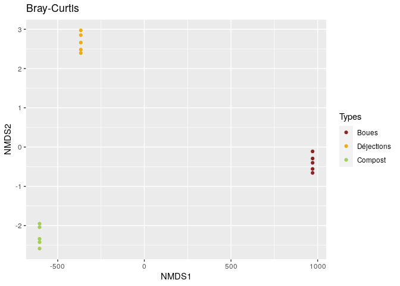

**CC2 Pierric MATHIS- -FUMEL**
================

| Les données sur lesquelles s’applique ce script proviennent de l’article suivant :                                                                                                                                            |
|-------------------------------------------------------------------------------------------------------------------------------------------------------------------------------------------------------------------------------|
| Domínguez, J., Aira, M., Crandall, K.A. et al. Earthworms drastically change fungal and bacterial communities during vermicomposting of sewage sludge. Sci Rep 11, 15556 (2021). <https://doi.org/10.1038/s41598-021-95099-z> |

# Préliminaires

## Installation des packages

``` bash
sudo apt-get update -y 
sudo apt-get install -y libbz2-dev
sudo apt-get install -y liblzma-dev
```

``` r
if (!requireNamespace("BiocManager", quietly = TRUE))
    install.packages("BiocManager")
BiocManager::install("BiocStyle")
BiocManager::install("Rhtslib")
```

``` r
library("knitr")
library("BiocStyle")
.cran_packages <- c("ggplot2", "gridExtra", "devtools")
install.packages(.cran_packages) 
.bioc_packages <- c("dada2", "phyloseq", "DECIPHER", "phangorn")
BiocManager::install(.bioc_packages)
sapply(c(.cran_packages, .bioc_packages), require, character.only = TRUE)
install.packages("vegan")
install.packages("dplyr")
install.packages("ggvenn")
install.packages("ggpubr")
```

## Chargement des packages

A relancer à chaque fois

``` r
library("knitr")
library("BiocStyle")
.cran_packages <- c("ggplot2", "gridExtra")
.bioc_packages <- c("dada2", "phyloseq", "DECIPHER", "phangorn")
sapply(c(.cran_packages, .bioc_packages), require, character.only = TRUE)
```

    ##   ggplot2 gridExtra     dada2  phyloseq  DECIPHER  phangorn 
    ##      TRUE      TRUE      TRUE      TRUE      TRUE      TRUE

``` r
library("vegan")
library("dplyr")
library("ggvenn")
library("ggpubr")
```

``` r
set.seed(100)
```

# Méthodes

## Préparation des données

On télécharge les données sur le site de l’ENA *copier dans un fichier
texte, ici “data”, puis sauver dans le dossier voulu*  
\> sed ’ <s@ftp.sra.ebi.ac.uk>@ftp://ftp.sra.ebi.ac.uk@g ’
/home/rstudio/EcoGeno2/data  
*remplacer le contenu de “data” par le résultat, puis sauver*  
\> sed ’ s@;@ @g ’ /home/rstudio/EcoGeno2/data  
*remplacer le contenu de “data” par le résultat, puis sauver*  
*mettre à la ligne chaque adresse dans data, puis sauver*  
*pour télécharger dans “EcoGeno2”, d’abord le choisir comme dossier de
travail (set working directory)*  
\> wget -i /home/rstudio/EcoGeno2/data

**Indiquer le chemin vers nos données**

``` r
path <- "/home/rstudio/EcoG-2/CC2_data"
list.files(path)
```

    ##  [1] "filtered"               "SRR14295221"            "SRR14295221_1.fastq.gz"
    ##  [4] "SRR14295221_2.fastq.gz" "SRR14295222"            "SRR14295222_1.fastq.gz"
    ##  [7] "SRR14295222_2.fastq.gz" "SRR14295223"            "SRR14295223_1.fastq.gz"
    ## [10] "SRR14295223_2.fastq.gz" "SRR14295224"            "SRR14295224_1.fastq.gz"
    ## [13] "SRR14295224_2.fastq.gz" "SRR14295225"            "SRR14295225_1.fastq.gz"
    ## [16] "SRR14295225_2.fastq.gz" "SRR14295226"            "SRR14295226_1.fastq.gz"
    ## [19] "SRR14295226_2.fastq.gz" "SRR14295227"            "SRR14295227_1.fastq.gz"
    ## [22] "SRR14295227_2.fastq.gz" "SRR14295228"            "SRR14295228_1.fastq.gz"
    ## [25] "SRR14295228_2.fastq.gz" "SRR14295229"            "SRR14295229_1.fastq.gz"
    ## [28] "SRR14295229_2.fastq.gz" "SRR14295230"            "SRR14295230_1.fastq.gz"
    ## [31] "SRR14295230_2.fastq.gz" "SRR14295231"            "SRR14295231_1.fastq.gz"
    ## [34] "SRR14295231_2.fastq.gz" "SRR14295232"            "SRR14295232_1.fastq.gz"
    ## [37] "SRR14295232_2.fastq.gz" "SRR14295233"            "SRR14295233_1.fastq.gz"
    ## [40] "SRR14295233_2.fastq.gz" "SRR14295234"            "SRR14295234_1.fastq.gz"
    ## [43] "SRR14295234_2.fastq.gz" "SRR14295235"            "SRR14295235_1.fastq.gz"
    ## [46] "SRR14295235_2.fastq.gz"

**Répartir les reads et extraire les noms**

``` r
fnFs <- sort(list.files(path, pattern = "_1.fastq.gz"))
fnRs <- sort(list.files(path, pattern = "_2.fastq.gz"))
sampleNames <- sapply(strsplit(fnFs,"_"),'[',1)    
fnFs <- file.path(path,fnFs)  
fnRs <- file.path(path,fnRs)
```

**Inspecter les profils qualité**

``` r
plotQualityProfile(fnFs[1:2])
```

    ## Warning: `guides(<scale> = FALSE)` is deprecated. Please use `guides(<scale> =
    ## "none")` instead.

<!-- -->

*On a une bonne qualité pour les reads forward. On choisit d’ôter
quelques derniers nucléotides en coupant à la 140e position (pour se
conformer à ce qui a été fait dans l’étude) en plus d’enlever les 10
premières bases, qui sont plus susceptibles de contenir des erreurs.*

``` r
plotQualityProfile(fnRs[1:2])
```

    ## Warning: `guides(<scale> = FALSE)` is deprecated. Please use `guides(<scale> =
    ## "none")` instead.

<!-- -->

*On a une bonne qualité pour les reads reverse. On choisit d’ôter
quelques derniers nucléotides en coupant à la 130e position (pour se
conformer à ce qui a été fait dans l’étude) en plus d’enlever les 10
premières bases, qui sont plus susceptibles de contenir des erreurs.*

**Définir les noms de fichiers pour les fastq.gz filtrés**

``` r
filt_path <- file.path(path,"filtered") 
if(!file_test("-d",filt_path)) dir.create(filt_path)
filtFs <- file.path(filt_path,paste0(sampleNames, "_F_filt.fastq.gz"))
filtRs <- file.path(filt_path,paste0(sampleNames, "_R_filt.fastq.gz"))
```

**Filtrer les reads**

``` r
out <- filterAndTrim(fnFs,filtFs,fnRs,filtRs,truncLen=c(140,130),
                     maxN=0, maxEE=c(2,2), truncQ=2, rm.phix=TRUE,
                     compress=TRUE, multithread=TRUE)
head(out)
```

    ##                        reads.in reads.out
    ## SRR14295221_1.fastq.gz     9819      9498
    ## SRR14295222_1.fastq.gz     5813      5674
    ## SRR14295223_1.fastq.gz    11669     11310
    ## SRR14295224_1.fastq.gz     7251      7029
    ## SRR14295225_1.fastq.gz     6606      6435
    ## SRR14295226_1.fastq.gz     7496      7301

## Définition des ASVs

**Dérépliquer**

``` r
derepFs <- derepFastq(filtFs, verbose=TRUE)  
derepRs <- derepFastq(filtRs, verbose=TRUE)

names(derepFs) <- sampleNames
names(derepRs) <- sampleNames
```

**Estimer le taux d’erreur**

``` r
errF <- learnErrors(filtFs, multithread=TRUE )
```

    ## 16856420 total bases in 120403 reads from 15 samples will be used for learning the error rates.

``` r
errR <- learnErrors(filtRs, multithread=TRUE)  
```

    ## 15652390 total bases in 120403 reads from 15 samples will be used for learning the error rates.

``` r
plotErrors(errF, nominalQ=TRUE)
```

    ## Warning: Transformation introduced infinite values in continuous y-axis

    ## Warning: Transformation introduced infinite values in continuous y-axis

<!-- -->

``` r
plotErrors(errR, nominalQ=TRUE)
```

    ## Warning: Transformation introduced infinite values in continuous y-axis

    ## Warning: Transformation introduced infinite values in continuous y-axis

<!-- -->

*Les taux d’erreur pour chaque transition possible (A→C, A→G, …) sont
indiqués. Les points sont les taux d’erreur observés pour chaque score
de qualité du consensus.*

-   La ligne noire montre les taux d’erreur estimés.

-   La ligne rouge montre les taux d’erreur attendus selon la définition
    nominale du Q-score.

*Ici, les taux d’erreur estimés (ligne noire) correspondent bien aux
taux observés (points), et les taux d’erreur diminuent avec
l’augmentation de la qualité, comme prévu. Tout semble raisonnable et
nous poursuivons avec confiance.*

**Inférer **

``` r
dadaFs <- dada(derepFs, err=errF, multithread=TRUE)  
```

    ## Sample 1 - 9498 reads in 3524 unique sequences.
    ## Sample 2 - 5674 reads in 1784 unique sequences.
    ## Sample 3 - 11310 reads in 3893 unique sequences.
    ## Sample 4 - 7029 reads in 2261 unique sequences.
    ## Sample 5 - 6435 reads in 2470 unique sequences.
    ## Sample 6 - 7301 reads in 2609 unique sequences.
    ## Sample 7 - 7010 reads in 2571 unique sequences.
    ## Sample 8 - 9493 reads in 2755 unique sequences.
    ## Sample 9 - 7002 reads in 2612 unique sequences.
    ## Sample 10 - 8647 reads in 2758 unique sequences.
    ## Sample 11 - 7932 reads in 2505 unique sequences.
    ## Sample 12 - 9584 reads in 3082 unique sequences.
    ## Sample 13 - 7289 reads in 2829 unique sequences.
    ## Sample 14 - 5733 reads in 2262 unique sequences.
    ## Sample 15 - 10466 reads in 3412 unique sequences.

``` r
dadaRs <- dada(derepRs, err=errR, multithread=TRUE)
```

    ## Sample 1 - 9498 reads in 3594 unique sequences.
    ## Sample 2 - 5674 reads in 1682 unique sequences.
    ## Sample 3 - 11310 reads in 4019 unique sequences.
    ## Sample 4 - 7029 reads in 2277 unique sequences.
    ## Sample 5 - 6435 reads in 2391 unique sequences.
    ## Sample 6 - 7301 reads in 2393 unique sequences.
    ## Sample 7 - 7010 reads in 2333 unique sequences.
    ## Sample 8 - 9493 reads in 2672 unique sequences.
    ## Sample 9 - 7002 reads in 2459 unique sequences.
    ## Sample 10 - 8647 reads in 2693 unique sequences.
    ## Sample 11 - 7932 reads in 2290 unique sequences.
    ## Sample 12 - 9584 reads in 2898 unique sequences.
    ## Sample 13 - 7289 reads in 2590 unique sequences.
    ## Sample 14 - 5733 reads in 2134 unique sequences.
    ## Sample 15 - 10466 reads in 3151 unique sequences.

**Inspecter le premier objet**

``` r
dadaFs[[1]] 
```

    ## dada-class: object describing DADA2 denoising results
    ## 355 sequence variants were inferred from 3524 input unique sequences.
    ## Key parameters: OMEGA_A = 1e-40, OMEGA_C = 1e-40, BAND_SIZE = 16

## Construction du tableau des séquences et suppression des chimères

**Fusionner les reads appariés**

``` r
mergers <- mergePairs(dadaFs, filtFs, dadaRs, filtRs)
```

**Inspecter la dataframe de fusion du premier échantillon**

``` r
head(mergers[[1]])
```

    ##                                                                                                                                                                                                                                                        sequence
    ## 1 TACAGAGGTCCCAAGCGTTGTTCGGATTCACTGGGCGTAAAGGGTGCGTAGGCGGTCGGGTAAGTCTGACGTGAAATCTTCGAGCTCAACTCGGAAACTGCGTCGGATACTATTCGGCTCGAGGAATGGAGGGGAGACTGGAATACTTGGTGTAGCAGTGAAATGCGTAGATATCAAGTGGAACACCAGTGGCGAAGGCGAGTCTCTGGACATTTCCTGACGCTGAGGCACGAAAGCCAGGGGAGCAAACGGG
    ## 2 TACGGAGGGTGCAAGCGTTATCCGGATTCACTGGGTTTAAAGGGTGCGTAGGCGGGCAGGTAAGTCAGTGGTGAAATCTCCGGGCTTAACCCGGAAACTGCCGTTGATACTACTTGTCTTGAATATTGTGGAGGTAAGCGGAATATGTCATGTAGCGGTGAAATGCTTAGATATGACATAGAACACCAATTGCGAAGGCAGCTTACTACACAATGATTGACGCTGAGGCACGAAAGCGTGGGGATCAAACAGG
    ## 3 TACGGAGGGTGCAAGCGTTATCCGGATTCACTGGGTTTAAAGGGTGCGTAGGCGGGCAGGTAAGTCAGTGGTGAAATCTCCGAGCTTAACTCGGAAACTGCCGTTGATACTACTTGTCTTGAATATTGTGGAGGTAAGCGGAATATGTCATGTAGCGGTGAAATGCTTAGATATGACATAGAACACCAATTGCGAAGGCAGCTTACTACACAATGATTGACGCTGAGGCACGAAAGCGTGGGGATCAAACAGG
    ## 4 TACGGAGGGTGCAAGCGTTATCCGGATTCACTGGGTTTAAAGGGTGCGTAGGTGGGTATGTAAGTCAGTGGTGAAATCCCCGAGCTCAACTTGGGAACTGCCGTTGATACTATATATCTTGAATGTCGTAGAGGTAAGCGGAATATGTCATGTAGCGGTGAAATGCTTAGAGATGACATAGAACACCAATTGCGAAGGCAGCTTACTATGCGAATATTGACACTGAGGCACGAAAGCGTGGGTAGCAAACAGG
    ## 5 TACAGAGGTCCCAAGCGTTGTTCGGATTCACTGGGCGTAAAGGGTGCGTAGGCGGTCGGGTAAGTCTGACGTGAAATCTTCAAGCTCAACTTGGAAACTGCGTCGGATACTATTCGGCTCGAGGAATGGAGGGGAGACTGGAATACTTGGTGTAGCAGTGAAATGCGTAGATATCAAGTGGAACACCAGTGGCGAAGGCGAGTCTCTGGACATTTCCTGACGCTGAGGCACGAAAGCCAGGGGAGCAAACGGG
    ## 6 TACGTAGGGCGCAAGCGTTGTCCGGATTTACTGGGTGTAAAGGGTGCGCAGGCGGATCTGTAAGTCAGGGGTGAAATCTCGCGGCTCAACCGCGAAACTGCCTTTGATACTGTGGATCTTGAGTTTGGGAGAGGTTGATGGAATTCCAGGTGTAGCGGTGAAATGCGTAGATATCTGGAAGAACACCAGTGGCGAAGGCGGTCAACTGGCCCATAACTGACGCTCATGCACGAAAGCGTGGGGATCAAACAGG
    ##   abundance forward reverse nmatch nmismatch nindel prefer accept
    ## 1       476       2       1     17         0      0      2   TRUE
    ## 2       386       3       2     17         0      0      2   TRUE
    ## 3       376       1       2     17         0      0      2   TRUE
    ## 4       341       5       3     17         0      0      1   TRUE
    ## 5       340       4       1     17         0      0      2   TRUE
    ## 6       246       6       4     17         0      0      1   TRUE

**Construire une table d’ASV**

``` r
seqtabAll <- makeSequenceTable(mergers[!grepl("Mock", names(mergers))])  
table(nchar(getSequences(seqtabAll)))  
```

    ## 
    ##  221  222  223  225  241  246  247  248  249  250  251  252  253  254  255  256 
    ##    2    2    2    1    2    2    3    2    2    4    4   68 1060   57    9    3 
    ##  257  258 
    ##    2    1

*Ce tableau contient 1226 ASV, et les longueurs de nos séquences
fusionnées se situent toutes dans la plage attendue pour cet amplicon
V4, en majorité à 253 nucléotides.*

**Supprimer les chimères**

``` r
seqtabNoC <- removeBimeraDenovo(seqtabAll, verbose=TRUE)
```

    ## Identified 102 bimeras out of 1226 input sequences.

``` r
1-ncol(seqtabNoC)/ncol(seqtabAll)
```

    ## [1] 0.08319739

*102 chimères ont été supprimées, soit 8% de nos ASVs.*

## Assignement de la taxonomie

**Acquérir le jeu d’entraînement Silva **

``` bash
cd home/rstudio
wget https://zenodo.org/record/4587955/files/silva_nr99_v138.1_train_set.fa.gz   
wget https://zenodo.org/record/4587955/files/silva_species_assignment_v138.1.fa.gz
```

**Assigner la taxonomie, puis également les espèces**

``` r
taxTab <- assignTaxonomy(seqtabNoC, "/home/rstudio/EcoG-2/silva_nr99_v138.1_train_set.fa.gz", multithread=TRUE)
taxTab <- addSpecies(taxTab, "/home/rstudio/EcoG-2/silva_species_assignment_v138.1.fa.gz")

unname(head(taxTab))
```

    ##      [,1]       [,2]             [,3]                  [,4]              
    ## [1,] "Bacteria" "Bacteroidota"   "Bacteroidia"         "Chitinophagales" 
    ## [2,] "Bacteria" "Proteobacteria" "Gammaproteobacteria" "Xanthomonadales" 
    ## [3,] "Bacteria" "Proteobacteria" "Gammaproteobacteria" "Enterobacterales"
    ## [4,] "Bacteria" "Proteobacteria" "Gammaproteobacteria" "Xanthomonadales" 
    ## [5,] "Bacteria" "Bacteroidota"   "Bacteroidia"         "Chitinophagales" 
    ## [6,] "Bacteria" "Bacteroidota"   "Bacteroidia"         "Flavobacteriales"
    ##      [,5]                 [,6]               [,7]
    ## [1,] "Chitinophagaceae"   NA                 NA  
    ## [2,] "Rhodanobacteraceae" "Rhodanobacter"    NA  
    ## [3,] "Aeromonadaceae"     "Aeromonas"        NA  
    ## [4,] "Rhodanobacteraceae" "Dokdonella"       NA  
    ## [5,] "Chitinophagaceae"   NA                 NA  
    ## [6,] "Weeksellaceae"      "Chryseobacterium" NA

**Tracer un arbre phylogénétique**

``` r
seqs <- getSequences(seqtabNoC)
names(seqs) <- seqs 
alignment <- AlignSeqs(DNAStringSet(seqs), anchor=NA,verbose=FALSE)
phangAlign <- phyDat(as(alignment, "matrix"), type="DNA")
dm <- dist.ml(phangAlign)
treeNJ <- NJ(dm) 
fit = pml(treeNJ, data=phangAlign)
fitGTR <- update(fit, k=4, inv=0.2)
fitGTR <- optim.pml(fitGTR, model="GTR", optInv=TRUE, optGamma=TRUE,
        rearrangement = "stochastic", control = pml.control(trace = 0))
plot(fitGTR)
```

<!-- -->

## Utilisation de phyloseq

**Classifier les échantillons**

``` r
#Après des heures de tentatives, je me suis résigné à assigner l'origine de chaque échantillon manuellement...
sampleNumber <- as.integer(sapply(strsplit(sampleNames, "52"), `[`, 2)) 
sampleType <- data.frame(sampleNames)
sampleType$Types <- "Boues"
sampleType$Types[sampleNumber==28] <- "Déjections" 
sampleType$Types[sampleNumber==30] <- "Déjections" 
sampleType$Types[sampleNumber==31] <- "Déjections" 
sampleType$Types[sampleNumber==32] <- "Déjections" 
sampleType$Types[sampleNumber==35] <- "Déjections" 
sampleType$Types[sampleNumber==21] <- "Compost" 
sampleType$Types[sampleNumber==22] <- "Compost" 
sampleType$Types[sampleNumber==23] <- "Compost" 
sampleType$Types[sampleNumber==24] <- "Compost" 
sampleType$Types[sampleNumber==25] <- "Compost" 
rownames(sampleType) <- sampleNames
```

**Combiner les données dans un objet phyloseq**

``` r
ps <- phyloseq(otu_table(seqtabNoC, taxa_are_rows=FALSE), 
               sample_data(sampleType), 
               tax_table(taxTab),phy_tree(fitGTR$tree))  
ps <- prune_samples(sample_names(ps) != "Mock", ps)  
ps
```

    ## phyloseq-class experiment-level object
    ## otu_table()   OTU Table:         [ 1124 taxa and 15 samples ]
    ## sample_data() Sample Data:       [ 15 samples by 2 sample variables ]
    ## tax_table()   Taxonomy Table:    [ 1124 taxa by 7 taxonomic ranks ]
    ## phy_tree()    Phylogenetic Tree: [ 1124 tips and 1122 internal nodes ]

``` r
ps@sam_data$Types <- factor(ps@sam_data$Types, levels=c("Boues", "Déjections", "Compost")) #pour mettre les échantillons dans le bon ordre
```

**Remplacer les séquences par les ASV numérotés**

``` r
dna <- Biostrings::DNAStringSet(taxa_names(ps))
names(dna) <- taxa_names(ps)
ps <- merge_phyloseq(ps, dna)
taxa_names(ps) <- paste0("ASV", seq(ntaxa(ps)))
ps
```

    ## phyloseq-class experiment-level object
    ## otu_table()   OTU Table:         [ 1124 taxa and 15 samples ]
    ## sample_data() Sample Data:       [ 15 samples by 2 sample variables ]
    ## tax_table()   Taxonomy Table:    [ 1124 taxa by 7 taxonomic ranks ]
    ## phy_tree()    Phylogenetic Tree: [ 1124 tips and 1122 internal nodes ]
    ## refseq()      DNAStringSet:      [ 1124 reference sequences ]

# Figures de l’article

Ici, on cherche à reproduire les principales figures de l’article.

## Courbes de raréfaction

``` r
col_boues <- "brown4"
col_déjections <- "darkgoldenrod2"
col_compost <- "darkolivegreen3"
colors <- c(col_compost, col_compost, col_compost, col_compost, col_compost, col_boues, col_boues, col_déjections, col_boues, col_déjections, col_déjections, col_déjections, col_boues, col_boues, col_déjections)    #on définit les couleurs qu'on va utiliser pour chaque origine des échantillons
rarecurve(seqtabNoC, step=1000, ylab="ASVs", col=colors, label=F)
legend("bottomright", legend=c("Boues","Déjections","Compost"), fill=c(col_boues,col_déjections,col_compost), title="Courbes de raréfaction")
```

<!-- -->

*Cela montre que la profondeur de séquençage est optimale.*  
*Ces courbes sont identiques à celles retrouvées dans les Figures
supplémentaires.*

## Abondance différentielle

``` r
ps.rel <- transform_sample_counts(ps, function(x) x/sum(x)*100)   
glom <- tax_glom(ps.rel, taxrank = 'Phylum', NArm = FALSE)    #agglomérer les taxa
ps.melt <- psmelt(glom)
ps.melt$Phylum <- as.character(ps.melt$Phylum)

ps.melt <- ps.melt %>% 
  group_by(Types, Phylum) %>%
  mutate(median=median(Abundance))  
keep <- unique(ps.melt$Phylum[ps.melt$median > 1])    #sélection des groupes avec median>1
ps.melt$Phylum[!(ps.melt$Phylum %in% keep)] <- "others"   
ps.melt_sum <- ps.melt %>%      #pour obtenir les mêmes lignes ensemble
  group_by(Types,Phylum) %>%
  summarise(Abundance=sum(Abundance)/5)
```

    ## `summarise()` has grouped output by 'Types'. You can override using the `.groups` argument.

``` r
ggplot(ps.melt_sum, aes(x = Types, y = Abundance, fill = Phylum)) + 
  geom_bar(stat = "identity", aes(fill=Phylum)) + 
  labs(x="", y="%") +
  theme_classic() + 
  theme(strip.background = element_blank(), 
        axis.text.x.bottom = element_text(angle=45,vjust=1,hjust=1))
```

<!-- -->

*On retrouve les phyla bactériens les plus abondants selon le type
d’échantillon.*  
*A la différence de la publication, ici les Planctomycetota sont
présents en abondance supérieure à celle des Sumerlaeota, et il
semblerait que le seuil choisi soit plus bas.*

## Alpha-diversité

``` r
ps@sam_data$Types <- factor(ps@sam_data$Types, levels=c("Boues", "Déjections", "Compost")) #pour mettre les échantillons dans le bon ordre
plot_richness(ps, x="Types", measures="Chao1", color="Types")+
scale_color_manual(values=c(col_boues, col_déjections, col_compost))
```

<!-- -->

*La diversité diminue après passage dans l’intestin, puis augmente lors
de la phase de maturation.*  
*Globalement, on retrouve des diversités alpha similaires à celles
trouvées dans l’article.*

## Bêta-diversité

``` r
ps.prop <- transform_sample_counts(ps, function(otu) otu/sum(otu))
ord.nmds.bray <- ordinate(ps.prop, method="NMDS", distance="bray")
```

    ## Run 0 stress 0.00009407978 
    ## Run 1 stress 0.00009711485 
    ## ... Procrustes: rmse 0.1280181  max resid 0.1689617 
    ## Run 2 stress 0.00009123674 
    ## ... New best solution
    ## ... Procrustes: rmse 0.1379452  max resid 0.1911845 
    ## Run 3 stress 0.0008693728 
    ## Run 4 stress 0.00008667921 
    ## ... New best solution
    ## ... Procrustes: rmse 0.02625075  max resid 0.03704369 
    ## Run 5 stress 0.3546489 
    ## Run 6 stress 0.00009322212 
    ## ... Procrustes: rmse 0.005084721  max resid 0.007433207 
    ## Run 7 stress 0.00009818141 
    ## ... Procrustes: rmse 0.06213774  max resid 0.08256831 
    ## Run 8 stress 0.330287 
    ## Run 9 stress 0.00009737697 
    ## ... Procrustes: rmse 0.01765278  max resid 0.02517663 
    ## Run 10 stress 0.00009430361 
    ## ... Procrustes: rmse 0.04194645  max resid 0.05750509 
    ## Run 11 stress 0.00008965387 
    ## ... Procrustes: rmse 0.09322377  max resid 0.1182402 
    ## Run 12 stress 0.001185915 
    ## Run 13 stress 0.00007975256 
    ## ... New best solution
    ## ... Procrustes: rmse 0.07561421  max resid 0.09922308 
    ## Run 14 stress 0.00009638623 
    ## ... Procrustes: rmse 0.02496443  max resid 0.03385009 
    ## Run 15 stress 0.00009381844 
    ## ... Procrustes: rmse 0.1126189  max resid 0.149425 
    ## Run 16 stress 0.00009396349 
    ## ... Procrustes: rmse 0.02274824  max resid 0.03080654 
    ## Run 17 stress 0.001322823 
    ## Run 18 stress 0.00009635608 
    ## ... Procrustes: rmse 0.09897282  max resid 0.1363372 
    ## Run 19 stress 0.00009425525 
    ## ... Procrustes: rmse 0.06251906  max resid 0.08660971 
    ## Run 20 stress 0.00009831433 
    ## ... Procrustes: rmse 0.01169614  max resid 0.01570907 
    ## *** No convergence -- monoMDS stopping criteria:
    ##      3: no. of iterations >= maxit
    ##     15: stress < smin
    ##      2: stress ratio > sratmax

    ## Warning in metaMDS(veganifyOTU(physeq), distance, ...): stress is (nearly) zero:
    ## you may have insufficient data

``` r
plot_ordination(ps.prop, ord.nmds.bray, color="Types", title="Bray-Curtis")+
scale_color_manual(values=c(col_boues, col_déjections, col_compost))
```

<!-- -->

*Il y a donc très peu d’ASVs en commun entre les boues, les déjections,
le compost.*  
*Les échantillons sont bien regroupés par type de prélèvement et les
trois points sont très éloignés les uns des autres, comme on le retrouve
sur la figure de l’article.*

## Diagramme de Venn

``` r
ps.melt <- psmelt(ps.prop)
ASVdf <- data.frame(ASV=ps.melt$OTU, Abondance=as.numeric(ps.melt$Abundance), Types=ps.melt$Types)

# Grouper les échantillons 
library(dplyr)
ASVdf <- ASVdf %>%
group_by(ASV, Types) %>%
summarise(Abondance = sum(Abondance))
```

    ## `summarise()` has grouped output by 'ASV'. You can override using the `.groups` argument.

``` r
# Transformer en présence/absence
pres_abs <- ASVdf
pres_abs <- transform(pres_abs, Abondance = Abondance/Abondance) 
pres_abs <- subset(pres_abs , is.na(pres_abs$Abondance) == F)
pres_abs <- pres_abs[,-3]

# Conception du diagramme
ASVlist <- list(Boues=pres_abs$ASV[pres_abs$Types=="Boues"], Déjections=pres_abs$ASV[pres_abs$Types=="Déjections"], Compost=pres_abs$ASV[pres_abs$Types=="Compost"])

ggvenn(ASVlist, fill_color = c(col_boues, col_déjections, col_compost), stroke_linetype = "blank", set_name_size = 8)
```

<!-- -->

*Très peu d’ASVs sont en commun entre les échantillons, et seuls 7
d’entre eux sont partagés par les trois.*  
*Ici, chaque catégorie comporte légèrement plus d’ASVs que ce qu’ont
trouvé les chercheurs. Le traitement des données a dû être différent.
Cependant, ce sont bien les mêmes proportions qui sont retrouvées.*

# Nouvelle question

On cherche ici à répondre à une question à laquelle l’article n’a pas
répondu : quelle abondance représente les 7 ASVs partagés par les trois
échantillons ?

## Afficher les 7 ASVs en commun

``` r
pres_abs$Types <- as.character(pres_abs$Types)
pres_abs$Types [pres_abs$Types == "Boues"] <- 1
pres_abs$Types [pres_abs$Types == "Déjections"] <- 2
pres_abs$Types [pres_abs$Types == "Compost"] <- 3
pres_abs$Types <-as.numeric(pres_abs$Types)
pres_abs <- pres_abs %>%
group_by(ASV) %>%
summarise(Types=sum(Types))
commonASV <- pres_abs$ASV[pres_abs$Types==6]
commonASV
```

    ## [1] "ASV126" "ASV148" "ASV178" "ASV249" "ASV380" "ASV67"  "ASV85"

## Sélectionner ces ASV

``` r
ASVdf <- ASVdf %>%
group_by(ASV) %>%
summarise(Abondance = sum(Abondance))
commonASVdf <- ASVdf [(ASVdf$ASV=="ASV126" | ASVdf$ASV=="ASV148" | ASVdf$ASV=="ASV178" | ASVdf$ASV=="ASV249" | ASVdf$ASV=="ASV380" | ASVdf$ASV=="ASV67" | ASVdf$ASV=="ASV85"),]
```

## Comparer la proportion de ces 7 ASV avec ce que représente 7/1124

``` r
abond_df <- data.frame(ASV = c("Communs", "Totaux"), Abondance_pcent = c(sum(commonASVdf$Abondance)/15, 1), ASV_proportion = c(7/1124, 1))
abond_df
```

    ##       ASV Abondance_pcent ASV_proportion
    ## 1 Communs      0.01115502    0.006227758
    ## 2  Totaux      1.00000000    1.000000000

``` r
ggarrange(
ggplot(abond_df, aes(x="", y=Abondance_pcent, fill=ASV))+
geom_bar(width = 1, stat = "identity")+ 
coord_polar("y", start=0),
ggplot(abond_df, aes(x="", y=ASV_proportion, fill=ASV))+
geom_bar(width = 1, stat = "identity")+ 
coord_polar("y", start=0)
)
```

<!-- -->

*Ces ASV partagés sont donc ne représentent donc pas une part importante
de l’ensemble des communautés bactériennes. On voit toutefois qu’ils
représentent presque 2 fois ce à quoi on s’attendrait si l’ensemble des
ASVs avait la même abondance.*

## Visualiser l’abondance des 3 ASVs communs les plus présents

``` r
ASVdf <- ASVdf %>% arrange(desc(Abondance))
ggplot(ASVdf, aes(x=reorder(ASV,Abondance), y=Abondance))+ 
geom_bar(stat = "identity")+ 
ggtitle("Abondance des ASV") +
xlab("ASV")+ 
geom_segment(aes(x=805, y=0.049668050, xend=1065, yend=0.049668050), arrow=arrow(), size=0.1, color="blue")+
geom_segment(aes(x=780, y=0.039987351, xend=1040, yend=0.039987351), arrow=arrow(), size=0.1, color="red")+
geom_segment(aes(x=720, y=0.023435878, xend=980, yend=0.023435878), arrow=arrow(), size=0.1, color="green")+ 
geom_text(aes(x=760, y=0.060), label="ASV67", size=4, color="blue")+ 
geom_text(aes(x=730, y=0.038), label="ASV85", size=4, color="red")+ 
geom_text(aes(x=660, y=0.020), label="ASV126", size=4, color="green")
```

<!-- -->

*Quand on regarde les 3 ASV communs les plus abondants, on remarque que
ceux-ci sont moyennement abondants : ils ne figurent pas parmi les plus
présents, mais ne font pas non plus partie de la biosphère rare.*
