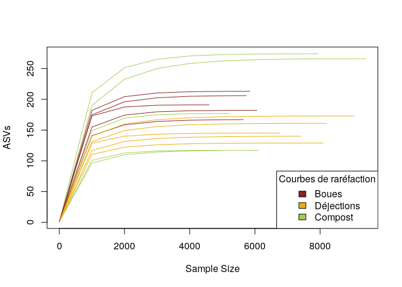
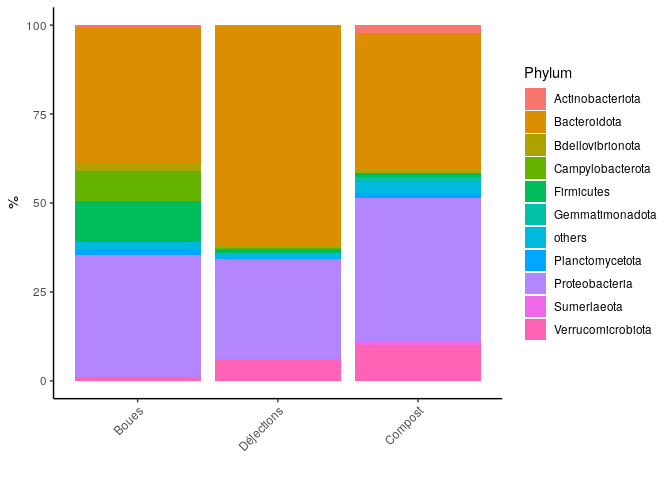

CC2
================

# Installation des packages

``` bash
sudo apt-get update -y 
sudo apt-get install -y libbz2-dev
sudo apt-get install -y liblzma-dev
```

    ## sudo: unable to resolve host 012e23cc2553: Name or service not known
    ## Get:1 http://security.ubuntu.com/ubuntu focal-security InRelease [114 kB]
    ## Hit:2 http://archive.ubuntu.com/ubuntu focal InRelease
    ## Get:3 http://archive.ubuntu.com/ubuntu focal-updates InRelease [114 kB]
    ## Get:4 http://archive.ubuntu.com/ubuntu focal-backports InRelease [108 kB]
    ## Fetched 336 kB in 1s (394 kB/s)
    ## Reading package lists...
    ## sudo: unable to resolve host 012e23cc2553: Name or service not known
    ## Reading package lists...
    ## Building dependency tree...
    ## Reading state information...
    ## libbz2-dev is already the newest version (1.0.8-2).
    ## 0 upgraded, 0 newly installed, 0 to remove and 17 not upgraded.
    ## sudo: unable to resolve host 012e23cc2553: Name or service not known
    ## Reading package lists...
    ## Building dependency tree...
    ## Reading state information...
    ## liblzma-dev is already the newest version (5.2.4-1ubuntu1).
    ## 0 upgraded, 0 newly installed, 0 to remove and 17 not upgraded.

``` r
if (!requireNamespace("BiocManager", quietly = TRUE))
    install.packages("BiocManager")
BiocManager::install("BiocStyle")
```

    ## 'getOption("repos")' replaces Bioconductor standard repositories, see
    ## '?repositories' for details
    ## 
    ## replacement repositories:
    ##     CRAN: https://packagemanager.rstudio.com/all/__linux__/focal/latest

    ## Bioconductor version 3.14 (BiocManager 1.30.16), R 4.1.2 (2021-11-01)

    ## Warning: package(s) not installed when version(s) same as current; use `force = TRUE` to
    ##   re-install: 'BiocStyle'

    ## Installation paths not writeable, unable to update packages
    ##   path: /usr/local/lib/R/library
    ##   packages:
    ##     Matrix

``` r
BiocManager::install("Rhtslib")
```

    ## 'getOption("repos")' replaces Bioconductor standard repositories, see
    ## '?repositories' for details
    ## 
    ## replacement repositories:
    ##     CRAN: https://packagemanager.rstudio.com/all/__linux__/focal/latest
    ## 
    ## Bioconductor version 3.14 (BiocManager 1.30.16), R 4.1.2 (2021-11-01)

    ## Warning: package(s) not installed when version(s) same as current; use `force = TRUE` to
    ##   re-install: 'Rhtslib'

    ## Installation paths not writeable, unable to update packages
    ##   path: /usr/local/lib/R/library
    ##   packages:
    ##     Matrix

``` r
library("knitr")
library("BiocStyle")
.cran_packages <- c("ggplot2", "gridExtra", "devtools")
install.packages(.cran_packages) 
```

    ## Installing packages into '/usr/local/lib/R/site-library'
    ## (as 'lib' is unspecified)

``` r
.bioc_packages <- c("dada2", "phyloseq", "DECIPHER", "phangorn")
BiocManager::install(.bioc_packages)
```

    ## 'getOption("repos")' replaces Bioconductor standard repositories, see
    ## '?repositories' for details
    ## 
    ## replacement repositories:
    ##     CRAN: https://packagemanager.rstudio.com/all/__linux__/focal/latest

    ## Bioconductor version 3.14 (BiocManager 1.30.16), R 4.1.2 (2021-11-01)

    ## Warning: package(s) not installed when version(s) same as current; use `force = TRUE` to
    ##   re-install: 'dada2' 'phyloseq' 'DECIPHER' 'phangorn'

    ## Installation paths not writeable, unable to update packages
    ##   path: /usr/local/lib/R/library
    ##   packages:
    ##     Matrix

``` r
sapply(c(.cran_packages, .bioc_packages), require, character.only = TRUE)
```

    ## Loading required package: ggplot2

    ## Loading required package: gridExtra

    ## Loading required package: devtools

    ## Loading required package: usethis

    ## Loading required package: dada2

    ## Loading required package: Rcpp

    ## Loading required package: phyloseq

    ## Loading required package: DECIPHER

    ## Loading required package: Biostrings

    ## Loading required package: BiocGenerics

    ## 
    ## Attaching package: 'BiocGenerics'

    ## The following object is masked from 'package:gridExtra':
    ## 
    ##     combine

    ## The following objects are masked from 'package:stats':
    ## 
    ##     IQR, mad, sd, var, xtabs

    ## The following objects are masked from 'package:base':
    ## 
    ##     anyDuplicated, append, as.data.frame, basename, cbind, colnames,
    ##     dirname, do.call, duplicated, eval, evalq, Filter, Find, get, grep,
    ##     grepl, intersect, is.unsorted, lapply, Map, mapply, match, mget,
    ##     order, paste, pmax, pmax.int, pmin, pmin.int, Position, rank,
    ##     rbind, Reduce, rownames, sapply, setdiff, sort, table, tapply,
    ##     union, unique, unsplit, which.max, which.min

    ## Loading required package: S4Vectors

    ## Loading required package: stats4

    ## 
    ## Attaching package: 'S4Vectors'

    ## The following objects are masked from 'package:base':
    ## 
    ##     expand.grid, I, unname

    ## Loading required package: IRanges

    ## 
    ## Attaching package: 'IRanges'

    ## The following object is masked from 'package:phyloseq':
    ## 
    ##     distance

    ## Loading required package: XVector

    ## Loading required package: GenomeInfoDb

    ## 
    ## Attaching package: 'Biostrings'

    ## The following object is masked from 'package:base':
    ## 
    ##     strsplit

    ## Loading required package: RSQLite

    ## Loading required package: parallel

    ## Loading required package: phangorn

    ## Loading required package: ape

    ## 
    ## Attaching package: 'ape'

    ## The following object is masked from 'package:Biostrings':
    ## 
    ##     complement

    ##   ggplot2 gridExtra  devtools     dada2  phyloseq  DECIPHER  phangorn 
    ##      TRUE      TRUE      TRUE      TRUE      TRUE      TRUE      TRUE

``` r
install.packages("vegan")
```

    ## Installing package into '/usr/local/lib/R/site-library'
    ## (as 'lib' is unspecified)

``` r
install.packages("VennDiagram")
```

    ## Installing package into '/usr/local/lib/R/site-library'
    ## (as 'lib' is unspecified)

# Chargement des packages

``` r
library("knitr")
library("BiocStyle")
.cran_packages <- c("ggplot2", "gridExtra")
.bioc_packages <- c("dada2", "phyloseq", "DECIPHER", "phangorn")
sapply(c(.cran_packages, .bioc_packages), require, character.only = TRUE)
```

    ##   ggplot2 gridExtra     dada2  phyloseq  DECIPHER  phangorn 
    ##      TRUE      TRUE      TRUE      TRUE      TRUE      TRUE

``` r
library("vegan")
library("VennDiagram")
```

``` r
set.seed(100)
```

# Préparation des données

On télécharge les données dans /EcoG-2/CC2_data.  
On indique le chemin vers nos données.

``` r
path <- "/home/rstudio/EcoG-2/CC2_data"
list.files(path)
```

    ##  [1] "filtered"               "SRR14295221"            "SRR14295221_1.fastq.gz"
    ##  [4] "SRR14295221_2.fastq.gz" "SRR14295222"            "SRR14295222_1.fastq.gz"
    ##  [7] "SRR14295222_2.fastq.gz" "SRR14295223"            "SRR14295223_1.fastq.gz"
    ## [10] "SRR14295223_2.fastq.gz" "SRR14295224"            "SRR14295224_1.fastq.gz"
    ## [13] "SRR14295224_2.fastq.gz" "SRR14295225"            "SRR14295225_1.fastq.gz"
    ## [16] "SRR14295225_2.fastq.gz" "SRR14295226"            "SRR14295226_1.fastq.gz"
    ## [19] "SRR14295226_2.fastq.gz" "SRR14295227"            "SRR14295227_1.fastq.gz"
    ## [22] "SRR14295227_2.fastq.gz" "SRR14295228"            "SRR14295228_1.fastq.gz"
    ## [25] "SRR14295228_2.fastq.gz" "SRR14295229"            "SRR14295229_1.fastq.gz"
    ## [28] "SRR14295229_2.fastq.gz" "SRR14295230"            "SRR14295230_1.fastq.gz"
    ## [31] "SRR14295230_2.fastq.gz" "SRR14295231"            "SRR14295231_1.fastq.gz"
    ## [34] "SRR14295231_2.fastq.gz" "SRR14295232"            "SRR14295232_1.fastq.gz"
    ## [37] "SRR14295232_2.fastq.gz" "SRR14295233"            "SRR14295233_1.fastq.gz"
    ## [40] "SRR14295233_2.fastq.gz" "SRR14295234"            "SRR14295234_1.fastq.gz"
    ## [43] "SRR14295234_2.fastq.gz" "SRR14295235"            "SRR14295235_1.fastq.gz"
    ## [46] "SRR14295235_2.fastq.gz"

Répartir les reads, extraire les noms,

``` r
fnFs <- sort(list.files(path, pattern = "_1.fastq.gz"))
fnRs <- sort(list.files(path, pattern = "_2.fastq.gz"))

sampleNames <- sapply(strsplit(fnFs,"_"),'[',1)    
#boues <- c(sampleNames[6:7],sampleNames[9],sampleNames[13:14])
#déjections <- c(sampleNames[8],sampleNames[10:12],sampleNames[15])
#compost <- sampleNames[1:5]
#sampleNames <- c(boues,déjections,compost)

fnFs <- file.path(path,fnFs)  
fnRs <- file.path(path,fnRs)
```

Inspection des profils qualité

``` r
plotQualityProfile(fnFs[1:2])
```

    ## Warning: `guides(<scale> = FALSE)` is deprecated. Please use `guides(<scale> =
    ## "none")` instead.

<!-- --> On a une bonne
qualité pour les reads forward. On choisit d’ôter quelques derniers
nucléotides en coupant à la 140e position en plus d’enlever les 10
premières bases, qui sont plus susceptibles de contenir des erreurs.

``` r
plotQualityProfile(fnRs[1:2])
```

    ## Warning: `guides(<scale> = FALSE)` is deprecated. Please use `guides(<scale> =
    ## "none")` instead.

<!-- --> On a une bonne
qualité pour les reads reverse. On choisit d’ôter quelques derniers
nucléotides en coupant à la 130e position en plus d’enlever les 10
premières bases, qui sont plus susceptibles de contenir des erreurs.

Définir les noms de fichiers pour les fastq.gz filtrés

``` r
filt_path <- file.path(path,"filtered") 
if(!file_test("-d",filt_path)) dir.create(filt_path)
filtFs <- file.path(filt_path,paste0(sampleNames, "_F_filt.fastq.gz"))
filtRs <- file.path(filt_path,paste0(sampleNames, "_R_filt.fastq.gz"))
```

Filtrer les reads

``` r
out <- filterAndTrim(fnFs,filtFs,fnRs,filtRs,truncLen=c(140,130),
                     maxN=0, maxEE=c(2,2), truncQ=2, rm.phix=TRUE,
                     compress=TRUE, multithread=TRUE)
head(out)
```

    ##                        reads.in reads.out
    ## SRR14295221_1.fastq.gz     9819      9498
    ## SRR14295222_1.fastq.gz     5813      5674
    ## SRR14295223_1.fastq.gz    11669     11310
    ## SRR14295224_1.fastq.gz     7251      7029
    ## SRR14295225_1.fastq.gz     6606      6435
    ## SRR14295226_1.fastq.gz     7496      7301

# Définir les ASVs

Dérépliquer

``` r
derepFs <- derepFastq(filtFs, verbose=TRUE)  
```

    ## Dereplicating sequence entries in Fastq file: /home/rstudio/EcoG-2/CC2_data/filtered/SRR14295221_F_filt.fastq.gz

    ## Encountered 3524 unique sequences from 9498 total sequences read.

    ## Dereplicating sequence entries in Fastq file: /home/rstudio/EcoG-2/CC2_data/filtered/SRR14295222_F_filt.fastq.gz

    ## Encountered 1784 unique sequences from 5674 total sequences read.

    ## Dereplicating sequence entries in Fastq file: /home/rstudio/EcoG-2/CC2_data/filtered/SRR14295223_F_filt.fastq.gz

    ## Encountered 3893 unique sequences from 11310 total sequences read.

    ## Dereplicating sequence entries in Fastq file: /home/rstudio/EcoG-2/CC2_data/filtered/SRR14295224_F_filt.fastq.gz

    ## Encountered 2261 unique sequences from 7029 total sequences read.

    ## Dereplicating sequence entries in Fastq file: /home/rstudio/EcoG-2/CC2_data/filtered/SRR14295225_F_filt.fastq.gz

    ## Encountered 2470 unique sequences from 6435 total sequences read.

    ## Dereplicating sequence entries in Fastq file: /home/rstudio/EcoG-2/CC2_data/filtered/SRR14295226_F_filt.fastq.gz

    ## Encountered 2609 unique sequences from 7301 total sequences read.

    ## Dereplicating sequence entries in Fastq file: /home/rstudio/EcoG-2/CC2_data/filtered/SRR14295227_F_filt.fastq.gz

    ## Encountered 2571 unique sequences from 7010 total sequences read.

    ## Dereplicating sequence entries in Fastq file: /home/rstudio/EcoG-2/CC2_data/filtered/SRR14295228_F_filt.fastq.gz

    ## Encountered 2755 unique sequences from 9493 total sequences read.

    ## Dereplicating sequence entries in Fastq file: /home/rstudio/EcoG-2/CC2_data/filtered/SRR14295229_F_filt.fastq.gz

    ## Encountered 2612 unique sequences from 7002 total sequences read.

    ## Dereplicating sequence entries in Fastq file: /home/rstudio/EcoG-2/CC2_data/filtered/SRR14295230_F_filt.fastq.gz

    ## Encountered 2758 unique sequences from 8647 total sequences read.

    ## Dereplicating sequence entries in Fastq file: /home/rstudio/EcoG-2/CC2_data/filtered/SRR14295231_F_filt.fastq.gz

    ## Encountered 2505 unique sequences from 7932 total sequences read.

    ## Dereplicating sequence entries in Fastq file: /home/rstudio/EcoG-2/CC2_data/filtered/SRR14295232_F_filt.fastq.gz

    ## Encountered 3082 unique sequences from 9584 total sequences read.

    ## Dereplicating sequence entries in Fastq file: /home/rstudio/EcoG-2/CC2_data/filtered/SRR14295233_F_filt.fastq.gz

    ## Encountered 2829 unique sequences from 7289 total sequences read.

    ## Dereplicating sequence entries in Fastq file: /home/rstudio/EcoG-2/CC2_data/filtered/SRR14295234_F_filt.fastq.gz

    ## Encountered 2262 unique sequences from 5733 total sequences read.

    ## Dereplicating sequence entries in Fastq file: /home/rstudio/EcoG-2/CC2_data/filtered/SRR14295235_F_filt.fastq.gz

    ## Encountered 3412 unique sequences from 10466 total sequences read.

``` r
derepRs <- derepFastq(filtRs, verbose=TRUE)
```

    ## Dereplicating sequence entries in Fastq file: /home/rstudio/EcoG-2/CC2_data/filtered/SRR14295221_R_filt.fastq.gz

    ## Encountered 3594 unique sequences from 9498 total sequences read.

    ## Dereplicating sequence entries in Fastq file: /home/rstudio/EcoG-2/CC2_data/filtered/SRR14295222_R_filt.fastq.gz

    ## Encountered 1682 unique sequences from 5674 total sequences read.

    ## Dereplicating sequence entries in Fastq file: /home/rstudio/EcoG-2/CC2_data/filtered/SRR14295223_R_filt.fastq.gz

    ## Encountered 4019 unique sequences from 11310 total sequences read.

    ## Dereplicating sequence entries in Fastq file: /home/rstudio/EcoG-2/CC2_data/filtered/SRR14295224_R_filt.fastq.gz

    ## Encountered 2277 unique sequences from 7029 total sequences read.

    ## Dereplicating sequence entries in Fastq file: /home/rstudio/EcoG-2/CC2_data/filtered/SRR14295225_R_filt.fastq.gz

    ## Encountered 2391 unique sequences from 6435 total sequences read.

    ## Dereplicating sequence entries in Fastq file: /home/rstudio/EcoG-2/CC2_data/filtered/SRR14295226_R_filt.fastq.gz

    ## Encountered 2393 unique sequences from 7301 total sequences read.

    ## Dereplicating sequence entries in Fastq file: /home/rstudio/EcoG-2/CC2_data/filtered/SRR14295227_R_filt.fastq.gz

    ## Encountered 2333 unique sequences from 7010 total sequences read.

    ## Dereplicating sequence entries in Fastq file: /home/rstudio/EcoG-2/CC2_data/filtered/SRR14295228_R_filt.fastq.gz

    ## Encountered 2672 unique sequences from 9493 total sequences read.

    ## Dereplicating sequence entries in Fastq file: /home/rstudio/EcoG-2/CC2_data/filtered/SRR14295229_R_filt.fastq.gz

    ## Encountered 2459 unique sequences from 7002 total sequences read.

    ## Dereplicating sequence entries in Fastq file: /home/rstudio/EcoG-2/CC2_data/filtered/SRR14295230_R_filt.fastq.gz

    ## Encountered 2693 unique sequences from 8647 total sequences read.

    ## Dereplicating sequence entries in Fastq file: /home/rstudio/EcoG-2/CC2_data/filtered/SRR14295231_R_filt.fastq.gz

    ## Encountered 2290 unique sequences from 7932 total sequences read.

    ## Dereplicating sequence entries in Fastq file: /home/rstudio/EcoG-2/CC2_data/filtered/SRR14295232_R_filt.fastq.gz

    ## Encountered 2898 unique sequences from 9584 total sequences read.

    ## Dereplicating sequence entries in Fastq file: /home/rstudio/EcoG-2/CC2_data/filtered/SRR14295233_R_filt.fastq.gz

    ## Encountered 2590 unique sequences from 7289 total sequences read.

    ## Dereplicating sequence entries in Fastq file: /home/rstudio/EcoG-2/CC2_data/filtered/SRR14295234_R_filt.fastq.gz

    ## Encountered 2134 unique sequences from 5733 total sequences read.

    ## Dereplicating sequence entries in Fastq file: /home/rstudio/EcoG-2/CC2_data/filtered/SRR14295235_R_filt.fastq.gz

    ## Encountered 3151 unique sequences from 10466 total sequences read.

``` r
names(derepFs) <- sampleNames
names(derepRs) <- sampleNames
```

Estimation du taux d’erreur

``` r
errF <- learnErrors(filtFs, multithread=TRUE )
```

    ## 16856420 total bases in 120403 reads from 15 samples will be used for learning the error rates.

``` r
errR <- learnErrors(filtRs, multithread=TRUE)  
```

    ## 15652390 total bases in 120403 reads from 15 samples will be used for learning the error rates.

``` r
plotErrors(errF, nominalQ=TRUE)
```

    ## Warning: Transformation introduced infinite values in continuous y-axis

    ## Warning: Transformation introduced infinite values in continuous y-axis

<!-- -->

``` r
plotErrors(errR, nominalQ=TRUE)
```

    ## Warning: Transformation introduced infinite values in continuous y-axis

    ## Warning: Transformation introduced infinite values in continuous y-axis

<!-- --> Les taux
d’erreur pour chaque transition possible (A→C, A→G, …) sont indiqués.
Les points sont les taux d’erreur observés pour chaque score de qualité
du consensus.  
\* La ligne noire montre les taux d’erreur estimés.  
\* La ligne rouge montre les taux d’erreur attendus selon la définition
nominale du Q-score.  
Ici, les taux d’erreur estimés (ligne noire) correspondent bien aux taux
observés (points), et les taux d’erreur diminuent avec l’augmentation de
la qualité, comme prévu. Tout semble raisonnable et nous poursuivons
avec confiance.

Inférence

``` r
dadaFs <- dada(derepFs, err=errF, multithread=TRUE)  
```

    ## Sample 1 - 9498 reads in 3524 unique sequences.
    ## Sample 2 - 5674 reads in 1784 unique sequences.
    ## Sample 3 - 11310 reads in 3893 unique sequences.
    ## Sample 4 - 7029 reads in 2261 unique sequences.
    ## Sample 5 - 6435 reads in 2470 unique sequences.
    ## Sample 6 - 7301 reads in 2609 unique sequences.
    ## Sample 7 - 7010 reads in 2571 unique sequences.
    ## Sample 8 - 9493 reads in 2755 unique sequences.
    ## Sample 9 - 7002 reads in 2612 unique sequences.
    ## Sample 10 - 8647 reads in 2758 unique sequences.
    ## Sample 11 - 7932 reads in 2505 unique sequences.
    ## Sample 12 - 9584 reads in 3082 unique sequences.
    ## Sample 13 - 7289 reads in 2829 unique sequences.
    ## Sample 14 - 5733 reads in 2262 unique sequences.
    ## Sample 15 - 10466 reads in 3412 unique sequences.

``` r
dadaRs <- dada(derepRs, err=errR, multithread=TRUE)
```

    ## Sample 1 - 9498 reads in 3594 unique sequences.
    ## Sample 2 - 5674 reads in 1682 unique sequences.
    ## Sample 3 - 11310 reads in 4019 unique sequences.
    ## Sample 4 - 7029 reads in 2277 unique sequences.
    ## Sample 5 - 6435 reads in 2391 unique sequences.
    ## Sample 6 - 7301 reads in 2393 unique sequences.
    ## Sample 7 - 7010 reads in 2333 unique sequences.
    ## Sample 8 - 9493 reads in 2672 unique sequences.
    ## Sample 9 - 7002 reads in 2459 unique sequences.
    ## Sample 10 - 8647 reads in 2693 unique sequences.
    ## Sample 11 - 7932 reads in 2290 unique sequences.
    ## Sample 12 - 9584 reads in 2898 unique sequences.
    ## Sample 13 - 7289 reads in 2590 unique sequences.
    ## Sample 14 - 5733 reads in 2134 unique sequences.
    ## Sample 15 - 10466 reads in 3151 unique sequences.

Inspection du premier objet.

``` r
dadaFs[[1]] 
```

    ## dada-class: object describing DADA2 denoising results
    ## 355 sequence variants were inferred from 3524 input unique sequences.
    ## Key parameters: OMEGA_A = 1e-40, OMEGA_C = 1e-40, BAND_SIZE = 16

# Construire le tableau des séquences et supprimer les chimères

Fusion des reads appariés.

``` r
mergers <- mergePairs(dadaFs, filtFs, dadaRs, filtRs)
```

Inspecter le data.frame de fusion du premier échantillon.

``` r
head(mergers[[1]])
```

    ##                                                                                                                                                                                                                                                        sequence
    ## 1 TACAGAGGTCCCAAGCGTTGTTCGGATTCACTGGGCGTAAAGGGTGCGTAGGCGGTCGGGTAAGTCTGACGTGAAATCTTCGAGCTCAACTCGGAAACTGCGTCGGATACTATTCGGCTCGAGGAATGGAGGGGAGACTGGAATACTTGGTGTAGCAGTGAAATGCGTAGATATCAAGTGGAACACCAGTGGCGAAGGCGAGTCTCTGGACATTTCCTGACGCTGAGGCACGAAAGCCAGGGGAGCAAACGGG
    ## 2 TACGGAGGGTGCAAGCGTTATCCGGATTCACTGGGTTTAAAGGGTGCGTAGGCGGGCAGGTAAGTCAGTGGTGAAATCTCCGGGCTTAACCCGGAAACTGCCGTTGATACTACTTGTCTTGAATATTGTGGAGGTAAGCGGAATATGTCATGTAGCGGTGAAATGCTTAGATATGACATAGAACACCAATTGCGAAGGCAGCTTACTACACAATGATTGACGCTGAGGCACGAAAGCGTGGGGATCAAACAGG
    ## 3 TACGGAGGGTGCAAGCGTTATCCGGATTCACTGGGTTTAAAGGGTGCGTAGGCGGGCAGGTAAGTCAGTGGTGAAATCTCCGAGCTTAACTCGGAAACTGCCGTTGATACTACTTGTCTTGAATATTGTGGAGGTAAGCGGAATATGTCATGTAGCGGTGAAATGCTTAGATATGACATAGAACACCAATTGCGAAGGCAGCTTACTACACAATGATTGACGCTGAGGCACGAAAGCGTGGGGATCAAACAGG
    ## 4 TACGGAGGGTGCAAGCGTTATCCGGATTCACTGGGTTTAAAGGGTGCGTAGGTGGGTATGTAAGTCAGTGGTGAAATCCCCGAGCTCAACTTGGGAACTGCCGTTGATACTATATATCTTGAATGTCGTAGAGGTAAGCGGAATATGTCATGTAGCGGTGAAATGCTTAGAGATGACATAGAACACCAATTGCGAAGGCAGCTTACTATGCGAATATTGACACTGAGGCACGAAAGCGTGGGTAGCAAACAGG
    ## 5 TACAGAGGTCCCAAGCGTTGTTCGGATTCACTGGGCGTAAAGGGTGCGTAGGCGGTCGGGTAAGTCTGACGTGAAATCTTCAAGCTCAACTTGGAAACTGCGTCGGATACTATTCGGCTCGAGGAATGGAGGGGAGACTGGAATACTTGGTGTAGCAGTGAAATGCGTAGATATCAAGTGGAACACCAGTGGCGAAGGCGAGTCTCTGGACATTTCCTGACGCTGAGGCACGAAAGCCAGGGGAGCAAACGGG
    ## 6 TACGTAGGGCGCAAGCGTTGTCCGGATTTACTGGGTGTAAAGGGTGCGCAGGCGGATCTGTAAGTCAGGGGTGAAATCTCGCGGCTCAACCGCGAAACTGCCTTTGATACTGTGGATCTTGAGTTTGGGAGAGGTTGATGGAATTCCAGGTGTAGCGGTGAAATGCGTAGATATCTGGAAGAACACCAGTGGCGAAGGCGGTCAACTGGCCCATAACTGACGCTCATGCACGAAAGCGTGGGGATCAAACAGG
    ##   abundance forward reverse nmatch nmismatch nindel prefer accept
    ## 1       476       2       1     17         0      0      2   TRUE
    ## 2       386       3       2     17         0      0      2   TRUE
    ## 3       376       1       2     17         0      0      2   TRUE
    ## 4       341       5       3     17         0      0      1   TRUE
    ## 5       340       4       1     17         0      0      2   TRUE
    ## 6       246       6       4     17         0      0      1   TRUE

Construction d’une table d’ASV

``` r
seqtabAll <- makeSequenceTable(mergers[!grepl("Mock", names(mergers))])  
table(nchar(getSequences(seqtabAll)))  
```

    ## 
    ##  221  222  223  225  241  246  247  248  249  250  251  252  253  254  255  256 
    ##    2    2    2    1    2    2    3    2    2    4    4   68 1060   57    9    3 
    ##  257  258 
    ##    2    1

Ce tableau contient 1226 ASV, et les longueurs de nos séquences
fusionnées se situent toutes dans la plage attendue pour cet amplicon
V4, en majorité à 253 nucléotides.

Suppression des chimères.

``` r
seqtabNoC <- removeBimeraDenovo(seqtabAll, verbose=TRUE)
```

    ## Identified 102 bimeras out of 1226 input sequences.

``` r
1-ncol(seqtabNoC)/ncol(seqtabAll)
```

    ## [1] 0.08319739

102 chimères ont été supprimées, soit 8% de nos ASVs.

# Assigner la taxonomie

Acquisition du jeu d’entraînement Silva (*non-exécuté*)

``` bash
cd home/rstudio
wget https://zenodo.org/record/4587955/files/silva_nr99_v138.1_train_set.fa.gz   
wget https://zenodo.org/record/4587955/files/silva_species_assignment_v138.1.fa.gz
```

    ## bash: line 0: cd: home/rstudio: No such file or directory
    ## --2021-12-23 18:20:40--  https://zenodo.org/record/4587955/files/silva_nr99_v138.1_train_set.fa.gz
    ## Resolving zenodo.org (zenodo.org)... 137.138.76.77
    ## Connecting to zenodo.org (zenodo.org)|137.138.76.77|:443... connected.
    ## HTTP request sent, awaiting response... 200 OK
    ## Length: 137283333 (131M) [application/octet-stream]
    ## Saving to: ‘silva_nr99_v138.1_train_set.fa.gz.4’
    ## 
    ##      0K .......... .......... .......... .......... ..........  0% 13.2M 10s
    ##     50K .......... .......... .......... .......... ..........  0% 4.65M 19s
    ##    100K .......... .......... .......... .......... ..........  0% 10.8M 17s
    ##    150K .......... .......... .......... .......... ..........  0% 27.1M 14s
    ##    200K .......... .......... .......... .......... ..........  0% 21.1M 12s
    ##    250K .......... .......... .......... .......... ..........  0% 53.1M 11s
    ##    300K .......... .......... .......... .......... ..........  0% 39.2M 10s
    ##    350K .......... .......... .......... .......... ..........  0% 65.2M 9s
    ##    400K .......... .......... .......... .......... ..........  0% 74.4M 8s
    ##    450K .......... .......... .......... .......... ..........  0% 56.9M 7s
    ##    500K .......... .......... .......... .......... ..........  0% 50.9M 7s
    ##    550K .......... .......... .......... .......... ..........  0% 64.9M 6s
    ##    600K .......... .......... .......... .......... ..........  0% 36.9M 6s
    ##    650K .......... .......... .......... .......... ..........  0% 21.8M 6s
    ##    700K .......... .......... .......... .......... ..........  0% 80.1M 6s
    ##    750K .......... .......... .......... .......... ..........  0% 65.3M 6s
    ##    800K .......... .......... .......... .......... ..........  0% 88.8M 5s
    ##    850K .......... .......... .......... .......... ..........  0% 20.8M 5s
    ##    900K .......... .......... .......... .......... ..........  0% 64.7M 5s
    ##    950K .......... .......... .......... .......... ..........  0% 55.1M 5s
    ##   1000K .......... .......... .......... .......... ..........  0% 69.6M 5s
    ##   1050K .......... .......... .......... .......... ..........  0% 42.7M 5s
    ##   1100K .......... .......... .......... .......... ..........  0% 71.8M 5s
    ##   1150K .......... .......... .......... .......... ..........  0% 33.6M 5s
    ##   1200K .......... .......... .......... .......... ..........  0% 80.4M 5s
    ##   1250K .......... .......... .......... .......... ..........  0% 49.6M 4s
    ##   1300K .......... .......... .......... .......... ..........  1% 21.0M 5s
    ##   1350K .......... .......... .......... .......... ..........  1% 66.0M 4s
    ##   1400K .......... .......... .......... .......... ..........  1% 71.3M 4s
    ##   1450K .......... .......... .......... .......... ..........  1% 93.1M 4s
    ##   1500K .......... .......... .......... .......... ..........  1% 20.3M 4s
    ##   1550K .......... .......... .......... .......... ..........  1% 52.2M 4s
    ##   1600K .......... .......... .......... .......... ..........  1% 86.0M 4s
    ##   1650K .......... .......... .......... .......... ..........  1% 91.7M 4s
    ##   1700K .......... .......... .......... .......... ..........  1% 29.3M 4s
    ##   1750K .......... .......... .......... .......... ..........  1% 33.8M 4s
    ##   1800K .......... .......... .......... .......... ..........  1% 74.6M 4s
    ##   1850K .......... .......... .......... .......... ..........  1% 97.3M 4s
    ##   1900K .......... .......... .......... .......... ..........  1% 96.7M 4s
    ##   1950K .......... .......... .......... .......... ..........  1% 8.70M 4s
    ##   2000K .......... .......... .......... .......... ..........  1% 68.3M 4s
    ##   2050K .......... .......... .......... .......... ..........  1% 87.2M 4s
    ##   2100K .......... .......... .......... .......... ..........  1%  100M 4s
    ##   2150K .......... .......... .......... .......... ..........  1% 27.4M 4s
    ##   2200K .......... .......... .......... .......... ..........  1% 98.0M 4s
    ##   2250K .......... .......... .......... .......... ..........  1% 91.9M 4s
    ##   2300K .......... .......... .......... .......... ..........  1% 93.0M 4s
    ##   2350K .......... .......... .......... .......... ..........  1% 28.6M 4s
    ##   2400K .......... .......... .......... .......... ..........  1% 31.5M 4s
    ##   2450K .......... .......... .......... .......... ..........  1% 80.3M 4s
    ##   2500K .......... .......... .......... .......... ..........  1% 93.2M 4s
    ##   2550K .......... .......... .......... .......... ..........  1% 84.8M 4s
    ##   2600K .......... .......... .......... .......... ..........  1% 28.3M 4s
    ##   2650K .......... .......... .......... .......... ..........  2% 75.3M 4s
    ##   2700K .......... .......... .......... .......... ..........  2% 34.3M 4s
    ##   2750K .......... .......... .......... .......... ..........  2% 60.2M 4s
    ##   2800K .......... .......... .......... .......... ..........  2% 25.8M 4s
    ##   2850K .......... .......... .......... .......... ..........  2%  101M 4s
    ##   2900K .......... .......... .......... .......... ..........  2% 77.3M 4s
    ##   2950K .......... .......... .......... .......... ..........  2% 50.9M 4s
    ##   3000K .......... .......... .......... .......... ..........  2% 87.5M 4s
    ##   3050K .......... .......... .......... .......... ..........  2% 35.7M 4s
    ##   3100K .......... .......... .......... .......... ..........  2% 16.9M 4s
    ##   3150K .......... .......... .......... .......... ..........  2% 54.6M 4s
    ##   3200K .......... .......... .......... .......... ..........  2% 72.5M 4s
    ##   3250K .......... .......... .......... .......... ..........  2% 74.4M 4s
    ##   3300K .......... .......... .......... .......... ..........  2% 42.6M 4s
    ##   3350K .......... .......... .......... .......... ..........  2% 60.5M 3s
    ##   3400K .......... .......... .......... .......... ..........  2% 31.4M 3s
    ##   3450K .......... .......... .......... .......... ..........  2% 70.6M 3s
    ##   3500K .......... .......... .......... .......... ..........  2% 76.2M 3s
    ##   3550K .......... .......... .......... .......... ..........  2% 32.3M 3s
    ##   3600K .......... .......... .......... .......... ..........  2% 45.8M 3s
    ##   3650K .......... .......... .......... .......... ..........  2% 66.5M 3s
    ##   3700K .......... .......... .......... .......... ..........  2% 82.9M 3s
    ##   3750K .......... .......... .......... .......... ..........  2% 72.7M 3s
    ##   3800K .......... .......... .......... .......... ..........  2% 31.9M 3s
    ##   3850K .......... .......... .......... .......... ..........  2% 72.9M 3s
    ##   3900K .......... .......... .......... .......... ..........  2% 75.5M 3s
    ##   3950K .......... .......... .......... .......... ..........  2% 58.0M 3s
    ##   4000K .......... .......... .......... .......... ..........  3% 34.3M 3s
    ##   4050K .......... .......... .......... .......... ..........  3% 29.8M 3s
    ##   4100K .......... .......... .......... .......... ..........  3% 68.0M 3s
    ##   4150K .......... .......... .......... .......... ..........  3% 72.4M 3s
    ##   4200K .......... .......... .......... .......... ..........  3% 78.8M 3s
    ##   4250K .......... .......... .......... .......... ..........  3% 14.0M 3s
    ##   4300K .......... .......... .......... .......... ..........  3% 71.4M 3s
    ##   4350K .......... .......... .......... .......... ..........  3% 58.8M 3s
    ##   4400K .......... .......... .......... .......... ..........  3% 80.4M 3s
    ##   4450K .......... .......... .......... .......... ..........  3% 85.5M 3s
    ##   4500K .......... .......... .......... .......... ..........  3% 28.2M 3s
    ##   4550K .......... .......... .......... .......... ..........  3% 55.7M 3s
    ##   4600K .......... .......... .......... .......... ..........  3% 67.3M 3s
    ##   4650K .......... .......... .......... .......... ..........  3% 85.2M 3s
    ##   4700K .......... .......... .......... .......... ..........  3% 57.6M 3s
    ##   4750K .......... .......... .......... .......... ..........  3% 36.3M 3s
    ##   4800K .......... .......... .......... .......... ..........  3% 58.2M 3s
    ##   4850K .......... .......... .......... .......... ..........  3% 67.9M 3s
    ##   4900K .......... .......... .......... .......... ..........  3% 75.7M 3s
    ##   4950K .......... .......... .......... .......... ..........  3% 31.5M 3s
    ##   5000K .......... .......... .......... .......... ..........  3% 72.8M 3s
    ##   5050K .......... .......... .......... .......... ..........  3% 50.2M 3s
    ##   5100K .......... .......... .......... .......... ..........  3% 68.4M 3s
    ##   5150K .......... .......... .......... .......... ..........  3% 77.2M 3s
    ##   5200K .......... .......... .......... .......... ..........  3% 37.2M 3s
    ##   5250K .......... .......... .......... .......... ..........  3% 39.7M 3s
    ##   5300K .......... .......... .......... .......... ..........  3% 73.0M 3s
    ##   5350K .......... .......... .......... .......... ..........  4% 82.7M 3s
    ##   5400K .......... .......... .......... .......... ..........  4% 23.7M 3s
    ##   5450K .......... .......... .......... .......... ..........  4% 51.3M 3s
    ##   5500K .......... .......... .......... .......... ..........  4% 69.3M 3s
    ##   5550K .......... .......... .......... .......... ..........  4% 49.2M 3s
    ##   5600K .......... .......... .......... .......... ..........  4% 85.8M 3s
    ##   5650K .......... .......... .......... .......... ..........  4% 6.90M 3s
    ##   5700K .......... .......... .......... .......... ..........  4% 43.2M 3s
    ##   5750K .......... .......... .......... .......... ..........  4% 69.8M 3s
    ##   5800K .......... .......... .......... .......... ..........  4%  111M 3s
    ##   5850K .......... .......... .......... .......... ..........  4% 79.4M 3s
    ##   5900K .......... .......... .......... .......... ..........  4% 20.2M 3s
    ##   5950K .......... .......... .......... .......... ..........  4% 73.6M 3s
    ##   6000K .......... .......... .......... .......... ..........  4% 98.2M 3s
    ##   6050K .......... .......... .......... .......... ..........  4%  107M 3s
    ##   6100K .......... .......... .......... .......... ..........  4% 38.3M 3s
    ##   6150K .......... .......... .......... .......... ..........  4% 56.2M 3s
    ##   6200K .......... .......... .......... .......... ..........  4% 83.3M 3s
    ##   6250K .......... .......... .......... .......... ..........  4%  101M 3s
    ##   6300K .......... .......... .......... .......... ..........  4% 20.5M 3s
    ##   6350K .......... .......... .......... .......... ..........  4% 65.2M 3s
    ##   6400K .......... .......... .......... .......... ..........  4% 93.3M 3s
    ##   6450K .......... .......... .......... .......... ..........  4% 19.2M 3s
    ##   6500K .......... .......... .......... .......... ..........  4% 78.9M 3s
    ##   6550K .......... .......... .......... .......... ..........  4% 78.3M 3s
    ##   6600K .......... .......... .......... .......... ..........  4% 90.2M 3s
    ##   6650K .......... .......... .......... .......... ..........  4% 19.4M 3s
    ##   6700K .......... .......... .......... .......... ..........  5% 77.7M 3s
    ##   6750K .......... .......... .......... .......... ..........  5% 67.8M 3s
    ##   6800K .......... .......... .......... .......... ..........  5% 94.3M 3s
    ##   6850K .......... .......... .......... .......... ..........  5% 33.7M 3s
    ##   6900K .......... .......... .......... .......... ..........  5% 46.8M 3s
    ##   6950K .......... .......... .......... .......... ..........  5% 70.5M 3s
    ##   7000K .......... .......... .......... .......... ..........  5% 90.0M 3s
    ##   7050K .......... .......... .......... .......... ..........  5% 70.9M 3s
    ##   7100K .......... .......... .......... .......... ..........  5% 29.0M 3s
    ##   7150K .......... .......... .......... .......... ..........  5% 25.5M 3s
    ##   7200K .......... .......... .......... .......... ..........  5% 8.96M 3s
    ##   7250K .......... .......... .......... .......... ..........  5% 98.4M 3s
    ##   7300K .......... .......... .......... .......... ..........  5%  108M 3s
    ##   7350K .......... .......... .......... .......... ..........  5% 78.0M 3s
    ##   7400K .......... .......... .......... .......... ..........  5%  106M 3s
    ##   7450K .......... .......... .......... .......... ..........  5% 77.2M 3s
    ##   7500K .......... .......... .......... .......... ..........  5% 26.5M 3s
    ##   7550K .......... .......... .......... .......... ..........  5% 80.4M 3s
    ##   7600K .......... .......... .......... .......... ..........  5% 92.7M 3s
    ##   7650K .......... .......... .......... .......... ..........  5%  100M 3s
    ##   7700K .......... .......... .......... .......... ..........  5% 54.6M 3s
    ##   7750K .......... .......... .......... .......... ..........  5% 31.1M 3s
    ##   7800K .......... .......... .......... .......... ..........  5% 46.3M 3s
    ##   7850K .......... .......... .......... .......... ..........  5% 72.0M 3s
    ##   7900K .......... .......... .......... .......... ..........  5% 98.4M 3s
    ##   7950K .......... .......... .......... .......... ..........  5% 26.2M 3s
    ##   8000K .......... .......... .......... .......... ..........  6% 18.9M 3s
    ##   8050K .......... .......... .......... .......... ..........  6% 20.6M 3s
    ##   8100K .......... .......... .......... .......... ..........  6% 21.6M 3s
    ##   8150K .......... .......... .......... .......... ..........  6% 19.9M 3s
    ##   8200K .......... .......... .......... .......... ..........  6% 20.2M 3s
    ##   8250K .......... .......... .......... .......... ..........  6% 22.5M 3s
    ##   8300K .......... .......... .......... .......... ..........  6% 22.2M 3s
    ##   8350K .......... .......... .......... .......... ..........  6% 20.3M 3s
    ##   8400K .......... .......... .......... .......... ..........  6% 22.9M 3s
    ##   8450K .......... .......... .......... .......... ..........  6% 24.2M 3s
    ##   8500K .......... .......... .......... .......... ..........  6% 23.4M 3s
    ##   8550K .......... .......... .......... .......... ..........  6% 21.6M 3s
    ##   8600K .......... .......... .......... .......... ..........  6% 23.5M 3s
    ##   8650K .......... .......... .......... .......... ..........  6% 26.3M 3s
    ##   8700K .......... .......... .......... .......... ..........  6% 24.5M 3s
    ##   8750K .......... .......... .......... .......... ..........  6% 21.7M 3s
    ##   8800K .......... .......... .......... .......... ..........  6% 25.4M 3s
    ##   8850K .......... .......... .......... .......... ..........  6% 27.1M 3s
    ##   8900K .......... .......... .......... .......... ..........  6% 27.6M 3s
    ##   8950K .......... .......... .......... .......... ..........  6% 23.2M 3s
    ##   9000K .......... .......... .......... .......... ..........  6% 28.1M 3s
    ##   9050K .......... .......... .......... .......... ..........  6% 25.5M 3s
    ##   9100K .......... .......... .......... .......... ..........  6% 28.4M 3s
    ##   9150K .......... .......... .......... .......... ..........  6% 23.1M 3s
    ##   9200K .......... .......... .......... .......... ..........  6%  167M 3s
    ##   9250K .......... .......... .......... .......... ..........  6%  166M 3s
    ##   9300K .......... .......... .......... .......... ..........  6%  158M 3s
    ##   9350K .......... .......... .......... .......... ..........  7%  152M 3s
    ##   9400K .......... .......... .......... .......... ..........  7%  179M 3s
    ##   9450K .......... .......... .......... .......... ..........  7%  170M 3s
    ##   9500K .......... .......... .......... .......... ..........  7%  179M 3s
    ##   9550K .......... .......... .......... .......... ..........  7%  138M 3s
    ##   9600K .......... .......... .......... .......... ..........  7%  154M 3s
    ##   9650K .......... .......... .......... .......... ..........  7%  144M 3s
    ##   9700K .......... .......... .......... .......... ..........  7%  159M 3s
    ##   9750K .......... .......... .......... .......... ..........  7%  147M 3s
    ##   9800K .......... .......... .......... .......... ..........  7%  162M 3s
    ##   9850K .......... .......... .......... .......... ..........  7%  126M 3s
    ##   9900K .......... .......... .......... .......... ..........  7%  164M 3s
    ##   9950K .......... .......... .......... .......... ..........  7%  102M 3s
    ##  10000K .......... .......... .......... .......... ..........  7% 98.6M 3s
    ##  10050K .......... .......... .......... .......... ..........  7%  111M 3s
    ##  10100K .......... .......... .......... .......... ..........  7%  164M 3s
    ##  10150K .......... .......... .......... .......... ..........  7%  153M 3s
    ##  10200K .......... .......... .......... .......... ..........  7%  150M 3s
    ##  10250K .......... .......... .......... .......... ..........  7%  143M 3s
    ##  10300K .......... .......... .......... .......... ..........  7%  152M 3s
    ##  10350K .......... .......... .......... .......... ..........  7%  140M 3s
    ##  10400K .......... .......... .......... .......... ..........  7%  147M 3s
    ##  10450K .......... .......... .......... .......... ..........  7%  107M 3s
    ##  10500K .......... .......... .......... .......... ..........  7% 85.5M 3s
    ##  10550K .......... .......... .......... .......... ..........  7%  113M 3s
    ##  10600K .......... .......... .......... .......... ..........  7%  110M 3s
    ##  10650K .......... .......... .......... .......... ..........  7% 91.6M 3s
    ##  10700K .......... .......... .......... .......... ..........  8% 50.7M 3s
    ##  10750K .......... .......... .......... .......... ..........  8% 56.1M 3s
    ##  10800K .......... .......... .......... .......... ..........  8% 73.6M 3s
    ##  10850K .......... .......... .......... .......... ..........  8% 92.3M 3s
    ##  10900K .......... .......... .......... .......... ..........  8% 26.8M 3s
    ##  10950K .......... .......... .......... .......... ..........  8% 22.5M 3s
    ##  11000K .......... .......... .......... .......... ..........  8%  114M 3s
    ##  11050K .......... .......... .......... .......... ..........  8%  104M 3s
    ##  11100K .......... .......... .......... .......... ..........  8% 35.5M 3s
    ##  11150K .......... .......... .......... .......... ..........  8% 47.5M 3s
    ##  11200K .......... .......... .......... .......... ..........  8% 54.8M 3s
    ##  11250K .......... .......... .......... .......... ..........  8% 50.1M 3s
    ##  11300K .......... .......... .......... .......... ..........  8% 96.4M 3s
    ##  11350K .......... .......... .......... .......... ..........  8% 46.7M 3s
    ##  11400K .......... .......... .......... .......... ..........  8% 43.8M 3s
    ##  11450K .......... .......... .......... .......... ..........  8% 86.3M 3s
    ##  11500K .......... .......... .......... .......... ..........  8% 21.7M 3s
    ##  11550K .......... .......... .......... .......... ..........  8% 50.7M 3s
    ##  11600K .......... .......... .......... .......... ..........  8%  102M 3s
    ##  11650K .......... .......... .......... .......... ..........  8% 40.6M 3s
    ##  11700K .......... .......... .......... .......... ..........  8% 51.8M 3s
    ##  11750K .......... .......... .......... .......... ..........  8% 97.4M 3s
    ##  11800K .......... .......... .......... .......... ..........  8% 75.6M 3s
    ##  11850K .......... .......... .......... .......... ..........  8% 8.62M 3s
    ##  11900K .......... .......... .......... .......... ..........  8% 68.4M 3s
    ##  11950K .......... .......... .......... .......... ..........  8% 85.3M 3s
    ##  12000K .......... .......... .......... .......... ..........  8%  114M 3s
    ##  12050K .......... .......... .......... .......... ..........  9% 23.7M 3s
    ##  12100K .......... .......... .......... .......... ..........  9% 40.9M 3s
    ##  12150K .......... .......... .......... .......... ..........  9%  105M 3s
    ##  12200K .......... .......... .......... .......... ..........  9%  124M 3s
    ##  12250K .......... .......... .......... .......... ..........  9% 26.1M 3s
    ##  12300K .......... .......... .......... .......... ..........  9% 70.4M 3s
    ##  12350K .......... .......... .......... .......... ..........  9%  141M 3s
    ##  12400K .......... .......... .......... .......... ..........  9%  159M 3s
    ##  12450K .......... .......... .......... .......... ..........  9% 27.9M 3s
    ##  12500K .......... .......... .......... .......... ..........  9% 29.7M 3s
    ##  12550K .......... .......... .......... .......... ..........  9% 90.5M 3s
    ##  12600K .......... .......... .......... .......... ..........  9%  109M 3s
    ##  12650K .......... .......... .......... .......... ..........  9% 63.4M 3s
    ##  12700K .......... .......... .......... .......... ..........  9% 16.7M 3s
    ##  12750K .......... .......... .......... .......... ..........  9% 70.5M 3s
    ##  12800K .......... .......... .......... .......... ..........  9%  125M 3s
    ##  12850K .......... .......... .......... .......... ..........  9% 18.8M 3s
    ##  12900K .......... .......... .......... .......... ..........  9% 78.7M 3s
    ##  12950K .......... .......... .......... .......... ..........  9% 90.7M 3s
    ##  13000K .......... .......... .......... .......... ..........  9%  153M 3s
    ##  13050K .......... .......... .......... .......... ..........  9% 19.4M 3s
    ##  13100K .......... .......... .......... .......... ..........  9% 69.7M 3s
    ##  13150K .......... .......... .......... .......... ..........  9% 72.7M 3s
    ##  13200K .......... .......... .......... .......... ..........  9%  155M 3s
    ##  13250K .......... .......... .......... .......... ..........  9% 17.8M 3s
    ##  13300K .......... .......... .......... .......... ..........  9% 28.2M 3s
    ##  13350K .......... .......... .......... .......... ..........  9% 30.0M 3s
    ##  13400K .......... .......... .......... .......... .......... 10% 28.7M 3s
    ##  13450K .......... .......... .......... .......... .......... 10% 36.0M 3s
    ##  13500K .......... .......... .......... .......... .......... 10% 36.4M 3s
    ##  13550K .......... .......... .......... .......... .......... 10% 24.4M 3s
    ##  13600K .......... .......... .......... .......... .......... 10% 36.9M 3s
    ##  13650K .......... .......... .......... .......... .......... 10% 36.5M 3s
    ##  13700K .......... .......... .......... .......... .......... 10% 37.4M 3s
    ##  13750K .......... .......... .......... .......... .......... 10% 20.6M 3s
    ##  13800K .......... .......... .......... .......... .......... 10% 31.0M 3s
    ##  13850K .......... .......... .......... .......... .......... 10% 19.3M 3s
    ##  13900K .......... .......... .......... .......... .......... 10% 36.1M 3s
    ##  13950K .......... .......... .......... .......... .......... 10% 17.6M 3s
    ##  14000K .......... .......... .......... .......... .......... 10% 32.2M 3s
    ##  14050K .......... .......... .......... .......... .......... 10% 40.2M 3s
    ##  14100K .......... .......... .......... .......... .......... 10% 34.3M 3s
    ##  14150K .......... .......... .......... .......... .......... 10% 18.7M 3s
    ##  14200K .......... .......... .......... .......... .......... 10% 31.3M 3s
    ##  14250K .......... .......... .......... .......... .......... 10% 35.2M 3s
    ##  14300K .......... .......... .......... .......... .......... 10% 24.5M 3s
    ##  14350K .......... .......... .......... .......... .......... 10% 25.1M 3s
    ##  14400K .......... .......... .......... .......... .......... 10% 18.7M 3s
    ##  14450K .......... .......... .......... .......... .......... 10% 35.4M 3s
    ##  14500K .......... .......... .......... .......... .......... 10% 26.2M 3s
    ##  14550K .......... .......... .......... .......... .......... 10% 24.2M 3s
    ##  14600K .......... .......... .......... .......... .......... 10% 20.1M 3s
    ##  14650K .......... .......... .......... .......... .......... 10% 74.4M 3s
    ##  14700K .......... .......... .......... .......... .......... 11% 86.9M 3s
    ##  14750K .......... .......... .......... .......... .......... 11% 66.7M 3s
    ##  14800K .......... .......... .......... .......... .......... 11% 75.9M 3s
    ##  14850K .......... .......... .......... .......... .......... 11% 77.2M 3s
    ##  14900K .......... .......... .......... .......... .......... 11% 81.2M 3s
    ##  14950K .......... .......... .......... .......... .......... 11% 65.0M 3s
    ##  15000K .......... .......... .......... .......... .......... 11% 64.1M 3s
    ##  15050K .......... .......... .......... .......... .......... 11% 70.3M 3s
    ##  15100K .......... .......... .......... .......... .......... 11% 87.9M 3s
    ##  15150K .......... .......... .......... .......... .......... 11% 56.5M 3s
    ##  15200K .......... .......... .......... .......... .......... 11% 80.0M 3s
    ##  15250K .......... .......... .......... .......... .......... 11% 86.9M 3s
    ##  15300K .......... .......... .......... .......... .......... 11% 70.3M 3s
    ##  15350K .......... .......... .......... .......... .......... 11% 67.4M 3s
    ##  15400K .......... .......... .......... .......... .......... 11% 80.6M 3s
    ##  15450K .......... .......... .......... .......... .......... 11% 87.9M 3s
    ##  15500K .......... .......... .......... .......... .......... 11% 84.7M 3s
    ##  15550K .......... .......... .......... .......... .......... 11% 64.6M 3s
    ##  15600K .......... .......... .......... .......... .......... 11% 91.9M 3s
    ##  15650K .......... .......... .......... .......... .......... 11% 75.9M 3s
    ##  15700K .......... .......... .......... .......... .......... 11% 76.6M 3s
    ##  15750K .......... .......... .......... .......... .......... 11% 62.4M 3s
    ##  15800K .......... .......... .......... .......... .......... 11% 75.4M 3s
    ##  15850K .......... .......... .......... .......... .......... 11% 78.1M 3s
    ##  15900K .......... .......... .......... .......... .......... 11% 79.1M 3s
    ##  15950K .......... .......... .......... .......... .......... 11% 71.5M 3s
    ##  16000K .......... .......... .......... .......... .......... 11% 90.1M 3s
    ##  16050K .......... .......... .......... .......... .......... 12% 95.7M 3s
    ##  16100K .......... .......... .......... .......... .......... 12% 72.3M 3s
    ##  16150K .......... .......... .......... .......... .......... 12% 63.9M 3s
    ##  16200K .......... .......... .......... .......... .......... 12% 80.0M 3s
    ##  16250K .......... .......... .......... .......... .......... 12% 97.5M 3s
    ##  16300K .......... .......... .......... .......... .......... 12% 80.5M 3s
    ##  16350K .......... .......... .......... .......... .......... 12% 70.2M 3s
    ##  16400K .......... .......... .......... .......... .......... 12% 87.5M 3s
    ##  16450K .......... .......... .......... .......... .......... 12% 87.7M 3s
    ##  16500K .......... .......... .......... .......... .......... 12%  112M 3s
    ##  16550K .......... .......... .......... .......... .......... 12% 82.8M 3s
    ##  16600K .......... .......... .......... .......... .......... 12% 87.6M 3s
    ##  16650K .......... .......... .......... .......... .......... 12%  108M 3s
    ##  16700K .......... .......... .......... .......... .......... 12% 99.1M 3s
    ##  16750K .......... .......... .......... .......... .......... 12% 87.1M 3s
    ##  16800K .......... .......... .......... .......... .......... 12% 67.4M 3s
    ##  16850K .......... .......... .......... .......... .......... 12% 77.0M 3s
    ##  16900K .......... .......... .......... .......... .......... 12%  110M 3s
    ##  16950K .......... .......... .......... .......... .......... 12% 84.5M 3s
    ##  17000K .......... .......... .......... .......... .......... 12%  115M 3s
    ##  17050K .......... .......... .......... .......... .......... 12%  113M 3s
    ##  17100K .......... .......... .......... .......... .......... 12% 92.2M 3s
    ##  17150K .......... .......... .......... .......... .......... 12% 86.9M 3s
    ##  17200K .......... .......... .......... .......... .......... 12% 96.2M 3s
    ##  17250K .......... .......... .......... .......... .......... 12% 45.5M 3s
    ##  17300K .......... .......... .......... .......... .......... 12%  112M 3s
    ##  17350K .......... .......... .......... .......... .......... 12%  109M 3s
    ##  17400K .......... .......... .......... .......... .......... 13% 92.1M 3s
    ##  17450K .......... .......... .......... .......... .......... 13%  107M 3s
    ##  17500K .......... .......... .......... .......... .......... 13% 93.6M 3s
    ##  17550K .......... .......... .......... .......... .......... 13% 56.7M 3s
    ##  17600K .......... .......... .......... .......... .......... 13% 75.6M 3s
    ##  17650K .......... .......... .......... .......... .......... 13% 85.9M 3s
    ##  17700K .......... .......... .......... .......... .......... 13% 75.8M 3s
    ##  17750K .......... .......... .......... .......... .......... 13% 54.0M 3s
    ##  17800K .......... .......... .......... .......... .......... 13%  106M 3s
    ##  17850K .......... .......... .......... .......... .......... 13% 45.7M 3s
    ##  17900K .......... .......... .......... .......... .......... 13% 84.7M 3s
    ##  17950K .......... .......... .......... .......... .......... 13% 65.0M 3s
    ##  18000K .......... .......... .......... .......... .......... 13% 71.5M 3s
    ##  18050K .......... .......... .......... .......... .......... 13% 91.9M 3s
    ##  18100K .......... .......... .......... .......... .......... 13% 6.04M 3s
    ##  18150K .......... .......... .......... .......... .......... 13% 77.6M 3s
    ##  18200K .......... .......... .......... .......... .......... 13% 87.8M 3s
    ##  18250K .......... .......... .......... .......... .......... 13% 84.8M 3s
    ##  18300K .......... .......... .......... .......... .......... 13%  100M 3s
    ##  18350K .......... .......... .......... .......... .......... 13% 16.3M 3s
    ##  18400K .......... .......... .......... .......... .......... 13% 8.17M 3s
    ##  18450K .......... .......... .......... .......... .......... 13% 58.2M 3s
    ##  18500K .......... .......... .......... .......... .......... 13% 49.6M 3s
    ##  18550K .......... .......... .......... .......... .......... 13% 64.1M 3s
    ##  18600K .......... .......... .......... .......... .......... 13% 89.7M 3s
    ##  18650K .......... .......... .......... .......... .......... 13% 78.0M 3s
    ##  18700K .......... .......... .......... .......... .......... 13% 83.7M 3s
    ##  18750K .......... .......... .......... .......... .......... 14% 68.0M 3s
    ##  18800K .......... .......... .......... .......... .......... 14% 67.1M 3s
    ##  18850K .......... .......... .......... .......... .......... 14% 42.2M 3s
    ##  18900K .......... .......... .......... .......... .......... 14% 88.6M 3s
    ##  18950K .......... .......... .......... .......... .......... 14% 82.7M 3s
    ##  19000K .......... .......... .......... .......... .......... 14% 90.5M 3s
    ##  19050K .......... .......... .......... .......... .......... 14% 22.0M 3s
    ##  19100K .......... .......... .......... .......... .......... 14% 59.7M 3s
    ##  19150K .......... .......... .......... .......... .......... 14% 67.0M 3s
    ##  19200K .......... .......... .......... .......... .......... 14% 72.0M 3s
    ##  19250K .......... .......... .......... .......... .......... 14% 27.6M 3s
    ##  19300K .......... .......... .......... .......... .......... 14% 37.8M 3s
    ##  19350K .......... .......... .......... .......... .......... 14% 52.4M 3s
    ##  19400K .......... .......... .......... .......... .......... 14% 73.7M 3s
    ##  19450K .......... .......... .......... .......... .......... 14% 82.8M 3s
    ##  19500K .......... .......... .......... .......... .......... 14% 88.9M 3s
    ##  19550K .......... .......... .......... .......... .......... 14% 69.2M 3s
    ##  19600K .......... .......... .......... .......... .......... 14% 52.6M 3s
    ##  19650K .......... .......... .......... .......... .......... 14% 39.7M 3s
    ##  19700K .......... .......... .......... .......... .......... 14% 57.3M 3s
    ##  19750K .......... .......... .......... .......... .......... 14% 71.3M 3s
    ##  19800K .......... .......... .......... .......... .......... 14% 73.9M 3s
    ##  19850K .......... .......... .......... .......... .......... 14% 81.6M 3s
    ##  19900K .......... .......... .......... .......... .......... 14% 88.4M 3s
    ##  19950K .......... .......... .......... .......... .......... 14% 25.9M 3s
    ##  20000K .......... .......... .......... .......... .......... 14% 72.6M 3s
    ##  20050K .......... .......... .......... .......... .......... 14% 86.9M 3s
    ##  20100K .......... .......... .......... .......... .......... 15% 91.9M 3s
    ##  20150K .......... .......... .......... .......... .......... 15% 11.2M 3s
    ##  20200K .......... .......... .......... .......... .......... 15% 74.2M 3s
    ##  20250K .......... .......... .......... .......... .......... 15% 73.4M 3s
    ##  20300K .......... .......... .......... .......... .......... 15% 97.8M 3s
    ##  20350K .......... .......... .......... .......... .......... 15% 86.3M 3s
    ##  20400K .......... .......... .......... .......... .......... 15% 80.1M 3s
    ##  20450K .......... .......... .......... .......... .......... 15% 77.5M 3s
    ##  20500K .......... .......... .......... .......... .......... 15% 81.7M 3s
    ##  20550K .......... .......... .......... .......... .......... 15% 78.3M 3s
    ##  20600K .......... .......... .......... .......... .......... 15% 99.2M 3s
    ##  20650K .......... .......... .......... .......... .......... 15% 33.4M 3s
    ##  20700K .......... .......... .......... .......... .......... 15% 60.5M 3s
    ##  20750K .......... .......... .......... .......... .......... 15% 67.2M 3s
    ##  20800K .......... .......... .......... .......... .......... 15% 82.9M 3s
    ##  20850K .......... .......... .......... .......... .......... 15%  139M 3s
    ##  20900K .......... .......... .......... .......... .......... 15% 54.1M 3s
    ##  20950K .......... .......... .......... .......... .......... 15% 43.5M 2s
    ##  21000K .......... .......... .......... .......... .......... 15% 90.8M 2s
    ##  21050K .......... .......... .......... .......... .......... 15% 76.7M 2s
    ##  21100K .......... .......... .......... .......... .......... 15% 67.2M 2s
    ##  21150K .......... .......... .......... .......... .......... 15% 17.3M 2s
    ##  21200K .......... .......... .......... .......... .......... 15% 79.6M 2s
    ##  21250K .......... .......... .......... .......... .......... 15%  180M 2s
    ##  21300K .......... .......... .......... .......... .......... 15%  169M 2s
    ##  21350K .......... .......... .......... .......... .......... 15%  157M 2s
    ##  21400K .......... .......... .......... .......... .......... 15% 16.1M 2s
    ##  21450K .......... .......... .......... .......... .......... 16%  139M 2s
    ##  21500K .......... .......... .......... .......... .......... 16%  132M 2s
    ##  21550K .......... .......... .......... .......... .......... 16%  116M 2s
    ##  21600K .......... .......... .......... .......... .......... 16%  183M 2s
    ##  21650K .......... .......... .......... .......... .......... 16% 17.6M 2s
    ##  21700K .......... .......... .......... .......... .......... 16% 77.6M 2s
    ##  21750K .......... .......... .......... .......... .......... 16%  129M 2s
    ##  21800K .......... .......... .......... .......... .......... 16%  134M 2s
    ##  21850K .......... .......... .......... .......... .......... 16%  169M 2s
    ##  21900K .......... .......... .......... .......... .......... 16% 30.2M 2s
    ##  21950K .......... .......... .......... .......... .......... 16% 35.8M 2s
    ##  22000K .......... .......... .......... .......... .......... 16% 88.7M 2s
    ##  22050K .......... .......... .......... .......... .......... 16%  124M 2s
    ##  22100K .......... .......... .......... .......... .......... 16% 25.9M 2s
    ##  22150K .......... .......... .......... .......... .......... 16%  142M 2s
    ##  22200K .......... .......... .......... .......... .......... 16% 53.2M 2s
    ##  22250K .......... .......... .......... .......... .......... 16%  132M 2s
    ##  22300K .......... .......... .......... .......... .......... 16%  161M 2s
    ##  22350K .......... .......... .......... .......... .......... 16% 14.6M 2s
    ##  22400K .......... .......... .......... .......... .......... 16%  151M 2s
    ##  22450K .......... .......... .......... .......... .......... 16% 47.4M 2s
    ##  22500K .......... .......... .......... .......... .......... 16%  163M 2s
    ##  22550K .......... .......... .......... .......... .......... 16%  121M 2s
    ##  22600K .......... .......... .......... .......... .......... 16% 54.3M 2s
    ##  22650K .......... .......... .......... .......... .......... 16% 28.8M 2s
    ##  22700K .......... .......... .......... .......... .......... 16%  192M 2s
    ##  22750K .......... .......... .......... .......... .......... 17% 30.1M 2s
    ##  22800K .......... .......... .......... .......... .......... 17%  130M 2s
    ##  22850K .......... .......... .......... .......... .......... 17%  152M 2s
    ##  22900K .......... .......... .......... .......... .......... 17% 80.8M 2s
    ##  22950K .......... .......... .......... .......... .......... 17%  130M 2s
    ##  23000K .......... .......... .......... .......... .......... 17% 24.1M 2s
    ##  23050K .......... .......... .......... .......... .......... 17%  148M 2s
    ##  23100K .......... .......... .......... .......... .......... 17%  178M 2s
    ##  23150K .......... .......... .......... .......... .......... 17% 79.4M 2s
    ##  23200K .......... .......... .......... .......... .......... 17%  143M 2s
    ##  23250K .......... .......... .......... .......... .......... 17% 5.32M 2s
    ##  23300K .......... .......... .......... .......... .......... 17% 83.6M 2s
    ##  23350K .......... .......... .......... .......... .......... 17% 62.3M 2s
    ##  23400K .......... .......... .......... .......... .......... 17%  137M 2s
    ##  23450K .......... .......... .......... .......... .......... 17%  174M 2s
    ##  23500K .......... .......... .......... .......... .......... 17% 21.9M 2s
    ##  23550K .......... .......... .......... .......... .......... 17%  127M 2s
    ##  23600K .......... .......... .......... .......... .......... 17% 93.4M 2s
    ##  23650K .......... .......... .......... .......... .......... 17%  108M 2s
    ##  23700K .......... .......... .......... .......... .......... 17%  130M 2s
    ##  23750K .......... .......... .......... .......... .......... 17% 6.54M 2s
    ##  23800K .......... .......... .......... .......... .......... 17%  110M 2s
    ##  23850K .......... .......... .......... .......... .......... 17% 63.6M 2s
    ##  23900K .......... .......... .......... .......... .......... 17%  123M 2s
    ##  23950K .......... .......... .......... .......... .......... 17%  115M 2s
    ##  24000K .......... .......... .......... .......... .......... 17% 16.4M 2s
    ##  24050K .......... .......... .......... .......... .......... 17% 35.5M 2s
    ##  24100K .......... .......... .......... .......... .......... 18%  150M 2s
    ##  24150K .......... .......... .......... .......... .......... 18%  130M 2s
    ##  24200K .......... .......... .......... .......... .......... 18%  149M 2s
    ##  24250K .......... .......... .......... .......... .......... 18% 74.2M 2s
    ##  24300K .......... .......... .......... .......... .......... 18% 27.1M 2s
    ##  24350K .......... .......... .......... .......... .......... 18% 92.4M 2s
    ##  24400K .......... .......... .......... .......... .......... 18%  133M 2s
    ##  24450K .......... .......... .......... .......... .......... 18%  141M 2s
    ##  24500K .......... .......... .......... .......... .......... 18% 6.70M 2s
    ##  24550K .......... .......... .......... .......... .......... 18% 87.9M 2s
    ##  24600K .......... .......... .......... .......... .......... 18%  127M 2s
    ##  24650K .......... .......... .......... .......... .......... 18%  108M 2s
    ##  24700K .......... .......... .......... .......... .......... 18%  146M 2s
    ##  24750K .......... .......... .......... .......... .......... 18%  153M 2s
    ##  24800K .......... .......... .......... .......... .......... 18% 9.94M 2s
    ##  24850K .......... .......... .......... .......... .......... 18%  131M 2s
    ##  24900K .......... .......... .......... .......... .......... 18% 43.9M 2s
    ##  24950K .......... .......... .......... .......... .......... 18%  101M 2s
    ##  25000K .......... .......... .......... .......... .......... 18%  145M 2s
    ##  25050K .......... .......... .......... .......... .......... 18% 59.4M 2s
    ##  25100K .......... .......... .......... .......... .......... 18% 17.3M 2s
    ##  25150K .......... .......... .......... .......... .......... 18% 32.5M 2s
    ##  25200K .......... .......... .......... .......... .......... 18% 84.8M 2s
    ##  25250K .......... .......... .......... .......... .......... 18%  182M 2s
    ##  25300K .......... .......... .......... .......... .......... 18%  156M 2s
    ##  25350K .......... .......... .......... .......... .......... 18% 13.6M 2s
    ##  25400K .......... .......... .......... .......... .......... 18%  124M 2s
    ##  25450K .......... .......... .......... .......... .......... 19%  126M 2s
    ##  25500K .......... .......... .......... .......... .......... 19% 59.2M 2s
    ##  25550K .......... .......... .......... .......... .......... 19%  107M 2s
    ##  25600K .......... .......... .......... .......... .......... 19% 82.5M 2s
    ##  25650K .......... .......... .......... .......... .......... 19% 38.3M 2s
    ##  25700K .......... .......... .......... .......... .......... 19%  142M 2s
    ##  25750K .......... .......... .......... .......... .......... 19% 77.3M 2s
    ##  25800K .......... .......... .......... .......... .......... 19% 79.0M 2s
    ##  25850K .......... .......... .......... .......... .......... 19% 77.5M 2s
    ##  25900K .......... .......... .......... .......... .......... 19% 37.0M 2s
    ##  25950K .......... .......... .......... .......... .......... 19%  108M 2s
    ##  26000K .......... .......... .......... .......... .......... 19% 46.2M 2s
    ##  26050K .......... .......... .......... .......... .......... 19%  158M 2s
    ##  26100K .......... .......... .......... .......... .......... 19% 96.1M 2s
    ##  26150K .......... .......... .......... .......... .......... 19% 38.8M 2s
    ##  26200K .......... .......... .......... .......... .......... 19%  133M 2s
    ##  26250K .......... .......... .......... .......... .......... 19%  177M 2s
    ##  26300K .......... .......... .......... .......... .......... 19% 18.9M 2s
    ##  26350K .......... .......... .......... .......... .......... 19%  139M 2s
    ##  26400K .......... .......... .......... .......... .......... 19%  127M 2s
    ##  26450K .......... .......... .......... .......... .......... 19%  155M 2s
    ##  26500K .......... .......... .......... .......... .......... 19%  147M 2s
    ##  26550K .......... .......... .......... .......... .......... 19% 15.5M 2s
    ##  26600K .......... .......... .......... .......... .......... 19%  139M 2s
    ##  26650K .......... .......... .......... .......... .......... 19% 59.5M 2s
    ##  26700K .......... .......... .......... .......... .......... 19%  111M 2s
    ##  26750K .......... .......... .......... .......... .......... 19%  107M 2s
    ##  26800K .......... .......... .......... .......... .......... 20% 8.72M 2s
    ##  26850K .......... .......... .......... .......... .......... 20% 83.5M 2s
    ##  26900K .......... .......... .......... .......... .......... 20%  103M 2s
    ##  26950K .......... .......... .......... .......... .......... 20% 96.7M 2s
    ##  27000K .......... .......... .......... .......... .......... 20%  142M 2s
    ##  27050K .......... .......... .......... .......... .......... 20% 17.1M 2s
    ##  27100K .......... .......... .......... .......... .......... 20%  130M 2s
    ##  27150K .......... .......... .......... .......... .......... 20%  133M 2s
    ##  27200K .......... .......... .......... .......... .......... 20% 80.7M 2s
    ##  27250K .......... .......... .......... .......... .......... 20%  124M 2s
    ##  27300K .......... .......... .......... .......... .......... 20% 17.5M 2s
    ##  27350K .......... .......... .......... .......... .......... 20%  152M 2s
    ##  27400K .......... .......... .......... .......... .......... 20%  142M 2s
    ##  27450K .......... .......... .......... .......... .......... 20%  140M 2s
    ##  27500K .......... .......... .......... .......... .......... 20%  114M 2s
    ##  27550K .......... .......... .......... .......... .......... 20% 21.9M 2s
    ##  27600K .......... .......... .......... .......... .......... 20%  136M 2s
    ##  27650K .......... .......... .......... .......... .......... 20% 74.7M 2s
    ##  27700K .......... .......... .......... .......... .......... 20%  113M 2s
    ##  27750K .......... .......... .......... .......... .......... 20% 55.5M 2s
    ##  27800K .......... .......... .......... .......... .......... 20%  120M 2s
    ##  27850K .......... .......... .......... .......... .......... 20% 60.6M 2s
    ##  27900K .......... .......... .......... .......... .......... 20%  130M 2s
    ##  27950K .......... .......... .......... .......... .......... 20% 44.3M 2s
    ##  28000K .......... .......... .......... .......... .......... 20% 59.2M 2s
    ##  28050K .......... .......... .......... .......... .......... 20%  109M 2s
    ##  28100K .......... .......... .......... .......... .......... 20% 86.9M 2s
    ##  28150K .......... .......... .......... .......... .......... 21%  113M 2s
    ##  28200K .......... .......... .......... .......... .......... 21% 17.7M 2s
    ##  28250K .......... .......... .......... .......... .......... 21%  128M 2s
    ##  28300K .......... .......... .......... .......... .......... 21%  148M 2s
    ##  28350K .......... .......... .......... .......... .......... 21%  111M 2s
    ##  28400K .......... .......... .......... .......... .......... 21%  185M 2s
    ##  28450K .......... .......... .......... .......... .......... 21% 18.1M 2s
    ##  28500K .......... .......... .......... .......... .......... 21%  130M 2s
    ##  28550K .......... .......... .......... .......... .......... 21% 74.6M 2s
    ##  28600K .......... .......... .......... .......... .......... 21%  162M 2s
    ##  28650K .......... .......... .......... .......... .......... 21% 91.4M 2s
    ##  28700K .......... .......... .......... .......... .......... 21% 35.9M 2s
    ##  28750K .......... .......... .......... .......... .......... 21% 55.6M 2s
    ##  28800K .......... .......... .......... .......... .......... 21% 69.0M 2s
    ##  28850K .......... .......... .......... .......... .......... 21%  134M 2s
    ##  28900K .......... .......... .......... .......... .......... 21% 89.7M 2s
    ##  28950K .......... .......... .......... .......... .......... 21% 76.2M 2s
    ##  29000K .......... .......... .......... .......... .......... 21% 29.3M 2s
    ##  29050K .......... .......... .......... .......... .......... 21%  150M 2s
    ##  29100K .......... .......... .......... .......... .......... 21% 79.0M 2s
    ##  29150K .......... .......... .......... .......... .......... 21% 72.4M 2s
    ##  29200K .......... .......... .......... .......... .......... 21% 77.4M 2s
    ##  29250K .......... .......... .......... .......... .......... 21% 43.3M 2s
    ##  29300K .......... .......... .......... .......... .......... 21%  140M 2s
    ##  29350K .......... .......... .......... .......... .......... 21% 67.5M 2s
    ##  29400K .......... .......... .......... .......... .......... 21% 59.7M 2s
    ##  29450K .......... .......... .......... .......... .......... 22% 41.4M 2s
    ##  29500K .......... .......... .......... .......... .......... 22%  127M 2s
    ##  29550K .......... .......... .......... .......... .......... 22% 71.6M 2s
    ##  29600K .......... .......... .......... .......... .......... 22% 63.5M 2s
    ##  29650K .......... .......... .......... .......... .......... 22% 15.3M 2s
    ##  29700K .......... .......... .......... .......... .......... 22%  152M 2s
    ##  29750K .......... .......... .......... .......... .......... 22% 41.7M 2s
    ##  29800K .......... .......... .......... .......... .......... 22%  160M 2s
    ##  29850K .......... .......... .......... .......... .......... 22%  203M 2s
    ##  29900K .......... .......... .......... .......... .......... 22% 37.0M 2s
    ##  29950K .......... .......... .......... .......... .......... 22% 46.4M 2s
    ##  30000K .......... .......... .......... .......... .......... 22%  150M 2s
    ##  30050K .......... .......... .......... .......... .......... 22% 57.9M 2s
    ##  30100K .......... .......... .......... .......... .......... 22% 42.9M 2s
    ##  30150K .......... .......... .......... .......... .......... 22% 40.1M 2s
    ##  30200K .......... .......... .......... .......... .......... 22% 45.7M 2s
    ##  30250K .......... .......... .......... .......... .......... 22% 41.1M 2s
    ##  30300K .......... .......... .......... .......... .......... 22% 41.6M 2s
    ##  30350K .......... .......... .......... .......... .......... 22% 37.6M 2s
    ##  30400K .......... .......... .......... .......... .......... 22% 44.6M 2s
    ##  30450K .......... .......... .......... .......... .......... 22% 4.81M 2s
    ##  30500K .......... .......... .......... .......... .......... 22% 45.5M 2s
    ##  30550K .......... .......... .......... .......... .......... 22% 8.73M 2s
    ##  30600K .......... .......... .......... .......... .......... 22% 44.5M 2s
    ##  30650K .......... .......... .......... .......... .......... 22% 43.8M 2s
    ##  30700K .......... .......... .......... .......... .......... 22% 43.8M 2s
    ##  30750K .......... .......... .......... .......... .......... 22% 38.4M 2s
    ##  30800K .......... .......... .......... .......... .......... 23% 42.1M 2s
    ##  30850K .......... .......... .......... .......... .......... 23% 42.9M 2s
    ##  30900K .......... .......... .......... .......... .......... 23% 46.1M 2s
    ##  30950K .......... .......... .......... .......... .......... 23% 38.4M 2s
    ##  31000K .......... .......... .......... .......... .......... 23% 39.0M 2s
    ##  31050K .......... .......... .......... .......... .......... 23% 40.7M 2s
    ##  31100K .......... .......... .......... .......... .......... 23% 38.7M 2s
    ##  31150K .......... .......... .......... .......... .......... 23% 37.1M 2s
    ##  31200K .......... .......... .......... .......... .......... 23% 39.9M 2s
    ##  31250K .......... .......... .......... .......... .......... 23% 44.8M 2s
    ##  31300K .......... .......... .......... .......... .......... 23% 43.9M 2s
    ##  31350K .......... .......... .......... .......... .......... 23% 37.8M 2s
    ##  31400K .......... .......... .......... .......... .......... 23% 43.6M 2s
    ##  31450K .......... .......... .......... .......... .......... 23% 46.9M 2s
    ##  31500K .......... .......... .......... .......... .......... 23% 46.0M 2s
    ##  31550K .......... .......... .......... .......... .......... 23% 37.9M 2s
    ##  31600K .......... .......... .......... .......... .......... 23% 44.4M 2s
    ##  31650K .......... .......... .......... .......... .......... 23% 42.4M 2s
    ##  31700K .......... .......... .......... .......... .......... 23% 42.3M 2s
    ##  31750K .......... .......... .......... .......... .......... 23% 39.3M 2s
    ##  31800K .......... .......... .......... .......... .......... 23% 42.4M 2s
    ##  31850K .......... .......... .......... .......... .......... 23% 48.7M 2s
    ##  31900K .......... .......... .......... .......... .......... 23% 46.1M 2s
    ##  31950K .......... .......... .......... .......... .......... 23% 38.9M 2s
    ##  32000K .......... .......... .......... .......... .......... 23% 44.9M 2s
    ##  32050K .......... .......... .......... .......... .......... 23% 7.53M 2s
    ##  32100K .......... .......... .......... .......... .......... 23% 41.7M 2s
    ##  32150K .......... .......... .......... .......... .......... 24% 34.2M 2s
    ##  32200K .......... .......... .......... .......... .......... 24% 46.0M 2s
    ##  32250K .......... .......... .......... .......... .......... 24% 39.9M 2s
    ##  32300K .......... .......... .......... .......... .......... 24% 43.4M 2s
    ##  32350K .......... .......... .......... .......... .......... 24% 39.9M 2s
    ##  32400K .......... .......... .......... .......... .......... 24% 46.0M 2s
    ##  32450K .......... .......... .......... .......... .......... 24% 32.7M 2s
    ##  32500K .......... .......... .......... .......... .......... 24% 44.8M 2s
    ##  32550K .......... .......... .......... .......... .......... 24% 39.3M 2s
    ##  32600K .......... .......... .......... .......... .......... 24% 42.4M 2s
    ##  32650K .......... .......... .......... .......... .......... 24% 41.1M 2s
    ##  32700K .......... .......... .......... .......... .......... 24% 42.8M 2s
    ##  32750K .......... .......... .......... .......... .......... 24% 40.9M 2s
    ##  32800K .......... .......... .......... .......... .......... 24% 43.3M 2s
    ##  32850K .......... .......... .......... .......... .......... 24% 40.5M 2s
    ##  32900K .......... .......... .......... .......... .......... 24% 43.5M 2s
    ##  32950K .......... .......... .......... .......... .......... 24% 40.6M 2s
    ##  33000K .......... .......... .......... .......... .......... 24% 44.7M 2s
    ##  33050K .......... .......... .......... .......... .......... 24% 41.9M 2s
    ##  33100K .......... .......... .......... .......... .......... 24% 44.3M 2s
    ##  33150K .......... .......... .......... .......... .......... 24% 39.4M 2s
    ##  33200K .......... .......... .......... .......... .......... 24% 44.0M 2s
    ##  33250K .......... .......... .......... .......... .......... 24% 40.8M 2s
    ##  33300K .......... .......... .......... .......... .......... 24% 45.0M 2s
    ##  33350K .......... .......... .......... .......... .......... 24% 39.7M 2s
    ##  33400K .......... .......... .......... .......... .......... 24% 43.8M 2s
    ##  33450K .......... .......... .......... .......... .......... 24% 44.6M 2s
    ##  33500K .......... .......... .......... .......... .......... 25% 45.7M 2s
    ##  33550K .......... .......... .......... .......... .......... 25% 39.8M 2s
    ##  33600K .......... .......... .......... .......... .......... 25% 44.5M 2s
    ##  33650K .......... .......... .......... .......... .......... 25% 43.1M 2s
    ##  33700K .......... .......... .......... .......... .......... 25% 43.9M 2s
    ##  33750K .......... .......... .......... .......... .......... 25% 38.3M 2s
    ##  33800K .......... .......... .......... .......... .......... 25% 43.6M 2s
    ##  33850K .......... .......... .......... .......... .......... 25% 45.7M 2s
    ##  33900K .......... .......... .......... .......... .......... 25% 40.8M 2s
    ##  33950K .......... .......... .......... .......... .......... 25% 38.1M 2s
    ##  34000K .......... .......... .......... .......... .......... 25% 42.8M 2s
    ##  34050K .......... .......... .......... .......... .......... 25% 40.9M 2s
    ##  34100K .......... .......... .......... .......... .......... 25% 39.8M 2s
    ##  34150K .......... .......... .......... .......... .......... 25% 41.6M 2s
    ##  34200K .......... .......... .......... .......... .......... 25% 46.8M 2s
    ##  34250K .......... .......... .......... .......... .......... 25% 39.8M 2s
    ##  34300K .......... .......... .......... .......... .......... 25% 40.2M 2s
    ##  34350K .......... .......... .......... .......... .......... 25% 37.6M 2s
    ##  34400K .......... .......... .......... .......... .......... 25% 42.6M 2s
    ##  34450K .......... .......... .......... .......... .......... 25% 42.5M 2s
    ##  34500K .......... .......... .......... .......... .......... 25% 45.5M 2s
    ##  34550K .......... .......... .......... .......... .......... 25% 39.1M 2s
    ##  34600K .......... .......... .......... .......... .......... 25% 41.9M 2s
    ##  34650K .......... .......... .......... .......... .......... 25% 43.7M 2s
    ##  34700K .......... .......... .......... .......... .......... 25% 43.1M 2s
    ##  34750K .......... .......... .......... .......... .......... 25% 36.9M 2s
    ##  34800K .......... .......... .......... .......... .......... 25% 42.7M 2s
    ##  34850K .......... .......... .......... .......... .......... 26% 43.4M 2s
    ##  34900K .......... .......... .......... .......... .......... 26% 44.8M 2s
    ##  34950K .......... .......... .......... .......... .......... 26% 38.4M 2s
    ##  35000K .......... .......... .......... .......... .......... 26% 45.4M 2s
    ##  35050K .......... .......... .......... .......... .......... 26% 47.9M 2s
    ##  35100K .......... .......... .......... .......... .......... 26% 44.3M 2s
    ##  35150K .......... .......... .......... .......... .......... 26% 35.1M 2s
    ##  35200K .......... .......... .......... .......... .......... 26% 43.6M 2s
    ##  35250K .......... .......... .......... .......... .......... 26% 45.5M 2s
    ##  35300K .......... .......... .......... .......... .......... 26% 45.8M 2s
    ##  35350K .......... .......... .......... .......... .......... 26% 38.3M 2s
    ##  35400K .......... .......... .......... .......... .......... 26% 44.6M 2s
    ##  35450K .......... .......... .......... .......... .......... 26% 41.2M 2s
    ##  35500K .......... .......... .......... .......... .......... 26% 46.8M 2s
    ##  35550K .......... .......... .......... .......... .......... 26% 38.0M 2s
    ##  35600K .......... .......... .......... .......... .......... 26% 40.8M 2s
    ##  35650K .......... .......... .......... .......... .......... 26% 43.2M 2s
    ##  35700K .......... .......... .......... .......... .......... 26% 41.9M 2s
    ##  35750K .......... .......... .......... .......... .......... 26% 36.3M 2s
    ##  35800K .......... .......... .......... .......... .......... 26% 40.6M 2s
    ##  35850K .......... .......... .......... .......... .......... 26% 42.8M 2s
    ##  35900K .......... .......... .......... .......... .......... 26% 43.1M 2s
    ##  35950K .......... .......... .......... .......... .......... 26% 36.2M 2s
    ##  36000K .......... .......... .......... .......... .......... 26% 43.0M 2s
    ##  36050K .......... .......... .......... .......... .......... 26% 44.2M 2s
    ##  36100K .......... .......... .......... .......... .......... 26% 41.7M 2s
    ##  36150K .......... .......... .......... .......... .......... 27% 39.6M 2s
    ##  36200K .......... .......... .......... .......... .......... 27% 41.8M 2s
    ##  36250K .......... .......... .......... .......... .......... 27% 42.2M 2s
    ##  36300K .......... .......... .......... .......... .......... 27% 41.9M 2s
    ##  36350K .......... .......... .......... .......... .......... 27% 35.1M 2s
    ##  36400K .......... .......... .......... .......... .......... 27% 34.4M 2s
    ##  36450K .......... .......... .......... .......... .......... 27% 41.6M 2s
    ##  36500K .......... .......... .......... .......... .......... 27% 44.0M 2s
    ##  36550K .......... .......... .......... .......... .......... 27% 38.1M 2s
    ##  36600K .......... .......... .......... .......... .......... 27% 42.5M 2s
    ##  36650K .......... .......... .......... .......... .......... 27% 40.6M 2s
    ##  36700K .......... .......... .......... .......... .......... 27% 41.0M 2s
    ##  36750K .......... .......... .......... .......... .......... 27% 33.4M 2s
    ##  36800K .......... .......... .......... .......... .......... 27% 44.6M 2s
    ##  36850K .......... .......... .......... .......... .......... 27% 41.6M 2s
    ##  36900K .......... .......... .......... .......... .......... 27% 43.6M 2s
    ##  36950K .......... .......... .......... .......... .......... 27% 34.3M 2s
    ##  37000K .......... .......... .......... .......... .......... 27% 58.5M 2s
    ##  37050K .......... .......... .......... .......... .......... 27%  101M 2s
    ##  37100K .......... .......... .......... .......... .......... 27% 83.0M 2s
    ##  37150K .......... .......... .......... .......... .......... 27% 91.0M 2s
    ##  37200K .......... .......... .......... .......... .......... 27% 83.5M 2s
    ##  37250K .......... .......... .......... .......... .......... 27%  126M 2s
    ##  37300K .......... .......... .......... .......... .......... 27% 74.5M 2s
    ##  37350K .......... .......... .......... .......... .......... 27% 61.5M 2s
    ##  37400K .......... .......... .......... .......... .......... 27% 74.8M 2s
    ##  37450K .......... .......... .......... .......... .......... 27% 72.0M 2s
    ##  37500K .......... .......... .......... .......... .......... 28% 68.5M 2s
    ##  37550K .......... .......... .......... .......... .......... 28% 61.5M 2s
    ##  37600K .......... .......... .......... .......... .......... 28% 65.1M 2s
    ##  37650K .......... .......... .......... .......... .......... 28% 68.3M 2s
    ##  37700K .......... .......... .......... .......... .......... 28% 71.1M 2s
    ##  37750K .......... .......... .......... .......... .......... 28% 91.0M 2s
    ##  37800K .......... .......... .......... .......... .......... 28% 82.4M 2s
    ##  37850K .......... .......... .......... .......... .......... 28%  112M 2s
    ##  37900K .......... .......... .......... .......... .......... 28% 98.2M 2s
    ##  37950K .......... .......... .......... .......... .......... 28%  120M 2s
    ##  38000K .......... .......... .......... .......... .......... 28%  131M 2s
    ##  38050K .......... .......... .......... .......... .......... 28%  140M 2s
    ##  38100K .......... .......... .......... .......... .......... 28%  109M 2s
    ##  38150K .......... .......... .......... .......... .......... 28% 55.5M 2s
    ##  38200K .......... .......... .......... .......... .......... 28% 52.2M 2s
    ##  38250K .......... .......... .......... .......... .......... 28% 98.7M 2s
    ##  38300K .......... .......... .......... .......... .......... 28%  107M 2s
    ##  38350K .......... .......... .......... .......... .......... 28%  125M 2s
    ##  38400K .......... .......... .......... .......... .......... 28%  106M 2s
    ##  38450K .......... .......... .......... .......... .......... 28% 74.8M 2s
    ##  38500K .......... .......... .......... .......... .......... 28%  139M 2s
    ##  38550K .......... .......... .......... .......... .......... 28% 90.7M 2s
    ##  38600K .......... .......... .......... .......... .......... 28% 95.3M 2s
    ##  38650K .......... .......... .......... .......... .......... 28% 94.0M 2s
    ##  38700K .......... .......... .......... .......... .......... 28% 58.4M 2s
    ##  38750K .......... .......... .......... .......... .......... 28% 62.4M 2s
    ##  38800K .......... .......... .......... .......... .......... 28% 71.5M 2s
    ##  38850K .......... .......... .......... .......... .......... 29%  112M 2s
    ##  38900K .......... .......... .......... .......... .......... 29%  130M 2s
    ##  38950K .......... .......... .......... .......... .......... 29%  122M 2s
    ##  39000K .......... .......... .......... .......... .......... 29% 79.9M 2s
    ##  39050K .......... .......... .......... .......... .......... 29%  124M 2s
    ##  39100K .......... .......... .......... .......... .......... 29% 62.0M 2s
    ##  39150K .......... .......... .......... .......... .......... 29% 46.6M 2s
    ##  39200K .......... .......... .......... .......... .......... 29% 68.7M 2s
    ##  39250K .......... .......... .......... .......... .......... 29%  133M 2s
    ##  39300K .......... .......... .......... .......... .......... 29%  100M 2s
    ##  39350K .......... .......... .......... .......... .......... 29%  131M 2s
    ##  39400K .......... .......... .......... .......... .......... 29% 83.8M 2s
    ##  39450K .......... .......... .......... .......... .......... 29%  151M 2s
    ##  39500K .......... .......... .......... .......... .......... 29%  130M 2s
    ##  39550K .......... .......... .......... .......... .......... 29%  104M 2s
    ##  39600K .......... .......... .......... .......... .......... 29% 80.1M 2s
    ##  39650K .......... .......... .......... .......... .......... 29%  115M 2s
    ##  39700K .......... .......... .......... .......... .......... 29% 84.9M 2s
    ##  39750K .......... .......... .......... .......... .......... 29% 50.7M 2s
    ##  39800K .......... .......... .......... .......... .......... 29% 85.9M 2s
    ##  39850K .......... .......... .......... .......... .......... 29%  128M 2s
    ##  39900K .......... .......... .......... .......... .......... 29%  139M 2s
    ##  39950K .......... .......... .......... .......... .......... 29% 89.1M 2s
    ##  40000K .......... .......... .......... .......... .......... 29% 97.6M 2s
    ##  40050K .......... .......... .......... .......... .......... 29%  152M 2s
    ##  40100K .......... .......... .......... .......... .......... 29%  138M 2s
    ##  40150K .......... .......... .......... .......... .......... 29%  128M 2s
    ##  40200K .......... .......... .......... .......... .......... 30% 94.7M 2s
    ##  40250K .......... .......... .......... .......... .......... 30%  106M 2s
    ##  40300K .......... .......... .......... .......... .......... 30%  129M 2s
    ##  40350K .......... .......... .......... .......... .......... 30% 99.2M 2s
    ##  40400K .......... .......... .......... .......... .......... 30%  101M 2s
    ##  40450K .......... .......... .......... .......... .......... 30%  146M 2s
    ##  40500K .......... .......... .......... .......... .......... 30%  149M 2s
    ##  40550K .......... .......... .......... .......... .......... 30%  130M 2s
    ##  40600K .......... .......... .......... .......... .......... 30%  158M 2s
    ##  40650K .......... .......... .......... .......... .......... 30%  177M 2s
    ##  40700K .......... .......... .......... .......... .......... 30%  142M 2s
    ##  40750K .......... .......... .......... .......... .......... 30%  115M 2s
    ##  40800K .......... .......... .......... .......... .......... 30%  147M 2s
    ##  40850K .......... .......... .......... .......... .......... 30%  111M 2s
    ##  40900K .......... .......... .......... .......... .......... 30% 95.5M 2s
    ##  40950K .......... .......... .......... .......... .......... 30% 58.1M 2s
    ##  41000K .......... .......... .......... .......... .......... 30% 55.4M 2s
    ##  41050K .......... .......... .......... .......... .......... 30%  165M 2s
    ##  41100K .......... .......... .......... .......... .......... 30%  164M 2s
    ##  41150K .......... .......... .......... .......... .......... 30%  118M 2s
    ##  41200K .......... .......... .......... .......... .......... 30%  152M 2s
    ##  41250K .......... .......... .......... .......... .......... 30% 86.4M 2s
    ##  41300K .......... .......... .......... .......... .......... 30% 77.5M 2s
    ##  41350K .......... .......... .......... .......... .......... 30% 67.4M 2s
    ##  41400K .......... .......... .......... .......... .......... 30%  113M 2s
    ##  41450K .......... .......... .......... .......... .......... 30% 71.6M 2s
    ##  41500K .......... .......... .......... .......... .......... 30%  141M 2s
    ##  41550K .......... .......... .......... .......... .......... 31%  118M 2s
    ##  41600K .......... .......... .......... .......... .......... 31%  160M 2s
    ##  41650K .......... .......... .......... .......... .......... 31%  155M 2s
    ##  41700K .......... .......... .......... .......... .......... 31% 94.3M 2s
    ##  41750K .......... .......... .......... .......... .......... 31%  123M 2s
    ##  41800K .......... .......... .......... .......... .......... 31% 54.9M 2s
    ##  41850K .......... .......... .......... .......... .......... 31%  116M 2s
    ##  41900K .......... .......... .......... .......... .......... 31% 52.3M 2s
    ##  41950K .......... .......... .......... .......... .......... 31%  108M 2s
    ##  42000K .......... .......... .......... .......... .......... 31%  165M 2s
    ##  42050K .......... .......... .......... .......... .......... 31%  141M 2s
    ##  42100K .......... .......... .......... .......... .......... 31%  138M 2s
    ##  42150K .......... .......... .......... .......... .......... 31%  140M 2s
    ##  42200K .......... .......... .......... .......... .......... 31%  141M 2s
    ##  42250K .......... .......... .......... .......... .......... 31%  139M 2s
    ##  42300K .......... .......... .......... .......... .......... 31%  162M 2s
    ##  42350K .......... .......... .......... .......... .......... 31%  116M 2s
    ##  42400K .......... .......... .......... .......... .......... 31%  137M 2s
    ##  42450K .......... .......... .......... .......... .......... 31%  106M 2s
    ##  42500K .......... .......... .......... .......... .......... 31%  142M 2s
    ##  42550K .......... .......... .......... .......... .......... 31% 94.9M 2s
    ##  42600K .......... .......... .......... .......... .......... 31%  121M 2s
    ##  42650K .......... .......... .......... .......... .......... 31% 74.2M 2s
    ##  42700K .......... .......... .......... .......... .......... 31% 43.2M 2s
    ##  42750K .......... .......... .......... .......... .......... 31% 76.6M 2s
    ##  42800K .......... .......... .......... .......... .......... 31% 77.1M 2s
    ##  42850K .......... .......... .......... .......... .......... 31% 86.7M 2s
    ##  42900K .......... .......... .......... .......... .......... 32%  125M 2s
    ##  42950K .......... .......... .......... .......... .......... 32%  135M 2s
    ##  43000K .......... .......... .......... .......... .......... 32%  112M 2s
    ##  43050K .......... .......... .......... .......... .......... 32%  106M 2s
    ##  43100K .......... .......... .......... .......... .......... 32% 87.2M 2s
    ##  43150K .......... .......... .......... .......... .......... 32% 70.8M 2s
    ##  43200K .......... .......... .......... .......... .......... 32% 80.6M 2s
    ##  43250K .......... .......... .......... .......... .......... 32%  127M 2s
    ##  43300K .......... .......... .......... .......... .......... 32%  157M 2s
    ##  43350K .......... .......... .......... .......... .......... 32%  127M 2s
    ##  43400K .......... .......... .......... .......... .......... 32%  135M 2s
    ##  43450K .......... .......... .......... .......... .......... 32%  151M 2s
    ##  43500K .......... .......... .......... .......... .......... 32%  131M 2s
    ##  43550K .......... .......... .......... .......... .......... 32% 86.2M 2s
    ##  43600K .......... .......... .......... .......... .......... 32%  129M 2s
    ##  43650K .......... .......... .......... .......... .......... 32% 91.6M 2s
    ##  43700K .......... .......... .......... .......... .......... 32%  113M 2s
    ##  43750K .......... .......... .......... .......... .......... 32% 54.9M 2s
    ##  43800K .......... .......... .......... .......... .......... 32% 68.1M 2s
    ##  43850K .......... .......... .......... .......... .......... 32%  134M 2s
    ##  43900K .......... .......... .......... .......... .......... 32%  178M 2s
    ##  43950K .......... .......... .......... .......... .......... 32%  141M 2s
    ##  44000K .......... .......... .......... .......... .......... 32%  141M 2s
    ##  44050K .......... .......... .......... .......... .......... 32%  161M 2s
    ##  44100K .......... .......... .......... .......... .......... 32%  154M 2s
    ##  44150K .......... .......... .......... .......... .......... 32% 91.6M 2s
    ##  44200K .......... .......... .......... .......... .......... 33%  143M 2s
    ##  44250K .......... .......... .......... .......... .......... 33%  100M 2s
    ##  44300K .......... .......... .......... .......... .......... 33% 86.2M 2s
    ##  44350K .......... .......... .......... .......... .......... 33% 68.2M 2s
    ##  44400K .......... .......... .......... .......... .......... 33% 61.0M 2s
    ##  44450K .......... .......... .......... .......... .......... 33% 85.1M 2s
    ##  44500K .......... .......... .......... .......... .......... 33%  165M 2s
    ##  44550K .......... .......... .......... .......... .......... 33%  143M 2s
    ##  44600K .......... .......... .......... .......... .......... 33%  142M 2s
    ##  44650K .......... .......... .......... .......... .......... 33%  175M 2s
    ##  44700K .......... .......... .......... .......... .......... 33%  147M 2s
    ##  44750K .......... .......... .......... .......... .......... 33%  121M 2s
    ##  44800K .......... .......... .......... .......... .......... 33%  108M 2s
    ##  44850K .......... .......... .......... .......... .......... 33%  133M 2s
    ##  44900K .......... .......... .......... .......... .......... 33% 73.0M 2s
    ##  44950K .......... .......... .......... .......... .......... 33%  109M 2s
    ##  45000K .......... .......... .......... .......... .......... 33%  133M 2s
    ##  45050K .......... .......... .......... .......... .......... 33% 57.6M 2s
    ##  45100K .......... .......... .......... .......... .......... 33% 44.7M 2s
    ##  45150K .......... .......... .......... .......... .......... 33%  134M 2s
    ##  45200K .......... .......... .......... .......... .......... 33%  100M 2s
    ##  45250K .......... .......... .......... .......... .......... 33% 94.3M 2s
    ##  45300K .......... .......... .......... .......... .......... 33%  137M 2s
    ##  45350K .......... .......... .......... .......... .......... 33%  135M 2s
    ##  45400K .......... .......... .......... .......... .......... 33%  156M 2s
    ##  45450K .......... .......... .......... .......... .......... 33%  139M 2s
    ##  45500K .......... .......... .......... .......... .......... 33%  149M 2s
    ##  45550K .......... .......... .......... .......... .......... 34% 8.15M 2s
    ##  45600K .......... .......... .......... .......... .......... 34% 21.4M 2s
    ##  45650K .......... .......... .......... .......... .......... 34% 21.0M 2s
    ##  45700K .......... .......... .......... .......... .......... 34% 23.5M 2s
    ##  45750K .......... .......... .......... .......... .......... 34% 20.5M 2s
    ##  45800K .......... .......... .......... .......... .......... 34% 22.1M 2s
    ##  45850K .......... .......... .......... .......... .......... 34% 20.8M 2s
    ##  45900K .......... .......... .......... .......... .......... 34% 22.7M 2s
    ##  45950K .......... .......... .......... .......... .......... 34% 21.3M 2s
    ##  46000K .......... .......... .......... .......... .......... 34% 35.1M 2s
    ##  46050K .......... .......... .......... .......... .......... 34% 84.9M 2s
    ##  46100K .......... .......... .......... .......... .......... 34% 93.2M 2s
    ##  46150K .......... .......... .......... .......... .......... 34% 72.6M 2s
    ##  46200K .......... .......... .......... .......... .......... 34% 84.8M 2s
    ##  46250K .......... .......... .......... .......... .......... 34% 90.3M 2s
    ##  46300K .......... .......... .......... .......... .......... 34% 83.7M 2s
    ##  46350K .......... .......... .......... .......... .......... 34% 76.2M 2s
    ##  46400K .......... .......... .......... .......... .......... 34% 87.1M 2s
    ##  46450K .......... .......... .......... .......... .......... 34% 84.5M 2s
    ##  46500K .......... .......... .......... .......... .......... 34% 94.1M 2s
    ##  46550K .......... .......... .......... .......... .......... 34% 66.3M 2s
    ##  46600K .......... .......... .......... .......... .......... 34% 79.9M 2s
    ##  46650K .......... .......... .......... .......... .......... 34% 78.4M 2s
    ##  46700K .......... .......... .......... .......... .......... 34% 99.1M 2s
    ##  46750K .......... .......... .......... .......... .......... 34% 88.6M 2s
    ##  46800K .......... .......... .......... .......... .......... 34% 92.0M 2s
    ##  46850K .......... .......... .......... .......... .......... 34% 78.8M 2s
    ##  46900K .......... .......... .......... .......... .......... 35% 85.9M 2s
    ##  46950K .......... .......... .......... .......... .......... 35% 78.6M 2s
    ##  47000K .......... .......... .......... .......... .......... 35% 74.5M 2s
    ##  47050K .......... .......... .......... .......... .......... 35% 92.7M 2s
    ##  47100K .......... .......... .......... .......... .......... 35% 84.7M 2s
    ##  47150K .......... .......... .......... .......... .......... 35% 76.0M 2s
    ##  47200K .......... .......... .......... .......... .......... 35% 87.1M 2s
    ##  47250K .......... .......... .......... .......... .......... 35% 82.4M 2s
    ##  47300K .......... .......... .......... .......... .......... 35% 87.7M 2s
    ##  47350K .......... .......... .......... .......... .......... 35% 77.4M 2s
    ##  47400K .......... .......... .......... .......... .......... 35% 74.8M 2s
    ##  47450K .......... .......... .......... .......... .......... 35% 80.3M 2s
    ##  47500K .......... .......... .......... .......... .......... 35% 53.3M 2s
    ##  47550K .......... .......... .......... .......... .......... 35% 85.7M 2s
    ##  47600K .......... .......... .......... .......... .......... 35%  115M 2s
    ##  47650K .......... .......... .......... .......... .......... 35%  101M 2s
    ##  47700K .......... .......... .......... .......... .......... 35%  102M 2s
    ##  47750K .......... .......... .......... .......... .......... 35%  101M 2s
    ##  47800K .......... .......... .......... .......... .......... 35%  109M 2s
    ##  47850K .......... .......... .......... .......... .......... 35% 95.0M 2s
    ##  47900K .......... .......... .......... .......... .......... 35%  114M 2s
    ##  47950K .......... .......... .......... .......... .......... 35% 84.2M 2s
    ##  48000K .......... .......... .......... .......... .......... 35% 93.4M 2s
    ##  48050K .......... .......... .......... .......... .......... 35% 88.1M 2s
    ##  48100K .......... .......... .......... .......... .......... 35%  106M 2s
    ##  48150K .......... .......... .......... .......... .......... 35% 74.7M 2s
    ##  48200K .......... .......... .......... .......... .......... 35% 91.8M 2s
    ##  48250K .......... .......... .......... .......... .......... 36%  110M 2s
    ##  48300K .......... .......... .......... .......... .......... 36%  118M 2s
    ##  48350K .......... .......... .......... .......... .......... 36% 85.1M 2s
    ##  48400K .......... .......... .......... .......... .......... 36%  120M 2s
    ##  48450K .......... .......... .......... .......... .......... 36% 81.1M 2s
    ##  48500K .......... .......... .......... .......... .......... 36% 80.1M 2s
    ##  48550K .......... .......... .......... .......... .......... 36% 91.9M 2s
    ##  48600K .......... .......... .......... .......... .......... 36%  114M 2s
    ##  48650K .......... .......... .......... .......... .......... 36% 60.3M 2s
    ##  48700K .......... .......... .......... .......... .......... 36%  106M 2s
    ##  48750K .......... .......... .......... .......... .......... 36% 83.8M 2s
    ##  48800K .......... .......... .......... .......... .......... 36%  102M 2s
    ##  48850K .......... .......... .......... .......... .......... 36% 91.3M 2s
    ##  48900K .......... .......... .......... .......... .......... 36% 94.1M 2s
    ##  48950K .......... .......... .......... .......... .......... 36% 51.1M 2s
    ##  49000K .......... .......... .......... .......... .......... 36% 28.9M 2s
    ##  49050K .......... .......... .......... .......... .......... 36%  104M 2s
    ##  49100K .......... .......... .......... .......... .......... 36%  115M 2s
    ##  49150K .......... .......... .......... .......... .......... 36% 98.7M 2s
    ##  49200K .......... .......... .......... .......... .......... 36%  120M 2s
    ##  49250K .......... .......... .......... .......... .......... 36%  127M 2s
    ##  49300K .......... .......... .......... .......... .......... 36%  115M 2s
    ##  49350K .......... .......... .......... .......... .......... 36% 9.95M 2s
    ##  49400K .......... .......... .......... .......... .......... 36% 98.4M 2s
    ##  49450K .......... .......... .......... .......... .......... 36% 92.6M 2s
    ##  49500K .......... .......... .......... .......... .......... 36% 87.5M 2s
    ##  49550K .......... .......... .......... .......... .......... 36% 99.7M 2s
    ##  49600K .......... .......... .......... .......... .......... 37%  112M 2s
    ##  49650K .......... .......... .......... .......... .......... 37%  114M 2s
    ##  49700K .......... .......... .......... .......... .......... 37% 53.0M 2s
    ##  49750K .......... .......... .......... .......... .......... 37% 77.5M 2s
    ##  49800K .......... .......... .......... .......... .......... 37% 88.9M 2s
    ##  49850K .......... .......... .......... .......... .......... 37% 99.3M 2s
    ##  49900K .......... .......... .......... .......... .......... 37%  137M 2s
    ##  49950K .......... .......... .......... .......... .......... 37% 27.0M 2s
    ##  50000K .......... .......... .......... .......... .......... 37% 73.3M 2s
    ##  50050K .......... .......... .......... .......... .......... 37%  111M 2s
    ##  50100K .......... .......... .......... .......... .......... 37% 84.9M 2s
    ##  50150K .......... .......... .......... .......... .......... 37% 97.0M 2s
    ##  50200K .......... .......... .......... .......... .......... 37%  113M 2s
    ##  50250K .......... .......... .......... .......... .......... 37%  106M 2s
    ##  50300K .......... .......... .......... .......... .......... 37%  144M 2s
    ##  50350K .......... .......... .......... .......... .......... 37% 75.9M 2s
    ##  50400K .......... .......... .......... .......... .......... 37%  106M 2s
    ##  50450K .......... .......... .......... .......... .......... 37% 86.4M 2s
    ##  50500K .......... .......... .......... .......... .......... 37%  111M 2s
    ##  50550K .......... .......... .......... .......... .......... 37% 95.1M 2s
    ##  50600K .......... .......... .......... .......... .......... 37% 71.2M 2s
    ##  50650K .......... .......... .......... .......... .......... 37% 60.0M 2s
    ##  50700K .......... .......... .......... .......... .......... 37% 96.5M 2s
    ##  50750K .......... .......... .......... .......... .......... 37% 88.8M 2s
    ##  50800K .......... .......... .......... .......... .......... 37%  121M 2s
    ##  50850K .......... .......... .......... .......... .......... 37% 88.8M 2s
    ##  50900K .......... .......... .......... .......... .......... 38% 71.2M 2s
    ##  50950K .......... .......... .......... .......... .......... 38%  103M 2s
    ##  51000K .......... .......... .......... .......... .......... 38% 39.0M 2s
    ##  51050K .......... .......... .......... .......... .......... 38%  123M 2s
    ##  51100K .......... .......... .......... .......... .......... 38% 59.6M 2s
    ##  51150K .......... .......... .......... .......... .......... 38% 87.6M 2s
    ##  51200K .......... .......... .......... .......... .......... 38%  118M 2s
    ##  51250K .......... .......... .......... .......... .......... 38% 15.5M 2s
    ##  51300K .......... .......... .......... .......... .......... 38% 93.9M 2s
    ##  51350K .......... .......... .......... .......... .......... 38% 85.1M 2s
    ##  51400K .......... .......... .......... .......... .......... 38%  106M 2s
    ##  51450K .......... .......... .......... .......... .......... 38% 93.5M 2s
    ##  51500K .......... .......... .......... .......... .......... 38%  104M 2s
    ##  51550K .......... .......... .......... .......... .......... 38% 33.2M 2s
    ##  51600K .......... .......... .......... .......... .......... 38%  118M 2s
    ##  51650K .......... .......... .......... .......... .......... 38%  103M 2s
    ##  51700K .......... .......... .......... .......... .......... 38%  126M 2s
    ##  51750K .......... .......... .......... .......... .......... 38% 88.3M 2s
    ##  51800K .......... .......... .......... .......... .......... 38% 20.8M 2s
    ##  51850K .......... .......... .......... .......... .......... 38%  136M 2s
    ##  51900K .......... .......... .......... .......... .......... 38% 96.2M 2s
    ##  51950K .......... .......... .......... .......... .......... 38% 89.5M 2s
    ##  52000K .......... .......... .......... .......... .......... 38%  131M 2s
    ##  52050K .......... .......... .......... .......... .......... 38%  115M 2s
    ##  52100K .......... .......... .......... .......... .......... 38%  128M 2s
    ##  52150K .......... .......... .......... .......... .......... 38% 31.4M 2s
    ##  52200K .......... .......... .......... .......... .......... 38%  112M 2s
    ##  52250K .......... .......... .......... .......... .......... 39%  114M 2s
    ##  52300K .......... .......... .......... .......... .......... 39% 71.9M 2s
    ##  52350K .......... .......... .......... .......... .......... 39% 92.6M 2s
    ##  52400K .......... .......... .......... .......... .......... 39%  124M 2s
    ##  52450K .......... .......... .......... .......... .......... 39% 38.9M 2s
    ##  52500K .......... .......... .......... .......... .......... 39%  103M 2s
    ##  52550K .......... .......... .......... .......... .......... 39%  104M 2s
    ##  52600K .......... .......... .......... .......... .......... 39% 31.9M 2s
    ##  52650K .......... .......... .......... .......... .......... 39%  107M 2s
    ##  52700K .......... .......... .......... .......... .......... 39%  137M 2s
    ##  52750K .......... .......... .......... .......... .......... 39% 77.1M 2s
    ##  52800K .......... .......... .......... .......... .......... 39% 87.4M 2s
    ##  52850K .......... .......... .......... .......... .......... 39%  103M 2s
    ##  52900K .......... .......... .......... .......... .......... 39% 89.2M 2s
    ##  52950K .......... .......... .......... .......... .......... 39% 84.4M 2s
    ##  53000K .......... .......... .......... .......... .......... 39% 90.9M 2s
    ##  53050K .......... .......... .......... .......... .......... 39%  108M 2s
    ##  53100K .......... .......... .......... .......... .......... 39%  129M 2s
    ##  53150K .......... .......... .......... .......... .......... 39% 94.7M 2s
    ##  53200K .......... .......... .......... .......... .......... 39% 96.4M 2s
    ##  53250K .......... .......... .......... .......... .......... 39% 20.5M 2s
    ##  53300K .......... .......... .......... .......... .......... 39% 95.5M 2s
    ##  53350K .......... .......... .......... .......... .......... 39%  106M 2s
    ##  53400K .......... .......... .......... .......... .......... 39%  130M 2s
    ##  53450K .......... .......... .......... .......... .......... 39% 13.6M 2s
    ##  53500K .......... .......... .......... .......... .......... 39%  116M 2s
    ##  53550K .......... .......... .......... .......... .......... 39% 95.2M 2s
    ##  53600K .......... .......... .......... .......... .......... 40% 22.7M 2s
    ##  53650K .......... .......... .......... .......... .......... 40% 89.0M 2s
    ##  53700K .......... .......... .......... .......... .......... 40% 82.0M 2s
    ##  53750K .......... .......... .......... .......... .......... 40% 94.5M 2s
    ##  53800K .......... .......... .......... .......... .......... 40% 94.7M 2s
    ##  53850K .......... .......... .......... .......... .......... 40%  110M 2s
    ##  53900K .......... .......... .......... .......... .......... 40% 25.8M 2s
    ##  53950K .......... .......... .......... .......... .......... 40% 72.3M 2s
    ##  54000K .......... .......... .......... .......... .......... 40%  135M 2s
    ##  54050K .......... .......... .......... .......... .......... 40%  118M 2s
    ##  54100K .......... .......... .......... .......... .......... 40% 91.7M 2s
    ##  54150K .......... .......... .......... .......... .......... 40% 77.9M 2s
    ##  54200K .......... .......... .......... .......... .......... 40% 96.1M 2s
    ##  54250K .......... .......... .......... .......... .......... 40%  149M 2s
    ##  54300K .......... .......... .......... .......... .......... 40% 51.4M 2s
    ##  54350K .......... .......... .......... .......... .......... 40% 93.7M 2s
    ##  54400K .......... .......... .......... .......... .......... 40% 79.1M 2s
    ##  54450K .......... .......... .......... .......... .......... 40% 94.6M 2s
    ##  54500K .......... .......... .......... .......... .......... 40% 39.9M 2s
    ##  54550K .......... .......... .......... .......... .......... 40% 34.2M 2s
    ##  54600K .......... .......... .......... .......... .......... 40%  125M 2s
    ##  54650K .......... .......... .......... .......... .......... 40%  112M 2s
    ##  54700K .......... .......... .......... .......... .......... 40%  136M 2s
    ##  54750K .......... .......... .......... .......... .......... 40%  120M 2s
    ##  54800K .......... .......... .......... .......... .......... 40%  137M 2s
    ##  54850K .......... .......... .......... .......... .......... 40%  133M 2s
    ##  54900K .......... .......... .......... .......... .......... 40% 93.3M 2s
    ##  54950K .......... .......... .......... .......... .......... 41%  107M 2s
    ##  55000K .......... .......... .......... .......... .......... 41% 36.8M 2s
    ##  55050K .......... .......... .......... .......... .......... 41%  139M 2s
    ##  55100K .......... .......... .......... .......... .......... 41% 78.8M 2s
    ##  55150K .......... .......... .......... .......... .......... 41% 94.2M 2s
    ##  55200K .......... .......... .......... .......... .......... 41%  120M 2s
    ##  55250K .......... .......... .......... .......... .......... 41%  134M 2s
    ##  55300K .......... .......... .......... .......... .......... 41% 55.8M 2s
    ##  55350K .......... .......... .......... .......... .......... 41% 96.2M 2s
    ##  55400K .......... .......... .......... .......... .......... 41%  138M 1s
    ##  55450K .......... .......... .......... .......... .......... 41% 44.8M 1s
    ##  55500K .......... .......... .......... .......... .......... 41%  127M 1s
    ##  55550K .......... .......... .......... .......... .......... 41% 32.2M 1s
    ##  55600K .......... .......... .......... .......... .......... 41% 99.0M 1s
    ##  55650K .......... .......... .......... .......... .......... 41% 63.2M 1s
    ##  55700K .......... .......... .......... .......... .......... 41% 75.6M 1s
    ##  55750K .......... .......... .......... .......... .......... 41% 46.2M 1s
    ##  55800K .......... .......... .......... .......... .......... 41% 94.2M 1s
    ##  55850K .......... .......... .......... .......... .......... 41%  105M 1s
    ##  55900K .......... .......... .......... .......... .......... 41% 77.9M 1s
    ##  55950K .......... .......... .......... .......... .......... 41% 86.8M 1s
    ##  56000K .......... .......... .......... .......... .......... 41% 14.0M 1s
    ##  56050K .......... .......... .......... .......... .......... 41% 31.6M 1s
    ##  56100K .......... .......... .......... .......... .......... 41% 62.0M 1s
    ##  56150K .......... .......... .......... .......... .......... 41% 54.3M 1s
    ##  56200K .......... .......... .......... .......... .......... 41% 97.0M 1s
    ##  56250K .......... .......... .......... .......... .......... 41%  109M 1s
    ##  56300K .......... .......... .......... .......... .......... 42%  117M 1s
    ##  56350K .......... .......... .......... .......... .......... 42% 88.3M 1s
    ##  56400K .......... .......... .......... .......... .......... 42%  112M 1s
    ##  56450K .......... .......... .......... .......... .......... 42% 44.5M 1s
    ##  56500K .......... .......... .......... .......... .......... 42% 93.7M 1s
    ##  56550K .......... .......... .......... .......... .......... 42% 29.1M 1s
    ##  56600K .......... .......... .......... .......... .......... 42% 74.5M 1s
    ##  56650K .......... .......... .......... .......... .......... 42% 66.1M 1s
    ##  56700K .......... .......... .......... .......... .......... 42% 97.2M 1s
    ##  56750K .......... .......... .......... .......... .......... 42% 54.4M 1s
    ##  56800K .......... .......... .......... .......... .......... 42% 61.6M 1s
    ##  56850K .......... .......... .......... .......... .......... 42% 80.1M 1s
    ##  56900K .......... .......... .......... .......... .......... 42% 71.3M 1s
    ##  56950K .......... .......... .......... .......... .......... 42% 76.0M 1s
    ##  57000K .......... .......... .......... .......... .......... 42% 26.5M 1s
    ##  57050K .......... .......... .......... .......... .......... 42% 75.6M 1s
    ##  57100K .......... .......... .......... .......... .......... 42% 34.4M 1s
    ##  57150K .......... .......... .......... .......... .......... 42% 51.2M 1s
    ##  57200K .......... .......... .......... .......... .......... 42% 62.8M 1s
    ##  57250K .......... .......... .......... .......... .......... 42% 62.4M 1s
    ##  57300K .......... .......... .......... .......... .......... 42% 71.2M 1s
    ##  57350K .......... .......... .......... .......... .......... 42% 71.0M 1s
    ##  57400K .......... .......... .......... .......... .......... 42% 20.7M 1s
    ##  57450K .......... .......... .......... .......... .......... 42% 72.6M 1s
    ##  57500K .......... .......... .......... .......... .......... 42% 39.8M 1s
    ##  57550K .......... .......... .......... .......... .......... 42% 53.6M 1s
    ##  57600K .......... .......... .......... .......... .......... 43% 67.8M 1s
    ##  57650K .......... .......... .......... .......... .......... 43% 81.3M 1s
    ##  57700K .......... .......... .......... .......... .......... 43% 84.8M 1s
    ##  57750K .......... .......... .......... .......... .......... 43% 66.9M 1s
    ##  57800K .......... .......... .......... .......... .......... 43% 88.8M 1s
    ##  57850K .......... .......... .......... .......... .......... 43% 80.7M 1s
    ##  57900K .......... .......... .......... .......... .......... 43% 19.0M 1s
    ##  57950K .......... .......... .......... .......... .......... 43% 66.4M 1s
    ##  58000K .......... .......... .......... .......... .......... 43% 77.5M 1s
    ##  58050K .......... .......... .......... .......... .......... 43% 80.4M 1s
    ##  58100K .......... .......... .......... .......... .......... 43% 69.6M 1s
    ##  58150K .......... .......... .......... .......... .......... 43% 75.8M 1s
    ##  58200K .......... .......... .......... .......... .......... 43% 75.5M 1s
    ##  58250K .......... .......... .......... .......... .......... 43% 39.5M 1s
    ##  58300K .......... .......... .......... .......... .......... 43% 83.2M 1s
    ##  58350K .......... .......... .......... .......... .......... 43% 78.7M 1s
    ##  58400K .......... .......... .......... .......... .......... 43% 97.8M 1s
    ##  58450K .......... .......... .......... .......... .......... 43% 72.7M 1s
    ##  58500K .......... .......... .......... .......... .......... 43% 83.8M 1s
    ##  58550K .......... .......... .......... .......... .......... 43% 74.9M 1s
    ##  58600K .......... .......... .......... .......... .......... 43% 47.9M 1s
    ##  58650K .......... .......... .......... .......... .......... 43% 71.5M 1s
    ##  58700K .......... .......... .......... .......... .......... 43% 69.9M 1s
    ##  58750K .......... .......... .......... .......... .......... 43% 57.8M 1s
    ##  58800K .......... .......... .......... .......... .......... 43% 69.8M 1s
    ##  58850K .......... .......... .......... .......... .......... 43% 83.4M 1s
    ##  58900K .......... .......... .......... .......... .......... 43% 76.1M 1s
    ##  58950K .......... .......... .......... .......... .......... 44% 74.8M 1s
    ##  59000K .......... .......... .......... .......... .......... 44% 56.1M 1s
    ##  59050K .......... .......... .......... .......... .......... 44% 77.1M 1s
    ##  59100K .......... .......... .......... .......... .......... 44% 73.0M 1s
    ##  59150K .......... .......... .......... .......... .......... 44% 61.4M 1s
    ##  59200K .......... .......... .......... .......... .......... 44% 86.6M 1s
    ##  59250K .......... .......... .......... .......... .......... 44% 73.3M 1s
    ##  59300K .......... .......... .......... .......... .......... 44% 71.0M 1s
    ##  59350K .......... .......... .......... .......... .......... 44% 57.0M 1s
    ##  59400K .......... .......... .......... .......... .......... 44% 73.0M 1s
    ##  59450K .......... .......... .......... .......... .......... 44% 76.6M 1s
    ##  59500K .......... .......... .......... .......... .......... 44% 61.0M 1s
    ##  59550K .......... .......... .......... .......... .......... 44% 64.5M 1s
    ##  59600K .......... .......... .......... .......... .......... 44% 74.3M 1s
    ##  59650K .......... .......... .......... .......... .......... 44% 85.9M 1s
    ##  59700K .......... .......... .......... .......... .......... 44% 73.7M 1s
    ##  59750K .......... .......... .......... .......... .......... 44% 65.3M 1s
    ##  59800K .......... .......... .......... .......... .......... 44% 93.1M 1s
    ##  59850K .......... .......... .......... .......... .......... 44% 65.8M 1s
    ##  59900K .......... .......... .......... .......... .......... 44% 71.2M 1s
    ##  59950K .......... .......... .......... .......... .......... 44% 74.0M 1s
    ##  60000K .......... .......... .......... .......... .......... 44% 93.9M 1s
    ##  60050K .......... .......... .......... .......... .......... 44% 91.9M 1s
    ##  60100K .......... .......... .......... .......... .......... 44% 81.4M 1s
    ##  60150K .......... .......... .......... .......... .......... 44% 38.0M 1s
    ##  60200K .......... .......... .......... .......... .......... 44% 83.8M 1s
    ##  60250K .......... .......... .......... .......... .......... 44% 87.0M 1s
    ##  60300K .......... .......... .......... .......... .......... 45% 90.7M 1s
    ##  60350K .......... .......... .......... .......... .......... 45% 62.4M 1s
    ##  60400K .......... .......... .......... .......... .......... 45% 44.7M 1s
    ##  60450K .......... .......... .......... .......... .......... 45% 95.8M 1s
    ##  60500K .......... .......... .......... .......... .......... 45% 84.9M 1s
    ##  60550K .......... .......... .......... .......... .......... 45% 85.6M 1s
    ##  60600K .......... .......... .......... .......... .......... 45% 92.0M 1s
    ##  60650K .......... .......... .......... .......... .......... 45%  102M 1s
    ##  60700K .......... .......... .......... .......... .......... 45% 80.8M 1s
    ##  60750K .......... .......... .......... .......... .......... 45% 71.9M 1s
    ##  60800K .......... .......... .......... .......... .......... 45% 87.1M 1s
    ##  60850K .......... .......... .......... .......... .......... 45% 46.6M 1s
    ##  60900K .......... .......... .......... .......... .......... 45% 86.9M 1s
    ##  60950K .......... .......... .......... .......... .......... 45% 65.2M 1s
    ##  61000K .......... .......... .......... .......... .......... 45% 83.8M 1s
    ##  61050K .......... .......... .......... .......... .......... 45% 63.2M 1s
    ##  61100K .......... .......... .......... .......... .......... 45%  100M 1s
    ##  61150K .......... .......... .......... .......... .......... 45% 73.4M 1s
    ##  61200K .......... .......... .......... .......... .......... 45%  110M 1s
    ##  61250K .......... .......... .......... .......... .......... 45%  101M 1s
    ##  61300K .......... .......... .......... .......... .......... 45% 86.8M 1s
    ##  61350K .......... .......... .......... .......... .......... 45% 98.4M 1s
    ##  61400K .......... .......... .......... .......... .......... 45% 63.5M 1s
    ##  61450K .......... .......... .......... .......... .......... 45% 78.4M 1s
    ##  61500K .......... .......... .......... .......... .......... 45% 67.0M 1s
    ##  61550K .......... .......... .......... .......... .......... 45% 59.2M 1s
    ##  61600K .......... .......... .......... .......... .......... 45% 81.0M 1s
    ##  61650K .......... .......... .......... .......... .......... 46%  104M 1s
    ##  61700K .......... .......... .......... .......... .......... 46% 22.6M 1s
    ##  61750K .......... .......... .......... .......... .......... 46% 66.5M 1s
    ##  61800K .......... .......... .......... .......... .......... 46% 33.0M 1s
    ##  61850K .......... .......... .......... .......... .......... 46% 96.6M 1s
    ##  61900K .......... .......... .......... .......... .......... 46%  129M 1s
    ##  61950K .......... .......... .......... .......... .......... 46% 33.0M 1s
    ##  62000K .......... .......... .......... .......... .......... 46%  136M 1s
    ##  62050K .......... .......... .......... .......... .......... 46%  105M 1s
    ##  62100K .......... .......... .......... .......... .......... 46% 81.9M 1s
    ##  62150K .......... .......... .......... .......... .......... 46% 98.3M 1s
    ##  62200K .......... .......... .......... .......... .......... 46%  104M 1s
    ##  62250K .......... .......... .......... .......... .......... 46%  129M 1s
    ##  62300K .......... .......... .......... .......... .......... 46% 91.7M 1s
    ##  62350K .......... .......... .......... .......... .......... 46% 21.9M 1s
    ##  62400K .......... .......... .......... .......... .......... 46% 96.8M 1s
    ##  62450K .......... .......... .......... .......... .......... 46%  134M 1s
    ##  62500K .......... .......... .......... .......... .......... 46%  122M 1s
    ##  62550K .......... .......... .......... .......... .......... 46% 97.5M 1s
    ##  62600K .......... .......... .......... .......... .......... 46%  118M 1s
    ##  62650K .......... .......... .......... .......... .......... 46%  118M 1s
    ##  62700K .......... .......... .......... .......... .......... 46% 79.7M 1s
    ##  62750K .......... .......... .......... .......... .......... 46% 88.1M 1s
    ##  62800K .......... .......... .......... .......... .......... 46% 47.1M 1s
    ##  62850K .......... .......... .......... .......... .......... 46% 89.9M 1s
    ##  62900K .......... .......... .......... .......... .......... 46% 99.9M 1s
    ##  62950K .......... .......... .......... .......... .......... 46%  109M 1s
    ##  63000K .......... .......... .......... .......... .......... 47% 15.9M 1s
    ##  63050K .......... .......... .......... .......... .......... 47% 93.7M 1s
    ##  63100K .......... .......... .......... .......... .......... 47% 93.5M 1s
    ##  63150K .......... .......... .......... .......... .......... 47% 89.8M 1s
    ##  63200K .......... .......... .......... .......... .......... 47%  121M 1s
    ##  63250K .......... .......... .......... .......... .......... 47%  136M 1s
    ##  63300K .......... .......... .......... .......... .......... 47%  145M 1s
    ##  63350K .......... .......... .......... .......... .......... 47% 27.4M 1s
    ##  63400K .......... .......... .......... .......... .......... 47%  133M 1s
    ##  63450K .......... .......... .......... .......... .......... 47% 47.8M 1s
    ##  63500K .......... .......... .......... .......... .......... 47%  103M 1s
    ##  63550K .......... .......... .......... .......... .......... 47% 93.2M 1s
    ##  63600K .......... .......... .......... .......... .......... 47%  120M 1s
    ##  63650K .......... .......... .......... .......... .......... 47%  116M 1s
    ##  63700K .......... .......... .......... .......... .......... 47%  116M 1s
    ##  63750K .......... .......... .......... .......... .......... 47% 76.5M 1s
    ##  63800K .......... .......... .......... .......... .......... 47% 70.0M 1s
    ##  63850K .......... .......... .......... .......... .......... 47% 63.7M 1s
    ##  63900K .......... .......... .......... .......... .......... 47% 60.5M 1s
    ##  63950K .......... .......... .......... .......... .......... 47% 63.2M 1s
    ##  64000K .......... .......... .......... .......... .......... 47% 78.2M 1s
    ##  64050K .......... .......... .......... .......... .......... 47% 87.4M 1s
    ##  64100K .......... .......... .......... .......... .......... 47% 81.7M 1s
    ##  64150K .......... .......... .......... .......... .......... 47% 31.1M 1s
    ##  64200K .......... .......... .......... .......... .......... 47% 63.5M 1s
    ##  64250K .......... .......... .......... .......... .......... 47% 70.9M 1s
    ##  64300K .......... .......... .......... .......... .......... 47% 66.7M 1s
    ##  64350K .......... .......... .......... .......... .......... 48% 45.7M 1s
    ##  64400K .......... .......... .......... .......... .......... 48% 87.8M 1s
    ##  64450K .......... .......... .......... .......... .......... 48% 74.2M 1s
    ##  64500K .......... .......... .......... .......... .......... 48% 71.5M 1s
    ##  64550K .......... .......... .......... .......... .......... 48% 66.6M 1s
    ##  64600K .......... .......... .......... .......... .......... 48% 74.4M 1s
    ##  64650K .......... .......... .......... .......... .......... 48% 60.4M 1s
    ##  64700K .......... .......... .......... .......... .......... 48% 80.2M 1s
    ##  64750K .......... .......... .......... .......... .......... 48% 66.8M 1s
    ##  64800K .......... .......... .......... .......... .......... 48% 76.7M 1s
    ##  64850K .......... .......... .......... .......... .......... 48% 70.4M 1s
    ##  64900K .......... .......... .......... .......... .......... 48% 67.8M 1s
    ##  64950K .......... .......... .......... .......... .......... 48% 72.0M 1s
    ##  65000K .......... .......... .......... .......... .......... 48% 65.8M 1s
    ##  65050K .......... .......... .......... .......... .......... 48% 87.2M 1s
    ##  65100K .......... .......... .......... .......... .......... 48% 89.2M 1s
    ##  65150K .......... .......... .......... .......... .......... 48% 80.1M 1s
    ##  65200K .......... .......... .......... .......... .......... 48% 75.9M 1s
    ##  65250K .......... .......... .......... .......... .......... 48% 69.5M 1s
    ##  65300K .......... .......... .......... .......... .......... 48% 73.2M 1s
    ##  65350K .......... .......... .......... .......... .......... 48% 65.9M 1s
    ##  65400K .......... .......... .......... .......... .......... 48% 68.3M 1s
    ##  65450K .......... .......... .......... .......... .......... 48% 87.1M 1s
    ##  65500K .......... .......... .......... .......... .......... 48% 72.4M 1s
    ##  65550K .......... .......... .......... .......... .......... 48% 59.0M 1s
    ##  65600K .......... .......... .......... .......... .......... 48% 90.1M 1s
    ##  65650K .......... .......... .......... .......... .......... 49% 78.9M 1s
    ##  65700K .......... .......... .......... .......... .......... 49% 85.0M 1s
    ##  65750K .......... .......... .......... .......... .......... 49% 71.4M 1s
    ##  65800K .......... .......... .......... .......... .......... 49% 79.7M 1s
    ##  65850K .......... .......... .......... .......... .......... 49% 57.0M 1s
    ##  65900K .......... .......... .......... .......... .......... 49% 80.8M 1s
    ##  65950K .......... .......... .......... .......... .......... 49% 66.6M 1s
    ##  66000K .......... .......... .......... .......... .......... 49% 83.8M 1s
    ##  66050K .......... .......... .......... .......... .......... 49% 84.4M 1s
    ##  66100K .......... .......... .......... .......... .......... 49% 79.6M 1s
    ##  66150K .......... .......... .......... .......... .......... 49% 55.3M 1s
    ##  66200K .......... .......... .......... .......... .......... 49% 69.3M 1s
    ##  66250K .......... .......... .......... .......... .......... 49% 96.0M 1s
    ##  66300K .......... .......... .......... .......... .......... 49% 54.7M 1s
    ##  66350K .......... .......... .......... .......... .......... 49% 63.1M 1s
    ##  66400K .......... .......... .......... .......... .......... 49% 94.7M 1s
    ##  66450K .......... .......... .......... .......... .......... 49% 65.3M 1s
    ##  66500K .......... .......... .......... .......... .......... 49% 82.7M 1s
    ##  66550K .......... .......... .......... .......... .......... 49% 70.5M 1s
    ##  66600K .......... .......... .......... .......... .......... 49% 90.4M 1s
    ##  66650K .......... .......... .......... .......... .......... 49% 68.8M 1s
    ##  66700K .......... .......... .......... .......... .......... 49% 88.2M 1s
    ##  66750K .......... .......... .......... .......... .......... 49% 12.2M 1s
    ##  66800K .......... .......... .......... .......... .......... 49% 74.6M 1s
    ##  66850K .......... .......... .......... .......... .......... 49% 37.4M 1s
    ##  66900K .......... .......... .......... .......... .......... 49% 84.4M 1s
    ##  66950K .......... .......... .......... .......... .......... 49% 71.3M 1s
    ##  67000K .......... .......... .......... .......... .......... 50% 70.0M 1s
    ##  67050K .......... .......... .......... .......... .......... 50%  104M 1s
    ##  67100K .......... .......... .......... .......... .......... 50%  110M 1s
    ##  67150K .......... .......... .......... .......... .......... 50% 71.2M 1s
    ##  67200K .......... .......... .......... .......... .......... 50% 83.6M 1s
    ##  67250K .......... .......... .......... .......... .......... 50% 92.2M 1s
    ##  67300K .......... .......... .......... .......... .......... 50% 85.6M 1s
    ##  67350K .......... .......... .......... .......... .......... 50% 84.1M 1s
    ##  67400K .......... .......... .......... .......... .......... 50% 92.6M 1s
    ##  67450K .......... .......... .......... .......... .......... 50%  103M 1s
    ##  67500K .......... .......... .......... .......... .......... 50% 90.7M 1s
    ##  67550K .......... .......... .......... .......... .......... 50% 87.7M 1s
    ##  67600K .......... .......... .......... .......... .......... 50%  117M 1s
    ##  67650K .......... .......... .......... .......... .......... 50% 20.1M 1s
    ##  67700K .......... .......... .......... .......... .......... 50% 81.0M 1s
    ##  67750K .......... .......... .......... .......... .......... 50% 76.7M 1s
    ##  67800K .......... .......... .......... .......... .......... 50% 98.3M 1s
    ##  67850K .......... .......... .......... .......... .......... 50%  109M 1s
    ##  67900K .......... .......... .......... .......... .......... 50%  140M 1s
    ##  67950K .......... .......... .......... .......... .......... 50%  117M 1s
    ##  68000K .......... .......... .......... .......... .......... 50% 92.7M 1s
    ##  68050K .......... .......... .......... .......... .......... 50% 59.0M 1s
    ##  68100K .......... .......... .......... .......... .......... 50% 61.3M 1s
    ##  68150K .......... .......... .......... .......... .......... 50% 49.8M 1s
    ##  68200K .......... .......... .......... .......... .......... 50% 45.7M 1s
    ##  68250K .......... .......... .......... .......... .......... 50% 24.9M 1s
    ##  68300K .......... .......... .......... .......... .......... 50%  121M 1s
    ##  68350K .......... .......... .......... .......... .......... 51% 92.5M 1s
    ##  68400K .......... .......... .......... .......... .......... 51%  107M 1s
    ##  68450K .......... .......... .......... .......... .......... 51%  116M 1s
    ##  68500K .......... .......... .......... .......... .......... 51% 82.3M 1s
    ##  68550K .......... .......... .......... .......... .......... 51% 85.6M 1s
    ##  68600K .......... .......... .......... .......... .......... 51%  106M 1s
    ##  68650K .......... .......... .......... .......... .......... 51% 44.1M 1s
    ##  68700K .......... .......... .......... .......... .......... 51%  129M 1s
    ##  68750K .......... .......... .......... .......... .......... 51% 50.8M 1s
    ##  68800K .......... .......... .......... .......... .......... 51% 88.5M 1s
    ##  68850K .......... .......... .......... .......... .......... 51% 58.3M 1s
    ##  68900K .......... .......... .......... .......... .......... 51% 80.8M 1s
    ##  68950K .......... .......... .......... .......... .......... 51% 80.4M 1s
    ##  69000K .......... .......... .......... .......... .......... 51% 87.0M 1s
    ##  69050K .......... .......... .......... .......... .......... 51%  134M 1s
    ##  69100K .......... .......... .......... .......... .......... 51% 88.0M 1s
    ##  69150K .......... .......... .......... .......... .......... 51% 93.9M 1s
    ##  69200K .......... .......... .......... .......... .......... 51% 93.5M 1s
    ##  69250K .......... .......... .......... .......... .......... 51% 92.6M 1s
    ##  69300K .......... .......... .......... .......... .......... 51% 46.1M 1s
    ##  69350K .......... .......... .......... .......... .......... 51% 50.3M 1s
    ##  69400K .......... .......... .......... .......... .......... 51% 73.4M 1s
    ##  69450K .......... .......... .......... .......... .......... 51% 98.2M 1s
    ##  69500K .......... .......... .......... .......... .......... 51%  101M 1s
    ##  69550K .......... .......... .......... .......... .......... 51% 99.6M 1s
    ##  69600K .......... .......... .......... .......... .......... 51% 23.8M 1s
    ##  69650K .......... .......... .......... .......... .......... 51% 93.7M 1s
    ##  69700K .......... .......... .......... .......... .......... 52% 84.9M 1s
    ##  69750K .......... .......... .......... .......... .......... 52% 76.9M 1s
    ##  69800K .......... .......... .......... .......... .......... 52%  105M 1s
    ##  69850K .......... .......... .......... .......... .......... 52% 28.9M 1s
    ##  69900K .......... .......... .......... .......... .......... 52%  100M 1s
    ##  69950K .......... .......... .......... .......... .......... 52% 85.5M 1s
    ##  70000K .......... .......... .......... .......... .......... 52%  114M 1s
    ##  70050K .......... .......... .......... .......... .......... 52% 94.7M 1s
    ##  70100K .......... .......... .......... .......... .......... 52%  132M 1s
    ##  70150K .......... .......... .......... .......... .......... 52% 88.0M 1s
    ##  70200K .......... .......... .......... .......... .......... 52%  108M 1s
    ##  70250K .......... .......... .......... .......... .......... 52% 46.3M 1s
    ##  70300K .......... .......... .......... .......... .......... 52% 97.9M 1s
    ##  70350K .......... .......... .......... .......... .......... 52% 29.7M 1s
    ##  70400K .......... .......... .......... .......... .......... 52%  116M 1s
    ##  70450K .......... .......... .......... .......... .......... 52%  123M 1s
    ##  70500K .......... .......... .......... .......... .......... 52% 37.5M 1s
    ##  70550K .......... .......... .......... .......... .......... 52% 94.2M 1s
    ##  70600K .......... .......... .......... .......... .......... 52% 98.9M 1s
    ##  70650K .......... .......... .......... .......... .......... 52% 81.8M 1s
    ##  70700K .......... .......... .......... .......... .......... 52%  118M 1s
    ##  70750K .......... .......... .......... .......... .......... 52% 96.8M 1s
    ##  70800K .......... .......... .......... .......... .......... 52%  138M 1s
    ##  70850K .......... .......... .......... .......... .......... 52%  153M 1s
    ##  70900K .......... .......... .......... .......... .......... 52%  137M 1s
    ##  70950K .......... .......... .......... .......... .......... 52% 22.5M 1s
    ##  71000K .......... .......... .......... .......... .......... 52%  122M 1s
    ##  71050K .......... .......... .......... .......... .......... 53% 97.4M 1s
    ##  71100K .......... .......... .......... .......... .......... 53%  109M 1s
    ##  71150K .......... .......... .......... .......... .......... 53% 95.9M 1s
    ##  71200K .......... .......... .......... .......... .......... 53% 9.67M 1s
    ##  71250K .......... .......... .......... .......... .......... 53%  104M 1s
    ##  71300K .......... .......... .......... .......... .......... 53% 61.2M 1s
    ##  71350K .......... .......... .......... .......... .......... 53% 77.8M 1s
    ##  71400K .......... .......... .......... .......... .......... 53% 92.4M 1s
    ##  71450K .......... .......... .......... .......... .......... 53% 89.9M 1s
    ##  71500K .......... .......... .......... .......... .......... 53%  115M 1s
    ##  71550K .......... .......... .......... .......... .......... 53%  103M 1s
    ##  71600K .......... .......... .......... .......... .......... 53% 97.1M 1s
    ##  71650K .......... .......... .......... .......... .......... 53%  116M 1s
    ##  71700K .......... .......... .......... .......... .......... 53% 29.3M 1s
    ##  71750K .......... .......... .......... .......... .......... 53% 87.0M 1s
    ##  71800K .......... .......... .......... .......... .......... 53% 93.1M 1s
    ##  71850K .......... .......... .......... .......... .......... 53%  126M 1s
    ##  71900K .......... .......... .......... .......... .......... 53%  138M 1s
    ##  71950K .......... .......... .......... .......... .......... 53% 72.4M 1s
    ##  72000K .......... .......... .......... .......... .......... 53% 34.2M 1s
    ##  72050K .......... .......... .......... .......... .......... 53%  102M 1s
    ##  72100K .......... .......... .......... .......... .......... 53% 32.2M 1s
    ##  72150K .......... .......... .......... .......... .......... 53% 99.3M 1s
    ##  72200K .......... .......... .......... .......... .......... 53% 86.0M 1s
    ##  72250K .......... .......... .......... .......... .......... 53%  101M 1s
    ##  72300K .......... .......... .......... .......... .......... 53%  131M 1s
    ##  72350K .......... .......... .......... .......... .......... 54% 50.4M 1s
    ##  72400K .......... .......... .......... .......... .......... 54% 98.3M 1s
    ##  72450K .......... .......... .......... .......... .......... 54%  109M 1s
    ##  72500K .......... .......... .......... .......... .......... 54% 49.6M 1s
    ##  72550K .......... .......... .......... .......... .......... 54% 52.6M 1s
    ##  72600K .......... .......... .......... .......... .......... 54% 62.1M 1s
    ##  72650K .......... .......... .......... .......... .......... 54% 97.9M 1s
    ##  72700K .......... .......... .......... .......... .......... 54% 86.6M 1s
    ##  72750K .......... .......... .......... .......... .......... 54% 71.6M 1s
    ##  72800K .......... .......... .......... .......... .......... 54%  110M 1s
    ##  72850K .......... .......... .......... .......... .......... 54% 70.3M 1s
    ##  72900K .......... .......... .......... .......... .......... 54% 88.5M 1s
    ##  72950K .......... .......... .......... .......... .......... 54% 51.9M 1s
    ##  73000K .......... .......... .......... .......... .......... 54% 93.6M 1s
    ##  73050K .......... .......... .......... .......... .......... 54%  106M 1s
    ##  73100K .......... .......... .......... .......... .......... 54% 51.4M 1s
    ##  73150K .......... .......... .......... .......... .......... 54% 83.7M 1s
    ##  73200K .......... .......... .......... .......... .......... 54%  127M 1s
    ##  73250K .......... .......... .......... .......... .......... 54%  105M 1s
    ##  73300K .......... .......... .......... .......... .......... 54% 11.4M 1s
    ##  73350K .......... .......... .......... .......... .......... 54% 77.3M 1s
    ##  73400K .......... .......... .......... .......... .......... 54%  130M 1s
    ##  73450K .......... .......... .......... .......... .......... 54%  131M 1s
    ##  73500K .......... .......... .......... .......... .......... 54%  140M 1s
    ##  73550K .......... .......... .......... .......... .......... 54%  113M 1s
    ##  73600K .......... .......... .......... .......... .......... 54%  130M 1s
    ##  73650K .......... .......... .......... .......... .......... 54% 34.6M 1s
    ##  73700K .......... .......... .......... .......... .......... 55%  115M 1s
    ##  73750K .......... .......... .......... .......... .......... 55% 77.7M 1s
    ##  73800K .......... .......... .......... .......... .......... 55%  100M 1s
    ##  73850K .......... .......... .......... .......... .......... 55%  122M 1s
    ##  73900K .......... .......... .......... .......... .......... 55%  128M 1s
    ##  73950K .......... .......... .......... .......... .......... 55% 15.4M 1s
    ##  74000K .......... .......... .......... .......... .......... 55%  104M 1s
    ##  74050K .......... .......... .......... .......... .......... 55% 77.0M 1s
    ##  74100K .......... .......... .......... .......... .......... 55% 93.0M 1s
    ##  74150K .......... .......... .......... .......... .......... 55% 88.9M 1s
    ##  74200K .......... .......... .......... .......... .......... 55%  105M 1s
    ##  74250K .......... .......... .......... .......... .......... 55%  103M 1s
    ##  74300K .......... .......... .......... .......... .......... 55%  121M 1s
    ##  74350K .......... .......... .......... .......... .......... 55% 98.2M 1s
    ##  74400K .......... .......... .......... .......... .......... 55%  124M 1s
    ##  74450K .......... .......... .......... .......... .......... 55% 79.6M 1s
    ##  74500K .......... .......... .......... .......... .......... 55% 21.6M 1s
    ##  74550K .......... .......... .......... .......... .......... 55%  111M 1s
    ##  74600K .......... .......... .......... .......... .......... 55% 91.5M 1s
    ##  74650K .......... .......... .......... .......... .......... 55%  107M 1s
    ##  74700K .......... .......... .......... .......... .......... 55%  105M 1s
    ##  74750K .......... .......... .......... .......... .......... 55% 84.2M 1s
    ##  74800K .......... .......... .......... .......... .......... 55%  129M 1s
    ##  74850K .......... .......... .......... .......... .......... 55%  105M 1s
    ##  74900K .......... .......... .......... .......... .......... 55%  111M 1s
    ##  74950K .......... .......... .......... .......... .......... 55% 48.0M 1s
    ##  75000K .......... .......... .......... .......... .......... 55% 44.2M 1s
    ##  75050K .......... .......... .......... .......... .......... 56% 19.4M 1s
    ##  75100K .......... .......... .......... .......... .......... 56%  128M 1s
    ##  75150K .......... .......... .......... .......... .......... 56%  116M 1s
    ##  75200K .......... .......... .......... .......... .......... 56% 29.4M 1s
    ##  75250K .......... .......... .......... .......... .......... 56%  108M 1s
    ##  75300K .......... .......... .......... .......... .......... 56%  119M 1s
    ##  75350K .......... .......... .......... .......... .......... 56%  108M 1s
    ##  75400K .......... .......... .......... .......... .......... 56%  134M 1s
    ##  75450K .......... .......... .......... .......... .......... 56%  146M 1s
    ##  75500K .......... .......... .......... .......... .......... 56%  146M 1s
    ##  75550K .......... .......... .......... .......... .......... 56% 60.8M 1s
    ##  75600K .......... .......... .......... .......... .......... 56% 28.5M 1s
    ##  75650K .......... .......... .......... .......... .......... 56% 23.6M 1s
    ##  75700K .......... .......... .......... .......... .......... 56% 66.5M 1s
    ##  75750K .......... .......... .......... .......... .......... 56%  116M 1s
    ##  75800K .......... .......... .......... .......... .......... 56%  125M 1s
    ##  75850K .......... .......... .......... .......... .......... 56%  135M 1s
    ##  75900K .......... .......... .......... .......... .......... 56%  145M 1s
    ##  75950K .......... .......... .......... .......... .......... 56% 35.8M 1s
    ##  76000K .......... .......... .......... .......... .......... 56%  123M 1s
    ##  76050K .......... .......... .......... .......... .......... 56%  164M 1s
    ##  76100K .......... .......... .......... .......... .......... 56%  107M 1s
    ##  76150K .......... .......... .......... .......... .......... 56% 85.4M 1s
    ##  76200K .......... .......... .......... .......... .......... 56%  105M 1s
    ##  76250K .......... .......... .......... .......... .......... 56%  103M 1s
    ##  76300K .......... .......... .......... .......... .......... 56%  116M 1s
    ##  76350K .......... .......... .......... .......... .......... 56% 99.9M 1s
    ##  76400K .......... .......... .......... .......... .......... 57%  121M 1s
    ##  76450K .......... .......... .......... .......... .......... 57%  117M 1s
    ##  76500K .......... .......... .......... .......... .......... 57% 56.9M 1s
    ##  76550K .......... .......... .......... .......... .......... 57%  127M 1s
    ##  76600K .......... .......... .......... .......... .......... 57% 44.4M 1s
    ##  76650K .......... .......... .......... .......... .......... 57%  131M 1s
    ##  76700K .......... .......... .......... .......... .......... 57%  115M 1s
    ##  76750K .......... .......... .......... .......... .......... 57% 94.9M 1s
    ##  76800K .......... .......... .......... .......... .......... 57%  139M 1s
    ##  76850K .......... .......... .......... .......... .......... 57%  142M 1s
    ##  76900K .......... .......... .......... .......... .......... 57%  132M 1s
    ##  76950K .......... .......... .......... .......... .......... 57% 38.1M 1s
    ##  77000K .......... .......... .......... .......... .......... 57%  104M 1s
    ##  77050K .......... .......... .......... .......... .......... 57%  110M 1s
    ##  77100K .......... .......... .......... .......... .......... 57% 91.0M 1s
    ##  77150K .......... .......... .......... .......... .......... 57% 88.1M 1s
    ##  77200K .......... .......... .......... .......... .......... 57%  131M 1s
    ##  77250K .......... .......... .......... .......... .......... 57% 33.1M 1s
    ##  77300K .......... .......... .......... .......... .......... 57% 95.9M 1s
    ##  77350K .......... .......... .......... .......... .......... 57%  133M 1s
    ##  77400K .......... .......... .......... .......... .......... 57%  133M 1s
    ##  77450K .......... .......... .......... .......... .......... 57%  160M 1s
    ##  77500K .......... .......... .......... .......... .......... 57%  145M 1s
    ##  77550K .......... .......... .......... .......... .......... 57%  103M 1s
    ##  77600K .......... .......... .......... .......... .......... 57%  140M 1s
    ##  77650K .......... .......... .......... .......... .......... 57% 16.3M 1s
    ##  77700K .......... .......... .......... .......... .......... 57%  137M 1s
    ##  77750K .......... .......... .......... .......... .......... 58%  119M 1s
    ##  77800K .......... .......... .......... .......... .......... 58% 90.6M 1s
    ##  77850K .......... .......... .......... .......... .......... 58%  128M 1s
    ##  77900K .......... .......... .......... .......... .......... 58% 92.2M 1s
    ##  77950K .......... .......... .......... .......... .......... 58%  102M 1s
    ##  78000K .......... .......... .......... .......... .......... 58%  147M 1s
    ##  78050K .......... .......... .......... .......... .......... 58% 71.8M 1s
    ##  78100K .......... .......... .......... .......... .......... 58%  108M 1s
    ##  78150K .......... .......... .......... .......... .......... 58%  125M 1s
    ##  78200K .......... .......... .......... .......... .......... 58% 87.0M 1s
    ##  78250K .......... .......... .......... .......... .......... 58% 35.9M 1s
    ##  78300K .......... .......... .......... .......... .......... 58% 64.2M 1s
    ##  78350K .......... .......... .......... .......... .......... 58% 54.9M 1s
    ##  78400K .......... .......... .......... .......... .......... 58%  111M 1s
    ##  78450K .......... .......... .......... .......... .......... 58%  116M 1s
    ##  78500K .......... .......... .......... .......... .......... 58%  138M 1s
    ##  78550K .......... .......... .......... .......... .......... 58%  118M 1s
    ##  78600K .......... .......... .......... .......... .......... 58%  156M 1s
    ##  78650K .......... .......... .......... .......... .......... 58%  148M 1s
    ##  78700K .......... .......... .......... .......... .......... 58% 29.8M 1s
    ##  78750K .......... .......... .......... .......... .......... 58% 37.6M 1s
    ##  78800K .......... .......... .......... .......... .......... 58% 98.7M 1s
    ##  78850K .......... .......... .......... .......... .......... 58%  108M 1s
    ##  78900K .......... .......... .......... .......... .......... 58% 95.6M 1s
    ##  78950K .......... .......... .......... .......... .......... 58%  110M 1s
    ##  79000K .......... .......... .......... .......... .......... 58% 7.72M 1s
    ##  79050K .......... .......... .......... .......... .......... 59%  124M 1s
    ##  79100K .......... .......... .......... .......... .......... 59%  136M 1s
    ##  79150K .......... .......... .......... .......... .......... 59% 85.9M 1s
    ##  79200K .......... .......... .......... .......... .......... 59%  109M 1s
    ##  79250K .......... .......... .......... .......... .......... 59%  141M 1s
    ##  79300K .......... .......... .......... .......... .......... 59%  129M 1s
    ##  79350K .......... .......... .......... .......... .......... 59%  122M 1s
    ##  79400K .......... .......... .......... .......... .......... 59% 20.3M 1s
    ##  79450K .......... .......... .......... .......... .......... 59%  157M 1s
    ##  79500K .......... .......... .......... .......... .......... 59% 33.3M 1s
    ##  79550K .......... .......... .......... .......... .......... 59% 73.7M 1s
    ##  79600K .......... .......... .......... .......... .......... 59%  133M 1s
    ##  79650K .......... .......... .......... .......... .......... 59%  137M 1s
    ##  79700K .......... .......... .......... .......... .......... 59%  140M 1s
    ##  79750K .......... .......... .......... .......... .......... 59%  113M 1s
    ##  79800K .......... .......... .......... .......... .......... 59%  151M 1s
    ##  79850K .......... .......... .......... .......... .......... 59% 48.5M 1s
    ##  79900K .......... .......... .......... .......... .......... 59% 31.0M 1s
    ##  79950K .......... .......... .......... .......... .......... 59%  110M 1s
    ##  80000K .......... .......... .......... .......... .......... 59% 36.1M 1s
    ##  80050K .......... .......... .......... .......... .......... 59%  123M 1s
    ##  80100K .......... .......... .......... .......... .......... 59% 45.1M 1s
    ##  80150K .......... .......... .......... .......... .......... 59%  145M 1s
    ##  80200K .......... .......... .......... .......... .......... 59% 65.2M 1s
    ##  80250K .......... .......... .......... .......... .......... 59%  152M 1s
    ##  80300K .......... .......... .......... .......... .......... 59% 37.2M 1s
    ##  80350K .......... .......... .......... .......... .......... 59% 13.9M 1s
    ##  80400K .......... .......... .......... .......... .......... 60% 64.5M 1s
    ##  80450K .......... .......... .......... .......... .......... 60%  156M 1s
    ##  80500K .......... .......... .......... .......... .......... 60%  128M 1s
    ##  80550K .......... .......... .......... .......... .......... 60% 22.0M 1s
    ##  80600K .......... .......... .......... .......... .......... 60%  165M 1s
    ##  80650K .......... .......... .......... .......... .......... 60%  132M 1s
    ##  80700K .......... .......... .......... .......... .......... 60%  129M 1s
    ##  80750K .......... .......... .......... .......... .......... 60%  108M 1s
    ##  80800K .......... .......... .......... .......... .......... 60%  144M 1s
    ##  80850K .......... .......... .......... .......... .......... 60% 60.0M 1s
    ##  80900K .......... .......... .......... .......... .......... 60%  121M 1s
    ##  80950K .......... .......... .......... .......... .......... 60% 86.9M 1s
    ##  81000K .......... .......... .......... .......... .......... 60%  159M 1s
    ##  81050K .......... .......... .......... .......... .......... 60% 49.3M 1s
    ##  81100K .......... .......... .......... .......... .......... 60%  118M 1s
    ##  81150K .......... .......... .......... .......... .......... 60% 91.3M 1s
    ##  81200K .......... .......... .......... .......... .......... 60%  141M 1s
    ##  81250K .......... .......... .......... .......... .......... 60%  136M 1s
    ##  81300K .......... .......... .......... .......... .......... 60% 97.5M 1s
    ##  81350K .......... .......... .......... .......... .......... 60% 57.7M 1s
    ##  81400K .......... .......... .......... .......... .......... 60% 48.8M 1s
    ##  81450K .......... .......... .......... .......... .......... 60% 63.7M 1s
    ##  81500K .......... .......... .......... .......... .......... 60% 68.6M 1s
    ##  81550K .......... .......... .......... .......... .......... 60% 36.6M 1s
    ##  81600K .......... .......... .......... .......... .......... 60%  113M 1s
    ##  81650K .......... .......... .......... .......... .......... 60% 70.1M 1s
    ##  81700K .......... .......... .......... .......... .......... 60%  109M 1s
    ##  81750K .......... .......... .......... .......... .......... 61% 71.9M 1s
    ##  81800K .......... .......... .......... .......... .......... 61% 50.3M 1s
    ##  81850K .......... .......... .......... .......... .......... 61%  125M 1s
    ##  81900K .......... .......... .......... .......... .......... 61%  114M 1s
    ##  81950K .......... .......... .......... .......... .......... 61% 26.0M 1s
    ##  82000K .......... .......... .......... .......... .......... 61% 75.0M 1s
    ##  82050K .......... .......... .......... .......... .......... 61% 94.4M 1s
    ##  82100K .......... .......... .......... .......... .......... 61% 72.8M 1s
    ##  82150K .......... .......... .......... .......... .......... 61% 62.8M 1s
    ##  82200K .......... .......... .......... .......... .......... 61%  119M 1s
    ##  82250K .......... .......... .......... .......... .......... 61%  117M 1s
    ##  82300K .......... .......... .......... .......... .......... 61% 30.9M 1s
    ##  82350K .......... .......... .......... .......... .......... 61% 85.9M 1s
    ##  82400K .......... .......... .......... .......... .......... 61% 51.5M 1s
    ##  82450K .......... .......... .......... .......... .......... 61%  148M 1s
    ##  82500K .......... .......... .......... .......... .......... 61% 66.0M 1s
    ##  82550K .......... .......... .......... .......... .......... 61% 28.3M 1s
    ##  82600K .......... .......... .......... .......... .......... 61%  131M 1s
    ##  82650K .......... .......... .......... .......... .......... 61%  139M 1s
    ##  82700K .......... .......... .......... .......... .......... 61%  125M 1s
    ##  82750K .......... .......... .......... .......... .......... 61% 52.8M 1s
    ##  82800K .......... .......... .......... .......... .......... 61%  130M 1s
    ##  82850K .......... .......... .......... .......... .......... 61%  135M 1s
    ##  82900K .......... .......... .......... .......... .......... 61%  134M 1s
    ##  82950K .......... .......... .......... .......... .......... 61% 33.1M 1s
    ##  83000K .......... .......... .......... .......... .......... 61%  101M 1s
    ##  83050K .......... .......... .......... .......... .......... 61%  119M 1s
    ##  83100K .......... .......... .......... .......... .......... 62%  134M 1s
    ##  83150K .......... .......... .......... .......... .......... 62% 65.5M 1s
    ##  83200K .......... .......... .......... .......... .......... 62%  114M 1s
    ##  83250K .......... .......... .......... .......... .......... 62%  150M 1s
    ##  83300K .......... .......... .......... .......... .......... 62% 37.0M 1s
    ##  83350K .......... .......... .......... .......... .......... 62%  102M 1s
    ##  83400K .......... .......... .......... .......... .......... 62% 95.2M 1s
    ##  83450K .......... .......... .......... .......... .......... 62% 96.9M 1s
    ##  83500K .......... .......... .......... .......... .......... 62% 43.6M 1s
    ##  83550K .......... .......... .......... .......... .......... 62% 94.7M 1s
    ##  83600K .......... .......... .......... .......... .......... 62% 59.7M 1s
    ##  83650K .......... .......... .......... .......... .......... 62% 72.0M 1s
    ##  83700K .......... .......... .......... .......... .......... 62%  173M 1s
    ##  83750K .......... .......... .......... .......... .......... 62%  120M 1s
    ##  83800K .......... .......... .......... .......... .......... 62%  135M 1s
    ##  83850K .......... .......... .......... .......... .......... 62%  141M 1s
    ##  83900K .......... .......... .......... .......... .......... 62% 12.8M 1s
    ##  83950K .......... .......... .......... .......... .......... 62%  116M 1s
    ##  84000K .......... .......... .......... .......... .......... 62% 70.0M 1s
    ##  84050K .......... .......... .......... .......... .......... 62%  122M 1s
    ##  84100K .......... .......... .......... .......... .......... 62%  113M 1s
    ##  84150K .......... .......... .......... .......... .......... 62%  108M 1s
    ##  84200K .......... .......... .......... .......... .......... 62%  137M 1s
    ##  84250K .......... .......... .......... .......... .......... 62%  161M 1s
    ##  84300K .......... .......... .......... .......... .......... 62%  138M 1s
    ##  84350K .......... .......... .......... .......... .......... 62% 67.7M 1s
    ##  84400K .......... .......... .......... .......... .......... 62% 36.1M 1s
    ##  84450K .......... .......... .......... .......... .......... 63%  126M 1s
    ##  84500K .......... .......... .......... .......... .......... 63% 50.8M 1s
    ##  84550K .......... .......... .......... .......... .......... 63% 87.0M 1s
    ##  84600K .......... .......... .......... .......... .......... 63%  121M 1s
    ##  84650K .......... .......... .......... .......... .......... 63% 91.7M 1s
    ##  84700K .......... .......... .......... .......... .......... 63% 88.0M 1s
    ##  84750K .......... .......... .......... .......... .......... 63% 63.2M 1s
    ##  84800K .......... .......... .......... .......... .......... 63%  127M 1s
    ##  84850K .......... .......... .......... .......... .......... 63% 65.1M 1s
    ##  84900K .......... .......... .......... .......... .......... 63% 45.9M 1s
    ##  84950K .......... .......... .......... .......... .......... 63% 95.7M 1s
    ##  85000K .......... .......... .......... .......... .......... 63%  118M 1s
    ##  85050K .......... .......... .......... .......... .......... 63% 37.8M 1s
    ##  85100K .......... .......... .......... .......... .......... 63%  129M 1s
    ##  85150K .......... .......... .......... .......... .......... 63%  104M 1s
    ##  85200K .......... .......... .......... .......... .......... 63%  115M 1s
    ##  85250K .......... .......... .......... .......... .......... 63%  149M 1s
    ##  85300K .......... .......... .......... .......... .......... 63% 39.1M 1s
    ##  85350K .......... .......... .......... .......... .......... 63%  121M 1s
    ##  85400K .......... .......... .......... .......... .......... 63%  121M 1s
    ##  85450K .......... .......... .......... .......... .......... 63% 78.4M 1s
    ##  85500K .......... .......... .......... .......... .......... 63%  100M 1s
    ##  85550K .......... .......... .......... .......... .......... 63% 34.7M 1s
    ##  85600K .......... .......... .......... .......... .......... 63%  130M 1s
    ##  85650K .......... .......... .......... .......... .......... 63% 39.2M 1s
    ##  85700K .......... .......... .......... .......... .......... 63%  111M 1s
    ##  85750K .......... .......... .......... .......... .......... 63%  107M 1s
    ##  85800K .......... .......... .......... .......... .......... 64%  154M 1s
    ##  85850K .......... .......... .......... .......... .......... 64% 33.0M 1s
    ##  85900K .......... .......... .......... .......... .......... 64%  124M 1s
    ##  85950K .......... .......... .......... .......... .......... 64% 4.25M 1s
    ##  86000K .......... .......... .......... .......... .......... 64% 44.8M 1s
    ##  86050K .......... .......... .......... .......... .......... 64% 64.0M 1s
    ##  86100K .......... .......... .......... .......... .......... 64% 99.0M 1s
    ##  86150K .......... .......... .......... .......... .......... 64%  122M 1s
    ##  86200K .......... .......... .......... .......... .......... 64%  111M 1s
    ##  86250K .......... .......... .......... .......... .......... 64%  118M 1s
    ##  86300K .......... .......... .......... .......... .......... 64%  150M 1s
    ##  86350K .......... .......... .......... .......... .......... 64% 18.0M 1s
    ##  86400K .......... .......... .......... .......... .......... 64% 75.6M 1s
    ##  86450K .......... .......... .......... .......... .......... 64%  147M 1s
    ##  86500K .......... .......... .......... .......... .......... 64% 67.9M 1s
    ##  86550K .......... .......... .......... .......... .......... 64% 92.9M 1s
    ##  86600K .......... .......... .......... .......... .......... 64% 99.6M 1s
    ##  86650K .......... .......... .......... .......... .......... 64% 88.7M 1s
    ##  86700K .......... .......... .......... .......... .......... 64% 87.6M 1s
    ##  86750K .......... .......... .......... .......... .......... 64% 88.5M 1s
    ##  86800K .......... .......... .......... .......... .......... 64% 49.6M 1s
    ##  86850K .......... .......... .......... .......... .......... 64% 87.4M 1s
    ##  86900K .......... .......... .......... .......... .......... 64% 98.4M 1s
    ##  86950K .......... .......... .......... .......... .......... 64% 30.7M 1s
    ##  87000K .......... .......... .......... .......... .......... 64%  118M 1s
    ##  87050K .......... .......... .......... .......... .......... 64% 87.1M 1s
    ##  87100K .......... .......... .......... .......... .......... 65%  127M 1s
    ##  87150K .......... .......... .......... .......... .......... 65% 66.8M 1s
    ##  87200K .......... .......... .......... .......... .......... 65% 45.8M 1s
    ##  87250K .......... .......... .......... .......... .......... 65% 87.4M 1s
    ##  87300K .......... .......... .......... .......... .......... 65% 78.5M 1s
    ##  87350K .......... .......... .......... .......... .......... 65% 64.8M 1s
    ##  87400K .......... .......... .......... .......... .......... 65% 57.5M 1s
    ##  87450K .......... .......... .......... .......... .......... 65% 91.1M 1s
    ##  87500K .......... .......... .......... .......... .......... 65% 94.8M 1s
    ##  87550K .......... .......... .......... .......... .......... 65% 51.6M 1s
    ##  87600K .......... .......... .......... .......... .......... 65% 86.4M 1s
    ##  87650K .......... .......... .......... .......... .......... 65% 99.6M 1s
    ##  87700K .......... .......... .......... .......... .......... 65% 34.9M 1s
    ##  87750K .......... .......... .......... .......... .......... 65% 21.7M 1s
    ##  87800K .......... .......... .......... .......... .......... 65%  133M 1s
    ##  87850K .......... .......... .......... .......... .......... 65% 43.0M 1s
    ##  87900K .......... .......... .......... .......... .......... 65%  111M 1s
    ##  87950K .......... .......... .......... .......... .......... 65%  102M 1s
    ##  88000K .......... .......... .......... .......... .......... 65%  123M 1s
    ##  88050K .......... .......... .......... .......... .......... 65%  129M 1s
    ##  88100K .......... .......... .......... .......... .......... 65%  133M 1s
    ##  88150K .......... .......... .......... .......... .......... 65% 94.9M 1s
    ##  88200K .......... .......... .......... .......... .......... 65% 11.3M 1s
    ##  88250K .......... .......... .......... .......... .......... 65% 31.0M 1s
    ##  88300K .......... .......... .......... .......... .......... 65% 99.4M 1s
    ##  88350K .......... .......... .......... .......... .......... 65% 54.2M 1s
    ##  88400K .......... .......... .......... .......... .......... 65%  117M 1s
    ##  88450K .......... .......... .......... .......... .......... 66% 89.8M 1s
    ##  88500K .......... .......... .......... .......... .......... 66%  108M 1s
    ##  88550K .......... .......... .......... .......... .......... 66%  103M 1s
    ##  88600K .......... .......... .......... .......... .......... 66% 19.2M 1s
    ##  88650K .......... .......... .......... .......... .......... 66%  110M 1s
    ##  88700K .......... .......... .......... .......... .......... 66% 84.6M 1s
    ##  88750K .......... .......... .......... .......... .......... 66% 76.7M 1s
    ##  88800K .......... .......... .......... .......... .......... 66% 71.0M 1s
    ##  88850K .......... .......... .......... .......... .......... 66% 35.1M 1s
    ##  88900K .......... .......... .......... .......... .......... 66%  127M 1s
    ##  88950K .......... .......... .......... .......... .......... 66% 59.2M 1s
    ##  89000K .......... .......... .......... .......... .......... 66%  123M 1s
    ##  89050K .......... .......... .......... .......... .......... 66%  131M 1s
    ##  89100K .......... .......... .......... .......... .......... 66% 32.7M 1s
    ##  89150K .......... .......... .......... .......... .......... 66% 97.9M 1s
    ##  89200K .......... .......... .......... .......... .......... 66%  113M 1s
    ##  89250K .......... .......... .......... .......... .......... 66%  133M 1s
    ##  89300K .......... .......... .......... .......... .......... 66%  128M 1s
    ##  89350K .......... .......... .......... .......... .......... 66% 36.3M 1s
    ##  89400K .......... .......... .......... .......... .......... 66%  119M 1s
    ##  89450K .......... .......... .......... .......... .......... 66% 43.5M 1s
    ##  89500K .......... .......... .......... .......... .......... 66% 86.6M 1s
    ##  89550K .......... .......... .......... .......... .......... 66% 69.3M 1s
    ##  89600K .......... .......... .......... .......... .......... 66%  107M 1s
    ##  89650K .......... .......... .......... .......... .......... 66%  137M 1s
    ##  89700K .......... .......... .......... .......... .......... 66%  131M 1s
    ##  89750K .......... .......... .......... .......... .......... 66% 83.4M 1s
    ##  89800K .......... .......... .......... .......... .......... 67%  141M 1s
    ##  89850K .......... .......... .......... .......... .......... 67% 23.2M 1s
    ##  89900K .......... .......... .......... .......... .......... 67% 98.3M 1s
    ##  89950K .......... .......... .......... .......... .......... 67%  111M 1s
    ##  90000K .......... .......... .......... .......... .......... 67%  134M 1s
    ##  90050K .......... .......... .......... .......... .......... 67%  119M 1s
    ##  90100K .......... .......... .......... .......... .......... 67%  118M 1s
    ##  90150K .......... .......... .......... .......... .......... 67%  121M 1s
    ##  90200K .......... .......... .......... .......... .......... 67%  149M 1s
    ##  90250K .......... .......... .......... .......... .......... 67% 35.2M 1s
    ##  90300K .......... .......... .......... .......... .......... 67% 86.6M 1s
    ##  90350K .......... .......... .......... .......... .......... 67% 75.3M 1s
    ##  90400K .......... .......... .......... .......... .......... 67% 87.0M 1s
    ##  90450K .......... .......... .......... .......... .......... 67% 98.6M 1s
    ##  90500K .......... .......... .......... .......... .......... 67%  114M 1s
    ##  90550K .......... .......... .......... .......... .......... 67%  118M 1s
    ##  90600K .......... .......... .......... .......... .......... 67%  143M 1s
    ##  90650K .......... .......... .......... .......... .......... 67%  128M 1s
    ##  90700K .......... .......... .......... .......... .......... 67%  102M 1s
    ##  90750K .......... .......... .......... .......... .......... 67% 95.4M 1s
    ##  90800K .......... .......... .......... .......... .......... 67% 24.1M 1s
    ##  90850K .......... .......... .......... .......... .......... 67% 92.3M 1s
    ##  90900K .......... .......... .......... .......... .......... 67%  103M 1s
    ##  90950K .......... .......... .......... .......... .......... 67% 37.7M 1s
    ##  91000K .......... .......... .......... .......... .......... 67% 34.7M 1s
    ##  91050K .......... .......... .......... .......... .......... 67%  106M 1s
    ##  91100K .......... .......... .......... .......... .......... 67% 58.6M 1s
    ##  91150K .......... .......... .......... .......... .......... 68% 89.3M 1s
    ##  91200K .......... .......... .......... .......... .......... 68%  109M 1s
    ##  91250K .......... .......... .......... .......... .......... 68% 15.9M 1s
    ##  91300K .......... .......... .......... .......... .......... 68% 16.2M 1s
    ##  91350K .......... .......... .......... .......... .......... 68% 58.9M 1s
    ##  91400K .......... .......... .......... .......... .......... 68% 78.2M 1s
    ##  91450K .......... .......... .......... .......... .......... 68% 66.5M 1s
    ##  91500K .......... .......... .......... .......... .......... 68% 34.8M 1s
    ##  91550K .......... .......... .......... .......... .......... 68% 59.7M 1s
    ##  91600K .......... .......... .......... .......... .......... 68% 64.7M 1s
    ##  91650K .......... .......... .......... .......... .......... 68% 58.4M 1s
    ##  91700K .......... .......... .......... .......... .......... 68% 76.8M 1s
    ##  91750K .......... .......... .......... .......... .......... 68% 72.8M 1s
    ##  91800K .......... .......... .......... .......... .......... 68%  103M 1s
    ##  91850K .......... .......... .......... .......... .......... 68% 82.8M 1s
    ##  91900K .......... .......... .......... .......... .......... 68% 84.1M 1s
    ##  91950K .......... .......... .......... .......... .......... 68% 72.8M 1s
    ##  92000K .......... .......... .......... .......... .......... 68% 84.9M 1s
    ##  92050K .......... .......... .......... .......... .......... 68% 85.6M 1s
    ##  92100K .......... .......... .......... .......... .......... 68% 75.3M 1s
    ##  92150K .......... .......... .......... .......... .......... 68% 73.3M 1s
    ##  92200K .......... .......... .......... .......... .......... 68% 84.3M 1s
    ##  92250K .......... .......... .......... .......... .......... 68% 91.4M 1s
    ##  92300K .......... .......... .......... .......... .......... 68% 95.1M 1s
    ##  92350K .......... .......... .......... .......... .......... 68% 53.7M 1s
    ##  92400K .......... .......... .......... .......... .......... 68% 81.0M 1s
    ##  92450K .......... .......... .......... .......... .......... 68%  107M 1s
    ##  92500K .......... .......... .......... .......... .......... 69%  101M 1s
    ##  92550K .......... .......... .......... .......... .......... 69% 11.7M 1s
    ##  92600K .......... .......... .......... .......... .......... 69%  109M 1s
    ##  92650K .......... .......... .......... .......... .......... 69%  124M 1s
    ##  92700K .......... .......... .......... .......... .......... 69%  121M 1s
    ##  92750K .......... .......... .......... .......... .......... 69% 98.0M 1s
    ##  92800K .......... .......... .......... .......... .......... 69%  121M 1s
    ##  92850K .......... .......... .......... .......... .......... 69%  131M 1s
    ##  92900K .......... .......... .......... .......... .......... 69% 48.9M 1s
    ##  92950K .......... .......... .......... .......... .......... 69% 84.4M 1s
    ##  93000K .......... .......... .......... .......... .......... 69% 98.1M 1s
    ##  93050K .......... .......... .......... .......... .......... 69% 82.0M 1s
    ##  93100K .......... .......... .......... .......... .......... 69% 26.0M 1s
    ##  93150K .......... .......... .......... .......... .......... 69% 35.7M 1s
    ##  93200K .......... .......... .......... .......... .......... 69% 38.1M 1s
    ##  93250K .......... .......... .......... .......... .......... 69% 27.9M 1s
    ##  93300K .......... .......... .......... .......... .......... 69% 97.0M 1s
    ##  93350K .......... .......... .......... .......... .......... 69% 45.0M 1s
    ##  93400K .......... .......... .......... .......... .......... 69% 89.2M 1s
    ##  93450K .......... .......... .......... .......... .......... 69%  103M 1s
    ##  93500K .......... .......... .......... .......... .......... 69%  123M 1s
    ##  93550K .......... .......... .......... .......... .......... 69%  111M 1s
    ##  93600K .......... .......... .......... .......... .......... 69% 86.1M 1s
    ##  93650K .......... .......... .......... .......... .......... 69%  104M 1s
    ##  93700K .......... .......... .......... .......... .......... 69%  120M 1s
    ##  93750K .......... .......... .......... .......... .......... 69%  114M 1s
    ##  93800K .......... .......... .......... .......... .......... 70%  131M 1s
    ##  93850K .......... .......... .......... .......... .......... 70% 89.7M 1s
    ##  93900K .......... .......... .......... .......... .......... 70%  107M 1s
    ##  93950K .......... .......... .......... .......... .......... 70% 24.9M 1s
    ##  94000K .......... .......... .......... .......... .......... 70% 33.2M 1s
    ##  94050K .......... .......... .......... .......... .......... 70% 97.3M 1s
    ##  94100K .......... .......... .......... .......... .......... 70%  113M 1s
    ##  94150K .......... .......... .......... .......... .......... 70%  107M 1s
    ##  94200K .......... .......... .......... .......... .......... 70% 96.6M 1s
    ##  94250K .......... .......... .......... .......... .......... 70%  104M 1s
    ##  94300K .......... .......... .......... .......... .......... 70%  100M 1s
    ##  94350K .......... .......... .......... .......... .......... 70% 83.9M 1s
    ##  94400K .......... .......... .......... .......... .......... 70% 38.6M 1s
    ##  94450K .......... .......... .......... .......... .......... 70% 48.6M 1s
    ##  94500K .......... .......... .......... .......... .......... 70% 99.8M 1s
    ##  94550K .......... .......... .......... .......... .......... 70% 32.3M 1s
    ##  94600K .......... .......... .......... .......... .......... 70% 57.5M 1s
    ##  94650K .......... .......... .......... .......... .......... 70%  133M 1s
    ##  94700K .......... .......... .......... .......... .......... 70% 33.1M 1s
    ##  94750K .......... .......... .......... .......... .......... 70% 96.7M 1s
    ##  94800K .......... .......... .......... .......... .......... 70%  107M 1s
    ##  94850K .......... .......... .......... .......... .......... 70%  113M 1s
    ##  94900K .......... .......... .......... .......... .......... 70% 96.9M 1s
    ##  94950K .......... .......... .......... .......... .......... 70%  108M 1s
    ##  95000K .......... .......... .......... .......... .......... 70%  131M 1s
    ##  95050K .......... .......... .......... .......... .......... 70% 94.7M 1s
    ##  95100K .......... .......... .......... .......... .......... 70%  123M 1s
    ##  95150K .......... .......... .......... .......... .......... 71% 38.4M 1s
    ##  95200K .......... .......... .......... .......... .......... 71% 84.8M 1s
    ##  95250K .......... .......... .......... .......... .......... 71% 87.2M 1s
    ##  95300K .......... .......... .......... .......... .......... 71% 36.5M 1s
    ##  95350K .......... .......... .......... .......... .......... 71% 83.8M 1s
    ##  95400K .......... .......... .......... .......... .......... 71%  100M 1s
    ##  95450K .......... .......... .......... .......... .......... 71% 85.6M 1s
    ##  95500K .......... .......... .......... .......... .......... 71% 91.2M 1s
    ##  95550K .......... .......... .......... .......... .......... 71% 83.6M 1s
    ##  95600K .......... .......... .......... .......... .......... 71% 46.3M 1s
    ##  95650K .......... .......... .......... .......... .......... 71%  118M 1s
    ##  95700K .......... .......... .......... .......... .......... 71% 56.4M 1s
    ##  95750K .......... .......... .......... .......... .......... 71% 88.1M 1s
    ##  95800K .......... .......... .......... .......... .......... 71% 81.6M 1s
    ##  95850K .......... .......... .......... .......... .......... 71% 85.1M 1s
    ##  95900K .......... .......... .......... .......... .......... 71%  115M 1s
    ##  95950K .......... .......... .......... .......... .......... 71% 74.7M 1s
    ##  96000K .......... .......... .......... .......... .......... 71% 64.5M 1s
    ##  96050K .......... .......... .......... .......... .......... 71% 64.5M 1s
    ##  96100K .......... .......... .......... .......... .......... 71% 83.1M 1s
    ##  96150K .......... .......... .......... .......... .......... 71% 84.4M 1s
    ##  96200K .......... .......... .......... .......... .......... 71% 45.6M 1s
    ##  96250K .......... .......... .......... .......... .......... 71% 97.9M 1s
    ##  96300K .......... .......... .......... .......... .......... 71% 94.1M 1s
    ##  96350K .......... .......... .......... .......... .......... 71% 97.2M 1s
    ##  96400K .......... .......... .......... .......... .......... 71% 92.0M 1s
    ##  96450K .......... .......... .......... .......... .......... 71% 81.2M 1s
    ##  96500K .......... .......... .......... .......... .......... 72% 78.5M 1s
    ##  96550K .......... .......... .......... .......... .......... 72% 73.1M 1s
    ##  96600K .......... .......... .......... .......... .......... 72% 43.8M 1s
    ##  96650K .......... .......... .......... .......... .......... 72%  100M 1s
    ##  96700K .......... .......... .......... .......... .......... 72% 99.5M 1s
    ##  96750K .......... .......... .......... .......... .......... 72% 80.4M 1s
    ##  96800K .......... .......... .......... .......... .......... 72% 52.6M 1s
    ##  96850K .......... .......... .......... .......... .......... 72%  112M 1s
    ##  96900K .......... .......... .......... .......... .......... 72%  109M 1s
    ##  96950K .......... .......... .......... .......... .......... 72%  129M 1s
    ##  97000K .......... .......... .......... .......... .......... 72% 60.1M 1s
    ##  97050K .......... .......... .......... .......... .......... 72% 96.8M 1s
    ##  97100K .......... .......... .......... .......... .......... 72% 86.2M 1s
    ##  97150K .......... .......... .......... .......... .......... 72% 56.9M 1s
    ##  97200K .......... .......... .......... .......... .......... 72% 81.5M 1s
    ##  97250K .......... .......... .......... .......... .......... 72%  123M 1s
    ##  97300K .......... .......... .......... .......... .......... 72% 98.7M 1s
    ##  97350K .......... .......... .......... .......... .......... 72% 59.4M 1s
    ##  97400K .......... .......... .......... .......... .......... 72% 89.2M 1s
    ##  97450K .......... .......... .......... .......... .......... 72%  105M 1s
    ##  97500K .......... .......... .......... .......... .......... 72% 46.7M 1s
    ##  97550K .......... .......... .......... .......... .......... 72% 82.2M 1s
    ##  97600K .......... .......... .......... .......... .......... 72%  109M 1s
    ##  97650K .......... .......... .......... .......... .......... 72%  128M 1s
    ##  97700K .......... .......... .......... .......... .......... 72% 72.9M 1s
    ##  97750K .......... .......... .......... .......... .......... 72% 93.1M 1s
    ##  97800K .......... .......... .......... .......... .......... 72%  100M 1s
    ##  97850K .......... .......... .......... .......... .......... 73%  108M 1s
    ##  97900K .......... .......... .......... .......... .......... 73% 84.4M 1s
    ##  97950K .......... .......... .......... .......... .......... 73% 79.0M 1s
    ##  98000K .......... .......... .......... .......... .......... 73%  117M 1s
    ##  98050K .......... .......... .......... .......... .......... 73% 82.5M 1s
    ##  98100K .......... .......... .......... .......... .......... 73% 74.3M 1s
    ##  98150K .......... .......... .......... .......... .......... 73%  101M 1s
    ##  98200K .......... .......... .......... .......... .......... 73% 92.1M 1s
    ##  98250K .......... .......... .......... .......... .......... 73% 75.8M 1s
    ##  98300K .......... .......... .......... .......... .......... 73% 88.0M 1s
    ##  98350K .......... .......... .......... .......... .......... 73% 59.3M 1s
    ##  98400K .......... .......... .......... .......... .......... 73%  111M 1s
    ##  98450K .......... .......... .......... .......... .......... 73%  124M 1s
    ##  98500K .......... .......... .......... .......... .......... 73% 58.4M 1s
    ##  98550K .......... .......... .......... .......... .......... 73% 92.6M 1s
    ##  98600K .......... .......... .......... .......... .......... 73%  107M 1s
    ##  98650K .......... .......... .......... .......... .......... 73%  118M 1s
    ##  98700K .......... .......... .......... .......... .......... 73% 13.3M 1s
    ##  98750K .......... .......... .......... .......... .......... 73%  109M 1s
    ##  98800K .......... .......... .......... .......... .......... 73%  113M 1s
    ##  98850K .......... .......... .......... .......... .......... 73%  147M 1s
    ##  98900K .......... .......... .......... .......... .......... 73%  137M 1s
    ##  98950K .......... .......... .......... .......... .......... 73%  138M 1s
    ##  99000K .......... .......... .......... .......... .......... 73%  137M 1s
    ##  99050K .......... .......... .......... .......... .......... 73%  153M 1s
    ##  99100K .......... .......... .......... .......... .......... 73% 14.6M 1s
    ##  99150K .......... .......... .......... .......... .......... 73% 46.1M 1s
    ##  99200K .......... .......... .......... .......... .......... 74%  117M 1s
    ##  99250K .......... .......... .......... .......... .......... 74% 97.9M 1s
    ##  99300K .......... .......... .......... .......... .......... 74%  100M 1s
    ##  99350K .......... .......... .......... .......... .......... 74%  115M 1s
    ##  99400K .......... .......... .......... .......... .......... 74%  176M 1s
    ##  99450K .......... .......... .......... .......... .......... 74%  141M 1s
    ##  99500K .......... .......... .......... .......... .......... 74%  117M 1s
    ##  99550K .......... .......... .......... .......... .......... 74% 19.9M 1s
    ##  99600K .......... .......... .......... .......... .......... 74% 29.0M 1s
    ##  99650K .......... .......... .......... .......... .......... 74% 35.1M 1s
    ##  99700K .......... .......... .......... .......... .......... 74% 29.5M 1s
    ##  99750K .......... .......... .......... .......... .......... 74%  101M 1s
    ##  99800K .......... .......... .......... .......... .......... 74% 36.1M 1s
    ##  99850K .......... .......... .......... .......... .......... 74%  129M 1s
    ##  99900K .......... .......... .......... .......... .......... 74% 18.4M 1s
    ##  99950K .......... .......... .......... .......... .......... 74%  100M 1s
    ## 100000K .......... .......... .......... .......... .......... 74%  155M 1s
    ## 100050K .......... .......... .......... .......... .......... 74%  126M 1s
    ## 100100K .......... .......... .......... .......... .......... 74%  138M 1s
    ## 100150K .......... .......... .......... .......... .......... 74%  119M 1s
    ## 100200K .......... .......... .......... .......... .......... 74%  130M 1s
    ## 100250K .......... .......... .......... .......... .......... 74%  165M 1s
    ## 100300K .......... .......... .......... .......... .......... 74%  135M 1s
    ## 100350K .......... .......... .......... .......... .......... 74% 36.0M 1s
    ## 100400K .......... .......... .......... .......... .......... 74% 32.9M 1s
    ## 100450K .......... .......... .......... .......... .......... 74% 71.9M 1s
    ## 100500K .......... .......... .......... .......... .......... 75%  103M 1s
    ## 100550K .......... .......... .......... .......... .......... 75%  122M 1s
    ## 100600K .......... .......... .......... .......... .......... 75%  140M 1s
    ## 100650K .......... .......... .......... .......... .......... 75% 87.9M 1s
    ## 100700K .......... .......... .......... .......... .......... 75% 58.3M 1s
    ## 100750K .......... .......... .......... .......... .......... 75% 96.6M 1s
    ## 100800K .......... .......... .......... .......... .......... 75%  133M 1s
    ## 100850K .......... .......... .......... .......... .......... 75%  108M 1s
    ## 100900K .......... .......... .......... .......... .......... 75%  143M 1s
    ## 100950K .......... .......... .......... .......... .......... 75% 46.7M 1s
    ## 101000K .......... .......... .......... .......... .......... 75% 44.8M 1s
    ## 101050K .......... .......... .......... .......... .......... 75%  107M 1s
    ## 101100K .......... .......... .......... .......... .......... 75%  101M 1s
    ## 101150K .......... .......... .......... .......... .......... 75% 57.4M 1s
    ## 101200K .......... .......... .......... .......... .......... 75% 77.3M 1s
    ## 101250K .......... .......... .......... .......... .......... 75% 64.8M 1s
    ## 101300K .......... .......... .......... .......... .......... 75% 83.3M 1s
    ## 101350K .......... .......... .......... .......... .......... 75% 95.6M 1s
    ## 101400K .......... .......... .......... .......... .......... 75%  112M 1s
    ## 101450K .......... .......... .......... .......... .......... 75% 29.8M 1s
    ## 101500K .......... .......... .......... .......... .......... 75%  142M 1s
    ## 101550K .......... .......... .......... .......... .......... 75% 94.7M 1s
    ## 101600K .......... .......... .......... .......... .......... 75% 22.5M 1s
    ## 101650K .......... .......... .......... .......... .......... 75% 79.4M 1s
    ## 101700K .......... .......... .......... .......... .......... 75% 56.2M 1s
    ## 101750K .......... .......... .......... .......... .......... 75% 81.5M 1s
    ## 101800K .......... .......... .......... .......... .......... 75%  112M 1s
    ## 101850K .......... .......... .......... .......... .......... 76%  120M 1s
    ## 101900K .......... .......... .......... .......... .......... 76% 31.9M 1s
    ## 101950K .......... .......... .......... .......... .......... 76% 52.2M 1s
    ## 102000K .......... .......... .......... .......... .......... 76% 87.1M 1s
    ## 102050K .......... .......... .......... .......... .......... 76% 90.8M 1s
    ## 102100K .......... .......... .......... .......... .......... 76% 41.8M 1s
    ## 102150K .......... .......... .......... .......... .......... 76% 26.0M 1s
    ## 102200K .......... .......... .......... .......... .......... 76%  119M 1s
    ## 102250K .......... .......... .......... .......... .......... 76%  136M 1s
    ## 102300K .......... .......... .......... .......... .......... 76%  145M 1s
    ## 102350K .......... .......... .......... .......... .......... 76% 33.4M 1s
    ## 102400K .......... .......... .......... .......... .......... 76% 67.0M 1s
    ## 102450K .......... .......... .......... .......... .......... 76%  112M 1s
    ## 102500K .......... .......... .......... .......... .......... 76%  152M 1s
    ## 102550K .......... .......... .......... .......... .......... 76% 7.38M 1s
    ## 102600K .......... .......... .......... .......... .......... 76%  127M 1s
    ## 102650K .......... .......... .......... .......... .......... 76% 33.9M 1s
    ## 102700K .......... .......... .......... .......... .......... 76%  112M 1s
    ## 102750K .......... .......... .......... .......... .......... 76% 80.1M 1s
    ## 102800K .......... .......... .......... .......... .......... 76%  102M 1s
    ## 102850K .......... .......... .......... .......... .......... 76% 88.2M 1s
    ## 102900K .......... .......... .......... .......... .......... 76%  109M 1s
    ## 102950K .......... .......... .......... .......... .......... 76%  103M 1s
    ## 103000K .......... .......... .......... .......... .......... 76% 35.8M 1s
    ## 103050K .......... .......... .......... .......... .......... 76%  131M 1s
    ## 103100K .......... .......... .......... .......... .......... 76% 59.1M 1s
    ## 103150K .......... .......... .......... .......... .......... 76% 42.2M 1s
    ## 103200K .......... .......... .......... .......... .......... 77%  101M 1s
    ## 103250K .......... .......... .......... .......... .......... 77% 34.6M 1s
    ## 103300K .......... .......... .......... .......... .......... 77%  103M 1s
    ## 103350K .......... .......... .......... .......... .......... 77% 25.4M 1s
    ## 103400K .......... .......... .......... .......... .......... 77%  147M 1s
    ## 103450K .......... .......... .......... .......... .......... 77%  131M 1s
    ## 103500K .......... .......... .......... .......... .......... 77%  160M 1s
    ## 103550K .......... .......... .......... .......... .......... 77%  100M 1s
    ## 103600K .......... .......... .......... .......... .......... 77% 91.8M 1s
    ## 103650K .......... .......... .......... .......... .......... 77%  114M 1s
    ## 103700K .......... .......... .......... .......... .......... 77%  129M 1s
    ## 103750K .......... .......... .......... .......... .......... 77% 38.5M 1s
    ## 103800K .......... .......... .......... .......... .......... 77% 95.2M 1s
    ## 103850K .......... .......... .......... .......... .......... 77% 28.0M 1s
    ## 103900K .......... .......... .......... .......... .......... 77% 49.5M 1s
    ## 103950K .......... .......... .......... .......... .......... 77% 82.8M 1s
    ## 104000K .......... .......... .......... .......... .......... 77%  103M 1s
    ## 104050K .......... .......... .......... .......... .......... 77%  111M 1s
    ## 104100K .......... .......... .......... .......... .......... 77% 43.5M 1s
    ## 104150K .......... .......... .......... .......... .......... 77% 85.9M 1s
    ## 104200K .......... .......... .......... .......... .......... 77%  102M 1s
    ## 104250K .......... .......... .......... .......... .......... 77% 76.2M 1s
    ## 104300K .......... .......... .......... .......... .......... 77%  104M 1s
    ## 104350K .......... .......... .......... .......... .......... 77% 67.2M 1s
    ## 104400K .......... .......... .......... .......... .......... 77% 94.8M 1s
    ## 104450K .......... .......... .......... .......... .......... 77% 83.9M 1s
    ## 104500K .......... .......... .......... .......... .......... 77% 91.7M 1s
    ## 104550K .......... .......... .......... .......... .......... 78% 71.9M 1s
    ## 104600K .......... .......... .......... .......... .......... 78% 99.9M 1s
    ## 104650K .......... .......... .......... .......... .......... 78%  114M 1s
    ## 104700K .......... .......... .......... .......... .......... 78% 73.7M 1s
    ## 104750K .......... .......... .......... .......... .......... 78% 35.2M 1s
    ## 104800K .......... .......... .......... .......... .......... 78%  120M 0s
    ## 104850K .......... .......... .......... .......... .......... 78% 90.1M 0s
    ## 104900K .......... .......... .......... .......... .......... 78%  104M 0s
    ## 104950K .......... .......... .......... .......... .......... 78% 73.0M 0s
    ## 105000K .......... .......... .......... .......... .......... 78% 81.2M 0s
    ## 105050K .......... .......... .......... .......... .......... 78% 76.1M 0s
    ## 105100K .......... .......... .......... .......... .......... 78% 81.2M 0s
    ## 105150K .......... .......... .......... .......... .......... 78% 83.3M 0s
    ## 105200K .......... .......... .......... .......... .......... 78%  106M 0s
    ## 105250K .......... .......... .......... .......... .......... 78% 99.7M 0s
    ## 105300K .......... .......... .......... .......... .......... 78%  125M 0s
    ## 105350K .......... .......... .......... .......... .......... 78% 82.6M 0s
    ## 105400K .......... .......... .......... .......... .......... 78% 44.5M 0s
    ## 105450K .......... .......... .......... .......... .......... 78% 32.4M 0s
    ## 105500K .......... .......... .......... .......... .......... 78%  133M 0s
    ## 105550K .......... .......... .......... .......... .......... 78% 75.3M 0s
    ## 105600K .......... .......... .......... .......... .......... 78%  112M 0s
    ## 105650K .......... .......... .......... .......... .......... 78%  108M 0s
    ## 105700K .......... .......... .......... .......... .......... 78% 82.5M 0s
    ## 105750K .......... .......... .......... .......... .......... 78% 99.4M 0s
    ## 105800K .......... .......... .......... .......... .......... 78%  106M 0s
    ## 105850K .......... .......... .......... .......... .......... 78%  119M 0s
    ## 105900K .......... .......... .......... .......... .......... 79% 85.1M 0s
    ## 105950K .......... .......... .......... .......... .......... 79% 75.6M 0s
    ## 106000K .......... .......... .......... .......... .......... 79% 93.4M 0s
    ## 106050K .......... .......... .......... .......... .......... 79%  128M 0s
    ## 106100K .......... .......... .......... .......... .......... 79% 49.9M 0s
    ## 106150K .......... .......... .......... .......... .......... 79% 86.9M 0s
    ## 106200K .......... .......... .......... .......... .......... 79% 88.8M 0s
    ## 106250K .......... .......... .......... .......... .......... 79% 81.5M 0s
    ## 106300K .......... .......... .......... .......... .......... 79% 28.5M 0s
    ## 106350K .......... .......... .......... .......... .......... 79% 72.4M 0s
    ## 106400K .......... .......... .......... .......... .......... 79%  113M 0s
    ## 106450K .......... .......... .......... .......... .......... 79% 82.7M 0s
    ## 106500K .......... .......... .......... .......... .......... 79% 76.9M 0s
    ## 106550K .......... .......... .......... .......... .......... 79% 83.6M 0s
    ## 106600K .......... .......... .......... .......... .......... 79%  105M 0s
    ## 106650K .......... .......... .......... .......... .......... 79% 88.6M 0s
    ## 106700K .......... .......... .......... .......... .......... 79% 98.2M 0s
    ## 106750K .......... .......... .......... .......... .......... 79% 76.3M 0s
    ## 106800K .......... .......... .......... .......... .......... 79%  111M 0s
    ## 106850K .......... .......... .......... .......... .......... 79%  103M 0s
    ## 106900K .......... .......... .......... .......... .......... 79% 73.0M 0s
    ## 106950K .......... .......... .......... .......... .......... 79% 53.3M 0s
    ## 107000K .......... .......... .......... .......... .......... 79% 76.8M 0s
    ## 107050K .......... .......... .......... .......... .......... 79% 75.3M 0s
    ## 107100K .......... .......... .......... .......... .......... 79% 75.4M 0s
    ## 107150K .......... .......... .......... .......... .......... 79% 83.0M 0s
    ## 107200K .......... .......... .......... .......... .......... 79% 90.1M 0s
    ## 107250K .......... .......... .......... .......... .......... 80% 92.4M 0s
    ## 107300K .......... .......... .......... .......... .......... 80%  118M 0s
    ## 107350K .......... .......... .......... .......... .......... 80% 74.4M 0s
    ## 107400K .......... .......... .......... .......... .......... 80% 45.0M 0s
    ## 107450K .......... .......... .......... .......... .......... 80% 77.5M 0s
    ## 107500K .......... .......... .......... .......... .......... 80% 80.5M 0s
    ## 107550K .......... .......... .......... .......... .......... 80% 71.2M 0s
    ## 107600K .......... .......... .......... .......... .......... 80% 73.4M 0s
    ## 107650K .......... .......... .......... .......... .......... 80% 82.7M 0s
    ## 107700K .......... .......... .......... .......... .......... 80%  109M 0s
    ## 107750K .......... .......... .......... .......... .......... 80%  106M 0s
    ## 107800K .......... .......... .......... .......... .......... 80% 90.2M 0s
    ## 107850K .......... .......... .......... .......... .......... 80% 89.3M 0s
    ## 107900K .......... .......... .......... .......... .......... 80%  118M 0s
    ## 107950K .......... .......... .......... .......... .......... 80% 74.5M 0s
    ## 108000K .......... .......... .......... .......... .......... 80%  101M 0s
    ## 108050K .......... .......... .......... .......... .......... 80%  121M 0s
    ## 108100K .......... .......... .......... .......... .......... 80% 91.8M 0s
    ## 108150K .......... .......... .......... .......... .......... 80% 51.0M 0s
    ## 108200K .......... .......... .......... .......... .......... 80%  104M 0s
    ## 108250K .......... .......... .......... .......... .......... 80% 91.4M 0s
    ## 108300K .......... .......... .......... .......... .......... 80% 93.4M 0s
    ## 108350K .......... .......... .......... .......... .......... 80% 88.4M 0s
    ## 108400K .......... .......... .......... .......... .......... 80% 87.0M 0s
    ## 108450K .......... .......... .......... .......... .......... 80% 86.2M 0s
    ## 108500K .......... .......... .......... .......... .......... 80%  105M 0s
    ## 108550K .......... .......... .......... .......... .......... 81%  115M 0s
    ## 108600K .......... .......... .......... .......... .......... 81% 48.8M 0s
    ## 108650K .......... .......... .......... .......... .......... 81% 89.8M 0s
    ## 108700K .......... .......... .......... .......... .......... 81% 86.7M 0s
    ## 108750K .......... .......... .......... .......... .......... 81% 50.2M 0s
    ## 108800K .......... .......... .......... .......... .......... 81% 87.5M 0s
    ## 108850K .......... .......... .......... .......... .......... 81% 86.3M 0s
    ## 108900K .......... .......... .......... .......... .......... 81% 38.2M 0s
    ## 108950K .......... .......... .......... .......... .......... 81%  111M 0s
    ## 109000K .......... .......... .......... .......... .......... 81%  115M 0s
    ## 109050K .......... .......... .......... .......... .......... 81% 71.1M 0s
    ## 109100K .......... .......... .......... .......... .......... 81%  132M 0s
    ## 109150K .......... .......... .......... .......... .......... 81% 18.6M 0s
    ## 109200K .......... .......... .......... .......... .......... 81%  123M 0s
    ## 109250K .......... .......... .......... .......... .......... 81%  125M 0s
    ## 109300K .......... .......... .......... .......... .......... 81%  108M 0s
    ## 109350K .......... .......... .......... .......... .......... 81% 34.2M 0s
    ## 109400K .......... .......... .......... .......... .......... 81% 77.6M 0s
    ## 109450K .......... .......... .......... .......... .......... 81% 95.4M 0s
    ## 109500K .......... .......... .......... .......... .......... 81%  105M 0s
    ## 109550K .......... .......... .......... .......... .......... 81% 28.9M 0s
    ## 109600K .......... .......... .......... .......... .......... 81% 73.7M 0s
    ## 109650K .......... .......... .......... .......... .......... 81% 79.6M 0s
    ## 109700K .......... .......... .......... .......... .......... 81% 95.7M 0s
    ## 109750K .......... .......... .......... .......... .......... 81%  109M 0s
    ## 109800K .......... .......... .......... .......... .......... 81%  104M 0s
    ## 109850K .......... .......... .......... .......... .......... 81% 93.0M 0s
    ## 109900K .......... .......... .......... .......... .......... 82%  113M 0s
    ## 109950K .......... .......... .......... .......... .......... 82% 36.9M 0s
    ## 110000K .......... .......... .......... .......... .......... 82%  101M 0s
    ## 110050K .......... .......... .......... .......... .......... 82% 94.9M 0s
    ## 110100K .......... .......... .......... .......... .......... 82%  113M 0s
    ## 110150K .......... .......... .......... .......... .......... 82% 99.7M 0s
    ## 110200K .......... .......... .......... .......... .......... 82% 93.9M 0s
    ## 110250K .......... .......... .......... .......... .......... 82%  133M 0s
    ## 110300K .......... .......... .......... .......... .......... 82%  123M 0s
    ## 110350K .......... .......... .......... .......... .......... 82% 24.2M 0s
    ## 110400K .......... .......... .......... .......... .......... 82% 96.7M 0s
    ## 110450K .......... .......... .......... .......... .......... 82% 90.1M 0s
    ## 110500K .......... .......... .......... .......... .......... 82%  112M 0s
    ## 110550K .......... .......... .......... .......... .......... 82% 95.3M 0s
    ## 110600K .......... .......... .......... .......... .......... 82%  109M 0s
    ## 110650K .......... .......... .......... .......... .......... 82%  149M 0s
    ## 110700K .......... .......... .......... .......... .......... 82%  116M 0s
    ## 110750K .......... .......... .......... .......... .......... 82%  118M 0s
    ## 110800K .......... .......... .......... .......... .......... 82% 87.9M 0s
    ## 110850K .......... .......... .......... .......... .......... 82%  109M 0s
    ## 110900K .......... .......... .......... .......... .......... 82% 26.4M 0s
    ## 110950K .......... .......... .......... .......... .......... 82% 89.2M 0s
    ## 111000K .......... .......... .......... .......... .......... 82% 77.1M 0s
    ## 111050K .......... .......... .......... .......... .......... 82% 70.9M 0s
    ## 111100K .......... .......... .......... .......... .......... 82%  102M 0s
    ## 111150K .......... .......... .......... .......... .......... 82% 94.9M 0s
    ## 111200K .......... .......... .......... .......... .......... 82%  111M 0s
    ## 111250K .......... .......... .......... .......... .......... 83% 12.7M 0s
    ## 111300K .......... .......... .......... .......... .......... 83%  116M 0s
    ## 111350K .......... .......... .......... .......... .......... 83%  115M 0s
    ## 111400K .......... .......... .......... .......... .......... 83%  127M 0s
    ## 111450K .......... .......... .......... .......... .......... 83%  107M 0s
    ## 111500K .......... .......... .......... .......... .......... 83%  126M 0s
    ## 111550K .......... .......... .......... .......... .......... 83% 97.4M 0s
    ## 111600K .......... .......... .......... .......... .......... 83% 40.1M 0s
    ## 111650K .......... .......... .......... .......... .......... 83%  112M 0s
    ## 111700K .......... .......... .......... .......... .......... 83% 81.9M 0s
    ## 111750K .......... .......... .......... .......... .......... 83% 37.0M 0s
    ## 111800K .......... .......... .......... .......... .......... 83% 95.1M 0s
    ## 111850K .......... .......... .......... .......... .......... 83% 62.4M 0s
    ## 111900K .......... .......... .......... .......... .......... 83% 35.5M 0s
    ## 111950K .......... .......... .......... .......... .......... 83% 42.8M 0s
    ## 112000K .......... .......... .......... .......... .......... 83%  105M 0s
    ## 112050K .......... .......... .......... .......... .......... 83%  111M 0s
    ## 112100K .......... .......... .......... .......... .......... 83%  132M 0s
    ## 112150K .......... .......... .......... .......... .......... 83% 5.36M 0s
    ## 112200K .......... .......... .......... .......... .......... 83% 54.5M 0s
    ## 112250K .......... .......... .......... .......... .......... 83% 24.5M 0s
    ## 112300K .......... .......... .......... .......... .......... 83% 71.3M 0s
    ## 112350K .......... .......... .......... .......... .......... 83% 74.5M 0s
    ## 112400K .......... .......... .......... .......... .......... 83%  133M 0s
    ## 112450K .......... .......... .......... .......... .......... 83%  134M 0s
    ## 112500K .......... .......... .......... .......... .......... 83% 73.0M 0s
    ## 112550K .......... .......... .......... .......... .......... 83%  110M 0s
    ## 112600K .......... .......... .......... .......... .......... 84% 82.5M 0s
    ## 112650K .......... .......... .......... .......... .......... 84%  109M 0s
    ## 112700K .......... .......... .......... .......... .......... 84%  141M 0s
    ## 112750K .......... .......... .......... .......... .......... 84% 51.1M 0s
    ## 112800K .......... .......... .......... .......... .......... 84%  120M 0s
    ## 112850K .......... .......... .......... .......... .......... 84% 4.95M 0s
    ## 112900K .......... .......... .......... .......... .......... 84% 84.1M 0s
    ## 112950K .......... .......... .......... .......... .......... 84% 17.1M 0s
    ## 113000K .......... .......... .......... .......... .......... 84%  130M 0s
    ## 113050K .......... .......... .......... .......... .......... 84% 72.7M 0s
    ## 113100K .......... .......... .......... .......... .......... 84% 55.2M 0s
    ## 113150K .......... .......... .......... .......... .......... 84% 82.2M 0s
    ## 113200K .......... .......... .......... .......... .......... 84%  140M 0s
    ## 113250K .......... .......... .......... .......... .......... 84%  143M 0s
    ## 113300K .......... .......... .......... .......... .......... 84%  131M 0s
    ## 113350K .......... .......... .......... .......... .......... 84%  110M 0s
    ## 113400K .......... .......... .......... .......... .......... 84%  126M 0s
    ## 113450K .......... .......... .......... .......... .......... 84% 45.2M 0s
    ## 113500K .......... .......... .......... .......... .......... 84%  102M 0s
    ## 113550K .......... .......... .......... .......... .......... 84% 79.7M 0s
    ## 113600K .......... .......... .......... .......... .......... 84%  112M 0s
    ## 113650K .......... .......... .......... .......... .......... 84%  120M 0s
    ## 113700K .......... .......... .......... .......... .......... 84%  101M 0s
    ## 113750K .......... .......... .......... .......... .......... 84% 3.92M 0s
    ## 113800K .......... .......... .......... .......... .......... 84% 30.3M 0s
    ## 113850K .......... .......... .......... .......... .......... 84%  130M 0s
    ## 113900K .......... .......... .......... .......... .......... 84% 42.5M 0s
    ## 113950K .......... .......... .......... .......... .......... 85% 84.9M 0s
    ## 114000K .......... .......... .......... .......... .......... 85%  112M 0s
    ## 114050K .......... .......... .......... .......... .......... 85%  133M 0s
    ## 114100K .......... .......... .......... .......... .......... 85%  164M 0s
    ## 114150K .......... .......... .......... .......... .......... 85% 28.0M 0s
    ## 114200K .......... .......... .......... .......... .......... 85% 29.2M 0s
    ## 114250K .......... .......... .......... .......... .......... 85% 30.5M 0s
    ## 114300K .......... .......... .......... .......... .......... 85% 29.1M 0s
    ## 114350K .......... .......... .......... .......... .......... 85% 25.5M 0s
    ## 114400K .......... .......... .......... .......... .......... 85% 27.9M 0s
    ## 114450K .......... .......... .......... .......... .......... 85% 24.7M 0s
    ## 114500K .......... .......... .......... .......... .......... 85% 32.5M 0s
    ## 114550K .......... .......... .......... .......... .......... 85% 28.1M 0s
    ## 114600K .......... .......... .......... .......... .......... 85% 33.3M 0s
    ## 114650K .......... .......... .......... .......... .......... 85% 32.6M 0s
    ## 114700K .......... .......... .......... .......... .......... 85% 29.7M 0s
    ## 114750K .......... .......... .......... .......... .......... 85% 24.7M 0s
    ## 114800K .......... .......... .......... .......... .......... 85% 31.0M 0s
    ## 114850K .......... .......... .......... .......... .......... 85% 32.9M 0s
    ## 114900K .......... .......... .......... .......... .......... 85% 31.7M 0s
    ## 114950K .......... .......... .......... .......... .......... 85% 30.4M 0s
    ## 115000K .......... .......... .......... .......... .......... 85% 33.0M 0s
    ## 115050K .......... .......... .......... .......... .......... 85% 32.7M 0s
    ## 115100K .......... .......... .......... .......... .......... 85% 32.6M 0s
    ## 115150K .......... .......... .......... .......... .......... 85% 27.8M 0s
    ## 115200K .......... .......... .......... .......... .......... 85% 33.3M 0s
    ## 115250K .......... .......... .......... .......... .......... 86% 35.1M 0s
    ## 115300K .......... .......... .......... .......... .......... 86% 31.9M 0s
    ## 115350K .......... .......... .......... .......... .......... 86% 30.8M 0s
    ## 115400K .......... .......... .......... .......... .......... 86% 35.3M 0s
    ## 115450K .......... .......... .......... .......... .......... 86% 34.9M 0s
    ## 115500K .......... .......... .......... .......... .......... 86% 34.2M 0s
    ## 115550K .......... .......... .......... .......... .......... 86% 29.8M 0s
    ## 115600K .......... .......... .......... .......... .......... 86% 35.0M 0s
    ## 115650K .......... .......... .......... .......... .......... 86% 34.0M 0s
    ## 115700K .......... .......... .......... .......... .......... 86% 34.6M 0s
    ## 115750K .......... .......... .......... .......... .......... 86% 30.1M 0s
    ## 115800K .......... .......... .......... .......... .......... 86% 31.3M 0s
    ## 115850K .......... .......... .......... .......... .......... 86% 37.3M 0s
    ## 115900K .......... .......... .......... .......... .......... 86% 35.1M 0s
    ## 115950K .......... .......... .......... .......... .......... 86% 30.7M 0s
    ## 116000K .......... .......... .......... .......... .......... 86% 35.8M 0s
    ## 116050K .......... .......... .......... .......... .......... 86% 33.1M 0s
    ## 116100K .......... .......... .......... .......... .......... 86% 35.8M 0s
    ## 116150K .......... .......... .......... .......... .......... 86% 29.8M 0s
    ## 116200K .......... .......... .......... .......... .......... 86% 34.3M 0s
    ## 116250K .......... .......... .......... .......... .......... 86% 35.9M 0s
    ## 116300K .......... .......... .......... .......... .......... 86% 37.4M 0s
    ## 116350K .......... .......... .......... .......... .......... 86% 23.2M 0s
    ## 116400K .......... .......... .......... .......... .......... 86% 33.0M 0s
    ## 116450K .......... .......... .......... .......... .......... 86% 36.9M 0s
    ## 116500K .......... .......... .......... .......... .......... 86% 34.8M 0s
    ## 116550K .......... .......... .......... .......... .......... 86% 31.1M 0s
    ## 116600K .......... .......... .......... .......... .......... 87% 24.2M 0s
    ## 116650K .......... .......... .......... .......... .......... 87% 38.1M 0s
    ## 116700K .......... .......... .......... .......... .......... 87% 36.9M 0s
    ## 116750K .......... .......... .......... .......... .......... 87% 29.2M 0s
    ## 116800K .......... .......... .......... .......... .......... 87% 33.6M 0s
    ## 116850K .......... .......... .......... .......... .......... 87% 34.0M 0s
    ## 116900K .......... .......... .......... .......... .......... 87% 33.5M 0s
    ## 116950K .......... .......... .......... .......... .......... 87% 32.2M 0s
    ## 117000K .......... .......... .......... .......... .......... 87% 33.8M 0s
    ## 117050K .......... .......... .......... .......... .......... 87% 33.7M 0s
    ## 117100K .......... .......... .......... .......... .......... 87% 33.3M 0s
    ## 117150K .......... .......... .......... .......... .......... 87% 30.9M 0s
    ## 117200K .......... .......... .......... .......... .......... 87% 32.9M 0s
    ## 117250K .......... .......... .......... .......... .......... 87% 30.6M 0s
    ## 117300K .......... .......... .......... .......... .......... 87% 33.0M 0s
    ## 117350K .......... .......... .......... .......... .......... 87% 31.0M 0s
    ## 117400K .......... .......... .......... .......... .......... 87% 36.6M 0s
    ## 117450K .......... .......... .......... .......... .......... 87% 30.7M 0s
    ## 117500K .......... .......... .......... .......... .......... 87% 33.9M 0s
    ## 117550K .......... .......... .......... .......... .......... 87% 28.9M 0s
    ## 117600K .......... .......... .......... .......... .......... 87% 34.8M 0s
    ## 117650K .......... .......... .......... .......... .......... 87% 35.0M 0s
    ## 117700K .......... .......... .......... .......... .......... 87% 33.5M 0s
    ## 117750K .......... .......... .......... .......... .......... 87% 26.3M 0s
    ## 117800K .......... .......... .......... .......... .......... 87% 25.0M 0s
    ## 117850K .......... .......... .......... .......... .......... 87% 30.7M 0s
    ## 117900K .......... .......... .......... .......... .......... 87% 30.5M 0s
    ## 117950K .......... .......... .......... .......... .......... 88% 23.7M 0s
    ## 118000K .......... .......... .......... .......... .......... 88% 33.9M 0s
    ## 118050K .......... .......... .......... .......... .......... 88% 38.8M 0s
    ## 118100K .......... .......... .......... .......... .......... 88% 32.3M 0s
    ## 118150K .......... .......... .......... .......... .......... 88% 34.9M 0s
    ## 118200K .......... .......... .......... .......... .......... 88% 34.6M 0s
    ## 118250K .......... .......... .......... .......... .......... 88% 34.1M 0s
    ## 118300K .......... .......... .......... .......... .......... 88% 32.5M 0s
    ## 118350K .......... .......... .......... .......... .......... 88% 27.6M 0s
    ## 118400K .......... .......... .......... .......... .......... 88% 36.5M 0s
    ## 118450K .......... .......... .......... .......... .......... 88% 36.5M 0s
    ## 118500K .......... .......... .......... .......... .......... 88% 38.9M 0s
    ## 118550K .......... .......... .......... .......... .......... 88% 31.5M 0s
    ## 118600K .......... .......... .......... .......... .......... 88% 19.2M 0s
    ## 118650K .......... .......... .......... .......... .......... 88% 28.8M 0s
    ## 118700K .......... .......... .......... .......... .......... 88% 34.9M 0s
    ## 118750K .......... .......... .......... .......... .......... 88% 27.8M 0s
    ## 118800K .......... .......... .......... .......... .......... 88% 38.9M 0s
    ## 118850K .......... .......... .......... .......... .......... 88% 34.1M 0s
    ## 118900K .......... .......... .......... .......... .......... 88% 33.0M 0s
    ## 118950K .......... .......... .......... .......... .......... 88% 32.9M 0s
    ## 119000K .......... .......... .......... .......... .......... 88% 33.3M 0s
    ## 119050K .......... .......... .......... .......... .......... 88% 37.5M 0s
    ## 119100K .......... .......... .......... .......... .......... 88% 33.2M 0s
    ## 119150K .......... .......... .......... .......... .......... 88% 26.9M 0s
    ## 119200K .......... .......... .......... .......... .......... 88% 34.5M 0s
    ## 119250K .......... .......... .......... .......... .......... 88% 35.8M 0s
    ## 119300K .......... .......... .......... .......... .......... 89% 39.1M 0s
    ## 119350K .......... .......... .......... .......... .......... 89% 30.9M 0s
    ## 119400K .......... .......... .......... .......... .......... 89% 33.8M 0s
    ## 119450K .......... .......... .......... .......... .......... 89% 36.2M 0s
    ## 119500K .......... .......... .......... .......... .......... 89% 34.6M 0s
    ## 119550K .......... .......... .......... .......... .......... 89% 32.2M 0s
    ## 119600K .......... .......... .......... .......... .......... 89% 38.6M 0s
    ## 119650K .......... .......... .......... .......... .......... 89% 36.7M 0s
    ## 119700K .......... .......... .......... .......... .......... 89% 35.3M 0s
    ## 119750K .......... .......... .......... .......... .......... 89% 32.4M 0s
    ## 119800K .......... .......... .......... .......... .......... 89% 36.5M 0s
    ## 119850K .......... .......... .......... .......... .......... 89% 37.1M 0s
    ## 119900K .......... .......... .......... .......... .......... 89% 40.0M 0s
    ## 119950K .......... .......... .......... .......... .......... 89% 28.3M 0s
    ## 120000K .......... .......... .......... .......... .......... 89% 36.7M 0s
    ## 120050K .......... .......... .......... .......... .......... 89% 35.6M 0s
    ## 120100K .......... .......... .......... .......... .......... 89% 34.0M 0s
    ## 120150K .......... .......... .......... .......... .......... 89% 31.8M 0s
    ## 120200K .......... .......... .......... .......... .......... 89% 40.0M 0s
    ## 120250K .......... .......... .......... .......... .......... 89% 37.0M 0s
    ## 120300K .......... .......... .......... .......... .......... 89% 39.3M 0s
    ## 120350K .......... .......... .......... .......... .......... 89% 33.1M 0s
    ## 120400K .......... .......... .......... .......... .......... 89% 35.4M 0s
    ## 120450K .......... .......... .......... .......... .......... 89% 38.9M 0s
    ## 120500K .......... .......... .......... .......... .......... 89% 36.6M 0s
    ## 120550K .......... .......... .......... .......... .......... 89% 31.8M 0s
    ## 120600K .......... .......... .......... .......... .......... 89% 35.1M 0s
    ## 120650K .......... .......... .......... .......... .......... 90% 38.2M 0s
    ## 120700K .......... .......... .......... .......... .......... 90% 34.8M 0s
    ## 120750K .......... .......... .......... .......... .......... 90% 30.8M 0s
    ## 120800K .......... .......... .......... .......... .......... 90% 35.5M 0s
    ## 120850K .......... .......... .......... .......... .......... 90% 36.8M 0s
    ## 120900K .......... .......... .......... .......... .......... 90% 37.4M 0s
    ## 120950K .......... .......... .......... .......... .......... 90% 32.5M 0s
    ## 121000K .......... .......... .......... .......... .......... 90% 35.9M 0s
    ## 121050K .......... .......... .......... .......... .......... 90% 38.9M 0s
    ## 121100K .......... .......... .......... .......... .......... 90% 37.8M 0s
    ## 121150K .......... .......... .......... .......... .......... 90% 30.2M 0s
    ## 121200K .......... .......... .......... .......... .......... 90% 38.6M 0s
    ## 121250K .......... .......... .......... .......... .......... 90% 37.0M 0s
    ## 121300K .......... .......... .......... .......... .......... 90% 34.8M 0s
    ## 121350K .......... .......... .......... .......... .......... 90% 30.1M 0s
    ## 121400K .......... .......... .......... .......... .......... 90% 32.0M 0s
    ## 121450K .......... .......... .......... .......... .......... 90% 32.5M 0s
    ## 121500K .......... .......... .......... .......... .......... 90% 37.1M 0s
    ## 121550K .......... .......... .......... .......... .......... 90% 30.6M 0s
    ## 121600K .......... .......... .......... .......... .......... 90% 34.9M 0s
    ## 121650K .......... .......... .......... .......... .......... 90% 37.6M 0s
    ## 121700K .......... .......... .......... .......... .......... 90% 34.9M 0s
    ## 121750K .......... .......... .......... .......... .......... 90% 30.3M 0s
    ## 121800K .......... .......... .......... .......... .......... 90% 38.4M 0s
    ## 121850K .......... .......... .......... .......... .......... 90% 33.8M 0s
    ## 121900K .......... .......... .......... .......... .......... 90% 36.1M 0s
    ## 121950K .......... .......... .......... .......... .......... 91% 31.3M 0s
    ## 122000K .......... .......... .......... .......... .......... 91% 36.7M 0s
    ## 122050K .......... .......... .......... .......... .......... 91% 37.2M 0s
    ## 122100K .......... .......... .......... .......... .......... 91% 36.6M 0s
    ## 122150K .......... .......... .......... .......... .......... 91% 30.8M 0s
    ## 122200K .......... .......... .......... .......... .......... 91% 39.6M 0s
    ## 122250K .......... .......... .......... .......... .......... 91% 37.0M 0s
    ## 122300K .......... .......... .......... .......... .......... 91% 38.4M 0s
    ## 122350K .......... .......... .......... .......... .......... 91% 34.5M 0s
    ## 122400K .......... .......... .......... .......... .......... 91% 33.7M 0s
    ## 122450K .......... .......... .......... .......... .......... 91% 37.2M 0s
    ## 122500K .......... .......... .......... .......... .......... 91% 38.9M 0s
    ## 122550K .......... .......... .......... .......... .......... 91% 31.3M 0s
    ## 122600K .......... .......... .......... .......... .......... 91% 34.4M 0s
    ## 122650K .......... .......... .......... .......... .......... 91% 39.4M 0s
    ## 122700K .......... .......... .......... .......... .......... 91% 27.7M 0s
    ## 122750K .......... .......... .......... .......... .......... 91% 28.4M 0s
    ## 122800K .......... .......... .......... .......... .......... 91% 38.5M 0s
    ## 122850K .......... .......... .......... .......... .......... 91% 33.3M 0s
    ## 122900K .......... .......... .......... .......... .......... 91% 35.3M 0s
    ## 122950K .......... .......... .......... .......... .......... 91% 32.2M 0s
    ## 123000K .......... .......... .......... .......... .......... 91% 33.5M 0s
    ## 123050K .......... .......... .......... .......... .......... 91% 39.6M 0s
    ## 123100K .......... .......... .......... .......... .......... 91% 34.8M 0s
    ## 123150K .......... .......... .......... .......... .......... 91% 29.2M 0s
    ## 123200K .......... .......... .......... .......... .......... 91% 36.0M 0s
    ## 123250K .......... .......... .......... .......... .......... 91% 33.6M 0s
    ## 123300K .......... .......... .......... .......... .......... 92% 34.2M 0s
    ## 123350K .......... .......... .......... .......... .......... 92% 32.1M 0s
    ## 123400K .......... .......... .......... .......... .......... 92% 36.6M 0s
    ## 123450K .......... .......... .......... .......... .......... 92% 37.9M 0s
    ## 123500K .......... .......... .......... .......... .......... 92% 36.5M 0s
    ## 123550K .......... .......... .......... .......... .......... 92% 30.1M 0s
    ## 123600K .......... .......... .......... .......... .......... 92% 35.1M 0s
    ## 123650K .......... .......... .......... .......... .......... 92% 34.3M 0s
    ## 123700K .......... .......... .......... .......... .......... 92% 36.9M 0s
    ## 123750K .......... .......... .......... .......... .......... 92% 30.6M 0s
    ## 123800K .......... .......... .......... .......... .......... 92% 35.8M 0s
    ## 123850K .......... .......... .......... .......... .......... 92% 38.5M 0s
    ## 123900K .......... .......... .......... .......... .......... 92% 35.1M 0s
    ## 123950K .......... .......... .......... .......... .......... 92% 30.5M 0s
    ## 124000K .......... .......... .......... .......... .......... 92% 39.0M 0s
    ## 124050K .......... .......... .......... .......... .......... 92% 36.8M 0s
    ## 124100K .......... .......... .......... .......... .......... 92% 34.6M 0s
    ## 124150K .......... .......... .......... .......... .......... 92% 32.1M 0s
    ## 124200K .......... .......... .......... .......... .......... 92% 34.2M 0s
    ## 124250K .......... .......... .......... .......... .......... 92% 36.2M 0s
    ## 124300K .......... .......... .......... .......... .......... 92% 39.6M 0s
    ## 124350K .......... .......... .......... .......... .......... 92% 31.4M 0s
    ## 124400K .......... .......... .......... .......... .......... 92% 36.2M 0s
    ## 124450K .......... .......... .......... .......... .......... 92% 37.3M 0s
    ## 124500K .......... .......... .......... .......... .......... 92% 36.2M 0s
    ## 124550K .......... .......... .......... .......... .......... 92% 31.5M 0s
    ## 124600K .......... .......... .......... .......... .......... 92% 36.3M 0s
    ## 124650K .......... .......... .......... .......... .......... 93% 39.2M 0s
    ## 124700K .......... .......... .......... .......... .......... 93% 38.0M 0s
    ## 124750K .......... .......... .......... .......... .......... 93% 28.5M 0s
    ## 124800K .......... .......... .......... .......... .......... 93% 26.1M 0s
    ## 124850K .......... .......... .......... .......... .......... 93% 38.0M 0s
    ## 124900K .......... .......... .......... .......... .......... 93% 36.1M 0s
    ## 124950K .......... .......... .......... .......... .......... 93% 31.6M 0s
    ## 125000K .......... .......... .......... .......... .......... 93% 40.0M 0s
    ## 125050K .......... .......... .......... .......... .......... 93% 36.1M 0s
    ## 125100K .......... .......... .......... .......... .......... 93% 37.8M 0s
    ## 125150K .......... .......... .......... .......... .......... 93% 42.6M 0s
    ## 125200K .......... .......... .......... .......... .......... 93% 61.6M 0s
    ## 125250K .......... .......... .......... .......... .......... 93% 63.4M 0s
    ## 125300K .......... .......... .......... .......... .......... 93% 85.2M 0s
    ## 125350K .......... .......... .......... .......... .......... 93% 72.2M 0s
    ## 125400K .......... .......... .......... .......... .......... 93% 82.8M 0s
    ## 125450K .......... .......... .......... .......... .......... 93% 83.1M 0s
    ## 125500K .......... .......... .......... .......... .......... 93% 75.8M 0s
    ## 125550K .......... .......... .......... .......... .......... 93% 58.5M 0s
    ## 125600K .......... .......... .......... .......... .......... 93% 62.1M 0s
    ## 125650K .......... .......... .......... .......... .......... 93% 74.7M 0s
    ## 125700K .......... .......... .......... .......... .......... 93% 94.8M 0s
    ## 125750K .......... .......... .......... .......... .......... 93% 73.9M 0s
    ## 125800K .......... .......... .......... .......... .......... 93% 76.9M 0s
    ## 125850K .......... .......... .......... .......... .......... 93% 49.7M 0s
    ## 125900K .......... .......... .......... .......... .......... 93% 80.2M 0s
    ## 125950K .......... .......... .......... .......... .......... 93% 84.1M 0s
    ## 126000K .......... .......... .......... .......... .......... 94% 74.1M 0s
    ## 126050K .......... .......... .......... .......... .......... 94% 77.2M 0s
    ## 126100K .......... .......... .......... .......... .......... 94% 47.9M 0s
    ## 126150K .......... .......... .......... .......... .......... 94% 81.9M 0s
    ## 126200K .......... .......... .......... .......... .......... 94% 83.6M 0s
    ## 126250K .......... .......... .......... .......... .......... 94% 81.6M 0s
    ## 126300K .......... .......... .......... .......... .......... 94% 55.9M 0s
    ## 126350K .......... .......... .......... .......... .......... 94% 59.2M 0s
    ## 126400K .......... .......... .......... .......... .......... 94% 87.5M 0s
    ## 126450K .......... .......... .......... .......... .......... 94% 53.3M 0s
    ## 126500K .......... .......... .......... .......... .......... 94% 89.1M 0s
    ## 126550K .......... .......... .......... .......... .......... 94% 75.7M 0s
    ## 126600K .......... .......... .......... .......... .......... 94% 71.4M 0s
    ## 126650K .......... .......... .......... .......... .......... 94% 84.5M 0s
    ## 126700K .......... .......... .......... .......... .......... 94% 79.7M 0s
    ## 126750K .......... .......... .......... .......... .......... 94% 76.1M 0s
    ## 126800K .......... .......... .......... .......... .......... 94% 73.9M 0s
    ## 126850K .......... .......... .......... .......... .......... 94%  104M 0s
    ## 126900K .......... .......... .......... .......... .......... 94% 98.5M 0s
    ## 126950K .......... .......... .......... .......... .......... 94% 84.8M 0s
    ## 127000K .......... .......... .......... .......... .......... 94%  102M 0s
    ## 127050K .......... .......... .......... .......... .......... 94% 85.4M 0s
    ## 127100K .......... .......... .......... .......... .......... 94%  107M 0s
    ## 127150K .......... .......... .......... .......... .......... 94% 76.8M 0s
    ## 127200K .......... .......... .......... .......... .......... 94% 75.1M 0s
    ## 127250K .......... .......... .......... .......... .......... 94% 86.1M 0s
    ## 127300K .......... .......... .......... .......... .......... 94% 77.6M 0s
    ## 127350K .......... .......... .......... .......... .......... 95% 68.6M 0s
    ## 127400K .......... .......... .......... .......... .......... 95% 68.4M 0s
    ## 127450K .......... .......... .......... .......... .......... 95% 97.0M 0s
    ## 127500K .......... .......... .......... .......... .......... 95%  120M 0s
    ## 127550K .......... .......... .......... .......... .......... 95% 84.1M 0s
    ## 127600K .......... .......... .......... .......... .......... 95% 51.1M 0s
    ## 127650K .......... .......... .......... .......... .......... 95% 60.4M 0s
    ## 127700K .......... .......... .......... .......... .......... 95% 93.8M 0s
    ## 127750K .......... .......... .......... .......... .......... 95% 89.7M 0s
    ## 127800K .......... .......... .......... .......... .......... 95%  105M 0s
    ## 127850K .......... .......... .......... .......... .......... 95% 60.7M 0s
    ## 127900K .......... .......... .......... .......... .......... 95% 97.7M 0s
    ## 127950K .......... .......... .......... .......... .......... 95% 77.9M 0s
    ## 128000K .......... .......... .......... .......... .......... 95% 80.3M 0s
    ## 128050K .......... .......... .......... .......... .......... 95% 77.4M 0s
    ## 128100K .......... .......... .......... .......... .......... 95% 97.4M 0s
    ## 128150K .......... .......... .......... .......... .......... 95% 60.8M 0s
    ## 128200K .......... .......... .......... .......... .......... 95% 92.8M 0s
    ## 128250K .......... .......... .......... .......... .......... 95%  104M 0s
    ## 128300K .......... .......... .......... .......... .......... 95%  115M 0s
    ## 128350K .......... .......... .......... .......... .......... 95% 79.8M 0s
    ## 128400K .......... .......... .......... .......... .......... 95% 85.9M 0s
    ## 128450K .......... .......... .......... .......... .......... 95% 92.4M 0s
    ## 128500K .......... .......... .......... .......... .......... 95% 80.9M 0s
    ## 128550K .......... .......... .......... .......... .......... 95% 76.8M 0s
    ## 128600K .......... .......... .......... .......... .......... 95% 93.3M 0s
    ## 128650K .......... .......... .......... .......... .......... 95% 98.9M 0s
    ## 128700K .......... .......... .......... .......... .......... 96% 83.5M 0s
    ## 128750K .......... .......... .......... .......... .......... 96% 72.1M 0s
    ## 128800K .......... .......... .......... .......... .......... 96%  105M 0s
    ## 128850K .......... .......... .......... .......... .......... 96% 97.2M 0s
    ## 128900K .......... .......... .......... .......... .......... 96% 82.3M 0s
    ## 128950K .......... .......... .......... .......... .......... 96% 82.2M 0s
    ## 129000K .......... .......... .......... .......... .......... 96% 86.2M 0s
    ## 129050K .......... .......... .......... .......... .......... 96% 97.1M 0s
    ## 129100K .......... .......... .......... .......... .......... 96% 87.4M 0s
    ## 129150K .......... .......... .......... .......... .......... 96% 66.4M 0s
    ## 129200K .......... .......... .......... .......... .......... 96%  109M 0s
    ## 129250K .......... .......... .......... .......... .......... 96% 85.6M 0s
    ## 129300K .......... .......... .......... .......... .......... 96% 93.5M 0s
    ## 129350K .......... .......... .......... .......... .......... 96% 75.2M 0s
    ## 129400K .......... .......... .......... .......... .......... 96%  105M 0s
    ## 129450K .......... .......... .......... .......... .......... 96%  116M 0s
    ## 129500K .......... .......... .......... .......... .......... 96%  107M 0s
    ## 129550K .......... .......... .......... .......... .......... 96%  104M 0s
    ## 129600K .......... .......... .......... .......... .......... 96%  118M 0s
    ## 129650K .......... .......... .......... .......... .......... 96%  126M 0s
    ## 129700K .......... .......... .......... .......... .......... 96%  117M 0s
    ## 129750K .......... .......... .......... .......... .......... 96% 88.9M 0s
    ## 129800K .......... .......... .......... .......... .......... 96%  110M 0s
    ## 129850K .......... .......... .......... .......... .......... 96%  109M 0s
    ## 129900K .......... .......... .......... .......... .......... 96%  108M 0s
    ## 129950K .......... .......... .......... .......... .......... 96% 79.2M 0s
    ## 130000K .......... .......... .......... .......... .......... 97% 92.0M 0s
    ## 130050K .......... .......... .......... .......... .......... 97% 98.9M 0s
    ## 130100K .......... .......... .......... .......... .......... 97%  126M 0s
    ## 130150K .......... .......... .......... .......... .......... 97%  100M 0s
    ## 130200K .......... .......... .......... .......... .......... 97% 14.8M 0s
    ## 130250K .......... .......... .......... .......... .......... 97% 90.9M 0s
    ## 130300K .......... .......... .......... .......... .......... 97% 85.9M 0s
    ## 130350K .......... .......... .......... .......... .......... 97% 72.9M 0s
    ## 130400K .......... .......... .......... .......... .......... 97% 93.6M 0s
    ## 130450K .......... .......... .......... .......... .......... 97% 96.1M 0s
    ## 130500K .......... .......... .......... .......... .......... 97% 84.6M 0s
    ## 130550K .......... .......... .......... .......... .......... 97% 84.8M 0s
    ## 130600K .......... .......... .......... .......... .......... 97%  108M 0s
    ## 130650K .......... .......... .......... .......... .......... 97% 98.4M 0s
    ## 130700K .......... .......... .......... .......... .......... 97%  106M 0s
    ## 130750K .......... .......... .......... .......... .......... 97% 88.3M 0s
    ## 130800K .......... .......... .......... .......... .......... 97% 96.7M 0s
    ## 130850K .......... .......... .......... .......... .......... 97% 91.1M 0s
    ## 130900K .......... .......... .......... .......... .......... 97%  102M 0s
    ## 130950K .......... .......... .......... .......... .......... 97% 87.3M 0s
    ## 131000K .......... .......... .......... .......... .......... 97%  108M 0s
    ## 131050K .......... .......... .......... .......... .......... 97% 89.8M 0s
    ## 131100K .......... .......... .......... .......... .......... 97% 82.1M 0s
    ## 131150K .......... .......... .......... .......... .......... 97% 73.1M 0s
    ## 131200K .......... .......... .......... .......... .......... 97%  102M 0s
    ## 131250K .......... .......... .......... .......... .......... 97% 96.0M 0s
    ## 131300K .......... .......... .......... .......... .......... 97% 88.6M 0s
    ## 131350K .......... .......... .......... .......... .......... 98% 85.9M 0s
    ## 131400K .......... .......... .......... .......... .......... 98%  107M 0s
    ## 131450K .......... .......... .......... .......... .......... 98% 91.9M 0s
    ## 131500K .......... .......... .......... .......... .......... 98% 89.2M 0s
    ## 131550K .......... .......... .......... .......... .......... 98% 77.6M 0s
    ## 131600K .......... .......... .......... .......... .......... 98% 77.8M 0s
    ## 131650K .......... .......... .......... .......... .......... 98%  109M 0s
    ## 131700K .......... .......... .......... .......... .......... 98%  108M 0s
    ## 131750K .......... .......... .......... .......... .......... 98% 91.3M 0s
    ## 131800K .......... .......... .......... .......... .......... 98%  106M 0s
    ## 131850K .......... .......... .......... .......... .......... 98% 89.3M 0s
    ## 131900K .......... .......... .......... .......... .......... 98%  107M 0s
    ## 131950K .......... .......... .......... .......... .......... 98% 83.0M 0s
    ## 132000K .......... .......... .......... .......... .......... 98% 98.1M 0s
    ## 132050K .......... .......... .......... .......... .......... 98% 99.6M 0s
    ## 132100K .......... .......... .......... .......... .......... 98% 89.6M 0s
    ## 132150K .......... .......... .......... .......... .......... 98% 79.9M 0s
    ## 132200K .......... .......... .......... .......... .......... 98% 99.7M 0s
    ## 132250K .......... .......... .......... .......... .......... 98%  113M 0s
    ## 132300K .......... .......... .......... .......... .......... 98%  114M 0s
    ## 132350K .......... .......... .......... .......... .......... 98% 88.3M 0s
    ## 132400K .......... .......... .......... .......... .......... 98% 95.4M 0s
    ## 132450K .......... .......... .......... .......... .......... 98% 95.9M 0s
    ## 132500K .......... .......... .......... .......... .......... 98% 94.1M 0s
    ## 132550K .......... .......... .......... .......... .......... 98% 82.5M 0s
    ## 132600K .......... .......... .......... .......... .......... 98%  117M 0s
    ## 132650K .......... .......... .......... .......... .......... 98%  114M 0s
    ## 132700K .......... .......... .......... .......... .......... 99%  116M 0s
    ## 132750K .......... .......... .......... .......... .......... 99%  103M 0s
    ## 132800K .......... .......... .......... .......... .......... 99%  113M 0s
    ## 132850K .......... .......... .......... .......... .......... 99%  116M 0s
    ## 132900K .......... .......... .......... .......... .......... 99%  107M 0s
    ## 132950K .......... .......... .......... .......... .......... 99% 82.3M 0s
    ## 133000K .......... .......... .......... .......... .......... 99% 95.3M 0s
    ## 133050K .......... .......... .......... .......... .......... 99% 97.6M 0s
    ## 133100K .......... .......... .......... .......... .......... 99% 95.5M 0s
    ## 133150K .......... .......... .......... .......... .......... 99%  101M 0s
    ## 133200K .......... .......... .......... .......... .......... 99%  104M 0s
    ## 133250K .......... .......... .......... .......... .......... 99% 98.9M 0s
    ## 133300K .......... .......... .......... .......... .......... 99%  101M 0s
    ## 133350K .......... .......... .......... .......... .......... 99% 80.0M 0s
    ## 133400K .......... .......... .......... .......... .......... 99%  105M 0s
    ## 133450K .......... .......... .......... .......... .......... 99% 92.9M 0s
    ## 133500K .......... .......... .......... .......... .......... 99% 93.7M 0s
    ## 133550K .......... .......... .......... .......... .......... 99% 99.5M 0s
    ## 133600K .......... .......... .......... .......... .......... 99%  102M 0s
    ## 133650K .......... .......... .......... .......... .......... 99%  107M 0s
    ## 133700K .......... .......... .......... .......... .......... 99% 98.7M 0s
    ## 133750K .......... .......... .......... .......... .......... 99% 82.4M 0s
    ## 133800K .......... .......... .......... .......... .......... 99% 93.0M 0s
    ## 133850K .......... .......... .......... .......... .......... 99% 98.1M 0s
    ## 133900K .......... .......... .......... .......... .......... 99% 91.8M 0s
    ## 133950K .......... .......... .......... .......... .......... 99% 78.9M 0s
    ## 134000K .......... .......... .......... .......... .......... 99% 91.9M 0s
    ## 134050K .......... .....                                      100% 89.4M=2.4s
    ## 
    ## 2021-12-23 18:20:43 (55.2 MB/s) - ‘silva_nr99_v138.1_train_set.fa.gz.4’ saved [137283333/137283333]
    ## 
    ## --2021-12-23 18:20:43--  https://zenodo.org/record/4587955/files/silva_species_assignment_v138.1.fa.gz
    ## Resolving zenodo.org (zenodo.org)... 137.138.76.77
    ## Connecting to zenodo.org (zenodo.org)|137.138.76.77|:443... connected.
    ## HTTP request sent, awaiting response... 200 OK
    ## Length: 78672696 (75M) [application/octet-stream]
    ## Saving to: ‘silva_species_assignment_v138.1.fa.gz.4’
    ## 
    ##      0K .......... .......... .......... .......... ..........  0% 14.3M 5s
    ##     50K .......... .......... .......... .......... ..........  0% 15.3M 5s
    ##    100K .......... .......... .......... .......... ..........  0% 16.9M 5s
    ##    150K .......... .......... .......... .......... ..........  0% 13.7M 5s
    ##    200K .......... .......... .......... .......... ..........  0%  177M 4s
    ##    250K .......... .......... .......... .......... ..........  0% 62.6M 4s
    ##    300K .......... .......... .......... .......... ..........  0% 18.4M 4s
    ##    350K .......... .......... .......... .......... ..........  0%  147M 3s
    ##    400K .......... .......... .......... .......... ..........  0% 12.9M 4s
    ##    450K .......... .......... .......... .......... ..........  0% 17.8M 4s
    ##    500K .......... .......... .......... .......... ..........  0% 38.6M 3s
    ##    550K .......... .......... .......... .......... ..........  0% 34.3M 3s
    ##    600K .......... .......... .......... .......... ..........  0% 32.3M 3s
    ##    650K .......... .......... .......... .......... ..........  0% 40.7M 3s
    ##    700K .......... .......... .......... .......... ..........  0% 37.9M 3s
    ##    750K .......... .......... .......... .......... ..........  1% 31.2M 3s
    ##    800K .......... .......... .......... .......... ..........  1% 20.7M 3s
    ##    850K .......... .......... .......... .......... ..........  1% 39.1M 3s
    ##    900K .......... .......... .......... .......... ..........  1% 37.5M 3s
    ##    950K .......... .......... .......... .......... ..........  1% 33.2M 3s
    ##   1000K .......... .......... .......... .......... ..........  1% 39.5M 3s
    ##   1050K .......... .......... .......... .......... ..........  1% 26.8M 3s
    ##   1100K .......... .......... .......... .......... ..........  1% 20.6M 3s
    ##   1150K .......... .......... .......... .......... ..........  1% 34.0M 3s
    ##   1200K .......... .......... .......... .......... ..........  1% 39.3M 3s
    ##   1250K .......... .......... .......... .......... ..........  1% 35.2M 3s
    ##   1300K .......... .......... .......... .......... ..........  1% 40.7M 3s
    ##   1350K .......... .......... .......... .......... ..........  1% 25.6M 3s
    ##   1400K .......... .......... .......... .......... ..........  1% 36.1M 3s
    ##   1450K .......... .......... .......... .......... ..........  1% 38.1M 3s
    ##   1500K .......... .......... .......... .......... ..........  2% 24.9M 3s
    ##   1550K .......... .......... .......... .......... ..........  2% 34.4M 3s
    ##   1600K .......... .......... .......... .......... ..........  2% 23.8M 3s
    ##   1650K .......... .......... .......... .......... ..........  2% 35.3M 3s
    ##   1700K .......... .......... .......... .......... ..........  2% 40.6M 3s
    ##   1750K .......... .......... .......... .......... ..........  2% 25.9M 3s
    ##   1800K .......... .......... .......... .......... ..........  2% 37.7M 3s
    ##   1850K .......... .......... .......... .......... ..........  2% 40.9M 3s
    ##   1900K .......... .......... .......... .......... ..........  2% 29.3M 3s
    ##   1950K .......... .......... .......... .......... ..........  2% 34.7M 3s
    ##   2000K .......... .......... .......... .......... ..........  2% 20.7M 3s
    ##   2050K .......... .......... .......... .......... ..........  2% 40.4M 3s
    ##   2100K .......... .......... .......... .......... ..........  2% 36.8M 3s
    ##   2150K .......... .......... .......... .......... ..........  2% 29.0M 3s
    ##   2200K .......... .......... .......... .......... ..........  2% 38.8M 3s
    ##   2250K .......... .......... .......... .......... ..........  2% 20.6M 3s
    ##   2300K .......... .......... .......... .......... ..........  3% 35.8M 3s
    ##   2350K .......... .......... .......... .......... ..........  3% 23.9M 3s
    ##   2400K .......... .......... .......... .......... ..........  3% 37.9M 3s
    ##   2450K .......... .......... .......... .......... ..........  3% 40.4M 3s
    ##   2500K .......... .......... .......... .......... ..........  3% 37.7M 3s
    ##   2550K .......... .......... .......... .......... ..........  3% 33.9M 3s
    ##   2600K .......... .......... .......... .......... ..........  3% 40.5M 2s
    ##   2650K .......... .......... .......... .......... ..........  3% 37.6M 2s
    ##   2700K .......... .......... .......... .......... ..........  3% 35.3M 2s
    ##   2750K .......... .......... .......... .......... ..........  3% 30.7M 2s
    ##   2800K .......... .......... .......... .......... ..........  3% 36.1M 2s
    ##   2850K .......... .......... .......... .......... ..........  3% 37.4M 2s
    ##   2900K .......... .......... .......... .......... ..........  3% 27.9M 2s
    ##   2950K .......... .......... .......... .......... ..........  3% 32.4M 2s
    ##   3000K .......... .......... .......... .......... ..........  3% 27.0M 2s
    ##   3050K .......... .......... .......... .......... ..........  4% 36.2M 2s
    ##   3100K .......... .......... .......... .......... ..........  4% 35.8M 2s
    ##   3150K .......... .......... .......... .......... ..........  4% 26.0M 2s
    ##   3200K .......... .......... .......... .......... ..........  4% 30.4M 2s
    ##   3250K .......... .......... .......... .......... ..........  4% 35.9M 2s
    ##   3300K .......... .......... .......... .......... ..........  4% 37.0M 2s
    ##   3350K .......... .......... .......... .......... ..........  4% 27.6M 2s
    ##   3400K .......... .......... .......... .......... ..........  4% 35.9M 2s
    ##   3450K .......... .......... .......... .......... ..........  4% 34.7M 2s
    ##   3500K .......... .......... .......... .......... ..........  4% 36.9M 2s
    ##   3550K .......... .......... .......... .......... ..........  4% 7.63M 2s
    ##   3600K .......... .......... .......... .......... ..........  4% 39.2M 2s
    ##   3650K .......... .......... .......... .......... ..........  4% 38.3M 2s
    ##   3700K .......... .......... .......... .......... ..........  4% 36.0M 2s
    ##   3750K .......... .......... .......... .......... ..........  4% 30.8M 2s
    ##   3800K .......... .......... .......... .......... ..........  5% 36.2M 2s
    ##   3850K .......... .......... .......... .......... ..........  5% 36.5M 2s
    ##   3900K .......... .......... .......... .......... ..........  5% 35.1M 2s
    ##   3950K .......... .......... .......... .......... ..........  5% 12.7M 2s
    ##   4000K .......... .......... .......... .......... ..........  5% 35.0M 2s
    ##   4050K .......... .......... .......... .......... ..........  5% 36.3M 2s
    ##   4100K .......... .......... .......... .......... ..........  5% 26.3M 2s
    ##   4150K .......... .......... .......... .......... ..........  5% 33.5M 2s
    ##   4200K .......... .......... .......... .......... ..........  5% 33.4M 2s
    ##   4250K .......... .......... .......... .......... ..........  5% 34.0M 2s
    ##   4300K .......... .......... .......... .......... ..........  5% 36.7M 2s
    ##   4350K .......... .......... .......... .......... ..........  5% 13.5M 2s
    ##   4400K .......... .......... .......... .......... ..........  5% 38.0M 2s
    ##   4450K .......... .......... .......... .......... ..........  5% 39.8M 2s
    ##   4500K .......... .......... .......... .......... ..........  5% 36.9M 2s
    ##   4550K .......... .......... .......... .......... ..........  5% 35.8M 2s
    ##   4600K .......... .......... .......... .......... ..........  6% 39.4M 2s
    ##   4650K .......... .......... .......... .......... ..........  6% 35.7M 2s
    ##   4700K .......... .......... .......... .......... ..........  6% 37.2M 2s
    ##   4750K .......... .......... .......... .......... ..........  6% 32.8M 2s
    ##   4800K .......... .......... .......... .......... ..........  6% 35.6M 2s
    ##   4850K .......... .......... .......... .......... ..........  6% 39.2M 2s
    ##   4900K .......... .......... .......... .......... ..........  6% 26.1M 2s
    ##   4950K .......... .......... .......... .......... ..........  6% 31.4M 2s
    ##   5000K .......... .......... .......... .......... ..........  6% 35.6M 2s
    ##   5050K .......... .......... .......... .......... ..........  6% 38.5M 2s
    ##   5100K .......... .......... .......... .......... ..........  6% 35.7M 2s
    ##   5150K .......... .......... .......... .......... ..........  6% 26.3M 2s
    ##   5200K .......... .......... .......... .......... ..........  6% 37.2M 2s
    ##   5250K .......... .......... .......... .......... ..........  6% 40.1M 2s
    ##   5300K .......... .......... .......... .......... ..........  6% 23.4M 2s
    ##   5350K .......... .......... .......... .......... ..........  7% 33.4M 2s
    ##   5400K .......... .......... .......... .......... ..........  7% 36.1M 2s
    ##   5450K .......... .......... .......... .......... ..........  7% 36.8M 2s
    ##   5500K .......... .......... .......... .......... ..........  7% 34.9M 2s
    ##   5550K .......... .......... .......... .......... ..........  7% 29.6M 2s
    ##   5600K .......... .......... .......... .......... ..........  7% 37.0M 2s
    ##   5650K .......... .......... .......... .......... ..........  7% 36.4M 2s
    ##   5700K .......... .......... .......... .......... ..........  7% 3.78M 2s
    ##   5750K .......... .......... .......... .......... ..........  7% 34.5M 2s
    ##   5800K .......... .......... .......... .......... ..........  7% 40.8M 2s
    ##   5850K .......... .......... .......... .......... ..........  7% 36.9M 2s
    ##   5900K .......... .......... .......... .......... ..........  7% 38.9M 2s
    ##   5950K .......... .......... .......... .......... ..........  7% 32.3M 2s
    ##   6000K .......... .......... .......... .......... ..........  7% 38.3M 2s
    ##   6050K .......... .......... .......... .......... ..........  7% 35.9M 2s
    ##   6100K .......... .......... .......... .......... ..........  8% 37.6M 2s
    ##   6150K .......... .......... .......... .......... ..........  8% 30.4M 2s
    ##   6200K .......... .......... .......... .......... ..........  8% 35.1M 2s
    ##   6250K .......... .......... .......... .......... ..........  8% 35.0M 2s
    ##   6300K .......... .......... .......... .......... ..........  8% 32.9M 2s
    ##   6350K .......... .......... .......... .......... ..........  8% 33.6M 2s
    ##   6400K .......... .......... .......... .......... ..........  8% 37.2M 2s
    ##   6450K .......... .......... .......... .......... ..........  8% 36.5M 2s
    ##   6500K .......... .......... .......... .......... ..........  8% 39.2M 2s
    ##   6550K .......... .......... .......... .......... ..........  8% 33.5M 2s
    ##   6600K .......... .......... .......... .......... ..........  8% 34.2M 2s
    ##   6650K .......... .......... .......... .......... ..........  8% 39.2M 2s
    ##   6700K .......... .......... .......... .......... ..........  8% 37.7M 2s
    ##   6750K .......... .......... .......... .......... ..........  8% 31.2M 2s
    ##   6800K .......... .......... .......... .......... ..........  8% 28.0M 2s
    ##   6850K .......... .......... .......... .......... ..........  8% 34.5M 2s
    ##   6900K .......... .......... .......... .......... ..........  9% 39.2M 2s
    ##   6950K .......... .......... .......... .......... ..........  9% 33.3M 2s
    ##   7000K .......... .......... .......... .......... ..........  9% 37.3M 2s
    ##   7050K .......... .......... .......... .......... ..........  9%  103M 2s
    ##   7100K .......... .......... .......... .......... ..........  9%  104M 2s
    ##   7150K .......... .......... .......... .......... ..........  9% 70.9M 2s
    ##   7200K .......... .......... .......... .......... ..........  9% 84.9M 2s
    ##   7250K .......... .......... .......... .......... ..........  9% 87.9M 2s
    ##   7300K .......... .......... .......... .......... ..........  9% 78.6M 2s
    ##   7350K .......... .......... .......... .......... ..........  9% 85.5M 2s
    ##   7400K .......... .......... .......... .......... ..........  9%  109M 2s
    ##   7450K .......... .......... .......... .......... ..........  9% 89.7M 2s
    ##   7500K .......... .......... .......... .......... ..........  9% 89.6M 2s
    ##   7550K .......... .......... .......... .......... ..........  9% 88.4M 2s
    ##   7600K .......... .......... .......... .......... ..........  9%  108M 2s
    ##   7650K .......... .......... .......... .......... .......... 10% 83.7M 2s
    ##   7700K .......... .......... .......... .......... .......... 10% 81.3M 2s
    ##   7750K .......... .......... .......... .......... .......... 10% 74.6M 2s
    ##   7800K .......... .......... .......... .......... .......... 10% 9.76M 2s
    ##   7850K .......... .......... .......... .......... .......... 10%  112M 2s
    ##   7900K .......... .......... .......... .......... .......... 10%  109M 2s
    ##   7950K .......... .......... .......... .......... .......... 10% 16.5M 2s
    ##   8000K .......... .......... .......... .......... .......... 10% 88.0M 2s
    ##   8050K .......... .......... .......... .......... .......... 10% 80.5M 2s
    ##   8100K .......... .......... .......... .......... .......... 10% 73.3M 2s
    ##   8150K .......... .......... .......... .......... .......... 10% 19.7M 2s
    ##   8200K .......... .......... .......... .......... .......... 10% 70.0M 2s
    ##   8250K .......... .......... .......... .......... .......... 10% 68.7M 2s
    ##   8300K .......... .......... .......... .......... .......... 10% 74.0M 2s
    ##   8350K .......... .......... .......... .......... .......... 10% 4.71M 2s
    ##   8400K .......... .......... .......... .......... .......... 10% 98.0M 2s
    ##   8450K .......... .......... .......... .......... .......... 11% 89.7M 2s
    ##   8500K .......... .......... .......... .......... .......... 11% 79.1M 2s
    ##   8550K .......... .......... .......... .......... .......... 11% 15.5M 2s
    ##   8600K .......... .......... .......... .......... .......... 11% 67.9M 2s
    ##   8650K .......... .......... .......... .......... .......... 11% 86.5M 2s
    ##   8700K .......... .......... .......... .......... .......... 11%  106M 2s
    ##   8750K .......... .......... .......... .......... .......... 11% 14.9M 2s
    ##   8800K .......... .......... .......... .......... .......... 11% 80.3M 2s
    ##   8850K .......... .......... .......... .......... .......... 11% 86.2M 2s
    ##   8900K .......... .......... .......... .......... .......... 11% 23.1M 2s
    ##   8950K .......... .......... .......... .......... .......... 11% 53.1M 2s
    ##   9000K .......... .......... .......... .......... .......... 11% 86.9M 2s
    ##   9050K .......... .......... .......... .......... .......... 11%  108M 2s
    ##   9100K .......... .......... .......... .......... .......... 11% 14.1M 2s
    ##   9150K .......... .......... .......... .......... .......... 11% 82.0M 2s
    ##   9200K .......... .......... .......... .......... .......... 12% 95.2M 2s
    ##   9250K .......... .......... .......... .......... .......... 12% 87.1M 2s
    ##   9300K .......... .......... .......... .......... .......... 12% 20.1M 2s
    ##   9350K .......... .......... .......... .......... .......... 12% 57.3M 2s
    ##   9400K .......... .......... .......... .......... .......... 12% 68.8M 2s
    ##   9450K .......... .......... .......... .......... .......... 12% 93.9M 2s
    ##   9500K .......... .......... .......... .......... .......... 12%  109M 2s
    ##   9550K .......... .......... .......... .......... .......... 12% 24.8M 2s
    ##   9600K .......... .......... .......... .......... .......... 12% 62.1M 2s
    ##   9650K .......... .......... .......... .......... .......... 12% 76.8M 2s
    ##   9700K .......... .......... .......... .......... .......... 12% 72.5M 2s
    ##   9750K .......... .......... .......... .......... .......... 12% 79.0M 2s
    ##   9800K .......... .......... .......... .......... .......... 12% 29.1M 2s
    ##   9850K .......... .......... .......... .......... .......... 12% 68.7M 2s
    ##   9900K .......... .......... .......... .......... .......... 12%  113M 2s
    ##   9950K .......... .......... .......... .......... .......... 13% 32.2M 2s
    ##  10000K .......... .......... .......... .......... .......... 13% 39.9M 2s
    ##  10050K .......... .......... .......... .......... .......... 13% 63.9M 2s
    ##  10100K .......... .......... .......... .......... .......... 13% 66.5M 2s
    ##  10150K .......... .......... .......... .......... .......... 13% 54.6M 2s
    ##  10200K .......... .......... .......... .......... .......... 13% 39.5M 2s
    ##  10250K .......... .......... .......... .......... .......... 13% 33.0M 2s
    ##  10300K .......... .......... .......... .......... .......... 13% 64.5M 2s
    ##  10350K .......... .......... .......... .......... .......... 13% 72.1M 2s
    ##  10400K .......... .......... .......... .......... .......... 13% 78.6M 2s
    ##  10450K .......... .......... .......... .......... .......... 13% 24.8M 2s
    ##  10500K .......... .......... .......... .......... .......... 13% 78.5M 2s
    ##  10550K .......... .......... .......... .......... .......... 13% 79.4M 2s
    ##  10600K .......... .......... .......... .......... .......... 13% 84.3M 2s
    ##  10650K .......... .......... .......... .......... .......... 13% 30.4M 2s
    ##  10700K .......... .......... .......... .......... .......... 13% 73.8M 2s
    ##  10750K .......... .......... .......... .......... .......... 14% 54.7M 2s
    ##  10800K .......... .......... .......... .......... .......... 14% 30.7M 2s
    ##  10850K .......... .......... .......... .......... .......... 14% 71.0M 2s
    ##  10900K .......... .......... .......... .......... .......... 14% 70.7M 2s
    ##  10950K .......... .......... .......... .......... .......... 14% 62.3M 2s
    ##  11000K .......... .......... .......... .......... .......... 14% 73.7M 2s
    ##  11050K .......... .......... .......... .......... .......... 14% 88.5M 2s
    ##  11100K .......... .......... .......... .......... .......... 14% 26.1M 2s
    ##  11150K .......... .......... .......... .......... .......... 14% 57.8M 2s
    ##  11200K .......... .......... .......... .......... .......... 14% 79.6M 2s
    ##  11250K .......... .......... .......... .......... .......... 14% 4.78M 2s
    ##  11300K .......... .......... .......... .......... .......... 14% 92.8M 2s
    ##  11350K .......... .......... .......... .......... .......... 14% 75.6M 2s
    ##  11400K .......... .......... .......... .......... .......... 14% 69.5M 2s
    ##  11450K .......... .......... .......... .......... .......... 14% 31.4M 2s
    ##  11500K .......... .......... .......... .......... .......... 15%  106M 2s
    ##  11550K .......... .......... .......... .......... .......... 15% 76.2M 2s
    ##  11600K .......... .......... .......... .......... .......... 15% 51.2M 2s
    ##  11650K .......... .......... .......... .......... .......... 15% 18.6M 2s
    ##  11700K .......... .......... .......... .......... .......... 15%  109M 2s
    ##  11750K .......... .......... .......... .......... .......... 15% 89.7M 2s
    ##  11800K .......... .......... .......... .......... .......... 15%  112M 2s
    ##  11850K .......... .......... .......... .......... .......... 15% 11.5M 2s
    ##  11900K .......... .......... .......... .......... .......... 15% 98.2M 2s
    ##  11950K .......... .......... .......... .......... .......... 15% 91.4M 2s
    ##  12000K .......... .......... .......... .......... .......... 15%  119M 2s
    ##  12050K .......... .......... .......... .......... .......... 15% 15.9M 2s
    ##  12100K .......... .......... .......... .......... .......... 15%  101M 2s
    ##  12150K .......... .......... .......... .......... .......... 15%  103M 2s
    ##  12200K .......... .......... .......... .......... .......... 15%  112M 2s
    ##  12250K .......... .......... .......... .......... .......... 16% 20.6M 2s
    ##  12300K .......... .......... .......... .......... .......... 16% 98.4M 2s
    ##  12350K .......... .......... .......... .......... .......... 16% 72.6M 2s
    ##  12400K .......... .......... .......... .......... .......... 16% 19.6M 2s
    ##  12450K .......... .......... .......... .......... .......... 16%  103M 2s
    ##  12500K .......... .......... .......... .......... .......... 16% 89.2M 2s
    ##  12550K .......... .......... .......... .......... .......... 16% 87.4M 2s
    ##  12600K .......... .......... .......... .......... .......... 16% 28.0M 2s
    ##  12650K .......... .......... .......... .......... .......... 16% 73.6M 2s
    ##  12700K .......... .......... .......... .......... .......... 16% 65.0M 2s
    ##  12750K .......... .......... .......... .......... .......... 16% 62.5M 2s
    ##  12800K .......... .......... .......... .......... .......... 16%  112M 2s
    ##  12850K .......... .......... .......... .......... .......... 16% 21.8M 2s
    ##  12900K .......... .......... .......... .......... .......... 16% 97.9M 2s
    ##  12950K .......... .......... .......... .......... .......... 16% 53.1M 2s
    ##  13000K .......... .......... .......... .......... .......... 16%  109M 2s
    ##  13050K .......... .......... .......... .......... .......... 17% 31.4M 2s
    ##  13100K .......... .......... .......... .......... .......... 17% 45.0M 2s
    ##  13150K .......... .......... .......... .......... .......... 17% 72.9M 2s
    ##  13200K .......... .......... .......... .......... .......... 17%  111M 2s
    ##  13250K .......... .......... .......... .......... .......... 17% 36.5M 2s
    ##  13300K .......... .......... .......... .......... .......... 17% 30.9M 2s
    ##  13350K .......... .......... .......... .......... .......... 17%  114M 2s
    ##  13400K .......... .......... .......... .......... .......... 17%  130M 2s
    ##  13450K .......... .......... .......... .......... .......... 17% 42.6M 2s
    ##  13500K .......... .......... .......... .......... .......... 17% 22.2M 2s
    ##  13550K .......... .......... .......... .......... .......... 17% 84.0M 2s
    ##  13600K .......... .......... .......... .......... .......... 17% 91.4M 2s
    ##  13650K .......... .......... .......... .......... .......... 17%  108M 2s
    ##  13700K .......... .......... .......... .......... .......... 17% 20.2M 2s
    ##  13750K .......... .......... .......... .......... .......... 17% 80.2M 2s
    ##  13800K .......... .......... .......... .......... .......... 18%  113M 2s
    ##  13850K .......... .......... .......... .......... .......... 18%  112M 2s
    ##  13900K .......... .......... .......... .......... .......... 18% 18.1M 2s
    ##  13950K .......... .......... .......... .......... .......... 18% 88.3M 2s
    ##  14000K .......... .......... .......... .......... .......... 18%  128M 2s
    ##  14050K .......... .......... .......... .......... .......... 18% 18.6M 2s
    ##  14100K .......... .......... .......... .......... .......... 18%  106M 2s
    ##  14150K .......... .......... .......... .......... .......... 18% 89.4M 2s
    ##  14200K .......... .......... .......... .......... .......... 18% 98.1M 2s
    ##  14250K .......... .......... .......... .......... .......... 18% 23.0M 2s
    ##  14300K .......... .......... .......... .......... .......... 18% 92.8M 2s
    ##  14350K .......... .......... .......... .......... .......... 18% 55.6M 2s
    ##  14400K .......... .......... .......... .......... .......... 18% 86.2M 2s
    ##  14450K .......... .......... .......... .......... .......... 18% 23.0M 2s
    ##  14500K .......... .......... .......... .......... .......... 18% 98.0M 2s
    ##  14550K .......... .......... .......... .......... .......... 19%  118M 2s
    ##  14600K .......... .......... .......... .......... .......... 19%  133M 2s
    ##  14650K .......... .......... .......... .......... .......... 19% 21.1M 2s
    ##  14700K .......... .......... .......... .......... .......... 19% 44.7M 2s
    ##  14750K .......... .......... .......... .......... .......... 19% 71.1M 2s
    ##  14800K .......... .......... .......... .......... .......... 19%  102M 2s
    ##  14850K .......... .......... .......... .......... .......... 19% 71.2M 2s
    ##  14900K .......... .......... .......... .......... .......... 19% 27.1M 2s
    ##  14950K .......... .......... .......... .......... .......... 19% 88.7M 2s
    ##  15000K .......... .......... .......... .......... .......... 19% 86.2M 2s
    ##  15050K .......... .......... .......... .......... .......... 19%  117M 2s
    ##  15100K .......... .......... .......... .......... .......... 19% 29.6M 2s
    ##  15150K .......... .......... .......... .......... .......... 19% 61.7M 2s
    ##  15200K .......... .......... .......... .......... .......... 19% 57.5M 2s
    ##  15250K .......... .......... .......... .......... .......... 19% 27.1M 2s
    ##  15300K .......... .......... .......... .......... .......... 19%  146M 2s
    ##  15350K .......... .......... .......... .......... .......... 20% 48.7M 2s
    ##  15400K .......... .......... .......... .......... .......... 20% 59.1M 2s
    ##  15450K .......... .......... .......... .......... .......... 20% 33.7M 2s
    ##  15500K .......... .......... .......... .......... .......... 20%  138M 2s
    ##  15550K .......... .......... .......... .......... .......... 20% 56.0M 2s
    ##  15600K .......... .......... .......... .......... .......... 20% 53.9M 2s
    ##  15650K .......... .......... .......... .......... .......... 20% 26.3M 2s
    ##  15700K .......... .......... .......... .......... .......... 20%  102M 2s
    ##  15750K .......... .......... .......... .......... .......... 20% 69.6M 2s
    ##  15800K .......... .......... .......... .......... .......... 20% 56.7M 2s
    ##  15850K .......... .......... .......... .......... .......... 20%  106M 2s
    ##  15900K .......... .......... .......... .......... .......... 20% 38.2M 2s
    ##  15950K .......... .......... .......... .......... .......... 20% 36.9M 2s
    ##  16000K .......... .......... .......... .......... .......... 20%  103M 2s
    ##  16050K .......... .......... .......... .......... .......... 20% 49.1M 2s
    ##  16100K .......... .......... .......... .......... .......... 21% 92.0M 2s
    ##  16150K .......... .......... .......... .......... .......... 21% 27.7M 2s
    ##  16200K .......... .......... .......... .......... .......... 21%  119M 2s
    ##  16250K .......... .......... .......... .......... .......... 21% 25.0M 2s
    ##  16300K .......... .......... .......... .......... .......... 21%  134M 2s
    ##  16350K .......... .......... .......... .......... .......... 21% 50.8M 2s
    ##  16400K .......... .......... .......... .......... .......... 21% 16.0M 2s
    ##  16450K .......... .......... .......... .......... .......... 21%  117M 2s
    ##  16500K .......... .......... .......... .......... .......... 21%  113M 2s
    ##  16550K .......... .......... .......... .......... .......... 21%  110M 2s
    ##  16600K .......... .......... .......... .......... .......... 21% 21.1M 2s
    ##  16650K .......... .......... .......... .......... .......... 21%  119M 2s
    ##  16700K .......... .......... .......... .......... .......... 21%  116M 2s
    ##  16750K .......... .......... .......... .......... .......... 21%  117M 2s
    ##  16800K .......... .......... .......... .......... .......... 21% 84.1M 2s
    ##  16850K .......... .......... .......... .......... .......... 21% 19.9M 2s
    ##  16900K .......... .......... .......... .......... .......... 22% 94.0M 2s
    ##  16950K .......... .......... .......... .......... .......... 22% 93.8M 2s
    ##  17000K .......... .......... .......... .......... .......... 22% 73.5M 2s
    ##  17050K .......... .......... .......... .......... .......... 22% 59.2M 2s
    ##  17100K .......... .......... .......... .......... .......... 22% 28.8M 2s
    ##  17150K .......... .......... .......... .......... .......... 22% 58.2M 2s
    ##  17200K .......... .......... .......... .......... .......... 22%  154M 2s
    ##  17250K .......... .......... .......... .......... .......... 22% 56.0M 2s
    ##  17300K .......... .......... .......... .......... .......... 22% 23.6M 2s
    ##  17350K .......... .......... .......... .......... .......... 22% 57.4M 2s
    ##  17400K .......... .......... .......... .......... .......... 22% 92.2M 2s
    ##  17450K .......... .......... .......... .......... .......... 22% 69.0M 2s
    ##  17500K .......... .......... .......... .......... .......... 22% 29.3M 2s
    ##  17550K .......... .......... .......... .......... .......... 22% 20.8M 2s
    ##  17600K .......... .......... .......... .......... .......... 22%  105M 2s
    ##  17650K .......... .......... .......... .......... .......... 23%  123M 2s
    ##  17700K .......... .......... .......... .......... .......... 23% 33.0M 2s
    ##  17750K .......... .......... .......... .......... .......... 23% 30.4M 2s
    ##  17800K .......... .......... .......... .......... .......... 23%  105M 2s
    ##  17850K .......... .......... .......... .......... .......... 23%  107M 2s
    ##  17900K .......... .......... .......... .......... .......... 23% 67.9M 2s
    ##  17950K .......... .......... .......... .......... .......... 23% 22.8M 2s
    ##  18000K .......... .......... .......... .......... .......... 23%  160M 2s
    ##  18050K .......... .......... .......... .......... .......... 23% 91.0M 2s
    ##  18100K .......... .......... .......... .......... .......... 23%  116M 2s
    ##  18150K .......... .......... .......... .......... .......... 23% 24.6M 2s
    ##  18200K .......... .......... .......... .......... .......... 23%  106M 2s
    ##  18250K .......... .......... .......... .......... .......... 23% 62.1M 2s
    ##  18300K .......... .......... .......... .......... .......... 23%  150M 2s
    ##  18350K .......... .......... .......... .......... .......... 23% 23.5M 2s
    ##  18400K .......... .......... .......... .......... .......... 24%  125M 2s
    ##  18450K .......... .......... .......... .......... .......... 24% 80.1M 2s
    ##  18500K .......... .......... .......... .......... .......... 24% 25.1M 2s
    ##  18550K .......... .......... .......... .......... .......... 24%  103M 2s
    ##  18600K .......... .......... .......... .......... .......... 24%  154M 2s
    ##  18650K .......... .......... .......... .......... .......... 24% 63.3M 2s
    ##  18700K .......... .......... .......... .......... .......... 24% 32.6M 2s
    ##  18750K .......... .......... .......... .......... .......... 24% 90.2M 1s
    ##  18800K .......... .......... .......... .......... .......... 24%  152M 1s
    ##  18850K .......... .......... .......... .......... .......... 24% 42.1M 1s
    ##  18900K .......... .......... .......... .......... .......... 24% 37.0M 1s
    ##  18950K .......... .......... .......... .......... .......... 24% 74.6M 1s
    ##  19000K .......... .......... .......... .......... .......... 24% 78.2M 1s
    ##  19050K .......... .......... .......... .......... .......... 24%  156M 1s
    ##  19100K .......... .......... .......... .......... .......... 24%  177M 1s
    ##  19150K .......... .......... .......... .......... .......... 24% 20.7M 1s
    ##  19200K .......... .......... .......... .......... .......... 25%  147M 1s
    ##  19250K .......... .......... .......... .......... .......... 25% 50.8M 1s
    ##  19300K .......... .......... .......... .......... .......... 25%  109M 1s
    ##  19350K .......... .......... .......... .......... .......... 25%  119M 1s
    ##  19400K .......... .......... .......... .......... .......... 25% 60.3M 1s
    ##  19450K .......... .......... .......... .......... .......... 25% 85.1M 1s
    ##  19500K .......... .......... .......... .......... .......... 25%  135M 1s
    ##  19550K .......... .......... .......... .......... .......... 25% 47.9M 1s
    ##  19600K .......... .......... .......... .......... .......... 25% 23.9M 1s
    ##  19650K .......... .......... .......... .......... .......... 25% 64.2M 1s
    ##  19700K .......... .......... .......... .......... .......... 25%  126M 1s
    ##  19750K .......... .......... .......... .......... .......... 25% 98.6M 1s
    ##  19800K .......... .......... .......... .......... .......... 25%  124M 1s
    ##  19850K .......... .......... .......... .......... .......... 25% 47.1M 1s
    ##  19900K .......... .......... .......... .......... .......... 25% 31.7M 1s
    ##  19950K .......... .......... .......... .......... .......... 26% 79.8M 1s
    ##  20000K .......... .......... .......... .......... .......... 26%  126M 1s
    ##  20050K .......... .......... .......... .......... .......... 26% 68.7M 1s
    ##  20100K .......... .......... .......... .......... .......... 26% 58.7M 1s
    ##  20150K .......... .......... .......... .......... .......... 26% 48.9M 1s
    ##  20200K .......... .......... .......... .......... .......... 26%  166M 1s
    ##  20250K .......... .......... .......... .......... .......... 26% 43.3M 1s
    ##  20300K .......... .......... .......... .......... .......... 26% 90.3M 1s
    ##  20350K .......... .......... .......... .......... .......... 26% 56.6M 1s
    ##  20400K .......... .......... .......... .......... .......... 26%  103M 1s
    ##  20450K .......... .......... .......... .......... .......... 26%  141M 1s
    ##  20500K .......... .......... .......... .......... .......... 26% 40.5M 1s
    ##  20550K .......... .......... .......... .......... .......... 26% 36.6M 1s
    ##  20600K .......... .......... .......... .......... .......... 26% 53.1M 1s
    ##  20650K .......... .......... .......... .......... .......... 26%  115M 1s
    ##  20700K .......... .......... .......... .......... .......... 27%  159M 1s
    ##  20750K .......... .......... .......... .......... .......... 27% 61.3M 1s
    ##  20800K .......... .......... .......... .......... .......... 27% 17.1M 1s
    ##  20850K .......... .......... .......... .......... .......... 27%  114M 1s
    ##  20900K .......... .......... .......... .......... .......... 27%  125M 1s
    ##  20950K .......... .......... .......... .......... .......... 27%  141M 1s
    ##  21000K .......... .......... .......... .......... .......... 27%  105M 1s
    ##  21050K .......... .......... .......... .......... .......... 27% 23.0M 1s
    ##  21100K .......... .......... .......... .......... .......... 27%  105M 1s
    ##  21150K .......... .......... .......... .......... .......... 27% 79.9M 1s
    ##  21200K .......... .......... .......... .......... .......... 27% 44.3M 1s
    ##  21250K .......... .......... .......... .......... .......... 27%  120M 1s
    ##  21300K .......... .......... .......... .......... .......... 27% 77.7M 1s
    ##  21350K .......... .......... .......... .......... .......... 27% 44.8M 1s
    ##  21400K .......... .......... .......... .......... .......... 27%  103M 1s
    ##  21450K .......... .......... .......... .......... .......... 27% 30.1M 1s
    ##  21500K .......... .......... .......... .......... .......... 28%  121M 1s
    ##  21550K .......... .......... .......... .......... .......... 28%  107M 1s
    ##  21600K .......... .......... .......... .......... .......... 28% 67.4M 1s
    ##  21650K .......... .......... .......... .......... .......... 28%  103M 1s
    ##  21700K .......... .......... .......... .......... .......... 28% 31.3M 1s
    ##  21750K .......... .......... .......... .......... .......... 28% 98.4M 1s
    ##  21800K .......... .......... .......... .......... .......... 28% 73.1M 1s
    ##  21850K .......... .......... .......... .......... .......... 28%  127M 1s
    ##  21900K .......... .......... .......... .......... .......... 28% 56.7M 1s
    ##  21950K .......... .......... .......... .......... .......... 28% 37.5M 1s
    ##  22000K .......... .......... .......... .......... .......... 28%  117M 1s
    ##  22050K .......... .......... .......... .......... .......... 28% 83.7M 1s
    ##  22100K .......... .......... .......... .......... .......... 28%  115M 1s
    ##  22150K .......... .......... .......... .......... .......... 28% 52.6M 1s
    ##  22200K .......... .......... .......... .......... .......... 28% 43.9M 1s
    ##  22250K .......... .......... .......... .......... .......... 29%  103M 1s
    ##  22300K .......... .......... .......... .......... .......... 29%  120M 1s
    ##  22350K .......... .......... .......... .......... .......... 29% 82.0M 1s
    ##  22400K .......... .......... .......... .......... .......... 29% 59.8M 1s
    ##  22450K .......... .......... .......... .......... .......... 29% 27.8M 1s
    ##  22500K .......... .......... .......... .......... .......... 29%  107M 1s
    ##  22550K .......... .......... .......... .......... .......... 29%  125M 1s
    ##  22600K .......... .......... .......... .......... .......... 29% 49.6M 1s
    ##  22650K .......... .......... .......... .......... .......... 29%  104M 1s
    ##  22700K .......... .......... .......... .......... .......... 29% 28.1M 1s
    ##  22750K .......... .......... .......... .......... .......... 29% 89.5M 1s
    ##  22800K .......... .......... .......... .......... .......... 29%  133M 1s
    ##  22850K .......... .......... .......... .......... .......... 29% 68.1M 1s
    ##  22900K .......... .......... .......... .......... .......... 29% 57.6M 1s
    ##  22950K .......... .......... .......... .......... .......... 29% 46.6M 1s
    ##  23000K .......... .......... .......... .......... .......... 30% 98.8M 1s
    ##  23050K .......... .......... .......... .......... .......... 30% 87.1M 1s
    ##  23100K .......... .......... .......... .......... .......... 30% 65.6M 1s
    ##  23150K .......... .......... .......... .......... .......... 30% 66.0M 1s
    ##  23200K .......... .......... .......... .......... .......... 30% 38.6M 1s
    ##  23250K .......... .......... .......... .......... .......... 30%  112M 1s
    ##  23300K .......... .......... .......... .......... .......... 30% 66.4M 1s
    ##  23350K .......... .......... .......... .......... .......... 30% 42.9M 1s
    ##  23400K .......... .......... .......... .......... .......... 30%  149M 1s
    ##  23450K .......... .......... .......... .......... .......... 30% 50.0M 1s
    ##  23500K .......... .......... .......... .......... .......... 30%  135M 1s
    ##  23550K .......... .......... .......... .......... .......... 30% 97.0M 1s
    ##  23600K .......... .......... .......... .......... .......... 30% 32.3M 1s
    ##  23650K .......... .......... .......... .......... .......... 30%  107M 1s
    ##  23700K .......... .......... .......... .......... .......... 30% 66.6M 1s
    ##  23750K .......... .......... .......... .......... .......... 30%  119M 1s
    ##  23800K .......... .......... .......... .......... .......... 31% 29.9M 1s
    ##  23850K .......... .......... .......... .......... .......... 31% 99.3M 1s
    ##  23900K .......... .......... .......... .......... .......... 31% 52.6M 1s
    ##  23950K .......... .......... .......... .......... .......... 31% 73.9M 1s
    ##  24000K .......... .......... .......... .......... .......... 31%  115M 1s
    ##  24050K .......... .......... .......... .......... .......... 31% 76.4M 1s
    ##  24100K .......... .......... .......... .......... .......... 31% 40.8M 1s
    ##  24150K .......... .......... .......... .......... .......... 31% 77.5M 1s
    ##  24200K .......... .......... .......... .......... .......... 31%  101M 1s
    ##  24250K .......... .......... .......... .......... .......... 31% 50.2M 1s
    ##  24300K .......... .......... .......... .......... .......... 31%  134M 1s
    ##  24350K .......... .......... .......... .......... .......... 31% 19.0M 1s
    ##  24400K .......... .......... .......... .......... .......... 31%  135M 1s
    ##  24450K .......... .......... .......... .......... .......... 31%  162M 1s
    ##  24500K .......... .......... .......... .......... .......... 31%  159M 1s
    ##  24550K .......... .......... .......... .......... .......... 32%  119M 1s
    ##  24600K .......... .......... .......... .......... .......... 32% 26.2M 1s
    ##  24650K .......... .......... .......... .......... .......... 32%  103M 1s
    ##  24700K .......... .......... .......... .......... .......... 32% 59.5M 1s
    ##  24750K .......... .......... .......... .......... .......... 32% 35.4M 1s
    ##  24800K .......... .......... .......... .......... .......... 32%  128M 1s
    ##  24850K .......... .......... .......... .......... .......... 32% 83.5M 1s
    ##  24900K .......... .......... .......... .......... .......... 32% 56.3M 1s
    ##  24950K .......... .......... .......... .......... .......... 32% 86.5M 1s
    ##  25000K .......... .......... .......... .......... .......... 32% 71.6M 1s
    ##  25050K .......... .......... .......... .......... .......... 32%  111M 1s
    ##  25100K .......... .......... .......... .......... .......... 32% 63.4M 1s
    ##  25150K .......... .......... .......... .......... .......... 32% 37.1M 1s
    ##  25200K .......... .......... .......... .......... .......... 32% 72.5M 1s
    ##  25250K .......... .......... .......... .......... .......... 32% 68.9M 1s
    ##  25300K .......... .......... .......... .......... .......... 32% 55.5M 1s
    ##  25350K .......... .......... .......... .......... .......... 33% 97.9M 1s
    ##  25400K .......... .......... .......... .......... .......... 33% 70.7M 1s
    ##  25450K .......... .......... .......... .......... .......... 33% 25.4M 1s
    ##  25500K .......... .......... .......... .......... .......... 33%  130M 1s
    ##  25550K .......... .......... .......... .......... .......... 33%  131M 1s
    ##  25600K .......... .......... .......... .......... .......... 33% 55.5M 1s
    ##  25650K .......... .......... .......... .......... .......... 33%  118M 1s
    ##  25700K .......... .......... .......... .......... .......... 33% 11.5M 1s
    ##  25750K .......... .......... .......... .......... .......... 33%  143M 1s
    ##  25800K .......... .......... .......... .......... .......... 33%  167M 1s
    ##  25850K .......... .......... .......... .......... .......... 33%  180M 1s
    ##  25900K .......... .......... .......... .......... .......... 33%  170M 1s
    ##  25950K .......... .......... .......... .......... .......... 33% 12.3M 1s
    ##  26000K .......... .......... .......... .......... .......... 33%  137M 1s
    ##  26050K .......... .......... .......... .......... .......... 33%  144M 1s
    ##  26100K .......... .......... .......... .......... .......... 34%  133M 1s
    ##  26150K .......... .......... .......... .......... .......... 34%  139M 1s
    ##  26200K .......... .......... .......... .......... .......... 34%  169M 1s
    ##  26250K .......... .......... .......... .......... .......... 34% 12.7M 1s
    ##  26300K .......... .......... .......... .......... .......... 34%  176M 1s
    ##  26350K .......... .......... .......... .......... .......... 34%  139M 1s
    ##  26400K .......... .......... .......... .......... .......... 34%  138M 1s
    ##  26450K .......... .......... .......... .......... .......... 34% 20.9M 1s
    ##  26500K .......... .......... .......... .......... .......... 34% 56.2M 1s
    ##  26550K .......... .......... .......... .......... .......... 34% 77.7M 1s
    ##  26600K .......... .......... .......... .......... .......... 34% 97.6M 1s
    ##  26650K .......... .......... .......... .......... .......... 34%  144M 1s
    ##  26700K .......... .......... .......... .......... .......... 34% 44.7M 1s
    ##  26750K .......... .......... .......... .......... .......... 34% 33.5M 1s
    ##  26800K .......... .......... .......... .......... .......... 34% 69.2M 1s
    ##  26850K .......... .......... .......... .......... .......... 35%  126M 1s
    ##  26900K .......... .......... .......... .......... .......... 35%  136M 1s
    ##  26950K .......... .......... .......... .......... .......... 35%  106M 1s
    ##  27000K .......... .......... .......... .......... .......... 35%  123M 1s
    ##  27050K .......... .......... .......... .......... .......... 35% 34.4M 1s
    ##  27100K .......... .......... .......... .......... .......... 35%  120M 1s
    ##  27150K .......... .......... .......... .......... .......... 35% 84.7M 1s
    ##  27200K .......... .......... .......... .......... .......... 35%  108M 1s
    ##  27250K .......... .......... .......... .......... .......... 35%  102M 1s
    ##  27300K .......... .......... .......... .......... .......... 35% 40.0M 1s
    ##  27350K .......... .......... .......... .......... .......... 35% 44.7M 1s
    ##  27400K .......... .......... .......... .......... .......... 35% 48.3M 1s
    ##  27450K .......... .......... .......... .......... .......... 35% 70.1M 1s
    ##  27500K .......... .......... .......... .......... .......... 35%  144M 1s
    ##  27550K .......... .......... .......... .......... .......... 35% 52.8M 1s
    ##  27600K .......... .......... .......... .......... .......... 35% 61.1M 1s
    ##  27650K .......... .......... .......... .......... .......... 36% 28.8M 1s
    ##  27700K .......... .......... .......... .......... .......... 36% 83.2M 1s
    ##  27750K .......... .......... .......... .......... .......... 36%  103M 1s
    ##  27800K .......... .......... .......... .......... .......... 36% 30.0M 1s
    ##  27850K .......... .......... .......... .......... .......... 36%  130M 1s
    ##  27900K .......... .......... .......... .......... .......... 36% 24.0M 1s
    ##  27950K .......... .......... .......... .......... .......... 36%  130M 1s
    ##  28000K .......... .......... .......... .......... .......... 36% 46.9M 1s
    ##  28050K .......... .......... .......... .......... .......... 36%  136M 1s
    ##  28100K .......... .......... .......... .......... .......... 36%  108M 1s
    ##  28150K .......... .......... .......... .......... .......... 36% 19.0M 1s
    ##  28200K .......... .......... .......... .......... .......... 36% 72.0M 1s
    ##  28250K .......... .......... .......... .......... .......... 36% 93.8M 1s
    ##  28300K .......... .......... .......... .......... .......... 36%  103M 1s
    ##  28350K .......... .......... .......... .......... .......... 36% 76.7M 1s
    ##  28400K .......... .......... .......... .......... .......... 37%  106M 1s
    ##  28450K .......... .......... .......... .......... .......... 37% 67.7M 1s
    ##  28500K .......... .......... .......... .......... .......... 37% 40.1M 1s
    ##  28550K .......... .......... .......... .......... .......... 37% 59.5M 1s
    ##  28600K .......... .......... .......... .......... .......... 37% 71.4M 1s
    ##  28650K .......... .......... .......... .......... .......... 37%  127M 1s
    ##  28700K .......... .......... .......... .......... .......... 37% 61.2M 1s
    ##  28750K .......... .......... .......... .......... .......... 37% 18.2M 1s
    ##  28800K .......... .......... .......... .......... .......... 37%  126M 1s
    ##  28850K .......... .......... .......... .......... .......... 37%  145M 1s
    ##  28900K .......... .......... .......... .......... .......... 37%  140M 1s
    ##  28950K .......... .......... .......... .......... .......... 37%  137M 1s
    ##  29000K .......... .......... .......... .......... .......... 37% 17.8M 1s
    ##  29050K .......... .......... .......... .......... .......... 37%  128M 1s
    ##  29100K .......... .......... .......... .......... .......... 37% 86.0M 1s
    ##  29150K .......... .......... .......... .......... .......... 38%  102M 1s
    ##  29200K .......... .......... .......... .......... .......... 38%  123M 1s
    ##  29250K .......... .......... .......... .......... .......... 38%  117M 1s
    ##  29300K .......... .......... .......... .......... .......... 38% 17.8M 1s
    ##  29350K .......... .......... .......... .......... .......... 38% 85.4M 1s
    ##  29400K .......... .......... .......... .......... .......... 38% 79.2M 1s
    ##  29450K .......... .......... .......... .......... .......... 38%  115M 1s
    ##  29500K .......... .......... .......... .......... .......... 38%  106M 1s
    ##  29550K .......... .......... .......... .......... .......... 38% 33.8M 1s
    ##  29600K .......... .......... .......... .......... .......... 38%  135M 1s
    ##  29650K .......... .......... .......... .......... .......... 38% 80.4M 1s
    ##  29700K .......... .......... .......... .......... .......... 38% 64.0M 1s
    ##  29750K .......... .......... .......... .......... .......... 38% 80.8M 1s
    ##  29800K .......... .......... .......... .......... .......... 38%  113M 1s
    ##  29850K .......... .......... .......... .......... .......... 38% 50.6M 1s
    ##  29900K .......... .......... .......... .......... .......... 38% 52.2M 1s
    ##  29950K .......... .......... .......... .......... .......... 39% 42.1M 1s
    ##  30000K .......... .......... .......... .......... .......... 39%  108M 1s
    ##  30050K .......... .......... .......... .......... .......... 39%  145M 1s
    ##  30100K .......... .......... .......... .......... .......... 39% 74.0M 1s
    ##  30150K .......... .......... .......... .......... .......... 39% 43.8M 1s
    ##  30200K .......... .......... .......... .......... .......... 39% 89.2M 1s
    ##  30250K .......... .......... .......... .......... .......... 39% 56.6M 1s
    ##  30300K .......... .......... .......... .......... .......... 39%  119M 1s
    ##  30350K .......... .......... .......... .......... .......... 39% 72.4M 1s
    ##  30400K .......... .......... .......... .......... .......... 39% 64.0M 1s
    ##  30450K .......... .......... .......... .......... .......... 39% 53.5M 1s
    ##  30500K .......... .......... .......... .......... .......... 39%  105M 1s
    ##  30550K .......... .......... .......... .......... .......... 39%  110M 1s
    ##  30600K .......... .......... .......... .......... .......... 39% 71.6M 1s
    ##  30650K .......... .......... .......... .......... .......... 39% 54.9M 1s
    ##  30700K .......... .......... .......... .......... .......... 40% 45.8M 1s
    ##  30750K .......... .......... .......... .......... .......... 40% 85.0M 1s
    ##  30800K .......... .......... .......... .......... .......... 40%  117M 1s
    ##  30850K .......... .......... .......... .......... .......... 40%  107M 1s
    ##  30900K .......... .......... .......... .......... .......... 40% 22.2M 1s
    ##  30950K .......... .......... .......... .......... .......... 40%  117M 1s
    ##  31000K .......... .......... .......... .......... .......... 40% 89.8M 1s
    ##  31050K .......... .......... .......... .......... .......... 40%  153M 1s
    ##  31100K .......... .......... .......... .......... .......... 40%  177M 1s
    ##  31150K .......... .......... .......... .......... .......... 40% 18.2M 1s
    ##  31200K .......... .......... .......... .......... .......... 40% 28.7M 1s
    ##  31250K .......... .......... .......... .......... .......... 40%  134M 1s
    ##  31300K .......... .......... .......... .......... .......... 40% 53.5M 1s
    ##  31350K .......... .......... .......... .......... .......... 40% 95.0M 1s
    ##  31400K .......... .......... .......... .......... .......... 40%  174M 1s
    ##  31450K .......... .......... .......... .......... .......... 41%  174M 1s
    ##  31500K .......... .......... .......... .......... .......... 41% 25.2M 1s
    ##  31550K .......... .......... .......... .......... .......... 41%  116M 1s
    ##  31600K .......... .......... .......... .......... .......... 41% 43.2M 1s
    ##  31650K .......... .......... .......... .......... .......... 41%  137M 1s
    ##  31700K .......... .......... .......... .......... .......... 41%  145M 1s
    ##  31750K .......... .......... .......... .......... .......... 41% 42.8M 1s
    ##  31800K .......... .......... .......... .......... .......... 41% 22.3M 1s
    ##  31850K .......... .......... .......... .......... .......... 41%  112M 1s
    ##  31900K .......... .......... .......... .......... .......... 41%  115M 1s
    ##  31950K .......... .......... .......... .......... .......... 41% 55.9M 1s
    ##  32000K .......... .......... .......... .......... .......... 41%  104M 1s
    ##  32050K .......... .......... .......... .......... .......... 41% 37.4M 1s
    ##  32100K .......... .......... .......... .......... .......... 41% 19.1M 1s
    ##  32150K .......... .......... .......... .......... .......... 41%  111M 1s
    ##  32200K .......... .......... .......... .......... .......... 41%  141M 1s
    ##  32250K .......... .......... .......... .......... .......... 42%  135M 1s
    ##  32300K .......... .......... .......... .......... .......... 42%  147M 1s
    ##  32350K .......... .......... .......... .......... .......... 42% 76.8M 1s
    ##  32400K .......... .......... .......... .......... .......... 42% 26.8M 1s
    ##  32450K .......... .......... .......... .......... .......... 42%  111M 1s
    ##  32500K .......... .......... .......... .......... .......... 42% 51.3M 1s
    ##  32550K .......... .......... .......... .......... .......... 42%  109M 1s
    ##  32600K .......... .......... .......... .......... .......... 42% 95.2M 1s
    ##  32650K .......... .......... .......... .......... .......... 42%  107M 1s
    ##  32700K .......... .......... .......... .......... .......... 42% 86.2M 1s
    ##  32750K .......... .......... .......... .......... .......... 42% 31.5M 1s
    ##  32800K .......... .......... .......... .......... .......... 42% 72.1M 1s
    ##  32850K .......... .......... .......... .......... .......... 42% 92.4M 1s
    ##  32900K .......... .......... .......... .......... .......... 42%  104M 1s
    ##  32950K .......... .......... .......... .......... .......... 42%  110M 1s
    ##  33000K .......... .......... .......... .......... .......... 43% 39.8M 1s
    ##  33050K .......... .......... .......... .......... .......... 43% 14.3M 1s
    ##  33100K .......... .......... .......... .......... .......... 43%  100M 1s
    ##  33150K .......... .......... .......... .......... .......... 43%  110M 1s
    ##  33200K .......... .......... .......... .......... .......... 43%  173M 1s
    ##  33250K .......... .......... .......... .......... .......... 43%  167M 1s
    ##  33300K .......... .......... .......... .......... .......... 43% 34.8M 1s
    ##  33350K .......... .......... .......... .......... .......... 43% 30.4M 1s
    ##  33400K .......... .......... .......... .......... .......... 43%  118M 1s
    ##  33450K .......... .......... .......... .......... .......... 43% 73.0M 1s
    ##  33500K .......... .......... .......... .......... .......... 43%  102M 1s
    ##  33550K .......... .......... .......... .......... .......... 43%  110M 1s
    ##  33600K .......... .......... .......... .......... .......... 43%  179M 1s
    ##  33650K .......... .......... .......... .......... .......... 43% 41.2M 1s
    ##  33700K .......... .......... .......... .......... .......... 43% 21.7M 1s
    ##  33750K .......... .......... .......... .......... .......... 43%  114M 1s
    ##  33800K .......... .......... .......... .......... .......... 44%  138M 1s
    ##  33850K .......... .......... .......... .......... .......... 44%  138M 1s
    ##  33900K .......... .......... .......... .......... .......... 44%  173M 1s
    ##  33950K .......... .......... .......... .......... .......... 44% 22.5M 1s
    ##  34000K .......... .......... .......... .......... .......... 44%  118M 1s
    ##  34050K .......... .......... .......... .......... .......... 44% 98.2M 1s
    ##  34100K .......... .......... .......... .......... .......... 44% 97.4M 1s
    ##  34150K .......... .......... .......... .......... .......... 44%  140M 1s
    ##  34200K .......... .......... .......... .......... .......... 44% 44.8M 1s
    ##  34250K .......... .......... .......... .......... .......... 44% 76.0M 1s
    ##  34300K .......... .......... .......... .......... .......... 44%  109M 1s
    ##  34350K .......... .......... .......... .......... .......... 44%  104M 1s
    ##  34400K .......... .......... .......... .......... .......... 44%  115M 1s
    ##  34450K .......... .......... .......... .......... .......... 44% 32.4M 1s
    ##  34500K .......... .......... .......... .......... .......... 44%  126M 1s
    ##  34550K .......... .......... .......... .......... .......... 45% 95.7M 1s
    ##  34600K .......... .......... .......... .......... .......... 45%  111M 1s
    ##  34650K .......... .......... .......... .......... .......... 45% 86.2M 1s
    ##  34700K .......... .......... .......... .......... .......... 45% 27.7M 1s
    ##  34750K .......... .......... .......... .......... .......... 45%  104M 1s
    ##  34800K .......... .......... .......... .......... .......... 45% 98.8M 1s
    ##  34850K .......... .......... .......... .......... .......... 45% 90.1M 1s
    ##  34900K .......... .......... .......... .......... .......... 45%  106M 1s
    ##  34950K .......... .......... .......... .......... .......... 45% 37.8M 1s
    ##  35000K .......... .......... .......... .......... .......... 45% 94.2M 1s
    ##  35050K .......... .......... .......... .......... .......... 45% 55.0M 1s
    ##  35100K .......... .......... .......... .......... .......... 45% 43.3M 1s
    ##  35150K .......... .......... .......... .......... .......... 45% 65.8M 1s
    ##  35200K .......... .......... .......... .......... .......... 45% 99.7M 1s
    ##  35250K .......... .......... .......... .......... .......... 45% 32.9M 1s
    ##  35300K .......... .......... .......... .......... .......... 46% 23.3M 1s
    ##  35350K .......... .......... .......... .......... .......... 46% 92.9M 1s
    ##  35400K .......... .......... .......... .......... .......... 46% 21.7M 1s
    ##  35450K .......... .......... .......... .......... .......... 46% 78.2M 1s
    ##  35500K .......... .......... .......... .......... .......... 46%  133M 1s
    ##  35550K .......... .......... .......... .......... .......... 46%  104M 1s
    ##  35600K .......... .......... .......... .......... .......... 46% 41.9M 1s
    ##  35650K .......... .......... .......... .......... .......... 46% 85.2M 1s
    ##  35700K .......... .......... .......... .......... .......... 46%  107M 1s
    ##  35750K .......... .......... .......... .......... .......... 46%  106M 1s
    ##  35800K .......... .......... .......... .......... .......... 46%  122M 1s
    ##  35850K .......... .......... .......... .......... .......... 46% 90.2M 1s
    ##  35900K .......... .......... .......... .......... .......... 46% 34.8M 1s
    ##  35950K .......... .......... .......... .......... .......... 46% 72.5M 1s
    ##  36000K .......... .......... .......... .......... .......... 46% 71.4M 1s
    ##  36050K .......... .......... .......... .......... .......... 46%  117M 1s
    ##  36100K .......... .......... .......... .......... .......... 47%  142M 1s
    ##  36150K .......... .......... .......... .......... .......... 47% 68.8M 1s
    ##  36200K .......... .......... .......... .......... .......... 47%  109M 1s
    ##  36250K .......... .......... .......... .......... .......... 47% 30.2M 1s
    ##  36300K .......... .......... .......... .......... .......... 47% 98.1M 1s
    ##  36350K .......... .......... .......... .......... .......... 47% 84.6M 1s
    ##  36400K .......... .......... .......... .......... .......... 47%  143M 1s
    ##  36450K .......... .......... .......... .......... .......... 47% 79.6M 1s
    ##  36500K .......... .......... .......... .......... .......... 47% 28.6M 1s
    ##  36550K .......... .......... .......... .......... .......... 47% 65.1M 1s
    ##  36600K .......... .......... .......... .......... .......... 47% 56.4M 1s
    ##  36650K .......... .......... .......... .......... .......... 47% 83.2M 1s
    ##  36700K .......... .......... .......... .......... .......... 47%  107M 1s
    ##  36750K .......... .......... .......... .......... .......... 47% 64.9M 1s
    ##  36800K .......... .......... .......... .......... .......... 47% 72.0M 1s
    ##  36850K .......... .......... .......... .......... .......... 48% 83.2M 1s
    ##  36900K .......... .......... .......... .......... .......... 48%  100M 1s
    ##  36950K .......... .......... .......... .......... .......... 48% 54.6M 1s
    ##  37000K .......... .......... .......... .......... .......... 48%  109M 1s
    ##  37050K .......... .......... .......... .......... .......... 48% 27.1M 1s
    ##  37100K .......... .......... .......... .......... .......... 48%  123M 1s
    ##  37150K .......... .......... .......... .......... .......... 48% 73.2M 1s
    ##  37200K .......... .......... .......... .......... .......... 48% 31.0M 1s
    ##  37250K .......... .......... .......... .......... .......... 48% 97.6M 1s
    ##  37300K .......... .......... .......... .......... .......... 48% 47.1M 1s
    ##  37350K .......... .......... .......... .......... .......... 48%  112M 1s
    ##  37400K .......... .......... .......... .......... .......... 48%  147M 1s
    ##  37450K .......... .......... .......... .......... .......... 48% 40.1M 1s
    ##  37500K .......... .......... .......... .......... .......... 48% 98.4M 1s
    ##  37550K .......... .......... .......... .......... .......... 48% 46.7M 1s
    ##  37600K .......... .......... .......... .......... .......... 49%  119M 1s
    ##  37650K .......... .......... .......... .......... .......... 49%  118M 1s
    ##  37700K .......... .......... .......... .......... .......... 49% 37.8M 1s
    ##  37750K .......... .......... .......... .......... .......... 49% 43.0M 1s
    ##  37800K .......... .......... .......... .......... .......... 49% 53.4M 1s
    ##  37850K .......... .......... .......... .......... .......... 49% 62.7M 1s
    ##  37900K .......... .......... .......... .......... .......... 49% 80.7M 1s
    ##  37950K .......... .......... .......... .......... .......... 49% 45.9M 1s
    ##  38000K .......... .......... .......... .......... .......... 49% 51.8M 1s
    ##  38050K .......... .......... .......... .......... .......... 49% 71.4M 1s
    ##  38100K .......... .......... .......... .......... .......... 49% 59.0M 1s
    ##  38150K .......... .......... .......... .......... .......... 49% 47.9M 1s
    ##  38200K .......... .......... .......... .......... .......... 49% 46.9M 1s
    ##  38250K .......... .......... .......... .......... .......... 49%  115M 1s
    ##  38300K .......... .......... .......... .......... .......... 49% 60.4M 1s
    ##  38350K .......... .......... .......... .......... .......... 49% 36.0M 1s
    ##  38400K .......... .......... .......... .......... .......... 50% 85.8M 1s
    ##  38450K .......... .......... .......... .......... .......... 50% 53.7M 1s
    ##  38500K .......... .......... .......... .......... .......... 50% 35.1M 1s
    ##  38550K .......... .......... .......... .......... .......... 50%  119M 1s
    ##  38600K .......... .......... .......... .......... .......... 50% 61.3M 1s
    ##  38650K .......... .......... .......... .......... .......... 50%  106M 1s
    ##  38700K .......... .......... .......... .......... .......... 50% 23.0M 1s
    ##  38750K .......... .......... .......... .......... .......... 50%  116M 1s
    ##  38800K .......... .......... .......... .......... .......... 50%  152M 1s
    ##  38850K .......... .......... .......... .......... .......... 50%  152M 1s
    ##  38900K .......... .......... .......... .......... .......... 50%  133M 1s
    ##  38950K .......... .......... .......... .......... .......... 50% 20.2M 1s
    ##  39000K .......... .......... .......... .......... .......... 50%  116M 1s
    ##  39050K .......... .......... .......... .......... .......... 50% 77.9M 1s
    ##  39100K .......... .......... .......... .......... .......... 50% 98.1M 1s
    ##  39150K .......... .......... .......... .......... .......... 51%  107M 1s
    ##  39200K .......... .......... .......... .......... .......... 51% 79.6M 1s
    ##  39250K .......... .......... .......... .......... .......... 51%  118M 1s
    ##  39300K .......... .......... .......... .......... .......... 51% 35.9M 1s
    ##  39350K .......... .......... .......... .......... .......... 51% 88.1M 1s
    ##  39400K .......... .......... .......... .......... .......... 51% 54.1M 1s
    ##  39450K .......... .......... .......... .......... .......... 51%  104M 1s
    ##  39500K .......... .......... .......... .......... .......... 51% 97.5M 1s
    ##  39550K .......... .......... .......... .......... .......... 51% 43.8M 1s
    ##  39600K .......... .......... .......... .......... .......... 51%  112M 1s
    ##  39650K .......... .......... .......... .......... .......... 51% 42.1M 1s
    ##  39700K .......... .......... .......... .......... .......... 51%  107M 1s
    ##  39750K .......... .......... .......... .......... .......... 51% 63.2M 1s
    ##  39800K .......... .......... .......... .......... .......... 51% 69.3M 1s
    ##  39850K .......... .......... .......... .......... .......... 51% 63.1M 1s
    ##  39900K .......... .......... .......... .......... .......... 51%  131M 1s
    ##  39950K .......... .......... .......... .......... .......... 52% 63.8M 1s
    ##  40000K .......... .......... .......... .......... .......... 52% 67.8M 1s
    ##  40050K .......... .......... .......... .......... .......... 52% 65.8M 1s
    ##  40100K .......... .......... .......... .......... .......... 52% 70.1M 1s
    ##  40150K .......... .......... .......... .......... .......... 52% 89.1M 1s
    ##  40200K .......... .......... .......... .......... .......... 52% 65.1M 1s
    ##  40250K .......... .......... .......... .......... .......... 52% 34.6M 1s
    ##  40300K .......... .......... .......... .......... .......... 52%  142M 1s
    ##  40350K .......... .......... .......... .......... .......... 52% 65.4M 1s
    ##  40400K .......... .......... .......... .......... .......... 52% 56.1M 1s
    ##  40450K .......... .......... .......... .......... .......... 52%  122M 1s
    ##  40500K .......... .......... .......... .......... .......... 52% 29.8M 1s
    ##  40550K .......... .......... .......... .......... .......... 52% 98.9M 1s
    ##  40600K .......... .......... .......... .......... .......... 52% 89.6M 1s
    ##  40650K .......... .......... .......... .......... .......... 52%  124M 1s
    ##  40700K .......... .......... .......... .......... .......... 53% 63.9M 1s
    ##  40750K .......... .......... .......... .......... .......... 53% 42.6M 1s
    ##  40800K .......... .......... .......... .......... .......... 53% 88.9M 1s
    ##  40850K .......... .......... .......... .......... .......... 53% 75.1M 1s
    ##  40900K .......... .......... .......... .......... .......... 53%  131M 1s
    ##  40950K .......... .......... .......... .......... .......... 53% 97.0M 1s
    ##  41000K .......... .......... .......... .......... .......... 53% 40.1M 1s
    ##  41050K .......... .......... .......... .......... .......... 53% 69.6M 1s
    ##  41100K .......... .......... .......... .......... .......... 53%  139M 1s
    ##  41150K .......... .......... .......... .......... .......... 53% 76.6M 1s
    ##  41200K .......... .......... .......... .......... .......... 53% 74.1M 1s
    ##  41250K .......... .......... .......... .......... .......... 53% 15.5M 1s
    ##  41300K .......... .......... .......... .......... .......... 53%  141M 1s
    ##  41350K .......... .......... .......... .......... .......... 53%  147M 1s
    ##  41400K .......... .......... .......... .......... .......... 53%  130M 1s
    ##  41450K .......... .......... .......... .......... .......... 54%  150M 1s
    ##  41500K .......... .......... .......... .......... .......... 54%  110M 1s
    ##  41550K .......... .......... .......... .......... .......... 54% 20.7M 1s
    ##  41600K .......... .......... .......... .......... .......... 54%  128M 1s
    ##  41650K .......... .......... .......... .......... .......... 54%  139M 1s
    ##  41700K .......... .......... .......... .......... .......... 54%  105M 1s
    ##  41750K .......... .......... .......... .......... .......... 54%  101M 1s
    ##  41800K .......... .......... .......... .......... .......... 54%  121M 1s
    ##  41850K .......... .......... .......... .......... .......... 54% 34.2M 1s
    ##  41900K .......... .......... .......... .......... .......... 54% 99.7M 1s
    ##  41950K .......... .......... .......... .......... .......... 54% 56.8M 1s
    ##  42000K .......... .......... .......... .......... .......... 54% 74.7M 1s
    ##  42050K .......... .......... .......... .......... .......... 54% 99.1M 1s
    ##  42100K .......... .......... .......... .......... .......... 54%  102M 1s
    ##  42150K .......... .......... .......... .......... .......... 54% 53.3M 1s
    ##  42200K .......... .......... .......... .......... .......... 54% 66.9M 1s
    ##  42250K .......... .......... .......... .......... .......... 55%  114M 1s
    ##  42300K .......... .......... .......... .......... .......... 55% 46.0M 1s
    ##  42350K .......... .......... .......... .......... .......... 55% 80.7M 1s
    ##  42400K .......... .......... .......... .......... .......... 55% 97.7M 1s
    ##  42450K .......... .......... .......... .......... .......... 55% 47.6M 1s
    ##  42500K .......... .......... .......... .......... .......... 55%  109M 1s
    ##  42550K .......... .......... .......... .......... .......... 55%  135M 1s
    ##  42600K .......... .......... .......... .......... .......... 55%  133M 1s
    ##  42650K .......... .......... .......... .......... .......... 55% 90.1M 1s
    ##  42700K .......... .......... .......... .......... .......... 55% 22.6M 1s
    ##  42750K .......... .......... .......... .......... .......... 55% 86.1M 1s
    ##  42800K .......... .......... .......... .......... .......... 55%  111M 1s
    ##  42850K .......... .......... .......... .......... .......... 55%  146M 1s
    ##  42900K .......... .......... .......... .......... .......... 55%  106M 1s
    ##  42950K .......... .......... .......... .......... .......... 55% 35.5M 1s
    ##  43000K .......... .......... .......... .......... .......... 56%  105M 1s
    ##  43050K .......... .......... .......... .......... .......... 56% 24.3M 1s
    ##  43100K .......... .......... .......... .......... .......... 56%  125M 1s
    ##  43150K .......... .......... .......... .......... .......... 56% 95.6M 1s
    ##  43200K .......... .......... .......... .......... .......... 56%  144M 1s
    ##  43250K .......... .......... .......... .......... .......... 56%  159M 1s
    ##  43300K .......... .......... .......... .......... .......... 56% 21.4M 1s
    ##  43350K .......... .......... .......... .......... .......... 56%  116M 1s
    ##  43400K .......... .......... .......... .......... .......... 56%  115M 1s
    ##  43450K .......... .......... .......... .......... .......... 56%  136M 1s
    ##  43500K .......... .......... .......... .......... .......... 56%  172M 1s
    ##  43550K .......... .......... .......... .......... .......... 56% 14.7M 1s
    ##  43600K .......... .......... .......... .......... .......... 56%  130M 1s
    ##  43650K .......... .......... .......... .......... .......... 56%  143M 1s
    ##  43700K .......... .......... .......... .......... .......... 56%  139M 1s
    ##  43750K .......... .......... .......... .......... .......... 57%  119M 1s
    ##  43800K .......... .......... .......... .......... .......... 57% 21.1M 1s
    ##  43850K .......... .......... .......... .......... .......... 57%  116M 1s
    ##  43900K .......... .......... .......... .......... .......... 57%  136M 1s
    ##  43950K .......... .......... .......... .......... .......... 57%  118M 1s
    ##  44000K .......... .......... .......... .......... .......... 57%  131M 1s
    ##  44050K .......... .......... .......... .......... .......... 57% 35.8M 1s
    ##  44100K .......... .......... .......... .......... .......... 57%  127M 1s
    ##  44150K .......... .......... .......... .......... .......... 57% 92.9M 1s
    ##  44200K .......... .......... .......... .......... .......... 57% 36.1M 1s
    ##  44250K .......... .......... .......... .......... .......... 57% 95.3M 1s
    ##  44300K .......... .......... .......... .......... .......... 57%  122M 1s
    ##  44350K .......... .......... .......... .......... .......... 57% 22.4M 1s
    ##  44400K .......... .......... .......... .......... .......... 57%  164M 1s
    ##  44450K .......... .......... .......... .......... .......... 57%  134M 1s
    ##  44500K .......... .......... .......... .......... .......... 57% 63.7M 1s
    ##  44550K .......... .......... .......... .......... .......... 58% 85.6M 1s
    ##  44600K .......... .......... .......... .......... .......... 58% 42.1M 1s
    ##  44650K .......... .......... .......... .......... .......... 58%  105M 1s
    ##  44700K .......... .......... .......... .......... .......... 58% 31.3M 1s
    ##  44750K .......... .......... .......... .......... .......... 58%  116M 1s
    ##  44800K .......... .......... .......... .......... .......... 58% 68.2M 1s
    ##  44850K .......... .......... .......... .......... .......... 58% 57.2M 1s
    ##  44900K .......... .......... .......... .......... .......... 58% 75.1M 1s
    ##  44950K .......... .......... .......... .......... .......... 58%  126M 1s
    ##  45000K .......... .......... .......... .......... .......... 58% 94.4M 1s
    ##  45050K .......... .......... .......... .......... .......... 58% 79.3M 1s
    ##  45100K .......... .......... .......... .......... .......... 58%  111M 1s
    ##  45150K .......... .......... .......... .......... .......... 58% 87.7M 1s
    ##  45200K .......... .......... .......... .......... .......... 58% 63.2M 1s
    ##  45250K .......... .......... .......... .......... .......... 58%  142M 1s
    ##  45300K .......... .......... .......... .......... .......... 59%  131M 1s
    ##  45350K .......... .......... .......... .......... .......... 59% 59.2M 1s
    ##  45400K .......... .......... .......... .......... .......... 59% 5.74M 1s
    ##  45450K .......... .......... .......... .......... .......... 59% 27.4M 1s
    ##  45500K .......... .......... .......... .......... .......... 59% 50.7M 1s
    ##  45550K .......... .......... .......... .......... .......... 59% 40.3M 1s
    ##  45600K .......... .......... .......... .......... .......... 59%  103M 1s
    ##  45650K .......... .......... .......... .......... .......... 59%  105M 1s
    ##  45700K .......... .......... .......... .......... .......... 59%  131M 1s
    ##  45750K .......... .......... .......... .......... .......... 59%  110M 1s
    ##  45800K .......... .......... .......... .......... .......... 59% 47.3M 1s
    ##  45850K .......... .......... .......... .......... .......... 59%  101M 1s
    ##  45900K .......... .......... .......... .......... .......... 59% 71.6M 1s
    ##  45950K .......... .......... .......... .......... .......... 59% 57.1M 1s
    ##  46000K .......... .......... .......... .......... .......... 59% 80.9M 1s
    ##  46050K .......... .......... .......... .......... .......... 60%  162M 1s
    ##  46100K .......... .......... .......... .......... .......... 60%  125M 1s
    ##  46150K .......... .......... .......... .......... .......... 60% 42.9M 1s
    ##  46200K .......... .......... .......... .......... .......... 60%  110M 1s
    ##  46250K .......... .......... .......... .......... .......... 60%  140M 1s
    ##  46300K .......... .......... .......... .......... .......... 60%  140M 1s
    ##  46350K .......... .......... .......... .......... .......... 60%  111M 1s
    ##  46400K .......... .......... .......... .......... .......... 60%  122M 1s
    ##  46450K .......... .......... .......... .......... .......... 60% 24.0M 1s
    ##  46500K .......... .......... .......... .......... .......... 60%  145M 1s
    ##  46550K .......... .......... .......... .......... .......... 60% 65.1M 1s
    ##  46600K .......... .......... .......... .......... .......... 60% 48.1M 1s
    ##  46650K .......... .......... .......... .......... .......... 60% 86.3M 1s
    ##  46700K .......... .......... .......... .......... .......... 60% 73.0M 1s
    ##  46750K .......... .......... .......... .......... .......... 60%  115M 1s
    ##  46800K .......... .......... .......... .......... .......... 60%  166M 1s
    ##  46850K .......... .......... .......... .......... .......... 61% 27.7M 1s
    ##  46900K .......... .......... .......... .......... .......... 61%  107M 1s
    ##  46950K .......... .......... .......... .......... .......... 61%  127M 1s
    ##  47000K .......... .......... .......... .......... .......... 61% 75.5M 1s
    ##  47050K .......... .......... .......... .......... .......... 61%  130M 1s
    ##  47100K .......... .......... .......... .......... .......... 61% 78.5M 1s
    ##  47150K .......... .......... .......... .......... .......... 61% 12.9M 1s
    ##  47200K .......... .......... .......... .......... .......... 61%  146M 1s
    ##  47250K .......... .......... .......... .......... .......... 61%  150M 1s
    ##  47300K .......... .......... .......... .......... .......... 61%  147M 1s
    ##  47350K .......... .......... .......... .......... .......... 61%  122M 1s
    ##  47400K .......... .......... .......... .......... .......... 61%  136M 1s
    ##  47450K .......... .......... .......... .......... .......... 61%  137M 1s
    ##  47500K .......... .......... .......... .......... .......... 61% 19.5M 1s
    ##  47550K .......... .......... .......... .......... .......... 61% 62.1M 1s
    ##  47600K .......... .......... .......... .......... .......... 62% 61.6M 1s
    ##  47650K .......... .......... .......... .......... .......... 62%  107M 1s
    ##  47700K .......... .......... .......... .......... .......... 62%  124M 1s
    ##  47750K .......... .......... .......... .......... .......... 62%  108M 1s
    ##  47800K .......... .......... .......... .......... .......... 62% 73.2M 1s
    ##  47850K .......... .......... .......... .......... .......... 62% 42.9M 1s
    ##  47900K .......... .......... .......... .......... .......... 62%  118M 1s
    ##  47950K .......... .......... .......... .......... .......... 62% 84.3M 1s
    ##  48000K .......... .......... .......... .......... .......... 62% 44.4M 1s
    ##  48050K .......... .......... .......... .......... .......... 62%  116M 1s
    ##  48100K .......... .......... .......... .......... .......... 62% 83.5M 1s
    ##  48150K .......... .......... .......... .......... .......... 62%  120M 1s
    ##  48200K .......... .......... .......... .......... .......... 62% 58.3M 1s
    ##  48250K .......... .......... .......... .......... .......... 62%  109M 1s
    ##  48300K .......... .......... .......... .......... .......... 62% 58.2M 1s
    ##  48350K .......... .......... .......... .......... .......... 62% 70.5M 1s
    ##  48400K .......... .......... .......... .......... .......... 63%  108M 1s
    ##  48450K .......... .......... .......... .......... .......... 63% 91.0M 1s
    ##  48500K .......... .......... .......... .......... .......... 63% 63.7M 1s
    ##  48550K .......... .......... .......... .......... .......... 63% 79.4M 1s
    ##  48600K .......... .......... .......... .......... .......... 63%  113M 1s
    ##  48650K .......... .......... .......... .......... .......... 63% 83.4M 1s
    ##  48700K .......... .......... .......... .......... .......... 63% 63.9M 1s
    ##  48750K .......... .......... .......... .......... .......... 63% 98.0M 1s
    ##  48800K .......... .......... .......... .......... .......... 63% 66.5M 1s
    ##  48850K .......... .......... .......... .......... .......... 63%  143M 1s
    ##  48900K .......... .......... .......... .......... .......... 63% 75.0M 1s
    ##  48950K .......... .......... .......... .......... .......... 63% 71.7M 1s
    ##  49000K .......... .......... .......... .......... .......... 63% 80.5M 1s
    ##  49050K .......... .......... .......... .......... .......... 63% 61.9M 1s
    ##  49100K .......... .......... .......... .......... .......... 63%  137M 1s
    ##  49150K .......... .......... .......... .......... .......... 64% 61.4M 1s
    ##  49200K .......... .......... .......... .......... .......... 64%  100M 1s
    ##  49250K .......... .......... .......... .......... .......... 64% 79.8M 1s
    ##  49300K .......... .......... .......... .......... .......... 64% 87.9M 1s
    ##  49350K .......... .......... .......... .......... .......... 64%  119M 1s
    ##  49400K .......... .......... .......... .......... .......... 64% 38.2M 1s
    ##  49450K .......... .......... .......... .......... .......... 64%  105M 1s
    ##  49500K .......... .......... .......... .......... .......... 64%  148M 1s
    ##  49550K .......... .......... .......... .......... .......... 64% 40.4M 1s
    ##  49600K .......... .......... .......... .......... .......... 64%  112M 1s
    ##  49650K .......... .......... .......... .......... .......... 64%  125M 1s
    ##  49700K .......... .......... .......... .......... .......... 64% 76.9M 1s
    ##  49750K .......... .......... .......... .......... .......... 64%  100M 1s
    ##  49800K .......... .......... .......... .......... .......... 64%  112M 1s
    ##  49850K .......... .......... .......... .......... .......... 64% 41.5M 1s
    ##  49900K .......... .......... .......... .......... .......... 65% 71.7M 1s
    ##  49950K .......... .......... .......... .......... .......... 65% 46.2M 1s
    ##  50000K .......... .......... .......... .......... .......... 65% 70.9M 1s
    ##  50050K .......... .......... .......... .......... .......... 65%  130M 1s
    ##  50100K .......... .......... .......... .......... .......... 65% 74.5M 1s
    ##  50150K .......... .......... .......... .......... .......... 65% 38.1M 1s
    ##  50200K .......... .......... .......... .......... .......... 65%  173M 1s
    ##  50250K .......... .......... .......... .......... .......... 65%  157M 1s
    ##  50300K .......... .......... .......... .......... .......... 65% 20.7M 1s
    ##  50350K .......... .......... .......... .......... .......... 65%  143M 1s
    ##  50400K .......... .......... .......... .......... .......... 65% 57.8M 1s
    ##  50450K .......... .......... .......... .......... .......... 65%  121M 1s
    ##  50500K .......... .......... .......... .......... .......... 65%  136M 1s
    ##  50550K .......... .......... .......... .......... .......... 65% 6.37M 1s
    ##  50600K .......... .......... .......... .......... .......... 65% 89.5M 1s
    ##  50650K .......... .......... .......... .......... .......... 65% 99.9M 1s
    ##  50700K .......... .......... .......... .......... .......... 66%  121M 1s
    ##  50750K .......... .......... .......... .......... .......... 66%  140M 1s
    ##  50800K .......... .......... .......... .......... .......... 66%  182M 1s
    ##  50850K .......... .......... .......... .......... .......... 66% 34.8M 1s
    ##  50900K .......... .......... .......... .......... .......... 66% 74.3M 1s
    ##  50950K .......... .......... .......... .......... .......... 66%  109M 1s
    ##  51000K .......... .......... .......... .......... .......... 66% 31.6M 1s
    ##  51050K .......... .......... .......... .......... .......... 66% 48.9M 1s
    ##  51100K .......... .......... .......... .......... .......... 66% 88.3M 1s
    ##  51150K .......... .......... .......... .......... .......... 66% 90.5M 1s
    ##  51200K .......... .......... .......... .......... .......... 66% 30.5M 0s
    ##  51250K .......... .......... .......... .......... .......... 66%  155M 0s
    ##  51300K .......... .......... .......... .......... .......... 66%  131M 0s
    ##  51350K .......... .......... .......... .......... .......... 66% 34.9M 0s
    ##  51400K .......... .......... .......... .......... .......... 66%  101M 0s
    ##  51450K .......... .......... .......... .......... .......... 67%  141M 0s
    ##  51500K .......... .......... .......... .......... .......... 67% 36.2M 0s
    ##  51550K .......... .......... .......... .......... .......... 67% 33.5M 0s
    ##  51600K .......... .......... .......... .......... .......... 67%  133M 0s
    ##  51650K .......... .......... .......... .......... .......... 67% 31.2M 0s
    ##  51700K .......... .......... .......... .......... .......... 67%  124M 0s
    ##  51750K .......... .......... .......... .......... .......... 67%  113M 0s
    ##  51800K .......... .......... .......... .......... .......... 67%  138M 0s
    ##  51850K .......... .......... .......... .......... .......... 67%  113M 0s
    ##  51900K .......... .......... .......... .......... .......... 67%  108M 0s
    ##  51950K .......... .......... .......... .......... .......... 67% 89.2M 0s
    ##  52000K .......... .......... .......... .......... .......... 67%  165M 0s
    ##  52050K .......... .......... .......... .......... .......... 67% 16.1M 0s
    ##  52100K .......... .......... .......... .......... .......... 67% 39.9M 0s
    ##  52150K .......... .......... .......... .......... .......... 67% 68.6M 0s
    ##  52200K .......... .......... .......... .......... .......... 68% 88.4M 0s
    ##  52250K .......... .......... .......... .......... .......... 68% 97.6M 0s
    ##  52300K .......... .......... .......... .......... .......... 68%  133M 0s
    ##  52350K .......... .......... .......... .......... .......... 68% 68.1M 0s
    ##  52400K .......... .......... .......... .......... .......... 68%  131M 0s
    ##  52450K .......... .......... .......... .......... .......... 68% 46.8M 0s
    ##  52500K .......... .......... .......... .......... .......... 68% 42.2M 0s
    ##  52550K .......... .......... .......... .......... .......... 68% 73.0M 0s
    ##  52600K .......... .......... .......... .......... .......... 68% 83.9M 0s
    ##  52650K .......... .......... .......... .......... .......... 68%  121M 0s
    ##  52700K .......... .......... .......... .......... .......... 68%  107M 0s
    ##  52750K .......... .......... .......... .......... .......... 68% 60.2M 0s
    ##  52800K .......... .......... .......... .......... .......... 68% 47.8M 0s
    ##  52850K .......... .......... .......... .......... .......... 68% 83.0M 0s
    ##  52900K .......... .......... .......... .......... .......... 68%  130M 0s
    ##  52950K .......... .......... .......... .......... .......... 68% 94.6M 0s
    ##  53000K .......... .......... .......... .......... .......... 69% 47.1M 0s
    ##  53050K .......... .......... .......... .......... .......... 69%  106M 0s
    ##  53100K .......... .......... .......... .......... .......... 69%  117M 0s
    ##  53150K .......... .......... .......... .......... .......... 69% 72.4M 0s
    ##  53200K .......... .......... .......... .......... .......... 69%  133M 0s
    ##  53250K .......... .......... .......... .......... .......... 69% 10.6M 0s
    ##  53300K .......... .......... .......... .......... .......... 69%  118M 0s
    ##  53350K .......... .......... .......... .......... .......... 69%  109M 0s
    ##  53400K .......... .......... .......... .......... .......... 69%  122M 0s
    ##  53450K .......... .......... .......... .......... .......... 69%  127M 0s
    ##  53500K .......... .......... .......... .......... .......... 69%  117M 0s
    ##  53550K .......... .......... .......... .......... .......... 69% 28.7M 0s
    ##  53600K .......... .......... .......... .......... .......... 69%  143M 0s
    ##  53650K .......... .......... .......... .......... .......... 69% 86.2M 0s
    ##  53700K .......... .......... .......... .......... .......... 69% 99.9M 0s
    ##  53750K .......... .......... .......... .......... .......... 70% 88.8M 0s
    ##  53800K .......... .......... .......... .......... .......... 70%  139M 0s
    ##  53850K .......... .......... .......... .......... .......... 70%  155M 0s
    ##  53900K .......... .......... .......... .......... .......... 70% 40.6M 0s
    ##  53950K .......... .......... .......... .......... .......... 70% 42.2M 0s
    ##  54000K .......... .......... .......... .......... .......... 70%  110M 0s
    ##  54050K .......... .......... .......... .......... .......... 70%  114M 0s
    ##  54100K .......... .......... .......... .......... .......... 70%  158M 0s
    ##  54150K .......... .......... .......... .......... .......... 70%  128M 0s
    ##  54200K .......... .......... .......... .......... .......... 70%  104M 0s
    ##  54250K .......... .......... .......... .......... .......... 70%  122M 0s
    ##  54300K .......... .......... .......... .......... .......... 70% 27.3M 0s
    ##  54350K .......... .......... .......... .......... .......... 70% 64.8M 0s
    ##  54400K .......... .......... .......... .......... .......... 70% 52.8M 0s
    ##  54450K .......... .......... .......... .......... .......... 70%  112M 0s
    ##  54500K .......... .......... .......... .......... .......... 71%  137M 0s
    ##  54550K .......... .......... .......... .......... .......... 71% 45.4M 0s
    ##  54600K .......... .......... .......... .......... .......... 71%  150M 0s
    ##  54650K .......... .......... .......... .......... .......... 71%  160M 0s
    ##  54700K .......... .......... .......... .......... .......... 71%  151M 0s
    ##  54750K .......... .......... .......... .......... .......... 71% 29.8M 0s
    ##  54800K .......... .......... .......... .......... .......... 71%  119M 0s
    ##  54850K .......... .......... .......... .......... .......... 71% 67.2M 0s
    ##  54900K .......... .......... .......... .......... .......... 71%  112M 0s
    ##  54950K .......... .......... .......... .......... .......... 71% 39.1M 0s
    ##  55000K .......... .......... .......... .......... .......... 71% 25.3M 0s
    ##  55050K .......... .......... .......... .......... .......... 71% 71.9M 0s
    ##  55100K .......... .......... .......... .......... .......... 71% 80.5M 0s
    ##  55150K .......... .......... .......... .......... .......... 71% 76.3M 0s
    ##  55200K .......... .......... .......... .......... .......... 71% 73.4M 0s
    ##  55250K .......... .......... .......... .......... .......... 71% 74.4M 0s
    ##  55300K .......... .......... .......... .......... .......... 72% 61.7M 0s
    ##  55350K .......... .......... .......... .......... .......... 72% 57.1M 0s
    ##  55400K .......... .......... .......... .......... .......... 72% 80.0M 0s
    ##  55450K .......... .......... .......... .......... .......... 72% 78.1M 0s
    ##  55500K .......... .......... .......... .......... .......... 72% 93.3M 0s
    ##  55550K .......... .......... .......... .......... .......... 72% 77.6M 0s
    ##  55600K .......... .......... .......... .......... .......... 72% 95.4M 0s
    ##  55650K .......... .......... .......... .......... .......... 72% 93.3M 0s
    ##  55700K .......... .......... .......... .......... .......... 72% 78.1M 0s
    ##  55750K .......... .......... .......... .......... .......... 72% 84.2M 0s
    ##  55800K .......... .......... .......... .......... .......... 72% 72.0M 0s
    ##  55850K .......... .......... .......... .......... .......... 72% 79.2M 0s
    ##  55900K .......... .......... .......... .......... .......... 72% 96.4M 0s
    ##  55950K .......... .......... .......... .......... .......... 72% 37.9M 0s
    ##  56000K .......... .......... .......... .......... .......... 72% 83.3M 0s
    ##  56050K .......... .......... .......... .......... .......... 73%  105M 0s
    ##  56100K .......... .......... .......... .......... .......... 73% 93.3M 0s
    ##  56150K .......... .......... .......... .......... .......... 73% 89.8M 0s
    ##  56200K .......... .......... .......... .......... .......... 73% 73.6M 0s
    ##  56250K .......... .......... .......... .......... .......... 73% 64.4M 0s
    ##  56300K .......... .......... .......... .......... .......... 73% 73.5M 0s
    ##  56350K .......... .......... .......... .......... .......... 73% 65.5M 0s
    ##  56400K .......... .......... .......... .......... .......... 73% 86.8M 0s
    ##  56450K .......... .......... .......... .......... .......... 73% 81.0M 0s
    ##  56500K .......... .......... .......... .......... .......... 73% 92.8M 0s
    ##  56550K .......... .......... .......... .......... .......... 73% 60.8M 0s
    ##  56600K .......... .......... .......... .......... .......... 73% 65.6M 0s
    ##  56650K .......... .......... .......... .......... .......... 73% 84.9M 0s
    ##  56700K .......... .......... .......... .......... .......... 73% 92.9M 0s
    ##  56750K .......... .......... .......... .......... .......... 73% 22.6M 0s
    ##  56800K .......... .......... .......... .......... .......... 73% 81.5M 0s
    ##  56850K .......... .......... .......... .......... .......... 74% 91.1M 0s
    ##  56900K .......... .......... .......... .......... .......... 74% 98.7M 0s
    ##  56950K .......... .......... .......... .......... .......... 74% 61.4M 0s
    ##  57000K .......... .......... .......... .......... .......... 74% 86.3M 0s
    ##  57050K .......... .......... .......... .......... .......... 74% 83.2M 0s
    ##  57100K .......... .......... .......... .......... .......... 74% 75.2M 0s
    ##  57150K .......... .......... .......... .......... .......... 74% 80.6M 0s
    ##  57200K .......... .......... .......... .......... .......... 74% 86.4M 0s
    ##  57250K .......... .......... .......... .......... .......... 74% 73.6M 0s
    ##  57300K .......... .......... .......... .......... .......... 74% 62.8M 0s
    ##  57350K .......... .......... .......... .......... .......... 74% 91.8M 0s
    ##  57400K .......... .......... .......... .......... .......... 74% 35.9M 0s
    ##  57450K .......... .......... .......... .......... .......... 74% 82.4M 0s
    ##  57500K .......... .......... .......... .......... .......... 74% 19.1M 0s
    ##  57550K .......... .......... .......... .......... .......... 74% 65.5M 0s
    ##  57600K .......... .......... .......... .......... .......... 75% 71.4M 0s
    ##  57650K .......... .......... .......... .......... .......... 75% 75.6M 0s
    ##  57700K .......... .......... .......... .......... .......... 75% 93.0M 0s
    ##  57750K .......... .......... .......... .......... .......... 75% 21.5M 0s
    ##  57800K .......... .......... .......... .......... .......... 75% 37.6M 0s
    ##  57850K .......... .......... .......... .......... .......... 75% 63.7M 0s
    ##  57900K .......... .......... .......... .......... .......... 75%  114M 0s
    ##  57950K .......... .......... .......... .......... .......... 75% 93.0M 0s
    ##  58000K .......... .......... .......... .......... .......... 75% 73.7M 0s
    ##  58050K .......... .......... .......... .......... .......... 75% 94.1M 0s
    ##  58100K .......... .......... .......... .......... .......... 75% 11.0M 0s
    ##  58150K .......... .......... .......... .......... .......... 75% 64.8M 0s
    ##  58200K .......... .......... .......... .......... .......... 75% 54.9M 0s
    ##  58250K .......... .......... .......... .......... .......... 75% 70.5M 0s
    ##  58300K .......... .......... .......... .......... .......... 75% 68.6M 0s
    ##  58350K .......... .......... .......... .......... .......... 76% 78.9M 0s
    ##  58400K .......... .......... .......... .......... .......... 76% 9.37M 0s
    ##  58450K .......... .......... .......... .......... .......... 76% 75.5M 0s
    ##  58500K .......... .......... .......... .......... .......... 76% 36.9M 0s
    ##  58550K .......... .......... .......... .......... .......... 76% 83.5M 0s
    ##  58600K .......... .......... .......... .......... .......... 76% 86.2M 0s
    ##  58650K .......... .......... .......... .......... .......... 76% 95.7M 0s
    ##  58700K .......... .......... .......... .......... .......... 76%  119M 0s
    ##  58750K .......... .......... .......... .......... .......... 76% 92.8M 0s
    ##  58800K .......... .......... .......... .......... .......... 76%  101M 0s
    ##  58850K .......... .......... .......... .......... .......... 76% 65.2M 0s
    ##  58900K .......... .......... .......... .......... .......... 76% 40.8M 0s
    ##  58950K .......... .......... .......... .......... .......... 76% 77.6M 0s
    ##  59000K .......... .......... .......... .......... .......... 76% 76.7M 0s
    ##  59050K .......... .......... .......... .......... .......... 76% 95.4M 0s
    ##  59100K .......... .......... .......... .......... .......... 76%  118M 0s
    ##  59150K .......... .......... .......... .......... .......... 77% 18.0M 0s
    ##  59200K .......... .......... .......... .......... .......... 77% 39.1M 0s
    ##  59250K .......... .......... .......... .......... .......... 77% 79.0M 0s
    ##  59300K .......... .......... .......... .......... .......... 77% 86.0M 0s
    ##  59350K .......... .......... .......... .......... .......... 77%  103M 0s
    ##  59400K .......... .......... .......... .......... .......... 77%  127M 0s
    ##  59450K .......... .......... .......... .......... .......... 77% 40.3M 0s
    ##  59500K .......... .......... .......... .......... .......... 77%  129M 0s
    ##  59550K .......... .......... .......... .......... .......... 77% 27.8M 0s
    ##  59600K .......... .......... .......... .......... .......... 77%  109M 0s
    ##  59650K .......... .......... .......... .......... .......... 77% 81.9M 0s
    ##  59700K .......... .......... .......... .......... .......... 77% 85.0M 0s
    ##  59750K .......... .......... .......... .......... .......... 77% 60.4M 0s
    ##  59800K .......... .......... .......... .......... .......... 77% 77.3M 0s
    ##  59850K .......... .......... .......... .......... .......... 77% 69.8M 0s
    ##  59900K .......... .......... .......... .......... .......... 78% 89.1M 0s
    ##  59950K .......... .......... .......... .......... .......... 78% 70.8M 0s
    ##  60000K .......... .......... .......... .......... .......... 78%  108M 0s
    ##  60050K .......... .......... .......... .......... .......... 78% 35.9M 0s
    ##  60100K .......... .......... .......... .......... .......... 78% 94.0M 0s
    ##  60150K .......... .......... .......... .......... .......... 78% 77.2M 0s
    ##  60200K .......... .......... .......... .......... .......... 78% 91.0M 0s
    ##  60250K .......... .......... .......... .......... .......... 78%  104M 0s
    ##  60300K .......... .......... .......... .......... .......... 78% 4.07M 0s
    ##  60350K .......... .......... .......... .......... .......... 78% 42.0M 0s
    ##  60400K .......... .......... .......... .......... .......... 78% 96.7M 0s
    ##  60450K .......... .......... .......... .......... .......... 78% 95.8M 0s
    ##  60500K .......... .......... .......... .......... .......... 78% 86.2M 0s
    ##  60550K .......... .......... .......... .......... .......... 78% 97.5M 0s
    ##  60600K .......... .......... .......... .......... .......... 78%  130M 0s
    ##  60650K .......... .......... .......... .......... .......... 79% 8.15M 0s
    ##  60700K .......... .......... .......... .......... .......... 79% 56.4M 0s
    ##  60750K .......... .......... .......... .......... .......... 79% 67.2M 0s
    ##  60800K .......... .......... .......... .......... .......... 79% 83.6M 0s
    ##  60850K .......... .......... .......... .......... .......... 79%  103M 0s
    ##  60900K .......... .......... .......... .......... .......... 79%  113M 0s
    ##  60950K .......... .......... .......... .......... .......... 79% 15.0M 0s
    ##  61000K .......... .......... .......... .......... .......... 79% 97.2M 0s
    ##  61050K .......... .......... .......... .......... .......... 79%  143M 0s
    ##  61100K .......... .......... .......... .......... .......... 79%  148M 0s
    ##  61150K .......... .......... .......... .......... .......... 79% 21.5M 0s
    ##  61200K .......... .......... .......... .......... .......... 79% 88.2M 0s
    ##  61250K .......... .......... .......... .......... .......... 79% 81.1M 0s
    ##  61300K .......... .......... .......... .......... .......... 79% 97.3M 0s
    ##  61350K .......... .......... .......... .......... .......... 79%  120M 0s
    ##  61400K .......... .......... .......... .......... .......... 79% 49.7M 0s
    ##  61450K .......... .......... .......... .......... .......... 80%  101M 0s
    ##  61500K .......... .......... .......... .......... .......... 80%  123M 0s
    ##  61550K .......... .......... .......... .......... .......... 80% 62.4M 0s
    ##  61600K .......... .......... .......... .......... .......... 80% 64.9M 0s
    ##  61650K .......... .......... .......... .......... .......... 80% 95.2M 0s
    ##  61700K .......... .......... .......... .......... .......... 80% 32.9M 0s
    ##  61750K .......... .......... .......... .......... .......... 80% 81.5M 0s
    ##  61800K .......... .......... .......... .......... .......... 80%  128M 0s
    ##  61850K .......... .......... .......... .......... .......... 80%  108M 0s
    ##  61900K .......... .......... .......... .......... .......... 80% 91.8M 0s
    ##  61950K .......... .......... .......... .......... .......... 80% 87.2M 0s
    ##  62000K .......... .......... .......... .......... .......... 80%  138M 0s
    ##  62050K .......... .......... .......... .......... .......... 80% 65.1M 0s
    ##  62100K .......... .......... .......... .......... .......... 80% 91.5M 0s
    ##  62150K .......... .......... .......... .......... .......... 80% 11.2M 0s
    ##  62200K .......... .......... .......... .......... .......... 81%  101M 0s
    ##  62250K .......... .......... .......... .......... .......... 81%  165M 0s
    ##  62300K .......... .......... .......... .......... .......... 81%  177M 0s
    ##  62350K .......... .......... .......... .......... .......... 81%  127M 0s
    ##  62400K .......... .......... .......... .......... .......... 81%  146M 0s
    ##  62450K .......... .......... .......... .......... .......... 81% 13.5M 0s
    ##  62500K .......... .......... .......... .......... .......... 81%  103M 0s
    ##  62550K .......... .......... .......... .......... .......... 81% 95.8M 0s
    ##  62600K .......... .......... .......... .......... .......... 81% 56.2M 0s
    ##  62650K .......... .......... .......... .......... .......... 81% 97.5M 0s
    ##  62700K .......... .......... .......... .......... .......... 81% 99.6M 0s
    ##  62750K .......... .......... .......... .......... .......... 81%  101M 0s
    ##  62800K .......... .......... .......... .......... .......... 81% 41.5M 0s
    ##  62850K .......... .......... .......... .......... .......... 81%  112M 0s
    ##  62900K .......... .......... .......... .......... .......... 81% 23.7M 0s
    ##  62950K .......... .......... .......... .......... .......... 82% 88.6M 0s
    ##  63000K .......... .......... .......... .......... .......... 82%  107M 0s
    ##  63050K .......... .......... .......... .......... .......... 82%  103M 0s
    ##  63100K .......... .......... .......... .......... .......... 82% 96.5M 0s
    ##  63150K .......... .......... .......... .......... .......... 82%  108M 0s
    ##  63200K .......... .......... .......... .......... .......... 82%  140M 0s
    ##  63250K .......... .......... .......... .......... .......... 82% 19.5M 0s
    ##  63300K .......... .......... .......... .......... .......... 82% 56.8M 0s
    ##  63350K .......... .......... .......... .......... .......... 82% 71.3M 0s
    ##  63400K .......... .......... .......... .......... .......... 82%  111M 0s
    ##  63450K .......... .......... .......... .......... .......... 82% 99.4M 0s
    ##  63500K .......... .......... .......... .......... .......... 82%  115M 0s
    ##  63550K .......... .......... .......... .......... .......... 82% 60.9M 0s
    ##  63600K .......... .......... .......... .......... .......... 82% 92.5M 0s
    ##  63650K .......... .......... .......... .......... .......... 82%  113M 0s
    ##  63700K .......... .......... .......... .......... .......... 82% 95.4M 0s
    ##  63750K .......... .......... .......... .......... .......... 83%  114M 0s
    ##  63800K .......... .......... .......... .......... .......... 83%  107M 0s
    ##  63850K .......... .......... .......... .......... .......... 83%  105M 0s
    ##  63900K .......... .......... .......... .......... .......... 83%  119M 0s
    ##  63950K .......... .......... .......... .......... .......... 83% 64.7M 0s
    ##  64000K .......... .......... .......... .......... .......... 83% 97.8M 0s
    ##  64050K .......... .......... .......... .......... .......... 83%  102M 0s
    ##  64100K .......... .......... .......... .......... .......... 83% 95.6M 0s
    ##  64150K .......... .......... .......... .......... .......... 83% 87.1M 0s
    ##  64200K .......... .......... .......... .......... .......... 83%  109M 0s
    ##  64250K .......... .......... .......... .......... .......... 83% 31.6M 0s
    ##  64300K .......... .......... .......... .......... .......... 83%  140M 0s
    ##  64350K .......... .......... .......... .......... .......... 83% 18.1M 0s
    ##  64400K .......... .......... .......... .......... .......... 83%  104M 0s
    ##  64450K .......... .......... .......... .......... .......... 83%  116M 0s
    ##  64500K .......... .......... .......... .......... .......... 84%  106M 0s
    ##  64550K .......... .......... .......... .......... .......... 84%  108M 0s
    ##  64600K .......... .......... .......... .......... .......... 84%  124M 0s
    ##  64650K .......... .......... .......... .......... .......... 84%  130M 0s
    ##  64700K .......... .......... .......... .......... .......... 84% 11.6M 0s
    ##  64750K .......... .......... .......... .......... .......... 84% 94.4M 0s
    ##  64800K .......... .......... .......... .......... .......... 84% 85.8M 0s
    ##  64850K .......... .......... .......... .......... .......... 84% 84.4M 0s
    ##  64900K .......... .......... .......... .......... .......... 84%  101M 0s
    ##  64950K .......... .......... .......... .......... .......... 84%  101M 0s
    ##  65000K .......... .......... .......... .......... .......... 84%  139M 0s
    ##  65050K .......... .......... .......... .......... .......... 84%  119M 0s
    ##  65100K .......... .......... .......... .......... .......... 84%  112M 0s
    ##  65150K .......... .......... .......... .......... .......... 84% 20.5M 0s
    ##  65200K .......... .......... .......... .......... .......... 84% 87.9M 0s
    ##  65250K .......... .......... .......... .......... .......... 84% 84.7M 0s
    ##  65300K .......... .......... .......... .......... .......... 85%  101M 0s
    ##  65350K .......... .......... .......... .......... .......... 85%  100M 0s
    ##  65400K .......... .......... .......... .......... .......... 85%  123M 0s
    ##  65450K .......... .......... .......... .......... .......... 85%  150M 0s
    ##  65500K .......... .......... .......... .......... .......... 85%  136M 0s
    ##  65550K .......... .......... .......... .......... .......... 85% 93.5M 0s
    ##  65600K .......... .......... .......... .......... .......... 85% 37.2M 0s
    ##  65650K .......... .......... .......... .......... .......... 85%  112M 0s
    ##  65700K .......... .......... .......... .......... .......... 85%  112M 0s
    ##  65750K .......... .......... .......... .......... .......... 85%  113M 0s
    ##  65800K .......... .......... .......... .......... .......... 85% 59.3M 0s
    ##  65850K .......... .......... .......... .......... .......... 85%  107M 0s
    ##  65900K .......... .......... .......... .......... .......... 85% 91.9M 0s
    ##  65950K .......... .......... .......... .......... .......... 85% 99.8M 0s
    ##  66000K .......... .......... .......... .......... .......... 85%  106M 0s
    ##  66050K .......... .......... .......... .......... .......... 86% 76.7M 0s
    ##  66100K .......... .......... .......... .......... .......... 86% 43.3M 0s
    ##  66150K .......... .......... .......... .......... .......... 86% 31.1M 0s
    ##  66200K .......... .......... .......... .......... .......... 86% 23.1M 0s
    ##  66250K .......... .......... .......... .......... .......... 86% 36.0M 0s
    ##  66300K .......... .......... .......... .......... .......... 86% 44.6M 0s
    ##  66350K .......... .......... .......... .......... .......... 86% 40.5M 0s
    ##  66400K .......... .......... .......... .......... .......... 86% 30.9M 0s
    ##  66450K .......... .......... .......... .......... .......... 86% 62.7M 0s
    ##  66500K .......... .......... .......... .......... .......... 86% 79.8M 0s
    ##  66550K .......... .......... .......... .......... .......... 86% 55.5M 0s
    ##  66600K .......... .......... .......... .......... .......... 86% 76.5M 0s
    ##  66650K .......... .......... .......... .......... .......... 86% 71.4M 0s
    ##  66700K .......... .......... .......... .......... .......... 86% 74.7M 0s
    ##  66750K .......... .......... .......... .......... .......... 86% 67.1M 0s
    ##  66800K .......... .......... .......... .......... .......... 87% 68.4M 0s
    ##  66850K .......... .......... .......... .......... .......... 87% 67.5M 0s
    ##  66900K .......... .......... .......... .......... .......... 87% 69.7M 0s
    ##  66950K .......... .......... .......... .......... .......... 87% 59.2M 0s
    ##  67000K .......... .......... .......... .......... .......... 87% 64.4M 0s
    ##  67050K .......... .......... .......... .......... .......... 87% 90.7M 0s
    ##  67100K .......... .......... .......... .......... .......... 87% 82.1M 0s
    ##  67150K .......... .......... .......... .......... .......... 87% 76.3M 0s
    ##  67200K .......... .......... .......... .......... .......... 87% 82.0M 0s
    ##  67250K .......... .......... .......... .......... .......... 87% 69.9M 0s
    ##  67300K .......... .......... .......... .......... .......... 87% 94.3M 0s
    ##  67350K .......... .......... .......... .......... .......... 87% 93.2M 0s
    ##  67400K .......... .......... .......... .......... .......... 87% 87.3M 0s
    ##  67450K .......... .......... .......... .......... .......... 87% 76.9M 0s
    ##  67500K .......... .......... .......... .......... .......... 87% 17.7M 0s
    ##  67550K .......... .......... .......... .......... .......... 87% 62.2M 0s
    ##  67600K .......... .......... .......... .......... .......... 88% 65.6M 0s
    ##  67650K .......... .......... .......... .......... .......... 88% 66.1M 0s
    ##  67700K .......... .......... .......... .......... .......... 88% 83.7M 0s
    ##  67750K .......... .......... .......... .......... .......... 88% 95.0M 0s
    ##  67800K .......... .......... .......... .......... .......... 88% 11.1M 0s
    ##  67850K .......... .......... .......... .......... .......... 88% 71.0M 0s
    ##  67900K .......... .......... .......... .......... .......... 88% 79.6M 0s
    ##  67950K .......... .......... .......... .......... .......... 88% 72.5M 0s
    ##  68000K .......... .......... .......... .......... .......... 88%  101M 0s
    ##  68050K .......... .......... .......... .......... .......... 88% 92.7M 0s
    ##  68100K .......... .......... .......... .......... .......... 88% 90.0M 0s
    ##  68150K .......... .......... .......... .......... .......... 88% 43.5M 0s
    ##  68200K .......... .......... .......... .......... .......... 88% 56.7M 0s
    ##  68250K .......... .......... .......... .......... .......... 88% 43.4M 0s
    ##  68300K .......... .......... .......... .......... .......... 88% 78.5M 0s
    ##  68350K .......... .......... .......... .......... .......... 89% 66.9M 0s
    ##  68400K .......... .......... .......... .......... .......... 89% 87.0M 0s
    ##  68450K .......... .......... .......... .......... .......... 89%  101M 0s
    ##  68500K .......... .......... .......... .......... .......... 89% 22.6M 0s
    ##  68550K .......... .......... .......... .......... .......... 89% 29.1M 0s
    ##  68600K .......... .......... .......... .......... .......... 89% 67.1M 0s
    ##  68650K .......... .......... .......... .......... .......... 89% 43.4M 0s
    ##  68700K .......... .......... .......... .......... .......... 89% 76.2M 0s
    ##  68750K .......... .......... .......... .......... .......... 89% 71.6M 0s
    ##  68800K .......... .......... .......... .......... .......... 89% 97.2M 0s
    ##  68850K .......... .......... .......... .......... .......... 89% 77.3M 0s
    ##  68900K .......... .......... .......... .......... .......... 89% 74.7M 0s
    ##  68950K .......... .......... .......... .......... .......... 89% 88.5M 0s
    ##  69000K .......... .......... .......... .......... .......... 89% 1.57M 0s
    ##  69050K .......... .......... .......... .......... .......... 89% 94.6M 0s
    ##  69100K .......... .......... .......... .......... .......... 90%  117M 0s
    ##  69150K .......... .......... .......... .......... .......... 90%  105M 0s
    ##  69200K .......... .......... .......... .......... .......... 90%  129M 0s
    ##  69250K .......... .......... .......... .......... .......... 90%  119M 0s
    ##  69300K .......... .......... .......... .......... .......... 90%  128M 0s
    ##  69350K .......... .......... .......... .......... .......... 90%  114M 0s
    ##  69400K .......... .......... .......... .......... .......... 90% 34.5M 0s
    ##  69450K .......... .......... .......... .......... .......... 90%  111M 0s
    ##  69500K .......... .......... .......... .......... .......... 90% 80.1M 0s
    ##  69550K .......... .......... .......... .......... .......... 90% 67.8M 0s
    ##  69600K .......... .......... .......... .......... .......... 90%  101M 0s
    ##  69650K .......... .......... .......... .......... .......... 90% 90.7M 0s
    ##  69700K .......... .......... .......... .......... .......... 90%  109M 0s
    ##  69750K .......... .......... .......... .......... .......... 90% 63.2M 0s
    ##  69800K .......... .......... .......... .......... .......... 90%  102M 0s
    ##  69850K .......... .......... .......... .......... .......... 90%  136M 0s
    ##  69900K .......... .......... .......... .......... .......... 91%  105M 0s
    ##  69950K .......... .......... .......... .......... .......... 91% 80.9M 0s
    ##  70000K .......... .......... .......... .......... .......... 91%  106M 0s
    ##  70050K .......... .......... .......... .......... .......... 91%  121M 0s
    ##  70100K .......... .......... .......... .......... .......... 91% 20.3M 0s
    ##  70150K .......... .......... .......... .......... .......... 91% 89.3M 0s
    ##  70200K .......... .......... .......... .......... .......... 91% 61.2M 0s
    ##  70250K .......... .......... .......... .......... .......... 91% 95.2M 0s
    ##  70300K .......... .......... .......... .......... .......... 91%  113M 0s
    ##  70350K .......... .......... .......... .......... .......... 91% 89.7M 0s
    ##  70400K .......... .......... .......... .......... .......... 91% 15.6M 0s
    ##  70450K .......... .......... .......... .......... .......... 91%  103M 0s
    ##  70500K .......... .......... .......... .......... .......... 91%  108M 0s
    ##  70550K .......... .......... .......... .......... .......... 91%  101M 0s
    ##  70600K .......... .......... .......... .......... .......... 91% 84.1M 0s
    ##  70650K .......... .......... .......... .......... .......... 92% 95.9M 0s
    ##  70700K .......... .......... .......... .......... .......... 92%  123M 0s
    ##  70750K .......... .......... .......... .......... .......... 92%  111M 0s
    ##  70800K .......... .......... .......... .......... .......... 92% 31.0M 0s
    ##  70850K .......... .......... .......... .......... .......... 92%  104M 0s
    ##  70900K .......... .......... .......... .......... .......... 92% 49.4M 0s
    ##  70950K .......... .......... .......... .......... .......... 92%  104M 0s
    ##  71000K .......... .......... .......... .......... .......... 92% 35.6M 0s
    ##  71050K .......... .......... .......... .......... .......... 92%  102M 0s
    ##  71100K .......... .......... .......... .......... .......... 92%  121M 0s
    ##  71150K .......... .......... .......... .......... .......... 92% 89.5M 0s
    ##  71200K .......... .......... .......... .......... .......... 92%  114M 0s
    ##  71250K .......... .......... .......... .......... .......... 92% 50.3M 0s
    ##  71300K .......... .......... .......... .......... .......... 92%  108M 0s
    ##  71350K .......... .......... .......... .......... .......... 92% 92.3M 0s
    ##  71400K .......... .......... .......... .......... .......... 92%  125M 0s
    ##  71450K .......... .......... .......... .......... .......... 93%  144M 0s
    ##  71500K .......... .......... .......... .......... .......... 93%  135M 0s
    ##  71550K .......... .......... .......... .......... .......... 93% 19.9M 0s
    ##  71600K .......... .......... .......... .......... .......... 93% 92.8M 0s
    ##  71650K .......... .......... .......... .......... .......... 93%  112M 0s
    ##  71700K .......... .......... .......... .......... .......... 93%  120M 0s
    ##  71750K .......... .......... .......... .......... .......... 93% 94.5M 0s
    ##  71800K .......... .......... .......... .......... .......... 93%  148M 0s
    ##  71850K .......... .......... .......... .......... .......... 93%  153M 0s
    ##  71900K .......... .......... .......... .......... .......... 93% 40.4M 0s
    ##  71950K .......... .......... .......... .......... .......... 93% 22.7M 0s
    ##  72000K .......... .......... .......... .......... .......... 93% 53.9M 0s
    ##  72050K .......... .......... .......... .......... .......... 93%  104M 0s
    ##  72100K .......... .......... .......... .......... .......... 93% 98.5M 0s
    ##  72150K .......... .......... .......... .......... .......... 93%  110M 0s
    ##  72200K .......... .......... .......... .......... .......... 94%  143M 0s
    ##  72250K .......... .......... .......... .......... .......... 94% 50.1M 0s
    ##  72300K .......... .......... .......... .......... .......... 94%  107M 0s
    ##  72350K .......... .......... .......... .......... .......... 94% 35.8M 0s
    ##  72400K .......... .......... .......... .......... .......... 94%  109M 0s
    ##  72450K .......... .......... .......... .......... .......... 94%  118M 0s
    ##  72500K .......... .......... .......... .......... .......... 94%  110M 0s
    ##  72550K .......... .......... .......... .......... .......... 94% 61.0M 0s
    ##  72600K .......... .......... .......... .......... .......... 94% 84.4M 0s
    ##  72650K .......... .......... .......... .......... .......... 94% 8.86M 0s
    ##  72700K .......... .......... .......... .......... .......... 94% 65.7M 0s
    ##  72750K .......... .......... .......... .......... .......... 94% 46.3M 0s
    ##  72800K .......... .......... .......... .......... .......... 94% 73.3M 0s
    ##  72850K .......... .......... .......... .......... .......... 94% 55.1M 0s
    ##  72900K .......... .......... .......... .......... .......... 94% 96.8M 0s
    ##  72950K .......... .......... .......... .......... .......... 95% 81.0M 0s
    ##  73000K .......... .......... .......... .......... .......... 95% 73.5M 0s
    ##  73050K .......... .......... .......... .......... .......... 95% 93.7M 0s
    ##  73100K .......... .......... .......... .......... .......... 95%  117M 0s
    ##  73150K .......... .......... .......... .......... .......... 95% 31.4M 0s
    ##  73200K .......... .......... .......... .......... .......... 95% 29.3M 0s
    ##  73250K .......... .......... .......... .......... .......... 95% 57.7M 0s
    ##  73300K .......... .......... .......... .......... .......... 95% 82.1M 0s
    ##  73350K .......... .......... .......... .......... .......... 95% 91.3M 0s
    ##  73400K .......... .......... .......... .......... .......... 95% 84.1M 0s
    ##  73450K .......... .......... .......... .......... .......... 95% 86.4M 0s
    ##  73500K .......... .......... .......... .......... .......... 95% 72.4M 0s
    ##  73550K .......... .......... .......... .......... .......... 95% 88.3M 0s
    ##  73600K .......... .......... .......... .......... .......... 95% 59.8M 0s
    ##  73650K .......... .......... .......... .......... .......... 95% 93.1M 0s
    ##  73700K .......... .......... .......... .......... .......... 95% 71.4M 0s
    ##  73750K .......... .......... .......... .......... .......... 96% 61.8M 0s
    ##  73800K .......... .......... .......... .......... .......... 96% 77.8M 0s
    ##  73850K .......... .......... .......... .......... .......... 96% 90.6M 0s
    ##  73900K .......... .......... .......... .......... .......... 96% 82.1M 0s
    ##  73950K .......... .......... .......... .......... .......... 96% 50.4M 0s
    ##  74000K .......... .......... .......... .......... .......... 96% 70.6M 0s
    ##  74050K .......... .......... .......... .......... .......... 96% 66.9M 0s
    ##  74100K .......... .......... .......... .......... .......... 96% 64.1M 0s
    ##  74150K .......... .......... .......... .......... .......... 96% 69.4M 0s
    ##  74200K .......... .......... .......... .......... .......... 96% 91.0M 0s
    ##  74250K .......... .......... .......... .......... .......... 96% 86.3M 0s
    ##  74300K .......... .......... .......... .......... .......... 96%  105M 0s
    ##  74350K .......... .......... .......... .......... .......... 96% 67.3M 0s
    ##  74400K .......... .......... .......... .......... .......... 96% 70.4M 0s
    ##  74450K .......... .......... .......... .......... .......... 96% 92.0M 0s
    ##  74500K .......... .......... .......... .......... .......... 97% 79.6M 0s
    ##  74550K .......... .......... .......... .......... .......... 97% 67.7M 0s
    ##  74600K .......... .......... .......... .......... .......... 97% 95.3M 0s
    ##  74650K .......... .......... .......... .......... .......... 97% 94.0M 0s
    ##  74700K .......... .......... .......... .......... .......... 97% 91.8M 0s
    ##  74750K .......... .......... .......... .......... .......... 97% 59.7M 0s
    ##  74800K .......... .......... .......... .......... .......... 97%  107M 0s
    ##  74850K .......... .......... .......... .......... .......... 97% 14.0M 0s
    ##  74900K .......... .......... .......... .......... .......... 97% 80.0M 0s
    ##  74950K .......... .......... .......... .......... .......... 97% 69.1M 0s
    ##  75000K .......... .......... .......... .......... .......... 97% 97.5M 0s
    ##  75050K .......... .......... .......... .......... .......... 97% 99.8M 0s
    ##  75100K .......... .......... .......... .......... .......... 97%  120M 0s
    ##  75150K .......... .......... .......... .......... .......... 97% 81.1M 0s
    ##  75200K .......... .......... .......... .......... .......... 97% 82.3M 0s
    ##  75250K .......... .......... .......... .......... .......... 98%  109M 0s
    ##  75300K .......... .......... .......... .......... .......... 98% 33.6M 0s
    ##  75350K .......... .......... .......... .......... .......... 98% 31.4M 0s
    ##  75400K .......... .......... .......... .......... .......... 98% 81.7M 0s
    ##  75450K .......... .......... .......... .......... .......... 98%  129M 0s
    ##  75500K .......... .......... .......... .......... .......... 98%  111M 0s
    ##  75550K .......... .......... .......... .......... .......... 98% 86.9M 0s
    ##  75600K .......... .......... .......... .......... .......... 98%  131M 0s
    ##  75650K .......... .......... .......... .......... .......... 98% 99.6M 0s
    ##  75700K .......... .......... .......... .......... .......... 98% 31.8M 0s
    ##  75750K .......... .......... .......... .......... .......... 98% 33.2M 0s
    ##  75800K .......... .......... .......... .......... .......... 98% 57.1M 0s
    ##  75850K .......... .......... .......... .......... .......... 98% 66.8M 0s
    ##  75900K .......... .......... .......... .......... .......... 98% 71.2M 0s
    ##  75950K .......... .......... .......... .......... .......... 98% 69.6M 0s
    ##  76000K .......... .......... .......... .......... .......... 98%  103M 0s
    ##  76050K .......... .......... .......... .......... .......... 99% 84.3M 0s
    ##  76100K .......... .......... .......... .......... .......... 99% 86.8M 0s
    ##  76150K .......... .......... .......... .......... .......... 99% 91.1M 0s
    ##  76200K .......... .......... .......... .......... .......... 99%  118M 0s
    ##  76250K .......... .......... .......... .......... .......... 99% 53.4M 0s
    ##  76300K .......... .......... .......... .......... .......... 99% 76.7M 0s
    ##  76350K .......... .......... .......... .......... .......... 99% 63.3M 0s
    ##  76400K .......... .......... .......... .......... .......... 99% 82.9M 0s
    ##  76450K .......... .......... .......... .......... .......... 99% 57.1M 0s
    ##  76500K .......... .......... .......... .......... .......... 99% 99.2M 0s
    ##  76550K .......... .......... .......... .......... .......... 99% 26.3M 0s
    ##  76600K .......... .......... .......... .......... .......... 99% 55.5M 0s
    ##  76650K .......... .......... .......... .......... .......... 99% 70.9M 0s
    ##  76700K .......... .......... .......... .......... .......... 99% 86.1M 0s
    ##  76750K .......... .......... .......... .......... .......... 99% 74.4M 0s
    ##  76800K .......... .......... ........                        100%  127M=1.4s
    ## 
    ## 2021-12-23 18:20:45 (51.8 MB/s) - ‘silva_species_assignment_v138.1.fa.gz.4’ saved [78672696/78672696]

Assignement taxonomique

``` r
taxTab <- assignTaxonomy(seqtabNoC, "/home/rstudio/EcoG-2/silva_nr99_v138.1_train_set.fa.gz", multithread=TRUE)
taxTab <- addSpecies(taxTab, "/home/rstudio/EcoG-2/silva_species_assignment_v138.1.fa.gz")

unname(head(taxTab))
```

    ##      [,1]       [,2]             [,3]                  [,4]              
    ## [1,] "Bacteria" "Bacteroidota"   "Bacteroidia"         "Chitinophagales" 
    ## [2,] "Bacteria" "Proteobacteria" "Gammaproteobacteria" "Xanthomonadales" 
    ## [3,] "Bacteria" "Proteobacteria" "Gammaproteobacteria" "Enterobacterales"
    ## [4,] "Bacteria" "Proteobacteria" "Gammaproteobacteria" "Xanthomonadales" 
    ## [5,] "Bacteria" "Bacteroidota"   "Bacteroidia"         "Chitinophagales" 
    ## [6,] "Bacteria" "Bacteroidota"   "Bacteroidia"         "Flavobacteriales"
    ##      [,5]                 [,6]               [,7]
    ## [1,] "Chitinophagaceae"   NA                 NA  
    ## [2,] "Rhodanobacteraceae" "Rhodanobacter"    NA  
    ## [3,] "Aeromonadaceae"     "Aeromonas"        NA  
    ## [4,] "Rhodanobacteraceae" "Dokdonella"       NA  
    ## [5,] "Chitinophagaceae"   NA                 NA  
    ## [6,] "Weeksellaceae"      "Chryseobacterium" NA

Arbre phylogénétique

``` r
seqs <- getSequences(seqtabNoC)
names(seqs) <- seqs # This propagates to the tip labels of the tree
alignment <- AlignSeqs(DNAStringSet(seqs), anchor=NA,verbose=FALSE)
phangAlign <- phyDat(as(alignment, "matrix"), type="DNA")
dm <- dist.ml(phangAlign)
treeNJ <- NJ(dm) # Note, tip order != sequence order
fit = pml(treeNJ, data=phangAlign)
fitGTR <- update(fit, k=4, inv=0.2)
fitGTR <- optim.pml(fitGTR, model="GTR", optInv=TRUE, optGamma=TRUE,
        rearrangement = "stochastic", control = pml.control(trace = 0))
plot(fitGTR)
```

<!-- -->

# Phyloseq

Classification des échantillons

``` r
#Après des heures de tentatives, je me suis résigné à assigner l'origine de chaque échantillon mannuellement...
sampleNumber <- as.integer(sapply(strsplit(sampleNames, "52"), `[`, 2)) 
sampleType <- data.frame(sampleNames)
sampleType$Types <- "Boues"
sampleType$Types[sampleNumber==28] <- "Déjections" 
sampleType$Types[sampleNumber==30] <- "Déjections" 
sampleType$Types[sampleNumber==31] <- "Déjections" 
sampleType$Types[sampleNumber==32] <- "Déjections" 
sampleType$Types[sampleNumber==35] <- "Déjections" 
sampleType$Types[sampleNumber==21] <- "Compost" 
sampleType$Types[sampleNumber==22] <- "Compost" 
sampleType$Types[sampleNumber==23] <- "Compost" 
sampleType$Types[sampleNumber==24] <- "Compost" 
sampleType$Types[sampleNumber==25] <- "Compost" 
rownames(sampleType) <- sampleNames
```

Combiner les données dans un objet phyloseq

``` r
ps <- phyloseq(otu_table(seqtabNoC, taxa_are_rows=FALSE), 
               sample_data(sampleType), 
               tax_table(taxTab),phy_tree(fitGTR$tree))  
ps <- prune_samples(sample_names(ps) != "Mock", ps)  
ps
```

    ## phyloseq-class experiment-level object
    ## otu_table()   OTU Table:         [ 1124 taxa and 15 samples ]
    ## sample_data() Sample Data:       [ 15 samples by 2 sample variables ]
    ## tax_table()   Taxonomy Table:    [ 1124 taxa by 7 taxonomic ranks ]
    ## phy_tree()    Phylogenetic Tree: [ 1124 tips and 1122 internal nodes ]

On remplace les séquences par ASV.

``` r
dna <- Biostrings::DNAStringSet(taxa_names(ps))
names(dna) <- taxa_names(ps)
ps <- merge_phyloseq(ps, dna)
taxa_names(ps) <- paste0("ASV", seq(ntaxa(ps)))
ps
```

    ## phyloseq-class experiment-level object
    ## otu_table()   OTU Table:         [ 1124 taxa and 15 samples ]
    ## sample_data() Sample Data:       [ 15 samples by 2 sample variables ]
    ## tax_table()   Taxonomy Table:    [ 1124 taxa by 7 taxonomic ranks ]
    ## phy_tree()    Phylogenetic Tree: [ 1124 tips and 1122 internal nodes ]
    ## refseq()      DNAStringSet:      [ 1124 reference sequences ]

# Courbes de raréfaction

``` r
#rarefy(ps,sampleType)
```

# Abondance différentielle

``` r
top20 <- names(sort(taxa_sums(ps), decreasing=TRUE))[1:20]
ps.top20 <- transform_sample_counts(ps, function(OTU) OTU/sum(OTU))
ps.top20 <- prune_taxa(top20, ps.top20)
plot_bar(ps.top20, x="Types", fill="Phylum") 
```

<!-- -->

# Alpha-diversité

``` r
#estimate_richness(ps, split = TRUE, measures = NULL)

plot_richness(ps)
```

<!-- -->

``` r
#chao1(ps)

plot_richness(ps, x="Types", measures="Chao1")
```

<!-- -->

# Bêta-diversité

``` r
ps.prop <- transform_sample_counts(ps, function(otu) otu/sum(otu))
ord.nmds.bray <- ordinate(ps.prop, method="NMDS", distance="bray")
```

    ## Run 0 stress 9.407978e-05 
    ## Run 1 stress 9.711485e-05 
    ## ... Procrustes: rmse 0.1280181  max resid 0.1689617 
    ## Run 2 stress 9.123674e-05 
    ## ... New best solution
    ## ... Procrustes: rmse 0.1379452  max resid 0.1911845 
    ## Run 3 stress 0.0008693728 
    ## Run 4 stress 8.667921e-05 
    ## ... New best solution
    ## ... Procrustes: rmse 0.02625075  max resid 0.03704369 
    ## Run 5 stress 0.3546489 
    ## Run 6 stress 9.322212e-05 
    ## ... Procrustes: rmse 0.005084721  max resid 0.007433207 
    ## Run 7 stress 9.818141e-05 
    ## ... Procrustes: rmse 0.06213774  max resid 0.08256831 
    ## Run 8 stress 0.330287 
    ## Run 9 stress 9.737697e-05 
    ## ... Procrustes: rmse 0.01765278  max resid 0.02517663 
    ## Run 10 stress 9.430361e-05 
    ## ... Procrustes: rmse 0.04194645  max resid 0.05750509 
    ## Run 11 stress 8.965387e-05 
    ## ... Procrustes: rmse 0.09322377  max resid 0.1182402 
    ## Run 12 stress 0.001185915 
    ## Run 13 stress 7.975256e-05 
    ## ... New best solution
    ## ... Procrustes: rmse 0.07561421  max resid 0.09922308 
    ## Run 14 stress 9.638623e-05 
    ## ... Procrustes: rmse 0.02496443  max resid 0.03385009 
    ## Run 15 stress 9.381844e-05 
    ## ... Procrustes: rmse 0.1126189  max resid 0.149425 
    ## Run 16 stress 9.396349e-05 
    ## ... Procrustes: rmse 0.02274824  max resid 0.03080654 
    ## Run 17 stress 0.001322823 
    ## Run 18 stress 9.635608e-05 
    ## ... Procrustes: rmse 0.09897282  max resid 0.1363372 
    ## Run 19 stress 9.425525e-05 
    ## ... Procrustes: rmse 0.06251906  max resid 0.08660971 
    ## Run 20 stress 9.831433e-05 
    ## ... Procrustes: rmse 0.01169614  max resid 0.01570907 
    ## *** No convergence -- monoMDS stopping criteria:
    ##      3: no. of iterations >= maxit
    ##     15: stress < smin
    ##      2: stress ratio > sratmax

    ## Warning in metaMDS(veganifyOTU(physeq), distance, ...): stress is (nearly) zero:
    ## you may have insufficient data

``` r
plot_ordination(ps.prop, ord.nmds.bray, color="Types", title="Bray NMDS")
```

<!-- -->
